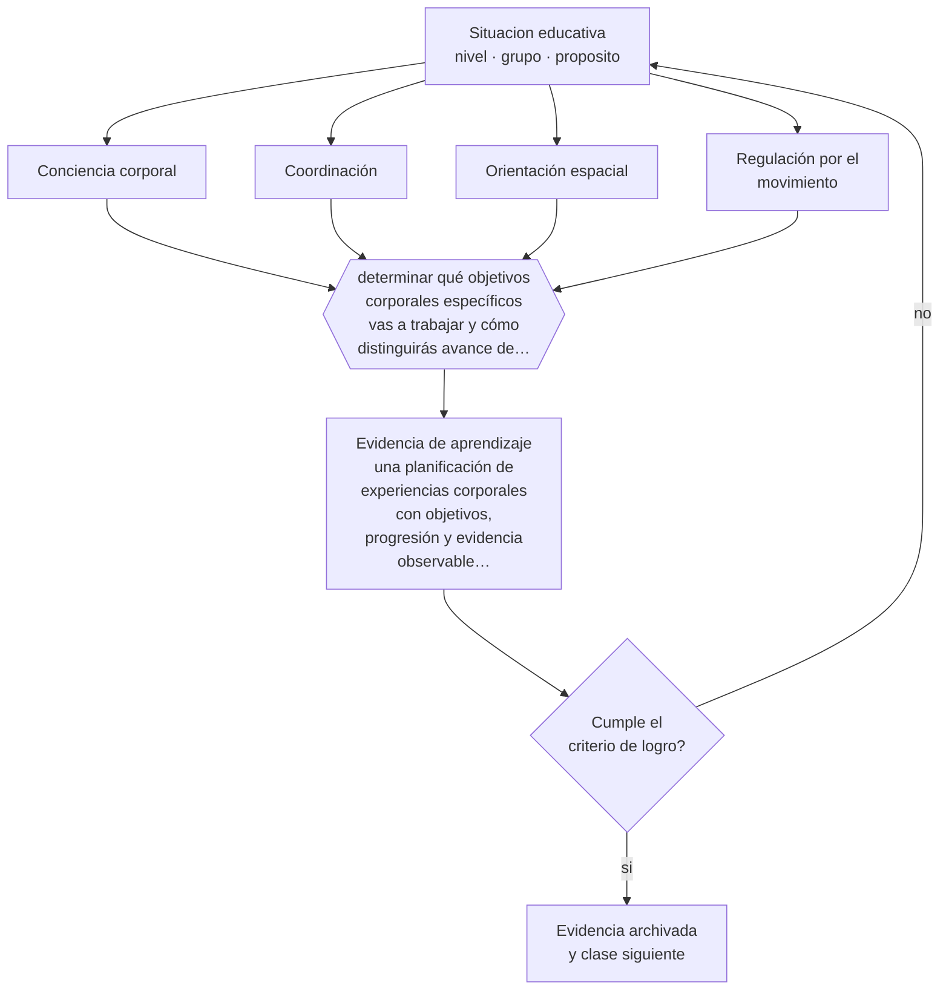

# Clase 042 — Corporalidad y movimiento

> **Parte 03 · Educación parvularia** — clase 6 de 12

**Estado de evidencia:** `CONSISTENTE` · **Etapa:** 🔵 Etapa B — Enseñanza por ciclo vital · **Población de referencia:** sala cuna, niveles medios y transición (0 a 6 años) 
**Decisión que habilita:** determinar qué objetivos corporales específicos vas a trabajar y cómo distinguirás avance de simple actividad física 
**Evidencia de aprendizaje:** una planificación de experiencias corporales con objetivos, progresión y evidencia observable de logro

## 🎯 Propósito

Integrar corporalidad y movimiento como núcleo de aprendizaje con objetivos propios —control, coordinación, orientación espacial, conciencia corporal— y como condición de bienestar y regulación.

## 📚 Resultados de aprendizaje

Al finalizar esta clase podrás:

1. **Definir** con precisión los cuatro conceptos centrales de la clase y reconocerlos en una situación educativa real, no solo en su enunciado.
2. **Explicar** por qué el movimiento en el nivel no es recreo ni relleno sino contenido con objetivos propios.
3. **Decidir** —qué objetivos corporales específicos vas a trabajar y cómo distinguirás avance de simple actividad física— y sostener la decisión con un fundamento escrito.
4. **Producir** la evidencia de la clase —una planificación de experiencias corporales con objetivos, progresión y evidencia observable de logro— y contrastarla contra el criterio de logro.
5. **Distinguir** lo que la evidencia sostiene de lo que es práctica instalada, preferencia personal o costumbre de la institución.

## 🧩 Conceptos centrales

| Concepto | Comprensión verificable |
|---|---|
| **Conciencia corporal** | reconocimiento del propio cuerpo, sus partes, sus límites y sus posibilidades de acción |
| **Coordinación** | organización del movimiento en función de una intención; se desarrolla con práctica variada |
| **Orientación espacial** | comprensión de la posición y el desplazamiento propio y de los objetos en el espacio |
| **Regulación por el movimiento** | uso de la actividad física y de la calma corporal para modular el estado de activación |

## 🗺️ Flujo de razonamiento

## 📖 Desarrollo

### 1. El fondo del asunto

El movimiento en la primera infancia cumple tres funciones simultáneas: es objetivo de aprendizaje, es vía de acceso a otros aprendizajes y es recurso de regulación. La evidencia sobre actividad física en la infancia respalda sus efectos en salud, sueño y disponibilidad atencional. Como contenido propio, la corporalidad tiene objetivos verificables que se pierden cuando el movimiento se reduce a tiempo libre entre actividades «importantes».

### 2. Cómo se traduce en decisiones de enseñanza

Planificar corporalidad implica declarar qué se busca —desplazarse esquivando obstáculos, coordinar dos acciones, mantener el equilibrio en distintas superficies, reconocer y nombrar partes del cuerpo— y diseñar experiencias con progresión. También implica distribuir el movimiento a lo largo de la jornada en vez de concentrarlo, porque su función reguladora depende del momento en que se ofrece.

### 3. Qué sostiene la evidencia y qué no

Conviene distinguir lo respaldado de lo prometido: la actividad física mejora salud, sueño y estado atencional, pero los programas que prometen mejorar la lectura o la matemática mediante secuencias motoras específicas no cuentan con evidencia de transferencia. La corporalidad se justifica por sí misma; no necesita atribuirse efectos que no tiene.

> **Cómo leer el estado de evidencia `CONSISTENTE`.** La evidencia es amplia y coherente, pero proviene sobre todo de estudios correlacionales, de síntesis con heterogeneidad alta o de contextos distintos al tuyo. Sirve para orientar la decisión y exige que compruebes el efecto en tu propio grupo.

## 🧪 Taller guiado

Aplica la clase a **uno** de los contextos siguientes y repite después el ejercicio en un
contexto de exigencia distinta. Cambiar de contexto es parte del aprendizaje: lo que funciona
con un grupo no se traslada intacto a otro.

| Contexto | Rasgo que cambia la decisión |
|---|---|
| Sala cuna (0–2) | cuidado, vínculo y lenguaje son la intervención pedagógica |
| Nivel medio (2–4) | juego simbólico y regulación emocional en construcción |
| Transición (4–6) | alfabetización y matemática emergentes, sin formato escolar |
| Jardín rural o de baja matrícula | grupos multiedad y recursos acotados |
| Modalidad no convencional o comunitaria | la familia participa en la ejecución |
| Contexto de alta vulnerabilidad | el jardín cumple funciones de protección y salud |

**Secuencia de trabajo:**

1. Delimita el contexto: nivel, edad, tamaño del grupo, asignatura o experiencia y tiempo real disponible.
2. Declara qué saben ya los estudiantes y **cómo lo comprobaste**, no cómo lo supones.
3. Formula la decisión pedagógica que esta clase habilita y escribe su fundamento.
4. Anticipa qué observarías si la decisión funciona y qué observarías si no funciona.
5. Diseña de antemano la alternativa que aplicarás si la primera estrategia falla.
6. Ejecuta o simula, y registra lo observado con fecha, contexto y evidencia concreta.
7. Produce la evidencia de aprendizaje de la clase.
8. Contrástala contra el criterio de logro, corrige y recién entonces avanza.

### 📦 Evidencia de aprendizaje

Una planificación de experiencias corporales con objetivos, progresión y evidencia observable de logro.

Debe incluir contexto, decisión, fundamento, fuentes consultadas con su fecha, indicador de
logro observable, riesgos previstos y qué harías distinto en la siguiente iteración.

## 🏆 Reto verificable

Registra el tiempo real de movimiento activo de tu jornada y compáralo con la recomendación vigente. Rediseña la jornada para acercarte y observa el efecto sobre la regulación del grupo.

## ✅ Criterio de logro

- [ ] cada experiencia declara un objetivo corporal observable y su progresión;
- [ ] el movimiento está distribuido en la jornada y no concentrado en un solo momento;
- [ ] cada afirmación sobre «lo que funciona» está atribuida a una fuente identificable, con autor y fecha;
- [ ] la decisión es ejecutable con el tiempo, el espacio, el número de estudiantes y los recursos que realmente tienes;
- [ ] la evidencia queda archivada de forma reproducible: otra persona podría revisarla sin que tú se la expliques.

## ⚠️ Errores frecuentes

**Propios de esta clase:**

- Tratar el movimiento como recreo y no como núcleo con objetivos propios.
- Adoptar programas que prometen efectos académicos directos a partir de secuencias motoras.

**Característicos de la parte 03:**

- Escolarizar el nivel adelantando formatos de enseñanza propios de la básica.
- Confundir actividad entretenida con experiencia de aprendizaje intencionada.

## ♿ Diversidad, accesibilidad y ética

Los niños con dificultades motoras suelen quedar fuera de las experiencias corporales colectivas y con ello pierden también participación social. Diseñar variantes de cada experiencia asegura que todos participen del mismo objetivo con distinta exigencia.

Antes de aplicar cualquier decisión de esta clase con estudiantes reales, revisa el
[protocolo de práctica responsable](../../../docs/ETICA_Y_PRACTICA_RESPONSABLE.md):
consentimiento, resguardo de datos personales, proporcionalidad de la intervención y derecho
de cada estudiante a no ser objeto de un ensayo que no le reporta beneficio.

## ❓ Preguntas de comprobación

1. ¿Qué objetivo corporal específico trabajaste esta semana?
2. ¿Cómo sabrías que un niño avanzó en coordinación y no solo que se movió mucho?
3. ¿En qué momento de tu jornada el movimiento cumple función reguladora?

## 📕 Lecturas base

**Mineduc (2018). *Bases Curriculares de la Educación Parvularia*, núcleo Corporalidad y Movimiento.**  
*Qué aporta a esta clase:* define los objetivos del núcleo y su progresión por nivel.

**Organización Mundial de la Salud (2019). *Directrices sobre actividad física en menores de 5 años*.**  
*Qué aporta a esta clase:* recomendaciones respaldadas sobre cantidad y tipo de actividad por edad.

Catálogo completo: [bibliografía del programa](../../../docs/BIBLIOGRAFIA.md) ·
[glosario](../../../docs/GLOSARIO.md) ·
[fuentes oficiales y cómo leerlas](../../../docs/FUENTES.md).

## 🔗 Conexión con el resto del programa

Aplica la clase 026 y se articula con la clase 039, porque el ambiente decide qué movimiento es posible.

> [!IMPORTANT]
> Material de formación profesional. No reemplaza un título de pedagogía, una habilitación
> legal para ejercer, ni el juicio de un equipo educativo que conoce a sus estudiantes.

---

| Anterior | Índice | Siguiente |
|---|---|---|
| [← 041 · Pensamiento matemático temprano](../class-05-pensamiento-matematico-temprano/README.md) | [Parte 03](../README.md) · [Programa](../../../README.md) | [043 · Arte, música y creatividad →](../class-07-arte-musica-y-creatividad/README.md) |
