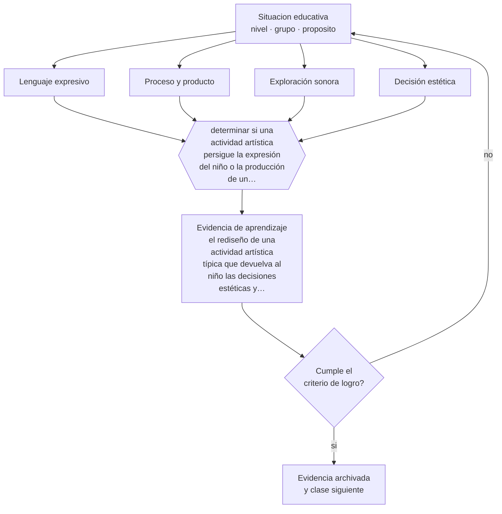

# Clase 043 — Arte, música y creatividad

> **Parte 03 · Educación parvularia** — clase 7 de 12

**Estado de evidencia:** `EMERGENTE` · **Etapa:** 🔵 Etapa B — Enseñanza por ciclo vital · **Población de referencia:** sala cuna, niveles medios y transición (0 a 6 años) 
**Decisión que habilita:** determinar si una actividad artística persigue la expresión del niño o la producción de un objeto para el adulto 
**Evidencia de aprendizaje:** el rediseño de una actividad artística típica que devuelva al niño las decisiones estéticas y su justificación

## 🎯 Propósito

Trabajar el arte, la música y la expresión como lenguajes con valor propio, y distinguir la experiencia estética genuina de la manualidad decorativa dirigida por el adulto.

## 📚 Resultados de aprendizaje

Al finalizar esta clase podrás:

1. **Definir** con precisión los cuatro conceptos centrales de la clase y reconocerlos en una situación educativa real, no solo en su enunciado.
2. **Explicar** qué aprende un niño cuando dibuja, canta o construye, más allá del producto que entrega.
3. **Decidir** —si una actividad artística persigue la expresión del niño o la producción de un objeto para el adulto— y sostener la decisión con un fundamento escrito.
4. **Producir** la evidencia de la clase —el rediseño de una actividad artística típica que devuelva al niño las decisiones estéticas y su justificación— y contrastarla contra el criterio de logro.
5. **Distinguir** lo que la evidencia sostiene de lo que es práctica instalada, preferencia personal o costumbre de la institución.

## 🧩 Conceptos centrales

| Concepto | Comprensión verificable |
|---|---|
| **Lenguaje expresivo** | modo de representar y comunicar experiencia mediante el arte, la música o el movimiento |
| **Proceso y producto** | distinción entre el valor de la experiencia creadora y el objeto resultante |
| **Exploración sonora** | investigación de sonido, ritmo y silencio como material propio de aprendizaje |
| **Decisión estética** | elección del niño sobre forma, color, material o secuencia; es donde ocurre el aprendizaje |

## 🗺️ Flujo de razonamiento

## 📖 Desarrollo

### 1. El fondo del asunto

Cuando un niño elige el color, decide dónde poner la línea y cambia de idea a mitad del trabajo, está tomando decisiones, representando y resolviendo problemas. Cuando repite un modelo entregado por el adulto, ejercita motricidad y poco más. La diferencia no está en el material ni en el resultado visible sino en dónde reside la decisión, y eso es observable con facilidad en cualquier sala.

### 2. Cómo se traduce en decisiones de enseñanza

El rediseño típico consiste en devolver decisiones: ofrecer materiales en vez de moldes, plantear un desafío en vez de un modelo, permitir versiones distintas del mismo trabajo y documentar el proceso además del producto. En música, sustituir la reproducción de canciones por exploración de sonido, ritmo y silencio produce un tipo de aprendizaje distinto y más rico.

### 3. Qué sostiene la evidencia y qué no

La investigación sobre efectos del arte en otros aprendizajes es débil y con frecuencia sobreinterpretada: las afirmaciones sobre música que aumenta la inteligencia no se sostienen en replicaciones. El arte se justifica por su valor propio como lenguaje y experiencia; sostenerlo con promesas de transferencia académica lo vuelve vulnerable cuando esas promesas no se cumplen.

> **Cómo leer el estado de evidencia `EMERGENTE`.** El cuerpo de estudios es reciente, escaso o poco replicado. Úsala como hipótesis de trabajo con seguimiento explícito, nunca como argumento de autoridad ni como base para una política de establecimiento.

## 🧪 Taller guiado

Aplica la clase a **uno** de los contextos siguientes y repite después el ejercicio en un
contexto de exigencia distinta. Cambiar de contexto es parte del aprendizaje: lo que funciona
con un grupo no se traslada intacto a otro.

| Contexto | Rasgo que cambia la decisión |
|---|---|
| Sala cuna (0–2) | cuidado, vínculo y lenguaje son la intervención pedagógica |
| Nivel medio (2–4) | juego simbólico y regulación emocional en construcción |
| Transición (4–6) | alfabetización y matemática emergentes, sin formato escolar |
| Jardín rural o de baja matrícula | grupos multiedad y recursos acotados |
| Modalidad no convencional o comunitaria | la familia participa en la ejecución |
| Contexto de alta vulnerabilidad | el jardín cumple funciones de protección y salud |

**Secuencia de trabajo:**

1. Delimita el contexto: nivel, edad, tamaño del grupo, asignatura o experiencia y tiempo real disponible.
2. Declara qué saben ya los estudiantes y **cómo lo comprobaste**, no cómo lo supones.
3. Formula la decisión pedagógica que esta clase habilita y escribe su fundamento.
4. Anticipa qué observarías si la decisión funciona y qué observarías si no funciona.
5. Diseña de antemano la alternativa que aplicarás si la primera estrategia falla.
6. Ejecuta o simula, y registra lo observado con fecha, contexto y evidencia concreta.
7. Produce la evidencia de aprendizaje de la clase.
8. Contrástala contra el criterio de logro, corrige y recién entonces avanza.

### 📦 Evidencia de aprendizaje

El rediseño de una actividad artística típica que devuelva al niño las decisiones estéticas y su justificación.

Debe incluir contexto, decisión, fundamento, fuentes consultadas con su fecha, indicador de
logro observable, riesgos previstos y qué harías distinto en la siguiente iteración.

## 🏆 Reto verificable

Toma una actividad artística habitual de tu sala y elimina el modelo. Documenta la variedad de resultados y las decisiones que tomaron los niños.

## ✅ Criterio de logro

- [ ] el rediseño identifica al menos tres decisiones que pasan del adulto al niño;
- [ ] la documentación registra proceso y no solo el objeto terminado;
- [ ] cada afirmación sobre «lo que funciona» está atribuida a una fuente identificable, con autor y fecha;
- [ ] la decisión es ejecutable con el tiempo, el espacio, el número de estudiantes y los recursos que realmente tienes;
- [ ] la evidencia queda archivada de forma reproducible: otra persona podría revisarla sin que tú se la expliques.

## ⚠️ Errores frecuentes

**Propios de esta clase:**

- Evaluar la actividad artística por el parecido del producto con el modelo del adulto.
- Justificar el arte por supuestos efectos en el rendimiento académico que la evidencia no respalda.

**Característicos de la parte 03:**

- Escolarizar el nivel adelantando formatos de enseñanza propios de la básica.
- Confundir actividad entretenida con experiencia de aprendizaje intencionada.

## ♿ Diversidad, accesibilidad y ética

Los lenguajes expresivos ofrecen vías de participación a niños con dificultades de comunicación verbal, y por eso son especialmente valiosos para la inclusión. Requieren, eso sí, materiales accesibles y aceptación real de formas de expresión no convencionales.

Antes de aplicar cualquier decisión de esta clase con estudiantes reales, revisa el
[protocolo de práctica responsable](../../../docs/ETICA_Y_PRACTICA_RESPONSABLE.md):
consentimiento, resguardo de datos personales, proporcionalidad de la intervención y derecho
de cada estudiante a no ser objeto de un ensayo que no le reporta beneficio.

## ❓ Preguntas de comprobación

1. ¿Quién tomó las decisiones estéticas en la última actividad artística de tu sala?
2. ¿Qué pasaría si dos trabajos del mismo desafío quedaran completamente distintos?
3. ¿Cómo justificas el arte sin recurrir a promesas de mejora académica?

## 📕 Lecturas base

**Eisner, E. (2002). *The Arts and the Creation of Mind*.**  
*Qué aporta a esta clase:* argumenta el valor cognitivo propio de las artes sin apelar a efectos de transferencia.

**Winner, E., Goldstein, T. & Vincent-Lancrin, S. (2013). *Art for Art's Sake? Overview*. OCDE.**  
*Qué aporta a esta clase:* revisa la evidencia sobre transferencia del arte a otros aprendizajes y desmonta las promesas infundadas.

Catálogo completo: [bibliografía del programa](../../../docs/BIBLIOGRAFIA.md) ·
[glosario](../../../docs/GLOSARIO.md) ·
[fuentes oficiales y cómo leerlas](../../../docs/FUENTES.md).

## 🔗 Conexión con el resto del programa

Se apoya en la clase 038 y alimenta la clase 046, porque el proceso creador es uno de los mejores objetos de documentación pedagógica.

> [!IMPORTANT]
> Material de formación profesional. No reemplaza un título de pedagogía, una habilitación
> legal para ejercer, ni el juicio de un equipo educativo que conoce a sus estudiantes.

---

| Anterior | Índice | Siguiente |
|---|---|---|
| [← 042 · Corporalidad y movimiento](../class-06-corporalidad-y-movimiento/README.md) | [Parte 03](../README.md) · [Programa](../../../README.md) | [044 · Exploración del entorno →](../class-08-exploracion-del-entorno/README.md) |
