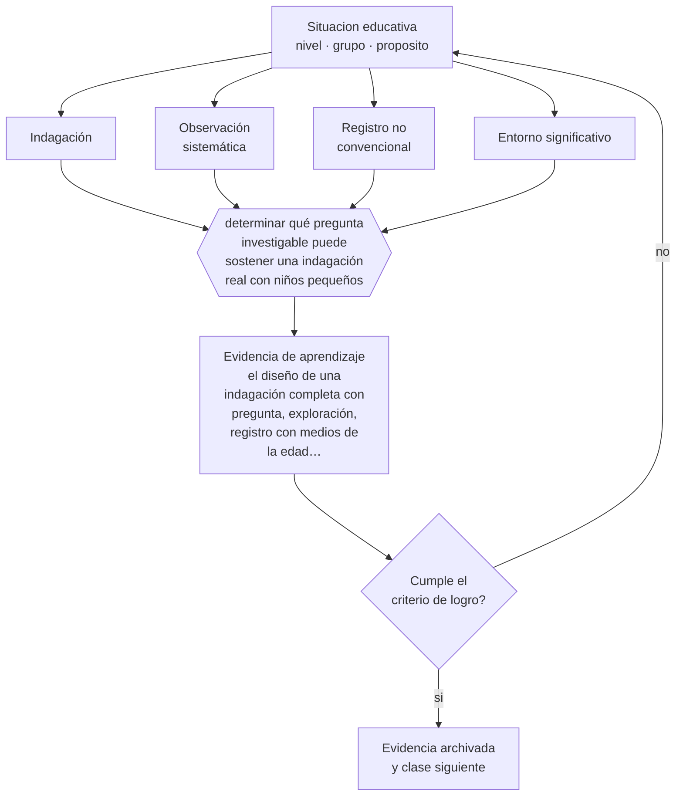

# Clase 044 — Exploración del entorno

> **Parte 03 · Educación parvularia** — clase 8 de 12

**Estado de evidencia:** `CONSISTENTE` · **Etapa:** 🔵 Etapa B — Enseñanza por ciclo vital · **Población de referencia:** sala cuna, niveles medios y transición (0 a 6 años) 
**Decisión que habilita:** determinar qué pregunta investigable puede sostener una indagación real con niños pequeños 
**Evidencia de aprendizaje:** el diseño de una indagación completa con pregunta, exploración, registro con medios de la edad y comunicación de hallazgos

## 🎯 Propósito

Diseñar experiencias de exploración del entorno natural, social y cultural que desarrollen observación, formulación de preguntas, comparación y registro con los medios propios de la edad.

## 📚 Resultados de aprendizaje

Al finalizar esta clase podrás:

1. **Definir** con precisión los cuatro conceptos centrales de la clase y reconocerlos en una situación educativa real, no solo en su enunciado.
2. **Explicar** cómo se enseña a investigar el mundo a alguien que todavía no lee ni escribe.
3. **Decidir** —qué pregunta investigable puede sostener una indagación real con niños pequeños— y sostener la decisión con un fundamento escrito.
4. **Producir** la evidencia de la clase —el diseño de una indagación completa con pregunta, exploración, registro con medios de la edad y comunicación de hallazgos— y contrastarla contra el criterio de logro.
5. **Distinguir** lo que la evidencia sostiene de lo que es práctica instalada, preferencia personal o costumbre de la institución.

## 🧩 Conceptos centrales

| Concepto | Comprensión verificable |
|---|---|
| **Indagación** | proceso de formular preguntas, explorar de forma deliberada y construir explicaciones con evidencia |
| **Observación sistemática** | mirar con un propósito definido y registrar lo observado de forma comparable |
| **Registro no convencional** | representación de lo observado mediante dibujo, fotografía, marcas o dictado al adulto |
| **Entorno significativo** | contexto natural, social o cultural conocido por el niño y disponible para su exploración |

## 🗺️ Flujo de razonamiento

## 📖 Desarrollo

### 1. El fondo del asunto

Los niños investigan naturalmente; lo que la educación agrega es método. Sostener una pregunta durante varios días, mirar con propósito, comparar lo observado, registrar y volver sobre el registro son operaciones que no aparecen solas y que se pueden enseñar sin lectoescritura. Una indagación bien conducida en el nivel parvulario tiene la misma estructura lógica que una investigación posterior, con otros medios.

### 2. Cómo se traduce en decisiones de enseñanza

El diseño parte de una pregunta que el grupo pueda responder con lo que tiene a mano y que admita más de una respuesta: qué le pasa a esta planta si la ponemos allí, quién trabaja en nuestro barrio y a qué hora, qué hacen los pájaros que vienen al patio. Luego se explora, se registra con dibujos o fotografías, se compara y se comunica lo encontrado. El registro es lo que convierte la curiosidad en aprendizaje acumulable.

### 3. Qué sostiene la evidencia y qué no

La indagación no sustituye la enseñanza de contenidos ni garantiza aprendizaje conceptual: sin mediación adulta que ofrezca vocabulario, explicaciones y comparaciones, los niños confirman lo que ya creían. La evidencia sobre indagación en general muestra que su eficacia depende del grado de guía, y en estas edades esa guía es imprescindible.

> **Cómo leer el estado de evidencia `CONSISTENTE`.** La evidencia es amplia y coherente, pero proviene sobre todo de estudios correlacionales, de síntesis con heterogeneidad alta o de contextos distintos al tuyo. Sirve para orientar la decisión y exige que compruebes el efecto en tu propio grupo.

## 🧪 Taller guiado

Aplica la clase a **uno** de los contextos siguientes y repite después el ejercicio en un
contexto de exigencia distinta. Cambiar de contexto es parte del aprendizaje: lo que funciona
con un grupo no se traslada intacto a otro.

| Contexto | Rasgo que cambia la decisión |
|---|---|
| Sala cuna (0–2) | cuidado, vínculo y lenguaje son la intervención pedagógica |
| Nivel medio (2–4) | juego simbólico y regulación emocional en construcción |
| Transición (4–6) | alfabetización y matemática emergentes, sin formato escolar |
| Jardín rural o de baja matrícula | grupos multiedad y recursos acotados |
| Modalidad no convencional o comunitaria | la familia participa en la ejecución |
| Contexto de alta vulnerabilidad | el jardín cumple funciones de protección y salud |

**Secuencia de trabajo:**

1. Delimita el contexto: nivel, edad, tamaño del grupo, asignatura o experiencia y tiempo real disponible.
2. Declara qué saben ya los estudiantes y **cómo lo comprobaste**, no cómo lo supones.
3. Formula la decisión pedagógica que esta clase habilita y escribe su fundamento.
4. Anticipa qué observarías si la decisión funciona y qué observarías si no funciona.
5. Diseña de antemano la alternativa que aplicarás si la primera estrategia falla.
6. Ejecuta o simula, y registra lo observado con fecha, contexto y evidencia concreta.
7. Produce la evidencia de aprendizaje de la clase.
8. Contrástala contra el criterio de logro, corrige y recién entonces avanza.

### 📦 Evidencia de aprendizaje

El diseño de una indagación completa con pregunta, exploración, registro con medios de la edad y comunicación de hallazgos.

Debe incluir contexto, decisión, fundamento, fuentes consultadas con su fecha, indicador de
logro observable, riesgos previstos y qué harías distinto en la siguiente iteración.

## 🏆 Reto verificable

Conduce una indagación de dos semanas a partir de una pregunta genuina de tu grupo. Documenta los registros de los niños y la variación entre el inicio y el cierre.

## ✅ Criterio de logro

- [ ] la pregunta es investigable con los medios de la edad y admite más de una respuesta;
- [ ] existe registro producido por los niños y una instancia de comunicación de hallazgos;
- [ ] cada afirmación sobre «lo que funciona» está atribuida a una fuente identificable, con autor y fecha;
- [ ] la decisión es ejecutable con el tiempo, el espacio, el número de estudiantes y los recursos que realmente tienes;
- [ ] la evidencia queda archivada de forma reproducible: otra persona podría revisarla sin que tú se la expliques.

## ⚠️ Errores frecuentes

**Propios de esta clase:**

- Plantear preguntas que el grupo no puede responder con los medios disponibles.
- Dejar la exploración sin mediación y sin registro, con lo que no queda aprendizaje acumulable.

**Característicos de la parte 03:**

- Escolarizar el nivel adelantando formatos de enseñanza propios de la básica.
- Confundir actividad entretenida con experiencia de aprendizaje intencionada.

## ♿ Diversidad, accesibilidad y ética

El registro no convencional abre la indagación a todos los niños, incluidos quienes tienen dificultades de comunicación o de motricidad fina. Ofrecer varios medios de registro es, otra vez, diseño universal aplicado al nivel.

Antes de aplicar cualquier decisión de esta clase con estudiantes reales, revisa el
[protocolo de práctica responsable](../../../docs/ETICA_Y_PRACTICA_RESPONSABLE.md):
consentimiento, resguardo de datos personales, proporcionalidad de la intervención y derecho
de cada estudiante a no ser objeto de un ensayo que no le reporta beneficio.

## ❓ Preguntas de comprobación

1. ¿Qué pregunta de tus niños podrías convertir en una indagación de dos semanas?
2. ¿Con qué medio van a registrar lo que observen?
3. ¿Qué vocabulario debes ofrecer para que la exploración produzca comprensión?

## 📕 Lecturas base

**Mineduc (2018). *Bases Curriculares de la Educación Parvularia*, ámbito Interacción y Comprensión del Entorno.**  
*Qué aporta a esta clase:* define los objetivos de exploración del entorno natural, social y cultural.

**Harlen, W. (2015). *Working with Big Ideas of Science Education*.**  
*Qué aporta a esta clase:* orienta qué ideas conviene construir desde la infancia y cómo evitar explicaciones prematuras.

Catálogo completo: [bibliografía del programa](../../../docs/BIBLIOGRAFIA.md) ·
[glosario](../../../docs/GLOSARIO.md) ·
[fuentes oficiales y cómo leerlas](../../../docs/FUENTES.md).

## 🔗 Conexión con el resto del programa

Anticipa la clase 052 (didáctica de las ciencias) y se apoya en la clase 046, que aporta el sistema de registro del nivel.

> [!IMPORTANT]
> Material de formación profesional. No reemplaza un título de pedagogía, una habilitación
> legal para ejercer, ni el juicio de un equipo educativo que conoce a sus estudiantes.

---

| Anterior | Índice | Siguiente |
|---|---|---|
| [← 043 · Arte, música y creatividad](../class-07-arte-musica-y-creatividad/README.md) | [Parte 03](../README.md) · [Programa](../../../README.md) | [045 · Desarrollo socioemocional →](../class-09-desarrollo-socioemocional/README.md) |
