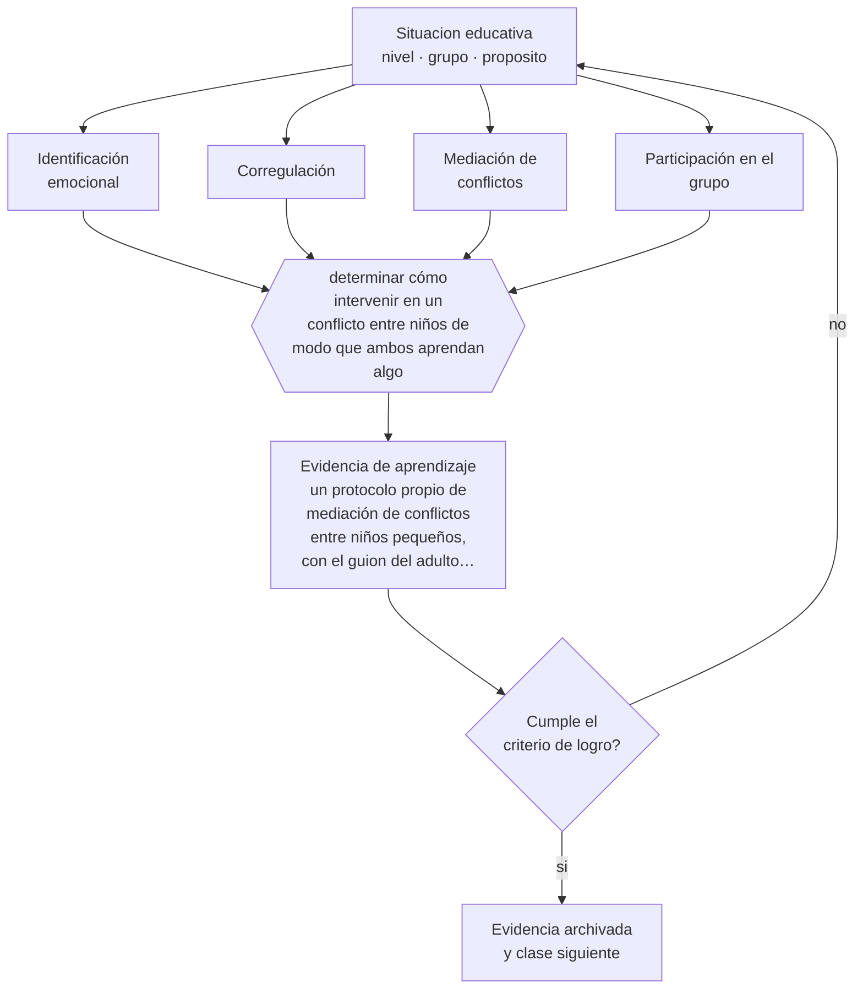

# Clase 045 — Desarrollo socioemocional

> **Parte 03 · Educación parvularia** — clase 9 de 12

**Estado de evidencia:** `CONSISTENTE` · **Etapa:** 🔵 Etapa B — Enseñanza por ciclo vital · **Población de referencia:** sala cuna, niveles medios y transición (0 a 6 años) 
**Decisión que habilita:** determinar cómo intervenir en un conflicto entre niños de modo que ambos aprendan algo 
**Evidencia de aprendizaje:** un protocolo propio de mediación de conflictos entre niños pequeños, con el guion del adulto paso a paso

## 🎯 Propósito

Trabajar el desarrollo socioemocional del nivel como enseñanza explícita y como diseño de condiciones: identificar emociones, regularse con apoyo, resolver conflictos y participar del grupo.

## 📚 Resultados de aprendizaje

Al finalizar esta clase podrás:

1. **Definir** con precisión los cuatro conceptos centrales de la clase y reconocerlos en una situación educativa real, no solo en su enunciado.
2. **Explicar** cómo se enseña a convivir a quien todavía está construyendo la capacidad de esperar, compartir y nombrar lo que siente.
3. **Decidir** —cómo intervenir en un conflicto entre niños de modo que ambos aprendan algo— y sostener la decisión con un fundamento escrito.
4. **Producir** la evidencia de la clase —un protocolo propio de mediación de conflictos entre niños pequeños, con el guion del adulto paso a paso— y contrastarla contra el criterio de logro.
5. **Distinguir** lo que la evidencia sostiene de lo que es práctica instalada, preferencia personal o costumbre de la institución.

## 🧩 Conceptos centrales

| Concepto | Comprensión verificable |
|---|---|
| **Identificación emocional** | capacidad de reconocer y nombrar la propia emoción y la de otro |
| **Corregulación** | apoyo del adulto que presta calma y lenguaje mientras el niño no puede regularse solo |
| **Mediación de conflictos** | intervención que sostiene a ambos niños y convierte el conflicto en aprendizaje social |
| **Participación en el grupo** | habilidades para entrar en el juego, sostener el turno y reparar tras un desacuerdo |

## 🗺️ Flujo de razonamiento

## 📖 Desarrollo

### 1. El fondo del asunto

Los conflictos entre niños pequeños no son fallas de la convivencia: son la situación de aprendizaje social por excelencia. Lo que determina si producen aprendizaje es la respuesta del adulto. Resolver por decreto —separar, castigar, imponer la solución— termina el conflicto y no enseña nada; mediar, en cambio, exige tiempo y un guion que la mayoría de los equipos nunca ha explicitado.

### 2. Cómo se traduce en decisiones de enseñanza

Un protocolo eficaz tiene pasos simples y sostenidos: detener la escalada garantizando seguridad, nombrar lo que ocurre y lo que cada uno siente, dar voz a ambos, buscar una solución que los dos acepten, y volver más tarde a comprobar. Escribir ese guion y usarlo con consistencia produce, en pocos meses, niños que empiezan a aplicar los mismos pasos entre ellos.

### 3. Qué sostiene la evidencia y qué no

La corregulación exige disponibilidad adulta, y esa disponibilidad depende de la proporción adulto-niño: un protocolo excelente es inaplicable si una persona sola atiende a un grupo numeroso. Reconocer esa condición material evita responsabilizar al equipo de una limitación estructural. Además, los programas socioemocionales rinden poco cuando se aplican como paquete sin ajuste al contexto.

> **Cómo leer el estado de evidencia `CONSISTENTE`.** La evidencia es amplia y coherente, pero proviene sobre todo de estudios correlacionales, de síntesis con heterogeneidad alta o de contextos distintos al tuyo. Sirve para orientar la decisión y exige que compruebes el efecto en tu propio grupo.

## 🧪 Taller guiado

Aplica la clase a **uno** de los contextos siguientes y repite después el ejercicio en un
contexto de exigencia distinta. Cambiar de contexto es parte del aprendizaje: lo que funciona
con un grupo no se traslada intacto a otro.

| Contexto | Rasgo que cambia la decisión |
|---|---|
| Sala cuna (0–2) | cuidado, vínculo y lenguaje son la intervención pedagógica |
| Nivel medio (2–4) | juego simbólico y regulación emocional en construcción |
| Transición (4–6) | alfabetización y matemática emergentes, sin formato escolar |
| Jardín rural o de baja matrícula | grupos multiedad y recursos acotados |
| Modalidad no convencional o comunitaria | la familia participa en la ejecución |
| Contexto de alta vulnerabilidad | el jardín cumple funciones de protección y salud |

**Secuencia de trabajo:**

1. Delimita el contexto: nivel, edad, tamaño del grupo, asignatura o experiencia y tiempo real disponible.
2. Declara qué saben ya los estudiantes y **cómo lo comprobaste**, no cómo lo supones.
3. Formula la decisión pedagógica que esta clase habilita y escribe su fundamento.
4. Anticipa qué observarías si la decisión funciona y qué observarías si no funciona.
5. Diseña de antemano la alternativa que aplicarás si la primera estrategia falla.
6. Ejecuta o simula, y registra lo observado con fecha, contexto y evidencia concreta.
7. Produce la evidencia de aprendizaje de la clase.
8. Contrástala contra el criterio de logro, corrige y recién entonces avanza.

### 📦 Evidencia de aprendizaje

Un protocolo propio de mediación de conflictos entre niños pequeños, con el guion del adulto paso a paso.

Debe incluir contexto, decisión, fundamento, fuentes consultadas con su fecha, indicador de
logro observable, riesgos previstos y qué harías distinto en la siguiente iteración.

## 🏆 Reto verificable

Escribe tu guion de mediación, aplícalo durante un mes con consistencia y registra si los niños empiezan a usar alguno de sus pasos por sí solos.

## ✅ Criterio de logro

- [ ] el protocolo detalla el guion del adulto paso a paso y no solo su intención;
- [ ] incluye el retorno posterior para verificar que la solución se sostuvo;
- [ ] cada afirmación sobre «lo que funciona» está atribuida a una fuente identificable, con autor y fecha;
- [ ] la decisión es ejecutable con el tiempo, el espacio, el número de estudiantes y los recursos que realmente tienes;
- [ ] la evidencia queda archivada de forma reproducible: otra persona podría revisarla sin que tú se la expliques.

## ⚠️ Errores frecuentes

**Propios de esta clase:**

- Resolver el conflicto por decreto y perder la única situación de aprendizaje social disponible.
- Exigir disculpas verbales inmediatas como sustituto de la reparación real.

**Característicos de la parte 03:**

- Escolarizar el nivel adelantando formatos de enseñanza propios de la básica.
- Confundir actividad entretenida con experiencia de aprendizaje intencionada.

## ♿ Diversidad, accesibilidad y ética

Los niños con dificultades de comunicación quedan en desventaja en cualquier mediación basada solo en el lenguaje verbal. Incorporar apoyos visuales y gestuales al protocolo permite que participen del proceso en vez de recibir la solución impuesta.

Antes de aplicar cualquier decisión de esta clase con estudiantes reales, revisa el
[protocolo de práctica responsable](../../../docs/ETICA_Y_PRACTICA_RESPONSABLE.md):
consentimiento, resguardo de datos personales, proporcionalidad de la intervención y derecho
de cada estudiante a no ser objeto de un ensayo que no le reporta beneficio.

## ❓ Preguntas de comprobación

1. ¿Qué dices exactamente en los primeros diez segundos de un conflicto?
2. ¿Qué aprende cada uno de los dos niños con tu intervención habitual?
3. ¿Qué condición material impide hoy mediar como corresponde en tu sala?

## 📕 Lecturas base

**Denham, S. (1998). *Emotional Development in Young Children*.**  
*Qué aporta a esta clase:* describe la secuencia del desarrollo emocional y sus implicancias para la intervención adulta.

**Gloeckler, L. & Cassell, J. (2012). *Teacher Practices with Toddlers during Social Problem Solving Opportunities*.**  
*Qué aporta a esta clase:* documenta qué hacen efectivamente los adultos ante conflictos y qué prácticas enseñan más.

Catálogo completo: [bibliografía del programa](../../../docs/BIBLIOGRAFIA.md) ·
[glosario](../../../docs/GLOSARIO.md) ·
[fuentes oficiales y cómo leerlas](../../../docs/FUENTES.md).

## 🔗 Conexión con el resto del programa

Aplica las clases 029 y 030 al nivel y es el antecedente temprano de toda la parte 12.

> [!IMPORTANT]
> Material de formación profesional. No reemplaza un título de pedagogía, una habilitación
> legal para ejercer, ni el juicio de un equipo educativo que conoce a sus estudiantes.

---

| Anterior | Índice | Siguiente |
|---|---|---|
| [← 044 · Exploración del entorno](../class-08-exploracion-del-entorno/README.md) | [Parte 03](../README.md) · [Programa](../../../README.md) | [046 · Observación y documentación pedagógica →](../class-10-observacion-y-documentacion-pedagogica/README.md) |
