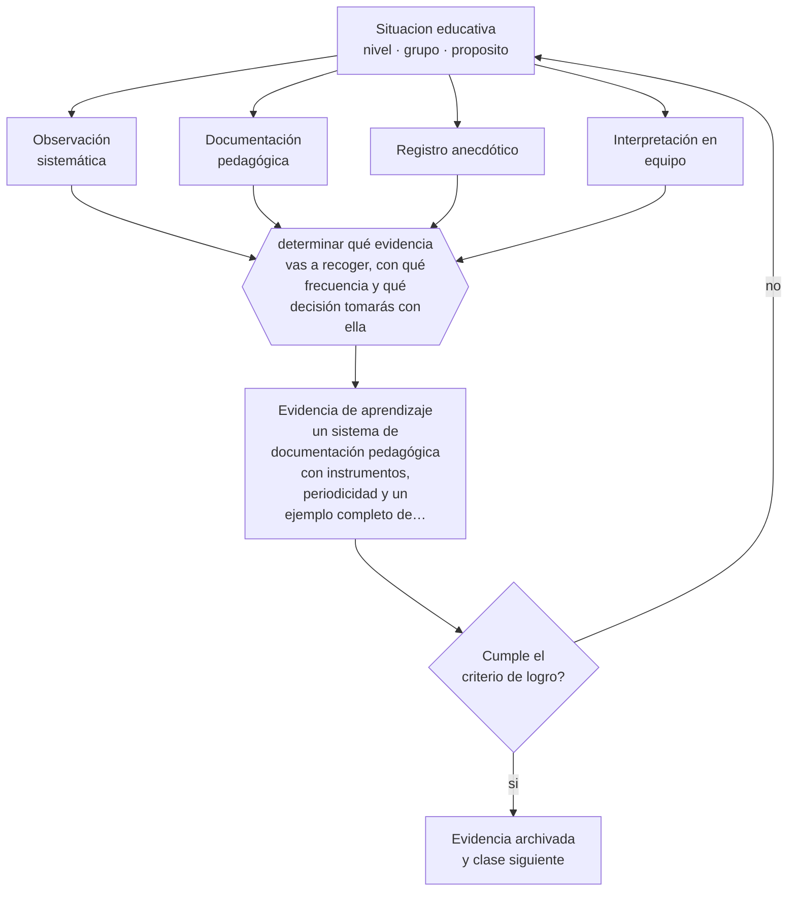

# Clase 046 — Observación y documentación pedagógica

> **Parte 03 · Educación parvularia** — clase 10 de 12

**Estado de evidencia:** `PRACTICA-PROFESIONAL` · **Etapa:** 🔵 Etapa B — Enseñanza por ciclo vital · **Población de referencia:** sala cuna, niveles medios y transición (0 a 6 años) 
**Decisión que habilita:** determinar qué evidencia vas a recoger, con qué frecuencia y qué decisión tomarás con ella 
**Evidencia de aprendizaje:** un sistema de documentación pedagógica con instrumentos, periodicidad y un ejemplo completo de interpretación y decisión

## 🎯 Propósito

Instalar la observación y la documentación pedagógica como sistema de evaluación del nivel: recoger evidencia de aprendizaje de forma sistemática, interpretarla en equipo y usarla para decidir.

## 📚 Resultados de aprendizaje

Al finalizar esta clase podrás:

1. **Definir** con precisión los cuatro conceptos centrales de la clase y reconocerlos en una situación educativa real, no solo en su enunciado.
2. **Explicar** cómo se evalúa el aprendizaje en un nivel donde no corresponde aplicar pruebas.
3. **Decidir** —qué evidencia vas a recoger, con qué frecuencia y qué decisión tomarás con ella— y sostener la decisión con un fundamento escrito.
4. **Producir** la evidencia de la clase —un sistema de documentación pedagógica con instrumentos, periodicidad y un ejemplo completo de interpretación y decisión— y contrastarla contra el criterio de logro.
5. **Distinguir** lo que la evidencia sostiene de lo que es práctica instalada, preferencia personal o costumbre de la institución.

## 🧩 Conceptos centrales

| Concepto | Comprensión verificable |
|---|---|
| **Observación sistemática** | registro planificado de conductas específicas, con foco y criterio definidos de antemano |
| **Documentación pedagógica** | conjunto de registros que hace visible el aprendizaje y permite interpretarlo en equipo |
| **Registro anecdótico** | descripción breve, fechada y objetiva de un episodio significativo |
| **Interpretación en equipo** | análisis colectivo de la evidencia; reduce el sesgo individual del observador |

## 🗺️ Flujo de razonamiento

## 📖 Desarrollo

### 1. El fondo del asunto

En un nivel sin pruebas, la evidencia proviene de la observación, y la diferencia entre observación profesional y opinión está en el método: foco definido, registro fechado, descripción de lo que se vio antes que de lo que se interpretó, y revisión con otros. La documentación cumple además una función que ninguna prueba cumple: hace visible el proceso, no solo el resultado, y permite mostrar a la familia y al equipo lo que efectivamente ocurrió.

### 2. Cómo se traduce en decisiones de enseñanza

Un sistema realista define pocos instrumentos y los sostiene: registros anecdóticos breves, evidencias de trabajo con fecha, y una pauta de observación focalizada por período. Lo que convierte esto en evaluación es el paso final: interpretar y decidir. Documentación que no cambia ninguna decisión pedagógica es archivo, no evaluación.

### 3. Qué sostiene la evidencia y qué no

La observación es vulnerable al sesgo: se registra más al niño que llama la atención, se interpreta lo que confirma la impresión previa y se olvida a quienes pasan desapercibidos. Los antídotos son procedimentales —rotación explícita del foco, descripción antes que interpretación, revisión en equipo— y no eliminan el sesgo, solo lo reducen.

> **Cómo leer el estado de evidencia `PRACTICA-PROFESIONAL`.** Es conocimiento práctico acumulado del oficio, útil y transferible, pero no probado con diseños de investigación. Trátalo como un buen punto de partida sujeto a comprobación en tu contexto.

## 🧪 Taller guiado

Aplica la clase a **uno** de los contextos siguientes y repite después el ejercicio en un
contexto de exigencia distinta. Cambiar de contexto es parte del aprendizaje: lo que funciona
con un grupo no se traslada intacto a otro.

| Contexto | Rasgo que cambia la decisión |
|---|---|
| Sala cuna (0–2) | cuidado, vínculo y lenguaje son la intervención pedagógica |
| Nivel medio (2–4) | juego simbólico y regulación emocional en construcción |
| Transición (4–6) | alfabetización y matemática emergentes, sin formato escolar |
| Jardín rural o de baja matrícula | grupos multiedad y recursos acotados |
| Modalidad no convencional o comunitaria | la familia participa en la ejecución |
| Contexto de alta vulnerabilidad | el jardín cumple funciones de protección y salud |

**Secuencia de trabajo:**

1. Delimita el contexto: nivel, edad, tamaño del grupo, asignatura o experiencia y tiempo real disponible.
2. Declara qué saben ya los estudiantes y **cómo lo comprobaste**, no cómo lo supones.
3. Formula la decisión pedagógica que esta clase habilita y escribe su fundamento.
4. Anticipa qué observarías si la decisión funciona y qué observarías si no funciona.
5. Diseña de antemano la alternativa que aplicarás si la primera estrategia falla.
6. Ejecuta o simula, y registra lo observado con fecha, contexto y evidencia concreta.
7. Produce la evidencia de aprendizaje de la clase.
8. Contrástala contra el criterio de logro, corrige y recién entonces avanza.

### 📦 Evidencia de aprendizaje

Un sistema de documentación pedagógica con instrumentos, periodicidad y un ejemplo completo de interpretación y decisión.

Debe incluir contexto, decisión, fundamento, fuentes consultadas con su fecha, indicador de
logro observable, riesgos previstos y qué harías distinto en la siguiente iteración.

## 🏆 Reto verificable

Aplica tu sistema durante tres semanas y revisa cuántos registros tiene cada niño. Corrige la distribución y contrasta tu interpretación de un caso con la de una colega.

## ✅ Criterio de logro

- [ ] el sistema declara qué se observa, con qué frecuencia y con qué instrumento;
- [ ] el ejemplo muestra el recorrido completo de registro a interpretación y a decisión;
- [ ] cada afirmación sobre «lo que funciona» está atribuida a una fuente identificable, con autor y fecha;
- [ ] la decisión es ejecutable con el tiempo, el espacio, el número de estudiantes y los recursos que realmente tienes;
- [ ] la evidencia queda archivada de forma reproducible: otra persona podría revisarla sin que tú se la expliques.

## ⚠️ Errores frecuentes

**Propios de esta clase:**

- Registrar interpretaciones —«está desmotivado»— en vez de conductas observables.
- Documentar de forma abundante sin que ningún registro cambie una decisión.

**Característicos de la parte 03:**

- Escolarizar el nivel adelantando formatos de enseñanza propios de la básica.
- Confundir actividad entretenida con experiencia de aprendizaje intencionada.

## ♿ Diversidad, accesibilidad y ética

Los niños silenciosos y los que tienen dificultades de comunicación son sistemáticamente subregistrados. Un sistema con rotación explícita del foco garantiza que la evidencia exista para todos, que es condición para detectar necesidades de apoyo a tiempo.

Antes de aplicar cualquier decisión de esta clase con estudiantes reales, revisa el
[protocolo de práctica responsable](../../../docs/ETICA_Y_PRACTICA_RESPONSABLE.md):
consentimiento, resguardo de datos personales, proporcionalidad de la intervención y derecho
de cada estudiante a no ser objeto de un ensayo que no le reporta beneficio.

## ❓ Preguntas de comprobación

1. ¿Qué niño de tu grupo tiene menos registros y por qué?
2. ¿Qué decisión pedagógica cambiaste el mes pasado por lo que observaste?
3. ¿Cómo distingues en tu registro lo que viste de lo que interpretaste?

## 📕 Lecturas base

**Rinaldi, C. (2006). *In Dialogue with Reggio Emilia*.**  
*Qué aporta a esta clase:* fundamenta la documentación pedagógica como práctica de investigación del propio equipo.

**Mineduc. *Orientaciones para la evaluación en educación parvularia*.**  
*Qué aporta a esta clase:* define en Chile el enfoque y los instrumentos esperados en el nivel.

Catálogo completo: [bibliografía del programa](../../../docs/BIBLIOGRAFIA.md) ·
[glosario](../../../docs/GLOSARIO.md) ·
[fuentes oficiales y cómo leerlas](../../../docs/FUENTES.md).

## 🔗 Conexión con el resto del programa

Es la versión del nivel de lo que la parte 11 desarrolla técnicamente. Alimenta la clase 048 y el trabajo con familias de la clase 047.

> [!IMPORTANT]
> Material de formación profesional. No reemplaza un título de pedagogía, una habilitación
> legal para ejercer, ni el juicio de un equipo educativo que conoce a sus estudiantes.

---

| Anterior | Índice | Siguiente |
|---|---|---|
| [← 045 · Desarrollo socioemocional](../class-09-desarrollo-socioemocional/README.md) | [Parte 03](../README.md) · [Programa](../../../README.md) | [047 · Familia y comunidad →](../class-11-familia-y-comunidad/README.md) |
