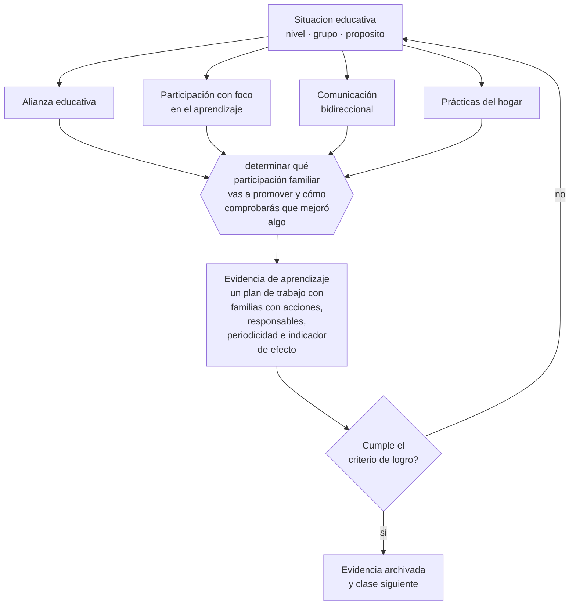

# Clase 047 — Familia y comunidad

> **Parte 03 · Educación parvularia** — clase 11 de 12

**Estado de evidencia:** `CONSISTENTE` · **Etapa:** 🔵 Etapa B — Enseñanza por ciclo vital · **Población de referencia:** sala cuna, niveles medios y transición (0 a 6 años) 
**Decisión que habilita:** determinar qué participación familiar vas a promover y cómo comprobarás que mejoró algo 
**Evidencia de aprendizaje:** un plan de trabajo con familias con acciones, responsables, periodicidad e indicador de efecto

## 🎯 Propósito

Construir alianza con familias como parte del diseño pedagógico: acordar propósitos, informar con evidencia y sostener prácticas de crianza y aprendizaje coherentes entre el hogar y el jardín.

## 📚 Resultados de aprendizaje

Al finalizar esta clase podrás:

1. **Definir** con precisión los cuatro conceptos centrales de la clase y reconocerlos en una situación educativa real, no solo en su enunciado.
2. **Explicar** qué hace que la participación de las familias mejore el aprendizaje y qué la convierte en trámite.
3. **Decidir** —qué participación familiar vas a promover y cómo comprobarás que mejoró algo— y sostener la decisión con un fundamento escrito.
4. **Producir** la evidencia de la clase —un plan de trabajo con familias con acciones, responsables, periodicidad e indicador de efecto— y contrastarla contra el criterio de logro.
5. **Distinguir** lo que la evidencia sostiene de lo que es práctica instalada, preferencia personal o costumbre de la institución.

## 🧩 Conceptos centrales

| Concepto | Comprensión verificable |
|---|---|
| **Alianza educativa** | relación de colaboración con propósitos compartidos entre el equipo y las familias |
| **Participación con foco en el aprendizaje** | involucramiento centrado en lo que el niño aprende, no solo en tareas logísticas |
| **Comunicación bidireccional** | intercambio en que la familia también aporta información que modifica la práctica |
| **Prácticas del hogar** | rutinas familiares de lectura, conversación y juego que sostienen el aprendizaje |

## 🗺️ Flujo de razonamiento

## 📖 Desarrollo

### 1. El fondo del asunto

La evidencia distingue tipos de participación: la que se centra en el aprendizaje del niño —conversar, leer juntos, sostener rutinas, tener expectativas claras— se asocia con mejores resultados; la que se limita a asistir a actos, aportar materiales o colaborar en la logística, no. Esa distinción es decisiva porque la mayoría de los planes de participación se concentra en la segunda, que es más fácil de organizar y produce menos.

### 2. Cómo se traduce en decisiones de enseñanza

Un plan útil define pocas acciones con foco en el aprendizaje: sugerencias concretas y realistas para el hogar, comunicación regular con evidencia del proceso del niño, y espacios donde la familia aporte información que efectivamente modifique la práctica del equipo. La periodicidad importa más que la intensidad, y la evidencia compartida importa más que los mensajes generales de aliento.

### 3. Qué sostiene la evidencia y qué no

Las condiciones familiares limitan lo que es posible: jornadas laborales extensas, hacinamiento, monoparentalidad o baja escolaridad hacen inviables algunas sugerencias bien intencionadas. Un plan que exige lo que la familia no puede dar produce culpa y aleja. Además, la evidencia proviene mayormente de estudios correlacionales, de modo que conviene ser prudente con las afirmaciones causales.

> **Cómo leer el estado de evidencia `CONSISTENTE`.** La evidencia es amplia y coherente, pero proviene sobre todo de estudios correlacionales, de síntesis con heterogeneidad alta o de contextos distintos al tuyo. Sirve para orientar la decisión y exige que compruebes el efecto en tu propio grupo.

## 🧪 Taller guiado

Aplica la clase a **uno** de los contextos siguientes y repite después el ejercicio en un
contexto de exigencia distinta. Cambiar de contexto es parte del aprendizaje: lo que funciona
con un grupo no se traslada intacto a otro.

| Contexto | Rasgo que cambia la decisión |
|---|---|
| Sala cuna (0–2) | cuidado, vínculo y lenguaje son la intervención pedagógica |
| Nivel medio (2–4) | juego simbólico y regulación emocional en construcción |
| Transición (4–6) | alfabetización y matemática emergentes, sin formato escolar |
| Jardín rural o de baja matrícula | grupos multiedad y recursos acotados |
| Modalidad no convencional o comunitaria | la familia participa en la ejecución |
| Contexto de alta vulnerabilidad | el jardín cumple funciones de protección y salud |

**Secuencia de trabajo:**

1. Delimita el contexto: nivel, edad, tamaño del grupo, asignatura o experiencia y tiempo real disponible.
2. Declara qué saben ya los estudiantes y **cómo lo comprobaste**, no cómo lo supones.
3. Formula la decisión pedagógica que esta clase habilita y escribe su fundamento.
4. Anticipa qué observarías si la decisión funciona y qué observarías si no funciona.
5. Diseña de antemano la alternativa que aplicarás si la primera estrategia falla.
6. Ejecuta o simula, y registra lo observado con fecha, contexto y evidencia concreta.
7. Produce la evidencia de aprendizaje de la clase.
8. Contrástala contra el criterio de logro, corrige y recién entonces avanza.

### 📦 Evidencia de aprendizaje

Un plan de trabajo con familias con acciones, responsables, periodicidad e indicador de efecto.

Debe incluir contexto, decisión, fundamento, fuentes consultadas con su fecha, indicador de
logro observable, riesgos previstos y qué harías distinto en la siguiente iteración.

## 🏆 Reto verificable

Revisa tu plan actual y clasifica cada acción según si se centra en el aprendizaje o en la logística. Sustituye dos acciones logísticas por acciones con foco en el aprendizaje y evalúa el resultado.

## ✅ Criterio de logro

- [ ] el plan incluye al menos dos acciones centradas en el aprendizaje y no en logística;
- [ ] cada acción declara un indicador de efecto y no solo de realización;
- [ ] cada afirmación sobre «lo que funciona» está atribuida a una fuente identificable, con autor y fecha;
- [ ] la decisión es ejecutable con el tiempo, el espacio, el número de estudiantes y los recursos que realmente tienes;
- [ ] la evidencia queda archivada de forma reproducible: otra persona podría revisarla sin que tú se la expliques.

## ⚠️ Errores frecuentes

**Propios de esta clase:**

- Concentrar la participación en logística y actos, que es la que menos efecto tiene.
- Proponer prácticas de hogar que la situación real de la familia no permite sostener.

**Característicos de la parte 03:**

- Escolarizar el nivel adelantando formatos de enseñanza propios de la básica.
- Confundir actividad entretenida con experiencia de aprendizaje intencionada.

## ♿ Diversidad, accesibilidad y ética

Las familias migrantes, con baja escolaridad o con hijos con discapacidad participan menos cuando la comunicación asume conocimientos y códigos que no comparten. Traducir, simplificar y ofrecer canales alternativos no es un extra: es condición para que el plan alcance a quienes más lo necesitan.

Antes de aplicar cualquier decisión de esta clase con estudiantes reales, revisa el
[protocolo de práctica responsable](../../../docs/ETICA_Y_PRACTICA_RESPONSABLE.md):
consentimiento, resguardo de datos personales, proporcionalidad de la intervención y derecho
de cada estudiante a no ser objeto de un ensayo que no le reporta beneficio.

## ❓ Preguntas de comprobación

1. ¿Qué proporción de tu trabajo con familias se centra en lo que el niño aprende?
2. ¿Qué información aportada por una familia cambió tu práctica este año?
3. ¿Qué sugerencia tuya es imposible de cumplir para las familias de tu grupo?

## 📕 Lecturas base

**Desforges, C. & Abouchaar, A. (2003). *The Impact of Parental Involvement, Parental Support and Family Education on Pupil Achievement*.**  
*Qué aporta a esta clase:* distingue con evidencia qué formas de participación se asocian con aprendizaje y cuáles no.

**Epstein, J. (2011). *School, Family, and Community Partnerships*.**  
*Qué aporta a esta clase:* marco operativo de tipos de participación; útil para diseñar y auditar un plan.

Catálogo completo: [bibliografía del programa](../../../docs/BIBLIOGRAFIA.md) ·
[glosario](../../../docs/GLOSARIO.md) ·
[fuentes oficiales y cómo leerlas](../../../docs/FUENTES.md).

## 🔗 Conexión con el resto del programa

Se apoya en la clase 046, porque la documentación es el mejor material para comunicar con familias, y anticipa la parte 12.

> [!IMPORTANT]
> Material de formación profesional. No reemplaza un título de pedagogía, una habilitación
> legal para ejercer, ni el juicio de un equipo educativo que conoce a sus estudiantes.

---

| Anterior | Índice | Siguiente |
|---|---|---|
| [← 046 · Observación y documentación pedagógica](../class-10-observacion-y-documentacion-pedagogica/README.md) | [Parte 03](../README.md) · [Programa](../../../README.md) | [048 · Proyecto integrador: experiencia parvularia →](../class-12-proyecto-integrador-experiencia-parvularia/README.md) |
