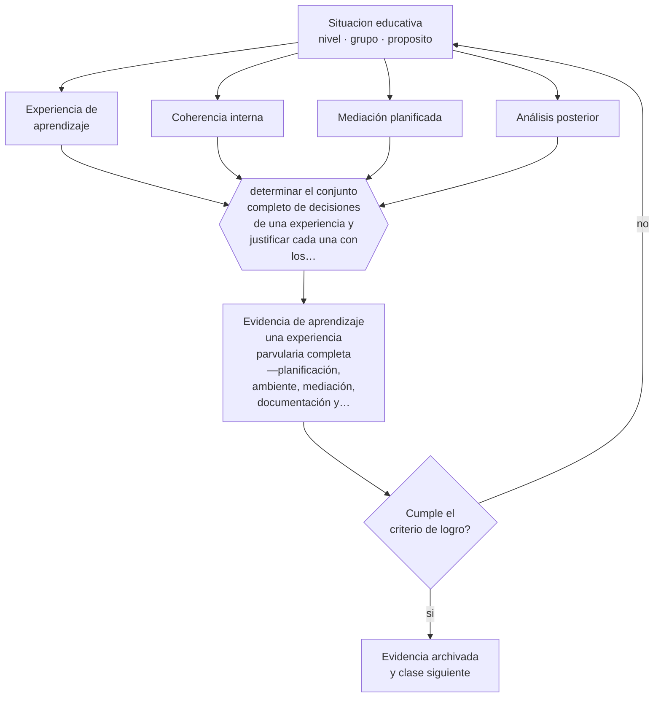

# Clase 048 — Proyecto integrador: experiencia parvularia

> **Parte 03 · Educación parvularia** — clase 12 de 12

**Estado de evidencia:** `MARCO-NORMATIVO` · **Etapa:** 🔵 Etapa B — Enseñanza por ciclo vital · **Población de referencia:** sala cuna, niveles medios y transición (0 a 6 años) 
**Decisión que habilita:** determinar el conjunto completo de decisiones de una experiencia y justificar cada una con los principios del nivel 
**Evidencia de aprendizaje:** una experiencia parvularia completa —planificación, ambiente, mediación, documentación y análisis posterior—

## 🎯 Propósito

Integrar la parte diseñando, ejecutando y documentando una experiencia de aprendizaje parvularia completa, con intención explícita, ambiente preparado, mediación planificada y evidencia recogida.

## 📚 Resultados de aprendizaje

Al finalizar esta clase podrás:

1. **Definir** con precisión los cuatro conceptos centrales de la clase y reconocerlos en una situación educativa real, no solo en su enunciado.
2. **Explicar** cómo se integra todo el nivel en una experiencia pedagógica completa, documentada y defendible.
3. **Decidir** —el conjunto completo de decisiones de una experiencia y justificar cada una con los principios del nivel— y sostener la decisión con un fundamento escrito.
4. **Producir** la evidencia de la clase —una experiencia parvularia completa —planificación, ambiente, mediación, documentación y análisis posterior—— y contrastarla contra el criterio de logro.
5. **Distinguir** lo que la evidencia sostiene de lo que es práctica instalada, preferencia personal o costumbre de la institución.

## 🧩 Conceptos centrales

| Concepto | Comprensión verificable |
|---|---|
| **Experiencia de aprendizaje** | situación diseñada con intención pedagógica que integra ambiente, mediación y evidencia |
| **Coherencia interna** | correspondencia entre objetivo, ambiente, mediación y evidencia recogida |
| **Mediación planificada** | previsión de qué dirá y hará el adulto para ampliar el aprendizaje durante la experiencia |
| **Análisis posterior** | revisión de la evidencia para decidir qué se conserva, qué se ajusta y qué sigue |

## 🗺️ Flujo de razonamiento

## 📖 Desarrollo

### 1. El fondo del asunto

El proyecto integrador exige que las decisiones que la parte trabajó por separado se sostengan juntas y sin contradicción. Es frecuente encontrar planificaciones con objetivos ambiciosos, ambientes que no los permiten y evaluaciones que miden otra cosa. La coherencia interna es el criterio central de esta evaluación, y se comprueba leyendo la experiencia completa de principio a fin.

### 2. Cómo se traduce en decisiones de enseñanza

El trabajo tiene cuatro momentos: planificar declarando intención y evidencia esperada; preparar el ambiente para que la conducta buscada sea posible; mediar según lo previsto, ajustando en el momento; y documentar y analizar para decidir qué sigue. El análisis posterior es la parte que más se omite y la que convierte una actividad aislada en aprendizaje profesional acumulable.

### 3. Qué sostiene la evidencia y qué no

Una experiencia bien diseñada no garantiza aprendizaje en todos los niños, y su evidencia es limitada: registra lo observado en un momento y en un contexto. Presentarla como demostración de logro sería sobreinterpretar. Su valor está en la coherencia del diseño y en la calidad de la evidencia recogida, no en probar un efecto.

> **Cómo leer el estado de evidencia `MARCO-NORMATIVO`.** El contenido no se decide por evidencia empírica sino por norma, política pública o marco institucional vigente. Verifica siempre la versión vigente a la fecha en que vas a aplicarlo: la norma cambia y la clase no se actualiza sola.

## 🧪 Taller guiado

Aplica la clase a **uno** de los contextos siguientes y repite después el ejercicio en un
contexto de exigencia distinta. Cambiar de contexto es parte del aprendizaje: lo que funciona
con un grupo no se traslada intacto a otro.

| Contexto | Rasgo que cambia la decisión |
|---|---|
| Sala cuna (0–2) | cuidado, vínculo y lenguaje son la intervención pedagógica |
| Nivel medio (2–4) | juego simbólico y regulación emocional en construcción |
| Transición (4–6) | alfabetización y matemática emergentes, sin formato escolar |
| Jardín rural o de baja matrícula | grupos multiedad y recursos acotados |
| Modalidad no convencional o comunitaria | la familia participa en la ejecución |
| Contexto de alta vulnerabilidad | el jardín cumple funciones de protección y salud |

**Secuencia de trabajo:**

1. Delimita el contexto: nivel, edad, tamaño del grupo, asignatura o experiencia y tiempo real disponible.
2. Declara qué saben ya los estudiantes y **cómo lo comprobaste**, no cómo lo supones.
3. Formula la decisión pedagógica que esta clase habilita y escribe su fundamento.
4. Anticipa qué observarías si la decisión funciona y qué observarías si no funciona.
5. Diseña de antemano la alternativa que aplicarás si la primera estrategia falla.
6. Ejecuta o simula, y registra lo observado con fecha, contexto y evidencia concreta.
7. Produce la evidencia de aprendizaje de la clase.
8. Contrástala contra el criterio de logro, corrige y recién entonces avanza.

### 📦 Evidencia de aprendizaje

Una experiencia parvularia completa —planificación, ambiente, mediación, documentación y análisis posterior—.

Debe incluir contexto, decisión, fundamento, fuentes consultadas con su fecha, indicador de
logro observable, riesgos previstos y qué harías distinto en la siguiente iteración.

## 🏆 Reto verificable

Ejecuta la experiencia, documenta y analiza en equipo. Presenta el análisis a una colega y pídele que identifique la mayor incoherencia entre lo planificado y lo ocurrido.

## ✅ Criterio de logro

- [ ] objetivo, ambiente, mediación y evidencia son coherentes entre sí y se puede mostrar cómo;
- [ ] el análisis posterior concluye con una decisión concreta sobre qué sigue;
- [ ] cada afirmación sobre «lo que funciona» está atribuida a una fuente identificable, con autor y fecha;
- [ ] la decisión es ejecutable con el tiempo, el espacio, el número de estudiantes y los recursos que realmente tienes;
- [ ] la evidencia queda archivada de forma reproducible: otra persona podría revisarla sin que tú se la expliques.

## ⚠️ Errores frecuentes

**Propios de esta clase:**

- Planificar objetivos que el ambiente preparado no permite alcanzar.
- Omitir el análisis posterior y con ello perder el aprendizaje profesional de la experiencia.

**Característicos de la parte 03:**

- Escolarizar el nivel adelantando formatos de enseñanza propios de la básica.
- Confundir actividad entretenida con experiencia de aprendizaje intencionada.

## ♿ Diversidad, accesibilidad y ética

La prueba de calidad de la experiencia es qué ocurrió con el niño que más apoyo necesita. Si la documentación no permite responder eso, el diseño no cumplió con el principio de singularidad que declara.

Antes de aplicar cualquier decisión de esta clase con estudiantes reales, revisa el
[protocolo de práctica responsable](../../../docs/ETICA_Y_PRACTICA_RESPONSABLE.md):
consentimiento, resguardo de datos personales, proporcionalidad de la intervención y derecho
de cada estudiante a no ser objeto de un ensayo que no le reporta beneficio.

## ❓ Preguntas de comprobación

1. ¿Qué parte de tu experiencia no resiste la pregunta por su coherencia?
2. ¿Qué evidencia recogiste que contradice tu impresión de cómo salió?
3. ¿Qué decidiste hacer distinto y con qué fundamento?

## 📕 Lecturas base

**Mineduc (2018). *Bases Curriculares de la Educación Parvularia*.**  
*Qué aporta a esta clase:* referencia obligatoria para objetivos y coherencia curricular del nivel.

**Rinaldi, C. (2006). *In Dialogue with Reggio Emilia*.**  
*Qué aporta a esta clase:* modelo de cómo documentar y analizar una experiencia para aprender de ella como equipo.

Catálogo completo: [bibliografía del programa](../../../docs/BIBLIOGRAFIA.md) ·
[glosario](../../../docs/GLOSARIO.md) ·
[fuentes oficiales y cómo leerlas](../../../docs/FUENTES.md).

## 🔗 Conexión con el resto del programa

Cierra la parte 03 integrando sus once clases previas. Es el modelo de trabajo que las partes 04 y 05 replican con otras poblaciones.

> [!IMPORTANT]
> Material de formación profesional. No reemplaza un título de pedagogía, una habilitación
> legal para ejercer, ni el juicio de un equipo educativo que conoce a sus estudiantes.

---

| Anterior | Índice | Siguiente |
|---|---|---|
| [← 047 · Familia y comunidad](../class-11-familia-y-comunidad/README.md) | [Parte 03](../README.md) · [Programa](../../../README.md) | [Programa completo →](../../../README.md) |
