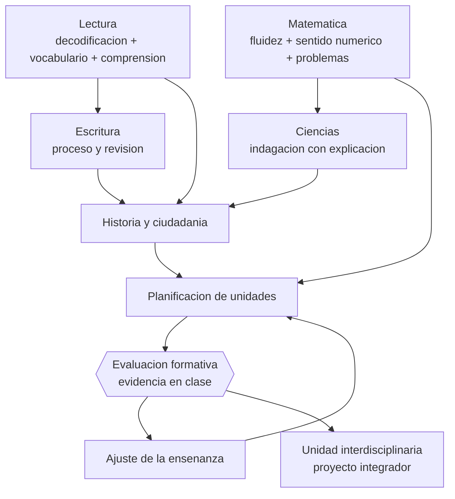

# Parte 04 — Educación básica

> *Aquí se decide quién leerá, calculará y confiará en sí mismo el resto de su vida*

🔵 **Etapa B — Enseñanza por ciclo vital** · salida de la etapa: enseñar a una población concreta con decisiones ajustadas a su desarrollo

**Clases:** 12 (049–060) · **Población de referencia:** 1.º a 8.º básico (6 a 13 años) · **Conceptos operacionales:** 48 · **Señales observables:** 36 
**Contenido central:** Didáctica de la lectura, escritura, matemática, ciencias, historia y ciudadanía, arte, educación física, alfabetización digital, planificación de unidades, evaluación formativa y gestión de aula

## 🎯 De qué trata esta parte

La educación básica concentra las decisiones didácticas con mayor evidencia acumulada y mayor impacto de largo plazo. La enseñanza inicial de la lectura es el mejor ejemplo: décadas de investigación convergen en que la enseñanza sistemática y explícita de la correspondencia entre letras y sonidos, combinada con vocabulario, comprensión y lectura abundante, produce mejores resultados que los enfoques que confían en la adivinación por contexto. No es una opinión metodológica: es uno de los cuerpos de evidencia más sólidos del campo.

La segunda decisión de peso es la matemática temprana. Fluidez en hechos numéricos, comprensión del valor posicional, sentido de las fracciones y resolución de problemas con representación explícita predicen desempeño posterior mejor que casi cualquier otra variable escolar. Aquí también hay un falso dilema instalado —comprensión contra práctica— que la evidencia disuelve: la fluidez libera memoria de trabajo para razonar, y el razonamiento da sentido a la práctica.

El tercer eje es la evaluación formativa cotidiana, que en este nivel decide si un estudiante avanza con vacíos o se detiene a tiempo. Un docente de básica que sabe recoger evidencia de comprensión en tres minutos de clase, y actuar con ella en la clase siguiente, corrige trayectorias enteras. Esa es la competencia central de la parte, y por eso todas las didácticas se cierran con instrumentos y no con discursos.

## 🏫 Caso de la parte

Las doce clases trabajan sobre la misma realidad, para que puedas ver cómo cambia tu diagnóstico
a medida que avanzas:

> En 3.º básico, un tercio del curso no alcanza fluidez lectora suficiente para comprender el texto de otras asignaturas. El establecimiento compró un programa de comprensión lectora, sin medir antes qué componente estaba fallando.

**Artefacto que produces al terminar:** unidad interdisciplinaria con diagnóstico por componente, secuencia alineada y evidencia formativa que produjo un ajuste.

## 📚 Resultados de la parte

Al terminar esta parte podrás:

1. **Enseñar lectura inicial y comprensión con una secuencia fundada en evidencia**.
2. **Diseñar enseñanza de matemática que integre fluidez, comprensión y resolución de problemas**.
3. **Planificar una unidad completa con alineamiento entre objetivos, actividades y evaluación**.
4. **Recoger evidencia formativa en clase y ajustar la enseñanza con ella dentro de la misma semana**.

## 🗺️ Mapa de la parte

## 🧠 Marco de referencia

- ciencia de la lectura: conciencia fonológica, decodificación, fluidez, vocabulario y comprensión
- trayectorias de aprendizaje en matemática temprana y resolución de problemas
- indagación científica escolar con explicación explícita del contenido
- Bases Curriculares de Educación Básica (Mineduc, Chile) y evaluación formativa

**Autoras y autores que conviene conocer:** Linnea Ehri, Anne Castles, Kate Nation y Maggie Snowling, Mark Seidenberg, Robert Siegler, Dylan Wiliam, Barak Rosenshine, equipos del Centro de Perfeccionamiento e Investigación Pedagógica

## 📋 Las 12 clases

| # | Clase | Decisión que habilita | Evidencia |
|---:|---|---|---|
| 049 | [Didáctica de la lectura](class-01-didactica-de-la-lectura/README.md) | determinar la secuencia de enseñanza lectora de tu curso y qué se evalúa en cada componente | `ROBUSTA` |
| 050 | [Didáctica de la escritura](class-02-didactica-de-la-escritura/README.md) | determinar qué estrategia de escritura vas a enseñar de forma explícita y cómo la modelarás | `CONSISTENTE` |
| 051 | [Didáctica de la matemática](class-03-didactica-de-la-matematica/README.md) | determinar qué componente matemático está fallando en tu grupo y qué enseñanza le corresponde | `ROBUSTA` |
| 052 | [Didáctica de las ciencias](class-04-didactica-de-las-ciencias/README.md) | determinar qué concepción alternativa vas a confrontar y con qué evidencia experimentable | `CONSISTENTE` |
| 053 | [Historia, geografía y ciudadanía](class-05-historia-geografia-y-ciudadania/README.md) | determinar qué habilidad disciplinar —uso de fuentes, causalidad, deliberación— vas a enseñar explícitamente | `CONSISTENTE` |
| 054 | [Arte y creatividad](class-06-arte-y-creatividad/README.md) | determinar qué aprendizaje artístico específico persigue tu unidad y cómo lo evaluarás sin premiar solo la prolijidad | `EMERGENTE` |
| 055 | [Educación física y bienestar](class-07-educacion-fisica-y-bienestar/README.md) | determinar qué objetivo motor o de hábito persigue tu clase y cómo se evalúa sin medir solo rendimiento | `ROBUSTA` |
| 056 | [Tecnología y alfabetización digital](class-08-tecnologia-y-alfabetizacion-digital/README.md) | determinar qué competencia digital específica vas a enseñar y cómo la evaluarás con desempeño real | `EN-DEBATE` |
| 057 | [Planificación de unidades](class-09-planificacion-de-unidades/README.md) | determinar la secuencia completa de una unidad y la evidencia que recogerás en cada tramo | `CONSISTENTE` |
| 058 | [Evaluación formativa en básica](class-10-evaluacion-formativa-en-basica/README.md) | determinar qué técnica de recogida de evidencia usarás y qué harás con lo que muestre | `ROBUSTA` |
| 059 | [Gestión de aula en niñez media](class-11-gestion-de-aula-en-ninez-media/README.md) | determinar qué rutinas vas a enseñar explícitamente antes de que aparezca el primer problema | `CONSISTENTE` |
| 060 | [Proyecto integrador: unidad interdisciplinaria](class-12-proyecto-integrador-unidad-interdisciplinaria/README.md) | determinar qué objetivos disciplinares se sostienen en la integración y cuáles se pierden | `CONSISTENTE` |

## ⚠️ Riesgos característicos

- Sostener métodos de lectura inicial refutados por costumbre o por identidad profesional.
- Oponer fluidez y comprensión como si fueran alternativas excluyentes.
- Planificar actividades atractivas sin objetivo de aprendizaje verificable.
- Aplicar evaluación formativa sin cambiar nada de la enseñanza después.

## 📕 Lecturas de referencia de la parte

- **Castles, A., Rastle, K. & Nation, K. (2018). *Ending the Reading Wars*. Psychological Science in the Public Interest, 19(1).** — la síntesis más citada sobre adquisición de la lectura: qué está resuelto y qué sigue abierto.
- **Rosenshine, B. (2012). *Principles of Instruction*. American Educator, 36(1).** — diez principios de enseñanza derivados de investigación de aula, cognición y docentes eficaces; la mejor entrada corta a la didáctica basada en evidencia.
- **Wiliam, D. (2011). *Embedded Formative Assessment*.** — convierte la evaluación formativa en técnicas concretas de aula, no en un discurso sobre evaluación.
- **Mineduc. *Bases Curriculares de Educación Básica* y Programas de Estudio (edición vigente).** — referencia obligatoria para objetivos, progresión y priorización curricular en Chile.

## ✅ Evidencia mínima para dar la parte por cerrada

- [ ] una secuencia de lectura inicial con progresión y evaluación de decodificación;
- [ ] una clase de matemática con problemas, representaciones y práctica deliberada;
- [ ] una unidad completa con alineamiento verificable;
- [ ] un registro de evidencia formativa con el ajuste que produjo.

## 🧭 Práctica y evaluación de la parte

- [Rúbrica maestra e instrumentos de autoevaluación](../../assessments/README.md)
- [Casos profesionales para resolver con este marco](../../cases/README.md)
- [Laboratorios de decisión](../../labs/README.md)
- [Dónde se archiva la evidencia](../../evidence/README.md)

---

| Anterior | Índice | Siguiente |
|---|---|---|
| [← Parte 03 · Educación parvularia](../part-03-educacion-parvularia/README.md) | [Programa](../../README.md) · [Currículo](../../CURRICULUM.md) | [Parte 05 · Educación media y adolescencia →](../part-05-educacion-media-y-adolescencia/README.md) |
