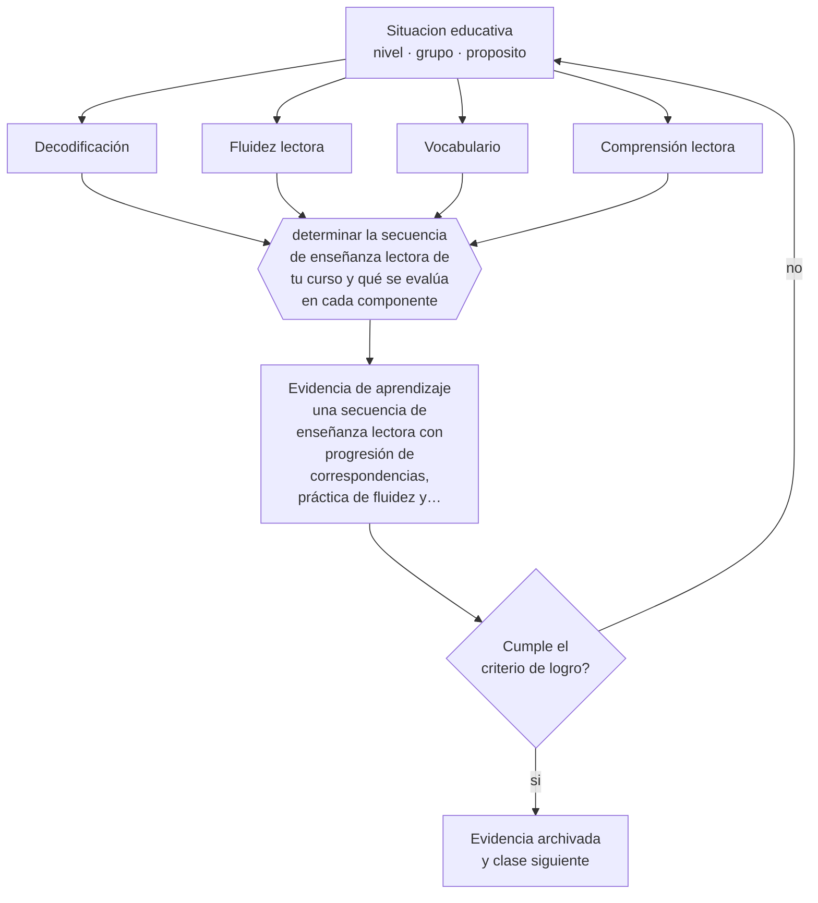

# Clase 049 — Didáctica de la lectura

> **Parte 04 · Educación básica** — clase 1 de 12

**Estado de evidencia:** `ROBUSTA` · **Etapa:** 🔵 Etapa B — Enseñanza por ciclo vital · **Población de referencia:** 1.º a 8.º básico (6 a 13 años) 
**Decisión que habilita:** determinar la secuencia de enseñanza lectora de tu curso y qué se evalúa en cada componente 
**Evidencia de aprendizaje:** una secuencia de enseñanza lectora con progresión de correspondencias, práctica de fluidez y evaluación por componente

## 🎯 Propósito

Enseñar a leer con una secuencia fundada en la evidencia disponible: decodificación sistemática y explícita, fluidez, vocabulario y comprensión trabajados en paralelo y no como etapas separadas.

## 📚 Resultados de aprendizaje

Al finalizar esta clase podrás:

1. **Definir** con precisión los cuatro conceptos centrales de la clase y reconocerlos en una situación educativa real, no solo en su enunciado.
2. **Explicar** por qué la enseñanza sistemática de las correspondencias entre letras y sonidos no es un método más entre otros.
3. **Decidir** —la secuencia de enseñanza lectora de tu curso y qué se evalúa en cada componente— y sostener la decisión con un fundamento escrito.
4. **Producir** la evidencia de la clase —una secuencia de enseñanza lectora con progresión de correspondencias, práctica de fluidez y evaluación por componente— y contrastarla contra el criterio de logro.
5. **Distinguir** lo que la evidencia sostiene de lo que es práctica instalada, preferencia personal o costumbre de la institución.

## 🧩 Conceptos centrales

| Concepto | Comprensión verificable |
|---|---|
| **Decodificación** | conversión de la cadena escrita en lenguaje oral mediante correspondencias entre grafemas y fonemas |
| **Fluidez lectora** | lectura precisa, a ritmo adecuado y con prosodia; libera capacidad para comprender |
| **Vocabulario** | conocimiento de palabras; limita la comprensión aunque la decodificación sea correcta |
| **Comprensión lectora** | construcción de significado; depende de decodificación, vocabulario y conocimiento del mundo |

## 🗺️ Flujo de razonamiento

## 📖 Desarrollo

### 1. El fondo del asunto

La investigación sobre adquisición de la lectura converge en un modelo simple y potente: leer con comprensión requiere decodificar y comprender el lenguaje, y ambos componentes son necesarios. La enseñanza sistemática y explícita de las correspondencias entre letras y sonidos produce mejores resultados que los enfoques que confían en el reconocimiento global o en la adivinación por contexto, sobre todo en los estudiantes con mayor riesgo de dificultad lectora. Esta conclusión está entre las mejor establecidas del campo.

### 2. Cómo se traduce en decisiones de enseñanza

Una secuencia profesional define el orden de las correspondencias, practica hasta la fluidez con textos decodificables al inicio, y desarrolla en paralelo vocabulario y conocimiento del mundo mediante lectura en voz alta de textos ricos que el estudiante todavía no puede leer solo. Evaluar por componente es lo que permite intervenir con precisión: un estudiante que decodifica bien y no comprende tiene un problema distinto del que no decodifica.

### 3. Qué sostiene la evidencia y qué no

La enseñanza sistemática de correspondencias es condición necesaria y no suficiente: no garantiza comprensión, que depende del vocabulario y del conocimiento previo. Además, la transparencia ortográfica del español hace que la decodificación se domine antes que en inglés, de modo que la fase intensiva es más breve y el foco se traslada antes a fluidez y comprensión. Trasladar sin ajuste los plazos de la investigación anglosajona es un error frecuente.

> **Cómo leer el estado de evidencia `ROBUSTA`.** Hay evidencia convergente de varios equipos, países y diseños de investigación, incluidos estudios experimentales o cuasiexperimentales, y el efecto se sostiene al replicarlo. Puedes apoyar una decisión profesional en ella, sin olvidar que ningún efecto promedio describe a un estudiante concreto.

## 🧪 Taller guiado

Aplica la clase a **uno** de los contextos siguientes y repite después el ejercicio en un
contexto de exigencia distinta. Cambiar de contexto es parte del aprendizaje: lo que funciona
con un grupo no se traslada intacto a otro.

| Contexto | Rasgo que cambia la decisión |
|---|---|
| Primer ciclo (1.º a 4.º) | alfabetización inicial y hábitos: el error se arrastra si no se corrige |
| Segundo ciclo (5.º a 8.º) | contenido disciplinar creciente y comparación social |
| Curso numeroso (más de 35) | la gestión del tiempo condiciona toda decisión didáctica |
| Escuela rural multigrado | un docente atiende varios niveles a la vez |
| Grupo con brecha lectora amplia | sin diagnóstico específico, la clase deja fuera a un tercio |
| Alta rotación o inasistencia | la continuidad no puede darse por supuesta |

**Secuencia de trabajo:**

1. Delimita el contexto: nivel, edad, tamaño del grupo, asignatura o experiencia y tiempo real disponible.
2. Declara qué saben ya los estudiantes y **cómo lo comprobaste**, no cómo lo supones.
3. Formula la decisión pedagógica que esta clase habilita y escribe su fundamento.
4. Anticipa qué observarías si la decisión funciona y qué observarías si no funciona.
5. Diseña de antemano la alternativa que aplicarás si la primera estrategia falla.
6. Ejecuta o simula, y registra lo observado con fecha, contexto y evidencia concreta.
7. Produce la evidencia de aprendizaje de la clase.
8. Contrástala contra el criterio de logro, corrige y recién entonces avanza.

### 📦 Evidencia de aprendizaje

Una secuencia de enseñanza lectora con progresión de correspondencias, práctica de fluidez y evaluación por componente.

Debe incluir contexto, decisión, fundamento, fuentes consultadas con su fecha, indicador de
logro observable, riesgos previstos y qué harías distinto en la siguiente iteración.

## 🏆 Reto verificable

Mide la fluidez lectora de tu curso con un texto estandarizado. Diseña una intervención de ocho semanas para el tercio más bajo y vuelve a medir con el mismo instrumento.

## ✅ Criterio de logro

- [ ] la secuencia declara la progresión de correspondencias y su criterio de dominio;
- [ ] existe evaluación separada de decodificación, fluidez y comprensión;
- [ ] cada afirmación sobre «lo que funciona» está atribuida a una fuente identificable, con autor y fecha;
- [ ] la decisión es ejecutable con el tiempo, el espacio, el número de estudiantes y los recursos que realmente tienes;
- [ ] la evidencia queda archivada de forma reproducible: otra persona podría revisarla sin que tú se la expliques.

## ⚠️ Errores frecuentes

**Propios de esta clase:**

- Enseñar a adivinar la palabra por el contexto o por la imagen en vez de decodificar.
- Dar por terminada la enseñanza lectora cuando el estudiante decodifica, sin trabajar fluidez ni vocabulario.

**Característicos de la parte 04:**

- Sostener métodos de lectura inicial refutados por costumbre o por identidad profesional.
- Oponer fluidez y comprensión como si fueran alternativas excluyentes.

## ♿ Diversidad, accesibilidad y ética

La enseñanza sistemática beneficia a todos y es indispensable para los estudiantes con dificultades específicas de la lectura, que son quienes más se perjudican con métodos basados en la adivinación. Detectar temprano y con instrumentos simples evita años de fracaso evitable.

Antes de aplicar cualquier decisión de esta clase con estudiantes reales, revisa el
[protocolo de práctica responsable](../../../docs/ETICA_Y_PRACTICA_RESPONSABLE.md):
consentimiento, resguardo de datos personales, proporcionalidad de la intervención y derecho
de cada estudiante a no ser objeto de un ensayo que no le reporta beneficio.

## ❓ Preguntas de comprobación

1. ¿Cuántos de tus estudiantes leen sin comprender y cuántos comprenden sin leer con fluidez?
2. ¿Qué evidencia tienes de la fluidez lectora de tu curso, en palabras por minuto y con qué texto?
3. ¿Qué haces distinto con quien falla en decodificación y con quien falla en vocabulario?

## 📕 Lecturas base

**Castles, A., Rastle, K. & Nation, K. (2018). *Ending the Reading Wars*.**  
*Qué aporta a esta clase:* la síntesis más completa y equilibrada sobre qué está resuelto en la enseñanza de la lectura.

**Seidenberg, M. (2017). *Language at the Speed of Sight*.**  
*Qué aporta a esta clase:* explica el mecanismo cognitivo de la lectura y por qué ciertos métodos populares fracasan.

Catálogo completo: [bibliografía del programa](../../../docs/BIBLIOGRAFIA.md) ·
[glosario](../../../docs/GLOSARIO.md) ·
[fuentes oficiales y cómo leerlas](../../../docs/FUENTES.md).

## 🔗 Conexión con el resto del programa

Se apoya en la clase 040 y sostiene toda la parte 04: sin fluidez lectora, ninguna asignatura funciona en el segundo ciclo.

> [!IMPORTANT]
> Material de formación profesional. No reemplaza un título de pedagogía, una habilitación
> legal para ejercer, ni el juicio de un equipo educativo que conoce a sus estudiantes.

---

| Anterior | Índice | Siguiente |
|---|---|---|
| [← Parte 04](../README.md) | [Parte 04](../README.md) · [Programa](../../../README.md) | [050 · Didáctica de la escritura →](../class-02-didactica-de-la-escritura/README.md) |
