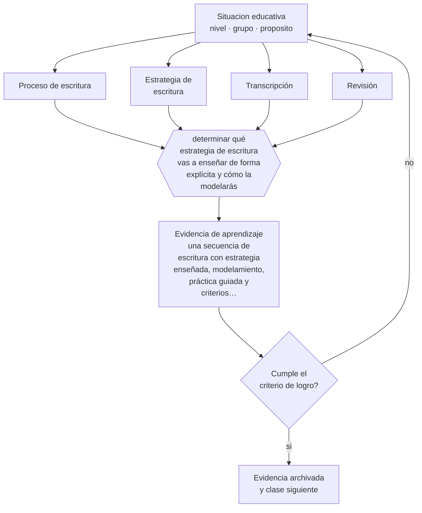

# Clase 050 — Didáctica de la escritura

> **Parte 04 · Educación básica** — clase 2 de 12

**Estado de evidencia:** `CONSISTENTE` · **Etapa:** 🔵 Etapa B — Enseñanza por ciclo vital · **Población de referencia:** 1.º a 8.º básico (6 a 13 años) 
**Decisión que habilita:** determinar qué estrategia de escritura vas a enseñar de forma explícita y cómo la modelarás 
**Evidencia de aprendizaje:** una secuencia de escritura con estrategia enseñada, modelamiento, práctica guiada y criterios de revisión

## 🎯 Propósito

Enseñar la escritura como proceso con enseñanza explícita de estrategias: planificar, redactar, revisar y editar, con modelamiento del docente y retroalimentación que se pueda usar.

## 📚 Resultados de aprendizaje

Al finalizar esta clase podrás:

1. **Definir** con precisión los cuatro conceptos centrales de la clase y reconocerlos en una situación educativa real, no solo en su enunciado.
2. **Explicar** por qué escribir bien no se aprende escribiendo mucho, sino escribiendo con enseñanza explícita y revisión.
3. **Decidir** —qué estrategia de escritura vas a enseñar de forma explícita y cómo la modelarás— y sostener la decisión con un fundamento escrito.
4. **Producir** la evidencia de la clase —una secuencia de escritura con estrategia enseñada, modelamiento, práctica guiada y criterios de revisión— y contrastarla contra el criterio de logro.
5. **Distinguir** lo que la evidencia sostiene de lo que es práctica instalada, preferencia personal o costumbre de la institución.

## 🧩 Conceptos centrales

| Concepto | Comprensión verificable |
|---|---|
| **Proceso de escritura** | ciclo de planificar, redactar, revisar y editar; no es lineal y se enseña por partes |
| **Estrategia de escritura** | procedimiento explícito que el estudiante puede aplicar de forma autónoma |
| **Transcripción** | costo de la caligrafía y la ortografía; si no está automatizado, consume la capacidad de componer |
| **Revisión** | modificación del texto con criterios; es la fase que más distingue a escritores expertos de novatos |

## 🗺️ Flujo de razonamiento

## 📖 Desarrollo

### 1. El fondo del asunto

Las síntesis de investigación sobre enseñanza de la escritura muestran efectos consistentes para la enseñanza explícita de estrategias, el establecimiento de metas de producto, la revisión entre pares con criterios y el modelamiento del proceso por parte del docente. Escribir mucho sin enseñanza produce poco cambio: los estudiantes repiten sus procedimientos actuales. Y en los primeros años, la automatización de la transcripción condiciona todo lo demás.

### 2. Cómo se traduce en decisiones de enseñanza

Una secuencia eficaz enseña una estrategia a la vez, la modela pensando en voz alta, la practica con apoyo y la retira de forma gradual. La revisión necesita criterios concretos —no «mejora tu texto» sino «comprueba que cada párrafo tenga una idea y su ejemplo»— y tiempo real de clase. La retroalimentación debe llegar antes de la versión final; después de la nota, casi nadie la usa.

### 3. Qué sostiene la evidencia y qué no

Los efectos varían según el tipo de texto y la edad, y las estrategias enseñadas no transfieren automáticamente a otros géneros. La corrección exhaustiva de errores de superficie no mejora la calidad de la escritura, aunque sea la práctica más extendida y la que más tiempo consume al docente. Redistribuir ese tiempo hacia la enseñanza explícita rinde mucho más.

> **Cómo leer el estado de evidencia `CONSISTENTE`.** La evidencia es amplia y coherente, pero proviene sobre todo de estudios correlacionales, de síntesis con heterogeneidad alta o de contextos distintos al tuyo. Sirve para orientar la decisión y exige que compruebes el efecto en tu propio grupo.

## 🧪 Taller guiado

Aplica la clase a **uno** de los contextos siguientes y repite después el ejercicio en un
contexto de exigencia distinta. Cambiar de contexto es parte del aprendizaje: lo que funciona
con un grupo no se traslada intacto a otro.

| Contexto | Rasgo que cambia la decisión |
|---|---|
| Primer ciclo (1.º a 4.º) | alfabetización inicial y hábitos: el error se arrastra si no se corrige |
| Segundo ciclo (5.º a 8.º) | contenido disciplinar creciente y comparación social |
| Curso numeroso (más de 35) | la gestión del tiempo condiciona toda decisión didáctica |
| Escuela rural multigrado | un docente atiende varios niveles a la vez |
| Grupo con brecha lectora amplia | sin diagnóstico específico, la clase deja fuera a un tercio |
| Alta rotación o inasistencia | la continuidad no puede darse por supuesta |

**Secuencia de trabajo:**

1. Delimita el contexto: nivel, edad, tamaño del grupo, asignatura o experiencia y tiempo real disponible.
2. Declara qué saben ya los estudiantes y **cómo lo comprobaste**, no cómo lo supones.
3. Formula la decisión pedagógica que esta clase habilita y escribe su fundamento.
4. Anticipa qué observarías si la decisión funciona y qué observarías si no funciona.
5. Diseña de antemano la alternativa que aplicarás si la primera estrategia falla.
6. Ejecuta o simula, y registra lo observado con fecha, contexto y evidencia concreta.
7. Produce la evidencia de aprendizaje de la clase.
8. Contrástala contra el criterio de logro, corrige y recién entonces avanza.

### 📦 Evidencia de aprendizaje

Una secuencia de escritura con estrategia enseñada, modelamiento, práctica guiada y criterios de revisión.

Debe incluir contexto, decisión, fundamento, fuentes consultadas con su fecha, indicador de
logro observable, riesgos previstos y qué harías distinto en la siguiente iteración.

## 🏆 Reto verificable

Enseña explícitamente una estrategia de escritura durante cuatro semanas. Compara un texto inicial y uno final con la misma rúbrica y analiza qué cambió realmente.

## ✅ Criterio de logro

- [ ] la secuencia enseña una estrategia identificable con modelamiento explícito;
- [ ] la retroalimentación ocurre antes de la versión final y con criterios utilizables;
- [ ] cada afirmación sobre «lo que funciona» está atribuida a una fuente identificable, con autor y fecha;
- [ ] la decisión es ejecutable con el tiempo, el espacio, el número de estudiantes y los recursos que realmente tienes;
- [ ] la evidencia queda archivada de forma reproducible: otra persona podría revisarla sin que tú se la expliques.

## ⚠️ Errores frecuentes

**Propios de esta clase:**

- Corregir exhaustivamente errores de superficie y esperar que eso mejore la escritura.
- Pedir revisión sin criterios concretos ni tiempo de clase para hacerla.

**Característicos de la parte 04:**

- Sostener métodos de lectura inicial refutados por costumbre o por identidad profesional.
- Oponer fluidez y comprensión como si fueran alternativas excluyentes.

## ♿ Diversidad, accesibilidad y ética

Los estudiantes con dificultades de transcripción quedan atrapados: no pueden componer porque el esfuerzo se agota en escribir. Permitir dictado, teclado o apoyo de transcripción no rebaja el objetivo de composición, lo hace accesible.

Antes de aplicar cualquier decisión de esta clase con estudiantes reales, revisa el
[protocolo de práctica responsable](../../../docs/ETICA_Y_PRACTICA_RESPONSABLE.md):
consentimiento, resguardo de datos personales, proporcionalidad de la intervención y derecho
de cada estudiante a no ser objeto de un ensayo que no le reporta beneficio.

## ❓ Preguntas de comprobación

1. ¿Qué estrategia de escritura pueden usar tus estudiantes sin ti?
2. ¿Cuánto de tu tiempo de corrección cambia efectivamente el texto siguiente?
3. ¿En qué momento de tu secuencia se revisa realmente, y con qué criterios?

## 📕 Lecturas base

**Graham, S. & Perin, D. (2007). *Writing Next*.**  
*Qué aporta a esta clase:* síntesis de intervenciones efectivas en escritura con tamaños de efecto declarados.

**Graham, S. & Harris, K. *Self-Regulated Strategy Development*.**  
*Qué aporta a esta clase:* modelo de enseñanza explícita de estrategias con evidencia acumulada en distintas edades.

Catálogo completo: [bibliografía del programa](../../../docs/BIBLIOGRAFIA.md) ·
[glosario](../../../docs/GLOSARIO.md) ·
[fuentes oficiales y cómo leerlas](../../../docs/FUENTES.md).

## 🔗 Conexión con el resto del programa

Se apoya en la clase 049 y alimenta la parte 11 (rúbricas y retroalimentación) y la parte 14 (escritura académica).

> [!IMPORTANT]
> Material de formación profesional. No reemplaza un título de pedagogía, una habilitación
> legal para ejercer, ni el juicio de un equipo educativo que conoce a sus estudiantes.

---

| Anterior | Índice | Siguiente |
|---|---|---|
| [← 049 · Didáctica de la lectura](../class-01-didactica-de-la-lectura/README.md) | [Parte 04](../README.md) · [Programa](../../../README.md) | [051 · Didáctica de la matemática →](../class-03-didactica-de-la-matematica/README.md) |
