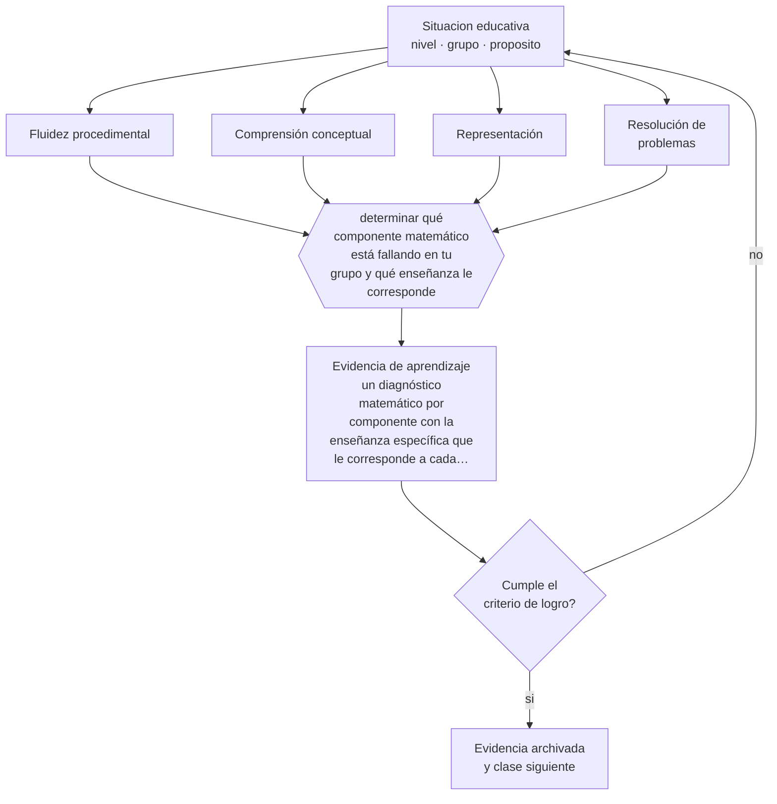

# Clase 051 — Didáctica de la matemática

> **Parte 04 · Educación básica** — clase 3 de 12

**Estado de evidencia:** `ROBUSTA` · **Etapa:** 🔵 Etapa B — Enseñanza por ciclo vital · **Población de referencia:** 1.º a 8.º básico (6 a 13 años) 
**Decisión que habilita:** determinar qué componente matemático está fallando en tu grupo y qué enseñanza le corresponde 
**Evidencia de aprendizaje:** un diagnóstico matemático por componente con la enseñanza específica que le corresponde a cada uno

## 🎯 Propósito

Diseñar enseñanza matemática que integre fluidez en hechos y procedimientos, comprensión conceptual y resolución de problemas, en vez de optar por uno de los tres.

## 📚 Resultados de aprendizaje

Al finalizar esta clase podrás:

1. **Definir** con precisión los cuatro conceptos centrales de la clase y reconocerlos en una situación educativa real, no solo en su enunciado.
2. **Explicar** por qué comprensión y práctica no son alternativas en la enseñanza de la matemática.
3. **Decidir** —qué componente matemático está fallando en tu grupo y qué enseñanza le corresponde— y sostener la decisión con un fundamento escrito.
4. **Producir** la evidencia de la clase —un diagnóstico matemático por componente con la enseñanza específica que le corresponde a cada uno— y contrastarla contra el criterio de logro.
5. **Distinguir** lo que la evidencia sostiene de lo que es práctica instalada, preferencia personal o costumbre de la institución.

## 🧩 Conceptos centrales

| Concepto | Comprensión verificable |
|---|---|
| **Fluidez procedimental** | ejecución rápida y precisa de procedimientos; libera capacidad para razonar |
| **Comprensión conceptual** | entendimiento de por qué funciona un procedimiento y cómo se relaciona con otros |
| **Representación** | forma de presentar una idea matemática —concreta, pictórica, simbólica— y su traducción entre sí |
| **Resolución de problemas** | aplicación de conocimiento a situaciones nuevas, que exige reconocer la estructura del problema |

## 🗺️ Flujo de razonamiento

## 📖 Desarrollo

### 1. El fondo del asunto

El falso dilema entre comprender y practicar ha hecho daño real en la enseñanza escolar. La evidencia muestra una relación recíproca: la fluidez libera memoria de trabajo para razonar sobre el problema, y la comprensión conceptual hace que la práctica no se olvide ni se aplique fuera de lugar. Los estudiantes con dificultades persistentes suelen fallar en ambos, y necesitan trabajo simultáneo, no la elección de una escuela didáctica.

### 2. Cómo se traduce en decisiones de enseñanza

El diagnóstico por componente es la herramienta central: distinguir a quien no domina hechos básicos, a quien ejecuta el procedimiento sin comprenderlo, a quien comprende y no reconoce cuándo aplicarlo. Cada perfil requiere enseñanza distinta. El uso deliberado de representaciones —concreta, pictórica y simbólica— y su traducción explícita entre sí es una de las prácticas con mejor rendimiento en todos los perfiles.

### 3. Qué sostiene la evidencia y qué no

El descubrimiento sin guía muestra resultados pobres en matemática escolar, especialmente en estudiantes con menos conocimiento previo; pero la instrucción puramente procedimental produce conocimiento frágil que no transfiere. La posición sostenible es instrucción explícita con práctica deliberada y trabajo de problemas con guía decreciente, no un extremo del péndulo.

> **Cómo leer el estado de evidencia `ROBUSTA`.** Hay evidencia convergente de varios equipos, países y diseños de investigación, incluidos estudios experimentales o cuasiexperimentales, y el efecto se sostiene al replicarlo. Puedes apoyar una decisión profesional en ella, sin olvidar que ningún efecto promedio describe a un estudiante concreto.

## 🧪 Taller guiado

Aplica la clase a **uno** de los contextos siguientes y repite después el ejercicio en un
contexto de exigencia distinta. Cambiar de contexto es parte del aprendizaje: lo que funciona
con un grupo no se traslada intacto a otro.

| Contexto | Rasgo que cambia la decisión |
|---|---|
| Primer ciclo (1.º a 4.º) | alfabetización inicial y hábitos: el error se arrastra si no se corrige |
| Segundo ciclo (5.º a 8.º) | contenido disciplinar creciente y comparación social |
| Curso numeroso (más de 35) | la gestión del tiempo condiciona toda decisión didáctica |
| Escuela rural multigrado | un docente atiende varios niveles a la vez |
| Grupo con brecha lectora amplia | sin diagnóstico específico, la clase deja fuera a un tercio |
| Alta rotación o inasistencia | la continuidad no puede darse por supuesta |

**Secuencia de trabajo:**

1. Delimita el contexto: nivel, edad, tamaño del grupo, asignatura o experiencia y tiempo real disponible.
2. Declara qué saben ya los estudiantes y **cómo lo comprobaste**, no cómo lo supones.
3. Formula la decisión pedagógica que esta clase habilita y escribe su fundamento.
4. Anticipa qué observarías si la decisión funciona y qué observarías si no funciona.
5. Diseña de antemano la alternativa que aplicarás si la primera estrategia falla.
6. Ejecuta o simula, y registra lo observado con fecha, contexto y evidencia concreta.
7. Produce la evidencia de aprendizaje de la clase.
8. Contrástala contra el criterio de logro, corrige y recién entonces avanza.

### 📦 Evidencia de aprendizaje

Un diagnóstico matemático por componente con la enseñanza específica que le corresponde a cada uno.

Debe incluir contexto, decisión, fundamento, fuentes consultadas con su fecha, indicador de
logro observable, riesgos previstos y qué harías distinto en la siguiente iteración.

## 🏆 Reto verificable

Aplica un diagnóstico por componente a tu curso y agrupa a los estudiantes por perfil. Diseña seis semanas de enseñanza diferenciada por perfil y compara resultados.

## ✅ Criterio de logro

- [ ] el diagnóstico distingue al menos tres perfiles de dificultad con evidencia;
- [ ] cada perfil recibe una enseñanza específica y no la misma repetición;
- [ ] cada afirmación sobre «lo que funciona» está atribuida a una fuente identificable, con autor y fecha;
- [ ] la decisión es ejecutable con el tiempo, el espacio, el número de estudiantes y los recursos que realmente tienes;
- [ ] la evidencia queda archivada de forma reproducible: otra persona podría revisarla sin que tú se la expliques.

## ⚠️ Errores frecuentes

**Propios de esta clase:**

- Optar entre comprensión y fluidez como si fueran escuelas rivales.
- Enseñar el procedimiento sin conectar la representación concreta con la simbólica.

**Característicos de la parte 04:**

- Sostener métodos de lectura inicial refutados por costumbre o por identidad profesional.
- Oponer fluidez y comprensión como si fueran alternativas excluyentes.

## ♿ Diversidad, accesibilidad y ética

Las dificultades específicas en matemática existen y se detectan con instrumentos simples. Sin diagnóstico, se atribuyen a falta de esfuerzo, y el estudiante acumula años de fracaso con intervenciones genéricas que no atacan su problema real.

Antes de aplicar cualquier decisión de esta clase con estudiantes reales, revisa el
[protocolo de práctica responsable](../../../docs/ETICA_Y_PRACTICA_RESPONSABLE.md):
consentimiento, resguardo de datos personales, proporcionalidad de la intervención y derecho
de cada estudiante a no ser objeto de un ensayo que no le reporta beneficio.

## ❓ Preguntas de comprobación

1. ¿Tus estudiantes no saben el procedimiento, no lo comprenden o no saben cuándo usarlo?
2. ¿Qué hechos básicos no automatizados están consumiendo su capacidad de razonar?
3. ¿Dónde haces explícita la traducción entre representaciones?

## 📕 Lecturas base

**National Mathematics Advisory Panel (2008). *Foundations for Success*.**  
*Qué aporta a esta clase:* informe que sintetiza la evidencia sobre fluidez, conceptos y resolución de problemas.

**Siegler, R. et al. (2012). *Early Predictors of High School Mathematics Achievement*. Psychological Science, 23(7).**  
*Qué aporta a esta clase:* muestra el papel predictivo del conocimiento de fracciones y división; orienta prioridades del segundo ciclo.

Catálogo completo: [bibliografía del programa](../../../docs/BIBLIOGRAFIA.md) ·
[glosario](../../../docs/GLOSARIO.md) ·
[fuentes oficiales y cómo leerlas](../../../docs/FUENTES.md).

## 🔗 Conexión con el resto del programa

Se apoya en las clases 041 y 017, porque la fluidez es el mecanismo por el que se libera memoria de trabajo.

> [!IMPORTANT]
> Material de formación profesional. No reemplaza un título de pedagogía, una habilitación
> legal para ejercer, ni el juicio de un equipo educativo que conoce a sus estudiantes.

---

| Anterior | Índice | Siguiente |
|---|---|---|
| [← 050 · Didáctica de la escritura](../class-02-didactica-de-la-escritura/README.md) | [Parte 04](../README.md) · [Programa](../../../README.md) | [052 · Didáctica de las ciencias →](../class-04-didactica-de-las-ciencias/README.md) |
