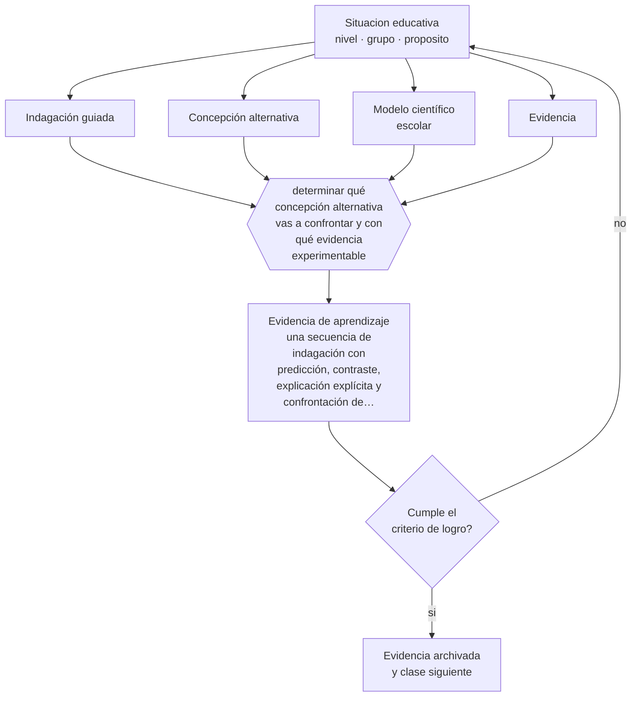

# Clase 052 — Didáctica de las ciencias

> **Parte 04 · Educación básica** — clase 4 de 12

**Estado de evidencia:** `CONSISTENTE` · **Etapa:** 🔵 Etapa B — Enseñanza por ciclo vital · **Población de referencia:** 1.º a 8.º básico (6 a 13 años) 
**Decisión que habilita:** determinar qué concepción alternativa vas a confrontar y con qué evidencia experimentable 
**Evidencia de aprendizaje:** una secuencia de indagación con predicción, contraste, explicación explícita y confrontación de la concepción alternativa

## 🎯 Propósito

Diseñar enseñanza científica que combine indagación con explicación explícita del contenido, y que enfrente las concepciones alternativas que los estudiantes traen sobre el mundo natural.

## 📚 Resultados de aprendizaje

Al finalizar esta clase podrás:

1. **Definir** con precisión los cuatro conceptos centrales de la clase y reconocerlos en una situación educativa real, no solo en su enunciado.
2. **Explicar** por qué hacer experimentos no equivale a aprender ciencia.
3. **Decidir** —qué concepción alternativa vas a confrontar y con qué evidencia experimentable— y sostener la decisión con un fundamento escrito.
4. **Producir** la evidencia de la clase —una secuencia de indagación con predicción, contraste, explicación explícita y confrontación de la concepción alternativa— y contrastarla contra el criterio de logro.
5. **Distinguir** lo que la evidencia sostiene de lo que es práctica instalada, preferencia personal o costumbre de la institución.

## 🧩 Conceptos centrales

| Concepto | Comprensión verificable |
|---|---|
| **Indagación guiada** | investigación estructurada por el docente donde el estudiante predice, prueba y explica |
| **Concepción alternativa** | idea previa sobre fenómenos naturales, coherente y resistente a la enseñanza |
| **Modelo científico escolar** | representación simplificada y correcta que permite explicar y predecir en el nivel |
| **Evidencia** | observación registrada que permite apoyar o descartar una explicación |

## 🗺️ Flujo de razonamiento

## 📖 Desarrollo

### 1. El fondo del asunto

Las actividades prácticas por sí solas producen poco aprendizaje conceptual: los estudiantes ejecutan procedimientos y confirman lo que ya creían. Lo que cambia el resultado es la combinación de predicción explícita, contraste con la observación y explicación posterior del docente que conecta lo observado con el modelo científico. La secuencia predecir-observar-explicar es simple y tiene respaldo consistente.

### 2. Cómo se traduce en decisiones de enseñanza

El diseño empieza identificando la concepción alternativa dominante del grupo y buscando una situación que ella no pueda explicar. Después se pide predicción escrita —comprometerse antes de mirar es parte del mecanismo—, se observa, se registra y se explica. Sin la explicación final, la mayoría reinterpreta lo observado para que quepa en su idea original.

### 3. Qué sostiene la evidencia y qué no

La indagación con guía mínima muestra resultados pobres, especialmente en estudiantes con menos conocimiento previo. Y una concepción alternativa robusta no desaparece con una sola experiencia: convive con la explicación escolar durante mucho tiempo. Prometer cambio conceptual con una actividad aislada es sobreestimar el efecto.

> **Cómo leer el estado de evidencia `CONSISTENTE`.** La evidencia es amplia y coherente, pero proviene sobre todo de estudios correlacionales, de síntesis con heterogeneidad alta o de contextos distintos al tuyo. Sirve para orientar la decisión y exige que compruebes el efecto en tu propio grupo.

## 🧪 Taller guiado

Aplica la clase a **uno** de los contextos siguientes y repite después el ejercicio en un
contexto de exigencia distinta. Cambiar de contexto es parte del aprendizaje: lo que funciona
con un grupo no se traslada intacto a otro.

| Contexto | Rasgo que cambia la decisión |
|---|---|
| Primer ciclo (1.º a 4.º) | alfabetización inicial y hábitos: el error se arrastra si no se corrige |
| Segundo ciclo (5.º a 8.º) | contenido disciplinar creciente y comparación social |
| Curso numeroso (más de 35) | la gestión del tiempo condiciona toda decisión didáctica |
| Escuela rural multigrado | un docente atiende varios niveles a la vez |
| Grupo con brecha lectora amplia | sin diagnóstico específico, la clase deja fuera a un tercio |
| Alta rotación o inasistencia | la continuidad no puede darse por supuesta |

**Secuencia de trabajo:**

1. Delimita el contexto: nivel, edad, tamaño del grupo, asignatura o experiencia y tiempo real disponible.
2. Declara qué saben ya los estudiantes y **cómo lo comprobaste**, no cómo lo supones.
3. Formula la decisión pedagógica que esta clase habilita y escribe su fundamento.
4. Anticipa qué observarías si la decisión funciona y qué observarías si no funciona.
5. Diseña de antemano la alternativa que aplicarás si la primera estrategia falla.
6. Ejecuta o simula, y registra lo observado con fecha, contexto y evidencia concreta.
7. Produce la evidencia de aprendizaje de la clase.
8. Contrástala contra el criterio de logro, corrige y recién entonces avanza.

### 📦 Evidencia de aprendizaje

Una secuencia de indagación con predicción, contraste, explicación explícita y confrontación de la concepción alternativa.

Debe incluir contexto, decisión, fundamento, fuentes consultadas con su fecha, indicador de
logro observable, riesgos previstos y qué harías distinto en la siguiente iteración.

## 🏆 Reto verificable

Aplica una secuencia de predecir, observar y explicar sobre una concepción alternativa conocida. Registra cuántos estudiantes mantienen su idea original después de la actividad.

## ✅ Criterio de logro

- [ ] la secuencia incluye predicción escrita antes de la observación;
- [ ] la explicación final conecta explícitamente la evidencia con el modelo científico escolar;
- [ ] cada afirmación sobre «lo que funciona» está atribuida a una fuente identificable, con autor y fecha;
- [ ] la decisión es ejecutable con el tiempo, el espacio, el número de estudiantes y los recursos que realmente tienes;
- [ ] la evidencia queda archivada de forma reproducible: otra persona podría revisarla sin que tú se la expliques.

## ⚠️ Errores frecuentes

**Propios de esta clase:**

- Realizar actividades prácticas sin predicción previa ni explicación posterior.
- Suponer que una sola experiencia desmonta una concepción alternativa consolidada.

**Característicos de la parte 04:**

- Sostener métodos de lectura inicial refutados por costumbre o por identidad profesional.
- Oponer fluidez y comprensión como si fueran alternativas excluyentes.

## ♿ Diversidad, accesibilidad y ética

El lenguaje científico es una barrera adicional para estudiantes que aprenden en una segunda lengua o con vocabulario limitado. Enseñar explícitamente los términos y aceptar explicaciones en lenguaje cotidiano antes de exigir el término técnico mantiene el acceso al razonamiento.

Antes de aplicar cualquier decisión de esta clase con estudiantes reales, revisa el
[protocolo de práctica responsable](../../../docs/ETICA_Y_PRACTICA_RESPONSABLE.md):
consentimiento, resguardo de datos personales, proporcionalidad de la intervención y derecho
de cada estudiante a no ser objeto de un ensayo que no le reporta beneficio.

## ❓ Preguntas de comprobación

1. ¿Qué cree tu grupo sobre este fenómeno antes de la clase?
2. ¿Qué observación sería imposible de explicar con esa creencia?
3. ¿Dónde en tu secuencia el estudiante se compromete con una predicción?

## 📕 Lecturas base

**Furtak, E. et al. (2012). *Experimental and Quasi-Experimental Studies of Inquiry-Based Science Teaching*. Review of Educational Research, 82(3).**  
*Qué aporta a esta clase:* metaanálisis que muestra el papel decisivo del grado de guía en la indagación.

**Driver, R. et al. (1994). *Making Sense of Secondary Science*.**  
*Qué aporta a esta clase:* catálogo de concepciones alternativas por tema; herramienta directa para planificar.

Catálogo completo: [bibliografía del programa](../../../docs/BIBLIOGRAFIA.md) ·
[glosario](../../../docs/GLOSARIO.md) ·
[fuentes oficiales y cómo leerlas](../../../docs/FUENTES.md).

## 🔗 Conexión con el resto del programa

Aplica la clase 015 y la clase 044, y anticipa la parte 05, donde la indagación se transforma en aprendizaje basado en problemas.

> [!IMPORTANT]
> Material de formación profesional. No reemplaza un título de pedagogía, una habilitación
> legal para ejercer, ni el juicio de un equipo educativo que conoce a sus estudiantes.

---

| Anterior | Índice | Siguiente |
|---|---|---|
| [← 051 · Didáctica de la matemática](../class-03-didactica-de-la-matematica/README.md) | [Parte 04](../README.md) · [Programa](../../../README.md) | [053 · Historia, geografía y ciudadanía →](../class-05-historia-geografia-y-ciudadania/README.md) |
