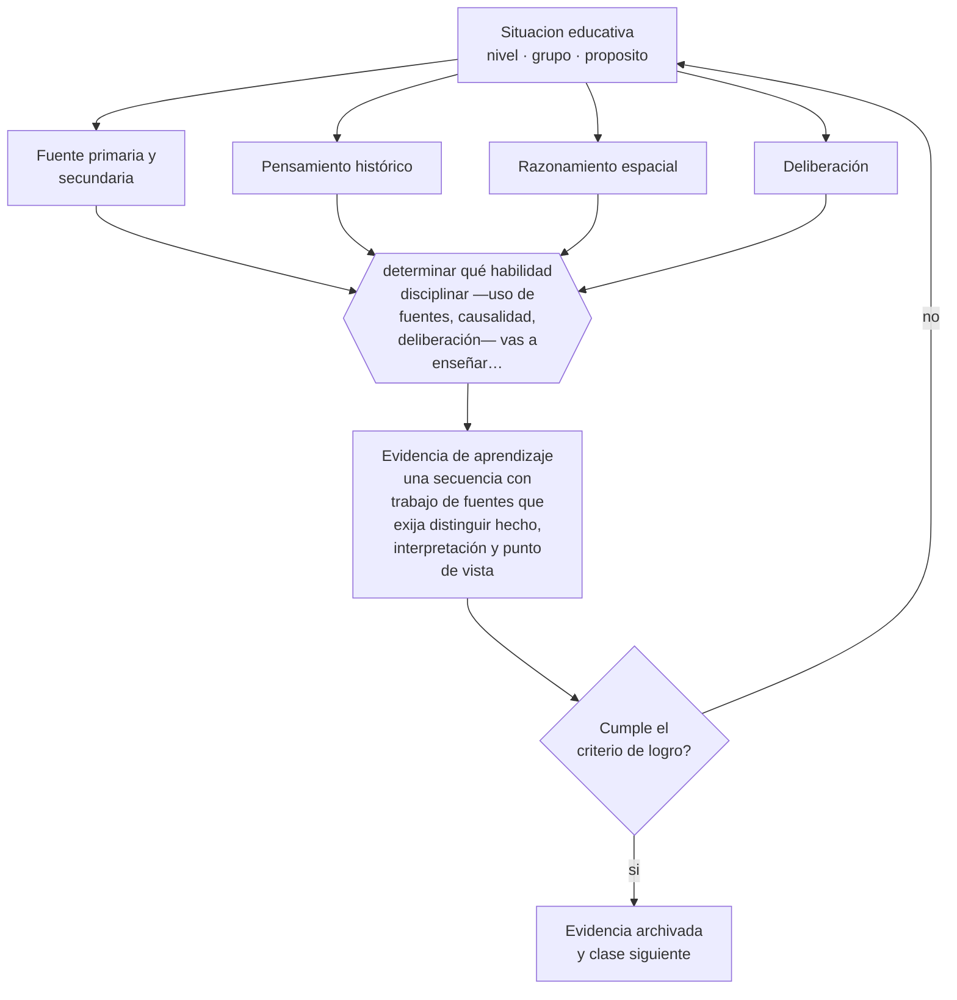

# Clase 053 — Historia, geografía y ciudadanía

> **Parte 04 · Educación básica** — clase 5 de 12

**Estado de evidencia:** `CONSISTENTE` · **Etapa:** 🔵 Etapa B — Enseñanza por ciclo vital · **Población de referencia:** 1.º a 8.º básico (6 a 13 años) 
**Decisión que habilita:** determinar qué habilidad disciplinar —uso de fuentes, causalidad, deliberación— vas a enseñar explícitamente 
**Evidencia de aprendizaje:** una secuencia con trabajo de fuentes que exija distinguir hecho, interpretación y punto de vista

## 🎯 Propósito

Enseñar historia, geografía y formación ciudadana como disciplinas con métodos propios: trabajar con fuentes, distinguir hecho de interpretación, situar en el espacio y deliberar con argumentos.

## 📚 Resultados de aprendizaje

Al finalizar esta clase podrás:

1. **Definir** con precisión los cuatro conceptos centrales de la clase y reconocerlos en una situación educativa real, no solo en su enunciado.
2. **Explicar** cómo se enseña a interpretar el pasado y el territorio sin reducirlos a fechas y mapas para memorizar.
3. **Decidir** —qué habilidad disciplinar —uso de fuentes, causalidad, deliberación— vas a enseñar explícitamente— y sostener la decisión con un fundamento escrito.
4. **Producir** la evidencia de la clase —una secuencia con trabajo de fuentes que exija distinguir hecho, interpretación y punto de vista— y contrastarla contra el criterio de logro.
5. **Distinguir** lo que la evidencia sostiene de lo que es práctica instalada, preferencia personal o costumbre de la institución.

## 🧩 Conceptos centrales

| Concepto | Comprensión verificable |
|---|---|
| **Fuente primaria y secundaria** | documento del período estudiado y elaboración posterior sobre él; se leen de forma distinta |
| **Pensamiento histórico** | conjunto de operaciones —contextualizar, corroborar, atribuir— propias del oficio del historiador |
| **Razonamiento espacial** | interpretación de la distribución de fenómenos en el territorio y de sus relaciones |
| **Deliberación** | discusión pública con argumentos y evidencia sobre asuntos que admiten desacuerdo legítimo |

## 🗺️ Flujo de razonamiento

## 📖 Desarrollo

### 1. El fondo del asunto

Enseñar historia como cronología para memorizar produce olvido rápido y ninguna capacidad de leer el presente. La alternativa con mejor respaldo es enseñar las operaciones del oficio: leer una fuente preguntando quién la escribió y para qué, corroborar con otra, contextualizar y distinguir lo que el documento prueba de lo que sugiere. Esas operaciones son enseñables desde la educación básica con fuentes adaptadas.

### 2. Cómo se traduce en decisiones de enseñanza

Una secuencia típica ofrece dos o tres fuentes que discrepan sobre un mismo hecho y pide al estudiante determinar qué se puede afirmar. La discusión posterior enseña más que la respuesta correcta. En formación ciudadana, la deliberación estructurada sobre asuntos controversiales —con reglas, evidencia y roles— muestra efectos consistentes sobre conocimiento cívico y disposición a participar.

### 3. Qué sostiene la evidencia y qué no

El trabajo con fuentes exige conocimiento previo suficiente: sin contexto, el estudiante no puede evaluar nada y la actividad se vuelve un ejercicio vacío. Y la deliberación sobre temas controversiales requiere reglas explícitas y clima seguro; sin ellas reproduce jerarquías del curso y silencia a los mismos de siempre.

> **Cómo leer el estado de evidencia `CONSISTENTE`.** La evidencia es amplia y coherente, pero proviene sobre todo de estudios correlacionales, de síntesis con heterogeneidad alta o de contextos distintos al tuyo. Sirve para orientar la decisión y exige que compruebes el efecto en tu propio grupo.

## 🧪 Taller guiado

Aplica la clase a **uno** de los contextos siguientes y repite después el ejercicio en un
contexto de exigencia distinta. Cambiar de contexto es parte del aprendizaje: lo que funciona
con un grupo no se traslada intacto a otro.

| Contexto | Rasgo que cambia la decisión |
|---|---|
| Primer ciclo (1.º a 4.º) | alfabetización inicial y hábitos: el error se arrastra si no se corrige |
| Segundo ciclo (5.º a 8.º) | contenido disciplinar creciente y comparación social |
| Curso numeroso (más de 35) | la gestión del tiempo condiciona toda decisión didáctica |
| Escuela rural multigrado | un docente atiende varios niveles a la vez |
| Grupo con brecha lectora amplia | sin diagnóstico específico, la clase deja fuera a un tercio |
| Alta rotación o inasistencia | la continuidad no puede darse por supuesta |

**Secuencia de trabajo:**

1. Delimita el contexto: nivel, edad, tamaño del grupo, asignatura o experiencia y tiempo real disponible.
2. Declara qué saben ya los estudiantes y **cómo lo comprobaste**, no cómo lo supones.
3. Formula la decisión pedagógica que esta clase habilita y escribe su fundamento.
4. Anticipa qué observarías si la decisión funciona y qué observarías si no funciona.
5. Diseña de antemano la alternativa que aplicarás si la primera estrategia falla.
6. Ejecuta o simula, y registra lo observado con fecha, contexto y evidencia concreta.
7. Produce la evidencia de aprendizaje de la clase.
8. Contrástala contra el criterio de logro, corrige y recién entonces avanza.

### 📦 Evidencia de aprendizaje

Una secuencia con trabajo de fuentes que exija distinguir hecho, interpretación y punto de vista.

Debe incluir contexto, decisión, fundamento, fuentes consultadas con su fecha, indicador de
logro observable, riesgos previstos y qué harías distinto en la siguiente iteración.

## 🏆 Reto verificable

Diseña una actividad con dos fuentes que discrepan. Registra cuántos estudiantes distinguen el punto de vista del autor y cuántos tratan la fuente como verdad transparente.

## ✅ Criterio de logro

- [ ] la secuencia exige distinguir hecho, interpretación y punto de vista con fuentes concretas;
- [ ] la deliberación tiene reglas explícitas y exige uso de evidencia;
- [ ] cada afirmación sobre «lo que funciona» está atribuida a una fuente identificable, con autor y fecha;
- [ ] la decisión es ejecutable con el tiempo, el espacio, el número de estudiantes y los recursos que realmente tienes;
- [ ] la evidencia queda archivada de forma reproducible: otra persona podría revisarla sin que tú se la expliques.

## ⚠️ Errores frecuentes

**Propios de esta clase:**

- Pedir análisis de fuentes sin haber construido el contexto necesario para interpretarlas.
- Evaluar la memorización de fechas y llamarlo pensamiento histórico.

**Característicos de la parte 04:**

- Sostener métodos de lectura inicial refutados por costumbre o por identidad profesional.
- Oponer fluidez y comprensión como si fueran alternativas excluyentes.

## ♿ Diversidad, accesibilidad y ética

La deliberación puede reproducir desigualdades de participación. Asignar roles, dar tiempo de preparación escrita y estructurar los turnos permite que estudiantes con menos capital verbal o menos confianza participen con argumentos y no solo con presencia.

Antes de aplicar cualquier decisión de esta clase con estudiantes reales, revisa el
[protocolo de práctica responsable](../../../docs/ETICA_Y_PRACTICA_RESPONSABLE.md):
consentimiento, resguardo de datos personales, proporcionalidad de la intervención y derecho
de cada estudiante a no ser objeto de un ensayo que no le reporta beneficio.

## ❓ Preguntas de comprobación

1. ¿Qué operación del oficio histórico enseñaste explícitamente este semestre?
2. ¿Qué conocimiento previo necesita tu grupo para poder interpretar esa fuente?
3. ¿Quién habla y quién calla en tus discusiones, y qué regla lo cambiaría?

## 📕 Lecturas base

**Wineburg, S. (2001). *Historical Thinking and Other Unnatural Acts*.**  
*Qué aporta a esta clase:* muestra experimentalmente en qué se diferencia leer como historiador de leer como estudiante.

**Hess, D. & McAvoy, P. (2015). *The Political Classroom*.**  
*Qué aporta a esta clase:* evidencia y criterios para conducir deliberación sobre asuntos controversiales en la escuela.

Catálogo completo: [bibliografía del programa](../../../docs/BIBLIOGRAFIA.md) ·
[glosario](../../../docs/GLOSARIO.md) ·
[fuentes oficiales y cómo leerlas](../../../docs/FUENTES.md).

## 🔗 Conexión con el resto del programa

Comparte método con la clase 052 y prepara la parte 05 (debate y argumentación) y la parte 16 (uso crítico de fuentes).

> [!IMPORTANT]
> Material de formación profesional. No reemplaza un título de pedagogía, una habilitación
> legal para ejercer, ni el juicio de un equipo educativo que conoce a sus estudiantes.

---

| Anterior | Índice | Siguiente |
|---|---|---|
| [← 052 · Didáctica de las ciencias](../class-04-didactica-de-las-ciencias/README.md) | [Parte 04](../README.md) · [Programa](../../../README.md) | [054 · Arte y creatividad →](../class-06-arte-y-creatividad/README.md) |
