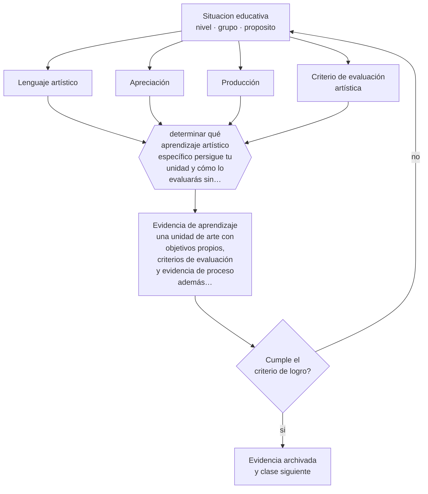

# Clase 054 — Arte y creatividad

> **Parte 04 · Educación básica** — clase 6 de 12

**Estado de evidencia:** `EMERGENTE` · **Etapa:** 🔵 Etapa B — Enseñanza por ciclo vital · **Población de referencia:** 1.º a 8.º básico (6 a 13 años) 
**Decisión que habilita:** determinar qué aprendizaje artístico específico persigue tu unidad y cómo lo evaluarás sin premiar solo la prolijidad 
**Evidencia de aprendizaje:** una unidad de arte con objetivos propios, criterios de evaluación y evidencia de proceso además de producto

## 🎯 Propósito

Enseñar arte en educación básica con objetivos propios —lenguajes, técnicas, apreciación y producción— y con criterios de evaluación que no se reduzcan a la prolijidad del producto.

## 📚 Resultados de aprendizaje

Al finalizar esta clase podrás:

1. **Definir** con precisión los cuatro conceptos centrales de la clase y reconocerlos en una situación educativa real, no solo en su enunciado.
2. **Explicar** qué enseña el arte en la escuela cuando no se lo usa como adorno de otras asignaturas.
3. **Decidir** —qué aprendizaje artístico específico persigue tu unidad y cómo lo evaluarás sin premiar solo la prolijidad— y sostener la decisión con un fundamento escrito.
4. **Producir** la evidencia de la clase —una unidad de arte con objetivos propios, criterios de evaluación y evidencia de proceso además de producto— y contrastarla contra el criterio de logro.
5. **Distinguir** lo que la evidencia sostiene de lo que es práctica instalada, preferencia personal o costumbre de la institución.

## 🧩 Conceptos centrales

| Concepto | Comprensión verificable |
|---|---|
| **Lenguaje artístico** | sistema de recursos expresivos propios de una disciplina artística |
| **Apreciación** | observación y análisis de obras con criterios; se enseña y se evalúa |
| **Producción** | creación con decisiones propias del estudiante dentro de restricciones dadas |
| **Criterio de evaluación artística** | referencia explícita que permite juzgar el trabajo sin reducirlo a limpieza o parecido |

## 🗺️ Flujo de razonamiento

## 📖 Desarrollo

### 1. El fondo del asunto

El arte escolar suele quedar atrapado entre dos reducciones: la manualidad decorativa y la ilustración de contenidos de otras asignaturas. Ambas eliminan su contenido propio. Una unidad con objetivos artísticos enseña recursos expresivos, ofrece referentes, exige decisiones y evalúa con criterios que el estudiante conoce de antemano, igual que cualquier otra disciplina.

### 2. Cómo se traduce en decisiones de enseñanza

La evaluación es el punto crítico. Si el criterio implícito es la prolijidad, se premia una habilidad motora y se castiga la exploración. Criterios como uso deliberado de un recurso, coherencia entre intención y resultado, o calidad de las decisiones tomadas ante una restricción, permiten evaluar sin reducir. La documentación del proceso —bocetos, versiones, decisiones— hace visible lo que el producto final oculta.

### 3. Qué sostiene la evidencia y qué no

La evidencia sobre efectos del arte en el rendimiento en otras asignaturas es débil y las promesas de transferencia no se sostienen en revisiones sistemáticas. Justificar el arte por su utilidad instrumental lo debilita: cuando la promesa no se cumple, se recorta. Su defensa sólida es disciplinar, no instrumental.

> **Cómo leer el estado de evidencia `EMERGENTE`.** El cuerpo de estudios es reciente, escaso o poco replicado. Úsala como hipótesis de trabajo con seguimiento explícito, nunca como argumento de autoridad ni como base para una política de establecimiento.

## 🧪 Taller guiado

Aplica la clase a **uno** de los contextos siguientes y repite después el ejercicio en un
contexto de exigencia distinta. Cambiar de contexto es parte del aprendizaje: lo que funciona
con un grupo no se traslada intacto a otro.

| Contexto | Rasgo que cambia la decisión |
|---|---|
| Primer ciclo (1.º a 4.º) | alfabetización inicial y hábitos: el error se arrastra si no se corrige |
| Segundo ciclo (5.º a 8.º) | contenido disciplinar creciente y comparación social |
| Curso numeroso (más de 35) | la gestión del tiempo condiciona toda decisión didáctica |
| Escuela rural multigrado | un docente atiende varios niveles a la vez |
| Grupo con brecha lectora amplia | sin diagnóstico específico, la clase deja fuera a un tercio |
| Alta rotación o inasistencia | la continuidad no puede darse por supuesta |

**Secuencia de trabajo:**

1. Delimita el contexto: nivel, edad, tamaño del grupo, asignatura o experiencia y tiempo real disponible.
2. Declara qué saben ya los estudiantes y **cómo lo comprobaste**, no cómo lo supones.
3. Formula la decisión pedagógica que esta clase habilita y escribe su fundamento.
4. Anticipa qué observarías si la decisión funciona y qué observarías si no funciona.
5. Diseña de antemano la alternativa que aplicarás si la primera estrategia falla.
6. Ejecuta o simula, y registra lo observado con fecha, contexto y evidencia concreta.
7. Produce la evidencia de aprendizaje de la clase.
8. Contrástala contra el criterio de logro, corrige y recién entonces avanza.

### 📦 Evidencia de aprendizaje

Una unidad de arte con objetivos propios, criterios de evaluación y evidencia de proceso además de producto.

Debe incluir contexto, decisión, fundamento, fuentes consultadas con su fecha, indicador de
logro observable, riesgos previstos y qué harías distinto en la siguiente iteración.

## 🏆 Reto verificable

Rediseña una unidad de arte con criterios explícitos y comunícalos antes. Compara la variedad de resultados con la de la versión anterior.

## ✅ Criterio de logro

- [ ] los criterios de evaluación son artísticos y se comunican antes del trabajo;
- [ ] hay evidencia de proceso documentada, no solo producto final;
- [ ] cada afirmación sobre «lo que funciona» está atribuida a una fuente identificable, con autor y fecha;
- [ ] la decisión es ejecutable con el tiempo, el espacio, el número de estudiantes y los recursos que realmente tienes;
- [ ] la evidencia queda archivada de forma reproducible: otra persona podría revisarla sin que tú se la expliques.

## ⚠️ Errores frecuentes

**Propios de esta clase:**

- Evaluar arte por prolijidad y parecido con el modelo.
- Justificar la asignatura por efectos en el rendimiento de otras materias.

**Característicos de la parte 04:**

- Sostener métodos de lectura inicial refutados por costumbre o por identidad profesional.
- Oponer fluidez y comprensión como si fueran alternativas excluyentes.

## ♿ Diversidad, accesibilidad y ética

El arte ofrece vías de expresión a estudiantes con dificultades en los lenguajes verbales y matemáticos, pero solo si la evaluación no premia una única forma de destreza. Criterios múltiples y materiales accesibles hacen la diferencia.

Antes de aplicar cualquier decisión de esta clase con estudiantes reales, revisa el
[protocolo de práctica responsable](../../../docs/ETICA_Y_PRACTICA_RESPONSABLE.md):
consentimiento, resguardo de datos personales, proporcionalidad de la intervención y derecho
de cada estudiante a no ser objeto de un ensayo que no le reporta beneficio.

## ❓ Preguntas de comprobación

1. ¿Qué recurso expresivo específico aprenderá tu grupo en esta unidad?
2. ¿Qué estás premiando realmente cuando calificas un trabajo artístico?
3. ¿Qué referentes ofreciste antes de pedir producción?

## 📕 Lecturas base

**Eisner, E. (2002). *The Arts and the Creation of Mind*.**  
*Qué aporta a esta clase:* fundamenta el contenido cognitivo propio de las artes y sus formas de evaluación.

**Winner, E., Goldstein, T. & Vincent-Lancrin, S. (2013). *Art for Art's Sake?* OCDE.**  
*Qué aporta a esta clase:* revisa la evidencia sobre transferencia y ordena qué se puede afirmar.

Catálogo completo: [bibliografía del programa](../../../docs/BIBLIOGRAFIA.md) ·
[glosario](../../../docs/GLOSARIO.md) ·
[fuentes oficiales y cómo leerlas](../../../docs/FUENTES.md).

## 🔗 Conexión con el resto del programa

Continúa la clase 043 en el nivel escolar y aporta a la parte 11 el problema de evaluar desempeños complejos con criterios.

> [!IMPORTANT]
> Material de formación profesional. No reemplaza un título de pedagogía, una habilitación
> legal para ejercer, ni el juicio de un equipo educativo que conoce a sus estudiantes.

---

| Anterior | Índice | Siguiente |
|---|---|---|
| [← 053 · Historia, geografía y ciudadanía](../class-05-historia-geografia-y-ciudadania/README.md) | [Parte 04](../README.md) · [Programa](../../../README.md) | [055 · Educación física y bienestar →](../class-07-educacion-fisica-y-bienestar/README.md) |
