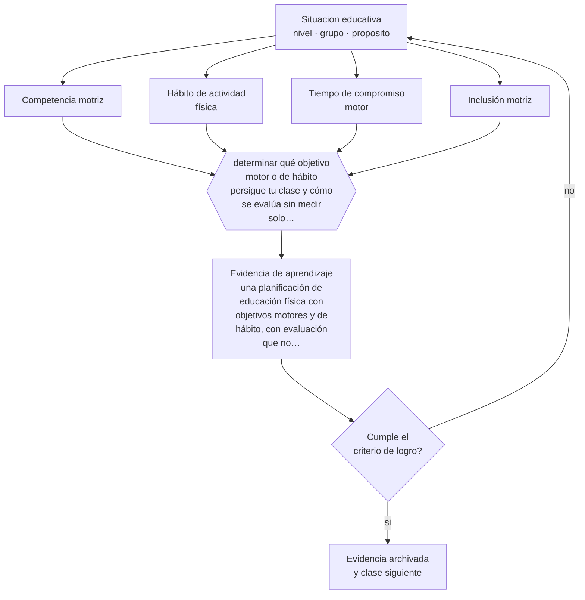

# Clase 055 — Educación física y bienestar

> **Parte 04 · Educación básica** — clase 7 de 12

**Estado de evidencia:** `ROBUSTA` · **Etapa:** 🔵 Etapa B — Enseñanza por ciclo vital · **Población de referencia:** 1.º a 8.º básico (6 a 13 años) 
**Decisión que habilita:** determinar qué objetivo motor o de hábito persigue tu clase y cómo se evalúa sin medir solo rendimiento 
**Evidencia de aprendizaje:** una planificación de educación física con objetivos motores y de hábito, con evaluación que no se reduzca a marcas

## 🎯 Propósito

Enseñar educación física con objetivos de aprendizaje motor y de hábito saludable, y usar la evidencia real sobre actividad física, salud y disposición para aprender sin atribuirle efectos que no tiene.

## 📚 Resultados de aprendizaje

Al finalizar esta clase podrás:

1. **Definir** con precisión los cuatro conceptos centrales de la clase y reconocerlos en una situación educativa real, no solo en su enunciado.
2. **Explicar** qué efectos de la actividad física escolar están bien establecidos y cuáles se exageran.
3. **Decidir** —qué objetivo motor o de hábito persigue tu clase y cómo se evalúa sin medir solo rendimiento— y sostener la decisión con un fundamento escrito.
4. **Producir** la evidencia de la clase —una planificación de educación física con objetivos motores y de hábito, con evaluación que no se reduzca a marcas— y contrastarla contra el criterio de logro.
5. **Distinguir** lo que la evidencia sostiene de lo que es práctica instalada, preferencia personal o costumbre de la institución.

## 🧩 Conceptos centrales

| Concepto | Comprensión verificable |
|---|---|
| **Competencia motriz** | capacidad de resolver tareas motrices variadas con eficacia y control |
| **Hábito de actividad física** | conducta sostenida en el tiempo; es el objetivo de largo plazo del área |
| **Tiempo de compromiso motor** | proporción de la clase en que el estudiante está efectivamente en movimiento |
| **Inclusión motriz** | condiciones que permiten participar a estudiantes con distinto nivel de destreza |

## 🗺️ Flujo de razonamiento

## 📖 Desarrollo

### 1. El fondo del asunto

La evidencia sobre actividad física en la infancia es sólida en salud cardiovascular, composición corporal, salud mental y calidad del sueño, y razonable en su asociación con atención y disposición para aprender inmediatamente después del ejercicio. Es más débil, en cambio, la afirmación de que la educación física mejora por sí sola el rendimiento académico general. La asignatura tiene objetivos propios y suficientes.

### 2. Cómo se traduce en decisiones de enseñanza

Dos decisiones cambian el resultado: aumentar el tiempo de compromiso motor real —que en muchas clases es una fracción pequeña del bloque— y diseñar tareas que permitan participar a distintos niveles de destreza. Evaluar solo por marcas premia la maduración y el talento previo; evaluar progreso, participación y competencia motriz mide lo que la asignatura enseña.

### 3. Qué sostiene la evidencia y qué no

Los efectos agudos del ejercicio sobre la atención son de corta duración y no equivalen a mejoras sostenidas de aprendizaje. Y los programas que prometen mejorar la lectura mediante ejercicios de coordinación específicos no cuentan con respaldo. Conviene defender la asignatura por su contribución a salud, competencia motriz y hábito.

> **Cómo leer el estado de evidencia `ROBUSTA`.** Hay evidencia convergente de varios equipos, países y diseños de investigación, incluidos estudios experimentales o cuasiexperimentales, y el efecto se sostiene al replicarlo. Puedes apoyar una decisión profesional en ella, sin olvidar que ningún efecto promedio describe a un estudiante concreto.

## 🧪 Taller guiado

Aplica la clase a **uno** de los contextos siguientes y repite después el ejercicio en un
contexto de exigencia distinta. Cambiar de contexto es parte del aprendizaje: lo que funciona
con un grupo no se traslada intacto a otro.

| Contexto | Rasgo que cambia la decisión |
|---|---|
| Primer ciclo (1.º a 4.º) | alfabetización inicial y hábitos: el error se arrastra si no se corrige |
| Segundo ciclo (5.º a 8.º) | contenido disciplinar creciente y comparación social |
| Curso numeroso (más de 35) | la gestión del tiempo condiciona toda decisión didáctica |
| Escuela rural multigrado | un docente atiende varios niveles a la vez |
| Grupo con brecha lectora amplia | sin diagnóstico específico, la clase deja fuera a un tercio |
| Alta rotación o inasistencia | la continuidad no puede darse por supuesta |

**Secuencia de trabajo:**

1. Delimita el contexto: nivel, edad, tamaño del grupo, asignatura o experiencia y tiempo real disponible.
2. Declara qué saben ya los estudiantes y **cómo lo comprobaste**, no cómo lo supones.
3. Formula la decisión pedagógica que esta clase habilita y escribe su fundamento.
4. Anticipa qué observarías si la decisión funciona y qué observarías si no funciona.
5. Diseña de antemano la alternativa que aplicarás si la primera estrategia falla.
6. Ejecuta o simula, y registra lo observado con fecha, contexto y evidencia concreta.
7. Produce la evidencia de aprendizaje de la clase.
8. Contrástala contra el criterio de logro, corrige y recién entonces avanza.

### 📦 Evidencia de aprendizaje

Una planificación de educación física con objetivos motores y de hábito, con evaluación que no se reduzca a marcas.

Debe incluir contexto, decisión, fundamento, fuentes consultadas con su fecha, indicador de
logro observable, riesgos previstos y qué harías distinto en la siguiente iteración.

## 🏆 Reto verificable

Cronometra el tiempo de compromiso motor de tres estudiantes de distinto nivel en una clase tuya. Rediseña para igualarlo y vuelve a medir.

## ✅ Criterio de logro

- [ ] la planificación declara objetivos motores y de hábito, no solo actividades;
- [ ] el diseño maximiza el tiempo de compromiso motor de todos los estudiantes;
- [ ] cada afirmación sobre «lo que funciona» está atribuida a una fuente identificable, con autor y fecha;
- [ ] la decisión es ejecutable con el tiempo, el espacio, el número de estudiantes y los recursos que realmente tienes;
- [ ] la evidencia queda archivada de forma reproducible: otra persona podría revisarla sin que tú se la expliques.

## ⚠️ Errores frecuentes

**Propios de esta clase:**

- Evaluar con marcas que reflejan maduración y talento previo más que aprendizaje.
- Diseñar clases donde una parte del curso pasa la mayor parte del tiempo esperando turno.

**Característicos de la parte 04:**

- Sostener métodos de lectura inicial refutados por costumbre o por identidad profesional.
- Oponer fluidez y comprensión como si fueran alternativas excluyentes.

## ♿ Diversidad, accesibilidad y ética

La educación física es donde la exclusión es más visible: la elección de equipos, la exposición de la torpeza y la evaluación por marcas apartan sistemáticamente a los mismos estudiantes. Diseñar tareas de participación simultánea y evitar la selección pública es una decisión pedagógica, no una concesión.

Antes de aplicar cualquier decisión de esta clase con estudiantes reales, revisa el
[protocolo de práctica responsable](../../../docs/ETICA_Y_PRACTICA_RESPONSABLE.md):
consentimiento, resguardo de datos personales, proporcionalidad de la intervención y derecho
de cada estudiante a no ser objeto de un ensayo que no le reporta beneficio.

## ❓ Preguntas de comprobación

1. ¿Cuántos minutos reales se mueve el estudiante menos hábil de tu curso?
2. ¿Qué estás evaluando cuando calificas una prueba de rendimiento físico?
3. ¿Qué tarea permitiría participar con éxito a distintos niveles de destreza a la vez?

## 📕 Lecturas base

**Organización Mundial de la Salud (2020). *Directrices sobre actividad física y comportamientos sedentarios*.**  
*Qué aporta a esta clase:* recomendaciones vigentes por edad, con la evidencia que las respalda.

**Bailey, R. et al. (2009). *The Educational Benefits Claimed for Physical Education and School Sport*. Research Papers in Education, 24(1).**  
*Qué aporta a esta clase:* revisa críticamente qué beneficios están respaldados y cuáles se afirman sin evidencia.

Catálogo completo: [bibliografía del programa](../../../docs/BIBLIOGRAFIA.md) ·
[glosario](../../../docs/GLOSARIO.md) ·
[fuentes oficiales y cómo leerlas](../../../docs/FUENTES.md).

## 🔗 Conexión con el resto del programa

Se apoya en las clases 026 y 042 y aporta a la parte 12, porque el movimiento regulado influye en el clima del curso.

> [!IMPORTANT]
> Material de formación profesional. No reemplaza un título de pedagogía, una habilitación
> legal para ejercer, ni el juicio de un equipo educativo que conoce a sus estudiantes.

---

| Anterior | Índice | Siguiente |
|---|---|---|
| [← 054 · Arte y creatividad](../class-06-arte-y-creatividad/README.md) | [Parte 04](../README.md) · [Programa](../../../README.md) | [056 · Tecnología y alfabetización digital →](../class-08-tecnologia-y-alfabetizacion-digital/README.md) |
