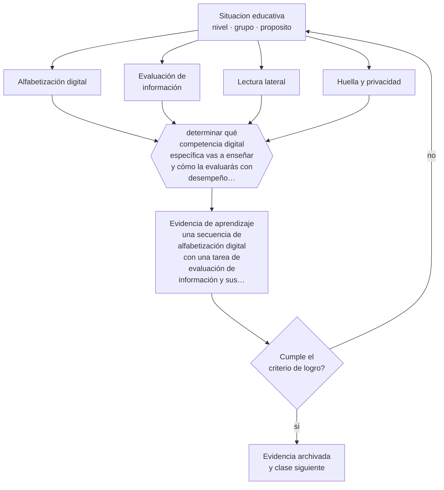

# Clase 056 — Tecnología y alfabetización digital

> **Parte 04 · Educación básica** — clase 8 de 12

**Estado de evidencia:** `EN-DEBATE` · **Etapa:** 🔵 Etapa B — Enseñanza por ciclo vital · **Población de referencia:** 1.º a 8.º básico (6 a 13 años) 
**Decisión que habilita:** determinar qué competencia digital específica vas a enseñar y cómo la evaluarás con desempeño real 
**Evidencia de aprendizaje:** una secuencia de alfabetización digital con una tarea de evaluación de información y sus criterios

## 🎯 Propósito

Enseñar alfabetización digital como competencia intelectual —evaluar información, comprender qué hace un sistema, producir y comunicar con criterio— y no como manejo de herramientas.

## 📚 Resultados de aprendizaje

Al finalizar esta clase podrás:

1. **Definir** con precisión los cuatro conceptos centrales de la clase y reconocerlos en una situación educativa real, no solo en su enunciado.
2. **Explicar** qué significa alfabetización digital cuando los estudiantes usan la tecnología todo el día y aun así no la comprenden.
3. **Decidir** —qué competencia digital específica vas a enseñar y cómo la evaluarás con desempeño real— y sostener la decisión con un fundamento escrito.
4. **Producir** la evidencia de la clase —una secuencia de alfabetización digital con una tarea de evaluación de información y sus criterios— y contrastarla contra el criterio de logro.
5. **Distinguir** lo que la evidencia sostiene de lo que es práctica instalada, preferencia personal o costumbre de la institución.

## 🧩 Conceptos centrales

| Concepto | Comprensión verificable |
|---|---|
| **Alfabetización digital** | capacidad de buscar, evaluar, producir y comunicar información con medios digitales |
| **Evaluación de información** | juicio sobre la credibilidad de una fuente digital: quién la produce, con qué interés y con qué respaldo |
| **Lectura lateral** | estrategia de verificar una fuente saliendo de ella y consultando otras, en vez de analizarla internamente |
| **Huella y privacidad** | rastro de datos que deja el uso de servicios digitales y sus consecuencias |

## 🗺️ Flujo de razonamiento

## 📖 Desarrollo

### 1. El fondo del asunto

El supuesto de que los estudiantes que crecieron con pantallas saben usarlas críticamente no se sostiene: los estudios sobre evaluación de información en línea muestran desempeños bajos en todas las edades. Lo que distingue a un lector competente es la lectura lateral —salir del sitio y verificar quién está detrás— y no el análisis del diseño de la página, que es lo que la escuela suele enseñar.

### 2. Cómo se traduce en decisiones de enseñanza

Enseñar esto exige tareas reales: dar tres fuentes sobre un mismo tema y pedir un juicio fundado sobre cuál es más confiable y por qué. Los criterios se enseñan explícitamente y se practican, no se suponen. En paralelo conviene trabajar privacidad y huella digital con casos concretos del entorno de los estudiantes, que es donde el contenido se vuelve relevante.

### 3. Qué sostiene la evidencia y qué no

El campo cambia rápido y la evidencia sobre intervenciones es limitada y de corto plazo. Además, buena parte de los marcos de competencia digital son normativos y no empíricos: describen lo deseable sin demostrar cómo se logra. Y las afirmaciones sobre nativos digitales carecen de respaldo, pese a su difusión.

> **Cómo leer el estado de evidencia `EN-DEBATE`.** Hay desacuerdo activo y publicado entre especialistas competentes. La clase presenta las posiciones y sus argumentos; tu tarea no es escoger un bando, sino saber qué evidencia te haría cambiar de posición.

## 🧪 Taller guiado

Aplica la clase a **uno** de los contextos siguientes y repite después el ejercicio en un
contexto de exigencia distinta. Cambiar de contexto es parte del aprendizaje: lo que funciona
con un grupo no se traslada intacto a otro.

| Contexto | Rasgo que cambia la decisión |
|---|---|
| Primer ciclo (1.º a 4.º) | alfabetización inicial y hábitos: el error se arrastra si no se corrige |
| Segundo ciclo (5.º a 8.º) | contenido disciplinar creciente y comparación social |
| Curso numeroso (más de 35) | la gestión del tiempo condiciona toda decisión didáctica |
| Escuela rural multigrado | un docente atiende varios niveles a la vez |
| Grupo con brecha lectora amplia | sin diagnóstico específico, la clase deja fuera a un tercio |
| Alta rotación o inasistencia | la continuidad no puede darse por supuesta |

**Secuencia de trabajo:**

1. Delimita el contexto: nivel, edad, tamaño del grupo, asignatura o experiencia y tiempo real disponible.
2. Declara qué saben ya los estudiantes y **cómo lo comprobaste**, no cómo lo supones.
3. Formula la decisión pedagógica que esta clase habilita y escribe su fundamento.
4. Anticipa qué observarías si la decisión funciona y qué observarías si no funciona.
5. Diseña de antemano la alternativa que aplicarás si la primera estrategia falla.
6. Ejecuta o simula, y registra lo observado con fecha, contexto y evidencia concreta.
7. Produce la evidencia de aprendizaje de la clase.
8. Contrástala contra el criterio de logro, corrige y recién entonces avanza.

### 📦 Evidencia de aprendizaje

Una secuencia de alfabetización digital con una tarea de evaluación de información y sus criterios.

Debe incluir contexto, decisión, fundamento, fuentes consultadas con su fecha, indicador de
logro observable, riesgos previstos y qué harías distinto en la siguiente iteración.

## 🏆 Reto verificable

Aplica una tarea de evaluación de tres fuentes en tu curso. Registra cuántos estudiantes verifican saliendo del sitio y cuántos juzgan por la apariencia de la página.

## ✅ Criterio de logro

- [ ] la tarea exige un juicio fundado sobre credibilidad y no solo búsqueda de información;
- [ ] los criterios de evaluación de fuentes se enseñaron explícitamente antes de la tarea;
- [ ] cada afirmación sobre «lo que funciona» está atribuida a una fuente identificable, con autor y fecha;
- [ ] la decisión es ejecutable con el tiempo, el espacio, el número de estudiantes y los recursos que realmente tienes;
- [ ] la evidencia queda archivada de forma reproducible: otra persona podría revisarla sin que tú se la expliques.

## ⚠️ Errores frecuentes

**Propios de esta clase:**

- Enseñar manejo de herramientas y llamarlo alfabetización digital.
- Suponer que los estudiantes evalúan bien la información porque usan mucho internet.

**Característicos de la parte 04:**

- Sostener métodos de lectura inicial refutados por costumbre o por identidad profesional.
- Oponer fluidez y comprensión como si fueran alternativas excluyentes.

## ♿ Diversidad, accesibilidad y ética

El acceso desigual a dispositivos y conectividad convierte cualquier tarea digital domiciliaria en una fuente de exclusión. La alfabetización digital debe enseñarse dentro del tiempo escolar y con recursos disponibles para todos.

Antes de aplicar cualquier decisión de esta clase con estudiantes reales, revisa el
[protocolo de práctica responsable](../../../docs/ETICA_Y_PRACTICA_RESPONSABLE.md):
consentimiento, resguardo de datos personales, proporcionalidad de la intervención y derecho
de cada estudiante a no ser objeto de un ensayo que no le reporta beneficio.

## ❓ Preguntas de comprobación

1. ¿Cómo decide tu grupo si una fuente es confiable?
2. ¿Qué haces tú antes de creer un contenido que confirma lo que ya piensas?
3. ¿Qué dato personal de tus estudiantes circula sin que ellos lo sepan?

## 📕 Lecturas base

**Wineburg, S. & McGrew, S. (2019). *Lateral Reading and the Nature of Expertise*. Teachers College Record.**  
*Qué aporta a esta clase:* muestra experimentalmente qué estrategia usan los verificadores profesionales y por qué la escuela enseña otra.

**UNESCO. *Marco de competencias digitales para docentes y estudiantes*.**  
*Qué aporta a esta clase:* referencia normativa internacional; útil para estructurar la progresión, con sus límites empíricos.

Catálogo completo: [bibliografía del programa](../../../docs/BIBLIOGRAFIA.md) ·
[glosario](../../../docs/GLOSARIO.md) ·
[fuentes oficiales y cómo leerlas](../../../docs/FUENTES.md).

## 🔗 Conexión con el resto del programa

Es el antecedente escolar de toda la parte 13 y se conecta con la clase 053 en el trabajo crítico con fuentes.

> [!IMPORTANT]
> Material de formación profesional. No reemplaza un título de pedagogía, una habilitación
> legal para ejercer, ni el juicio de un equipo educativo que conoce a sus estudiantes.

---

| Anterior | Índice | Siguiente |
|---|---|---|
| [← 055 · Educación física y bienestar](../class-07-educacion-fisica-y-bienestar/README.md) | [Parte 04](../README.md) · [Programa](../../../README.md) | [057 · Planificación de unidades →](../class-09-planificacion-de-unidades/README.md) |
