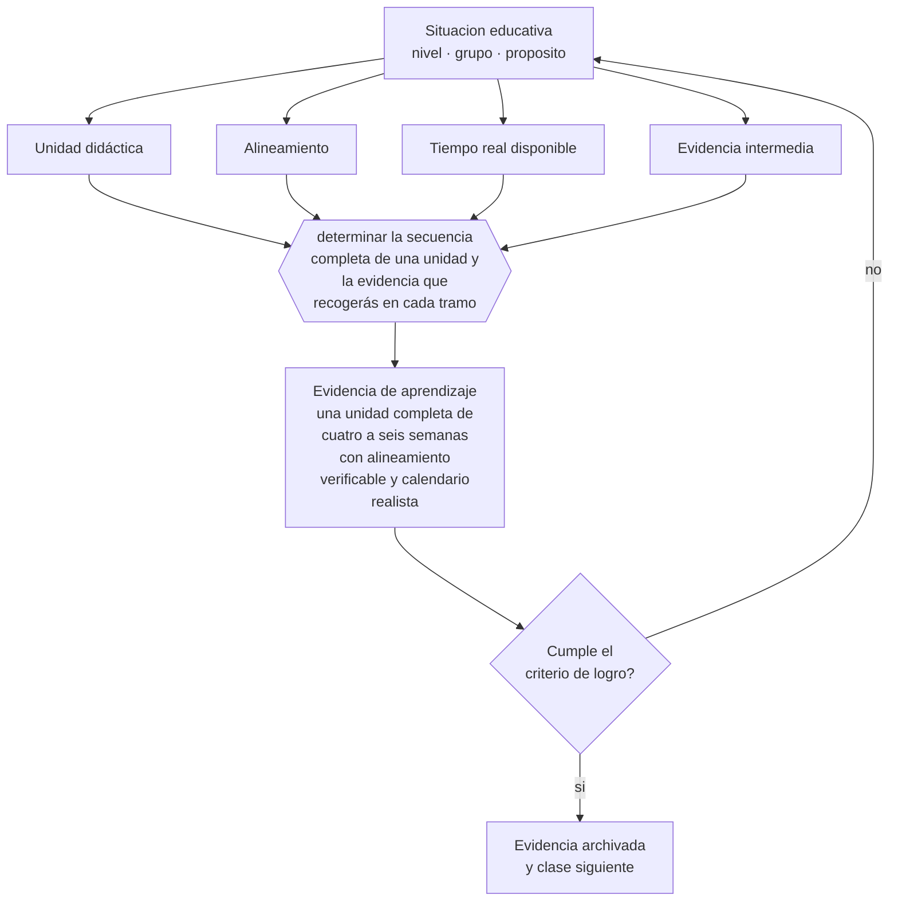

# Clase 057 — Planificación de unidades

> **Parte 04 · Educación básica** — clase 9 de 12

**Estado de evidencia:** `CONSISTENTE` · **Etapa:** 🔵 Etapa B — Enseñanza por ciclo vital · **Población de referencia:** 1.º a 8.º básico (6 a 13 años) 
**Decisión que habilita:** determinar la secuencia completa de una unidad y la evidencia que recogerás en cada tramo 
**Evidencia de aprendizaje:** una unidad completa de cuatro a seis semanas con alineamiento verificable y calendario realista

## 🎯 Propósito

Planificar unidades completas con alineamiento entre objetivos, actividades y evaluación, distribución realista del tiempo y previsión de la evidencia que se recogerá en el camino.

## 📚 Resultados de aprendizaje

Al finalizar esta clase podrás:

1. **Definir** con precisión los cuatro conceptos centrales de la clase y reconocerlos en una situación educativa real, no solo en su enunciado.
2. **Explicar** por qué una unidad bien planificada se reconoce en su evaluación y no en su lista de actividades.
3. **Decidir** —la secuencia completa de una unidad y la evidencia que recogerás en cada tramo— y sostener la decisión con un fundamento escrito.
4. **Producir** la evidencia de la clase —una unidad completa de cuatro a seis semanas con alineamiento verificable y calendario realista— y contrastarla contra el criterio de logro.
5. **Distinguir** lo que la evidencia sostiene de lo que es práctica instalada, preferencia personal o costumbre de la institución.

## 🧩 Conceptos centrales

| Concepto | Comprensión verificable |
|---|---|
| **Unidad didáctica** | secuencia de clases organizada en torno a un conjunto coherente de objetivos |
| **Alineamiento** | correspondencia entre lo que se declara, lo que se enseña y lo que se evalúa |
| **Tiempo real disponible** | horas efectivas de clase descontando evaluaciones, actos, interrupciones y ausencias |
| **Evidencia intermedia** | información sobre el aprendizaje recogida durante la unidad y no solo al final |

## 🗺️ Flujo de razonamiento

## 📖 Desarrollo

### 1. El fondo del asunto

La planificación fracasa habitualmente por dos causas: falta de alineamiento —se evalúa algo distinto de lo declarado— y sobreestimación del tiempo disponible. La segunda es tan frecuente que muchos programas se planifican para un año que nunca existe. Calcular el tiempo real, con interrupciones incluidas, y priorizar en consecuencia es una operación profesional básica y poco practicada.

### 2. Cómo se traduce en decisiones de enseñanza

El procedimiento con mejor rendimiento es inverso: definir primero qué evidencia aceptaría como prueba de logro, después las actividades que llevan a producirla, y solo entonces el calendario. Cada tramo debe tener una evidencia intermedia prevista, para no descubrir en la evaluación final que la mitad del curso se perdió en la semana dos.

### 3. Qué sostiene la evidencia y qué no

Una planificación es una hipótesis, no un contrato: se ajusta con la evidencia que aparece. Las planificaciones rígidas que se cumplen a costa del aprendizaje son un problema tan grave como la ausencia de planificación. El criterio de calidad no es cumplirla, sino haber previsto dónde y cómo se comprobaría el avance.

> **Cómo leer el estado de evidencia `CONSISTENTE`.** La evidencia es amplia y coherente, pero proviene sobre todo de estudios correlacionales, de síntesis con heterogeneidad alta o de contextos distintos al tuyo. Sirve para orientar la decisión y exige que compruebes el efecto en tu propio grupo.

## 🧪 Taller guiado

Aplica la clase a **uno** de los contextos siguientes y repite después el ejercicio en un
contexto de exigencia distinta. Cambiar de contexto es parte del aprendizaje: lo que funciona
con un grupo no se traslada intacto a otro.

| Contexto | Rasgo que cambia la decisión |
|---|---|
| Primer ciclo (1.º a 4.º) | alfabetización inicial y hábitos: el error se arrastra si no se corrige |
| Segundo ciclo (5.º a 8.º) | contenido disciplinar creciente y comparación social |
| Curso numeroso (más de 35) | la gestión del tiempo condiciona toda decisión didáctica |
| Escuela rural multigrado | un docente atiende varios niveles a la vez |
| Grupo con brecha lectora amplia | sin diagnóstico específico, la clase deja fuera a un tercio |
| Alta rotación o inasistencia | la continuidad no puede darse por supuesta |

**Secuencia de trabajo:**

1. Delimita el contexto: nivel, edad, tamaño del grupo, asignatura o experiencia y tiempo real disponible.
2. Declara qué saben ya los estudiantes y **cómo lo comprobaste**, no cómo lo supones.
3. Formula la decisión pedagógica que esta clase habilita y escribe su fundamento.
4. Anticipa qué observarías si la decisión funciona y qué observarías si no funciona.
5. Diseña de antemano la alternativa que aplicarás si la primera estrategia falla.
6. Ejecuta o simula, y registra lo observado con fecha, contexto y evidencia concreta.
7. Produce la evidencia de aprendizaje de la clase.
8. Contrástala contra el criterio de logro, corrige y recién entonces avanza.

### 📦 Evidencia de aprendizaje

Una unidad completa de cuatro a seis semanas con alineamiento verificable y calendario realista.

Debe incluir contexto, decisión, fundamento, fuentes consultadas con su fecha, indicador de
logro observable, riesgos previstos y qué harías distinto en la siguiente iteración.

## 🏆 Reto verificable

Planifica una unidad calculando el tiempo real. Al terminar, compara lo planificado con lo ejecutado y analiza dónde se produjo la diferencia.

## ✅ Criterio de logro

- [ ] cada objetivo tiene su evidencia de logro identificable en la unidad;
- [ ] el calendario descuenta el tiempo no lectivo y prioriza en consecuencia;
- [ ] cada afirmación sobre «lo que funciona» está atribuida a una fuente identificable, con autor y fecha;
- [ ] la decisión es ejecutable con el tiempo, el espacio, el número de estudiantes y los recursos que realmente tienes;
- [ ] la evidencia queda archivada de forma reproducible: otra persona podría revisarla sin que tú se la expliques.

## ⚠️ Errores frecuentes

**Propios de esta clase:**

- Planificar sobre el tiempo nominal y no sobre el tiempo real disponible.
- Diseñar primero las actividades y buscar después cómo evaluarlas.

**Característicos de la parte 04:**

- Sostener métodos de lectura inicial refutados por costumbre o por identidad profesional.
- Oponer fluidez y comprensión como si fueran alternativas excluyentes.

## ♿ Diversidad, accesibilidad y ética

Una unidad inclusiva prevé desde el diseño las vías alternativas de acceso y de demostración, en vez de improvisar adecuaciones cuando aparece la dificultad. Eso exige conocer al grupo antes de planificar, no después.

Antes de aplicar cualquier decisión de esta clase con estudiantes reales, revisa el
[protocolo de práctica responsable](../../../docs/ETICA_Y_PRACTICA_RESPONSABLE.md):
consentimiento, resguardo de datos personales, proporcionalidad de la intervención y derecho
de cada estudiante a no ser objeto de un ensayo que no le reporta beneficio.

## ❓ Preguntas de comprobación

1. ¿Cuántas horas efectivas tiene realmente tu unidad?
2. ¿Qué objetivo declarado no aparece en ninguna evaluación?
3. ¿En qué momento sabrás si la mitad del curso se quedó atrás?

## 📕 Lecturas base

**Wiggins, G. & McTighe, J. (2005). *Understanding by Design*.**  
*Qué aporta a esta clase:* el procedimiento de diseño inverso, aplicable directamente a la unidad escolar.

**Mineduc. *Programas de Estudio* vigentes.**  
*Qué aporta a esta clase:* referencia obligatoria de objetivos y progresión; base sobre la que se planifica en Chile.

Catálogo completo: [bibliografía del programa](../../../docs/BIBLIOGRAFIA.md) ·
[glosario](../../../docs/GLOSARIO.md) ·
[fuentes oficiales y cómo leerlas](../../../docs/FUENTES.md).

## 🔗 Conexión con el resto del programa

Es la aplicación escolar de la parte 09 y se apoya en la clase 058 para la evidencia intermedia.

> [!IMPORTANT]
> Material de formación profesional. No reemplaza un título de pedagogía, una habilitación
> legal para ejercer, ni el juicio de un equipo educativo que conoce a sus estudiantes.

---

| Anterior | Índice | Siguiente |
|---|---|---|
| [← 056 · Tecnología y alfabetización digital](../class-08-tecnologia-y-alfabetizacion-digital/README.md) | [Parte 04](../README.md) · [Programa](../../../README.md) | [058 · Evaluación formativa en básica →](../class-10-evaluacion-formativa-en-basica/README.md) |
