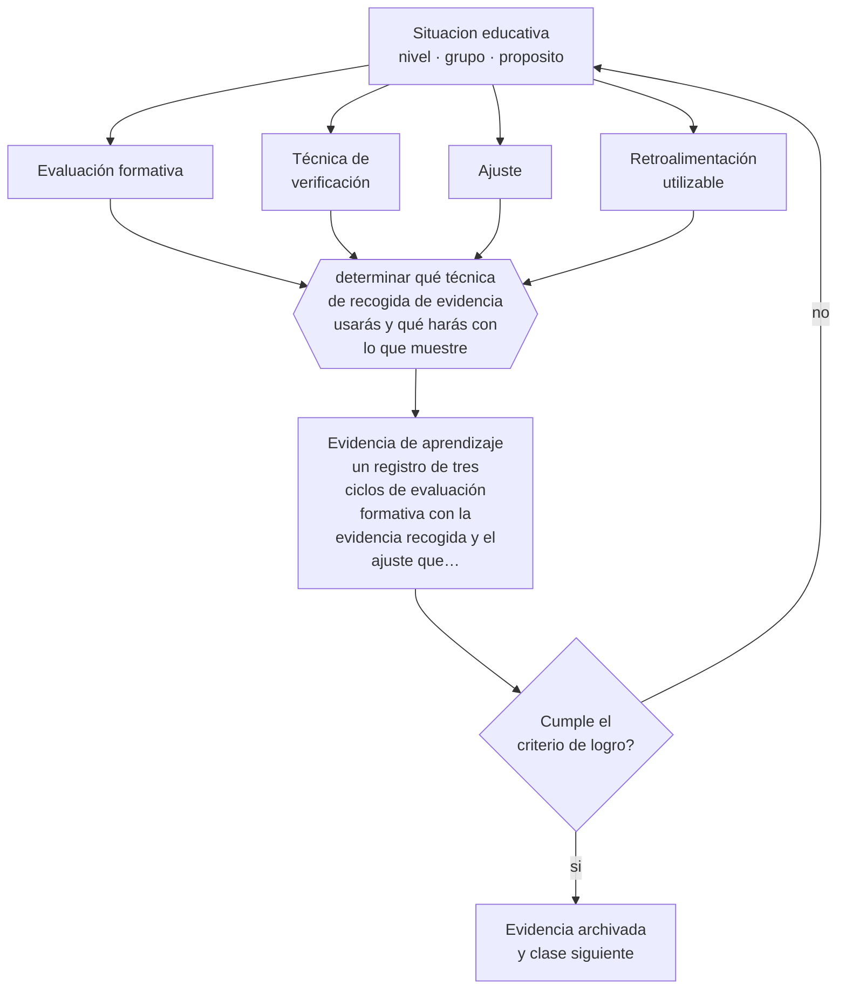

# Clase 058 — Evaluación formativa en básica

> **Parte 04 · Educación básica** — clase 10 de 12

**Estado de evidencia:** `ROBUSTA` · **Etapa:** 🔵 Etapa B — Enseñanza por ciclo vital · **Población de referencia:** 1.º a 8.º básico (6 a 13 años) 
**Decisión que habilita:** determinar qué técnica de recogida de evidencia usarás y qué harás con lo que muestre 
**Evidencia de aprendizaje:** un registro de tres ciclos de evaluación formativa con la evidencia recogida y el ajuste que produjo

## 🎯 Propósito

Instalar técnicas de recogida de evidencia en clase que informen decisiones inmediatas de enseñanza, con la condición que las hace funcionar: que algo cambie después.

## 📚 Resultados de aprendizaje

Al finalizar esta clase podrás:

1. **Definir** con precisión los cuatro conceptos centrales de la clase y reconocerlos en una situación educativa real, no solo en su enunciado.
2. **Explicar** qué convierte a la evaluación formativa en una intervención con efecto y qué la reduce a un discurso.
3. **Decidir** —qué técnica de recogida de evidencia usarás y qué harás con lo que muestre— y sostener la decisión con un fundamento escrito.
4. **Producir** la evidencia de la clase —un registro de tres ciclos de evaluación formativa con la evidencia recogida y el ajuste que produjo— y contrastarla contra el criterio de logro.
5. **Distinguir** lo que la evidencia sostiene de lo que es práctica instalada, preferencia personal o costumbre de la institución.

## 🧩 Conceptos centrales

| Concepto | Comprensión verificable |
|---|---|
| **Evaluación formativa** | uso de evidencia sobre el aprendizaje para ajustar la enseñanza mientras aún se puede |
| **Técnica de verificación** | procedimiento breve que revela el estado de comprensión de todo el curso, no de quien responde |
| **Ajuste** | cambio concreto en la enseñanza derivado de la evidencia recogida |
| **Retroalimentación utilizable** | comentario que el estudiante puede aplicar en un trabajo posterior |

## 🗺️ Flujo de razonamiento

## 📖 Desarrollo

### 1. El fondo del asunto

La evaluación formativa muestra efectos consistentes cuando cumple una condición que suele omitirse: que la evidencia recogida cambie algo. Recolectar información sobre la comprensión y seguir con lo planificado no es evaluación formativa. Las técnicas eficaces son breves y revelan el estado del curso completo: pizarras individuales, respuestas simultáneas, tarjetas de salida, preguntas con opciones diseñadas para exponer errores típicos.

### 2. Cómo se traduce en decisiones de enseñanza

El ciclo completo tiene tres pasos: recoger evidencia de todo el curso en menos de cinco minutos, interpretarla en el momento y ajustar la clase siguiente o la siguiente actividad. El registro de esos ciclos es lo que permite comprobar si la práctica existe realmente o solo se declara. Y la retroalimentación escrita rinde mucho más si llega antes de la calificación, porque después casi nadie la lee.

### 3. Qué sostiene la evidencia y qué no

El tamaño de efecto de la evaluación formativa se ha citado con cifras infladas provenientes de síntesis heterogéneas. El efecto es real y valioso, pero depende de la implementación y de la calidad de las decisiones que toma el docente con la evidencia. Aplicar las técnicas sin cambiar la enseñanza produce ceremonias sin resultado.

> **Cómo leer el estado de evidencia `ROBUSTA`.** Hay evidencia convergente de varios equipos, países y diseños de investigación, incluidos estudios experimentales o cuasiexperimentales, y el efecto se sostiene al replicarlo. Puedes apoyar una decisión profesional en ella, sin olvidar que ningún efecto promedio describe a un estudiante concreto.

## 🧪 Taller guiado

Aplica la clase a **uno** de los contextos siguientes y repite después el ejercicio en un
contexto de exigencia distinta. Cambiar de contexto es parte del aprendizaje: lo que funciona
con un grupo no se traslada intacto a otro.

| Contexto | Rasgo que cambia la decisión |
|---|---|
| Primer ciclo (1.º a 4.º) | alfabetización inicial y hábitos: el error se arrastra si no se corrige |
| Segundo ciclo (5.º a 8.º) | contenido disciplinar creciente y comparación social |
| Curso numeroso (más de 35) | la gestión del tiempo condiciona toda decisión didáctica |
| Escuela rural multigrado | un docente atiende varios niveles a la vez |
| Grupo con brecha lectora amplia | sin diagnóstico específico, la clase deja fuera a un tercio |
| Alta rotación o inasistencia | la continuidad no puede darse por supuesta |

**Secuencia de trabajo:**

1. Delimita el contexto: nivel, edad, tamaño del grupo, asignatura o experiencia y tiempo real disponible.
2. Declara qué saben ya los estudiantes y **cómo lo comprobaste**, no cómo lo supones.
3. Formula la decisión pedagógica que esta clase habilita y escribe su fundamento.
4. Anticipa qué observarías si la decisión funciona y qué observarías si no funciona.
5. Diseña de antemano la alternativa que aplicarás si la primera estrategia falla.
6. Ejecuta o simula, y registra lo observado con fecha, contexto y evidencia concreta.
7. Produce la evidencia de aprendizaje de la clase.
8. Contrástala contra el criterio de logro, corrige y recién entonces avanza.

### 📦 Evidencia de aprendizaje

Un registro de tres ciclos de evaluación formativa con la evidencia recogida y el ajuste que produjo.

Debe incluir contexto, decisión, fundamento, fuentes consultadas con su fecha, indicador de
logro observable, riesgos previstos y qué harías distinto en la siguiente iteración.

## 🏆 Reto verificable

Aplica tres ciclos completos en dos semanas y documenta el ajuste de cada uno. Analiza cuántas veces la evidencia contradijo tu impresión de cómo iba el curso.

## ✅ Criterio de logro

- [ ] cada ciclo registra evidencia, interpretación y ajuste efectivamente realizado;
- [ ] la técnica usada revela el estado del curso completo y no solo de quien participa;
- [ ] cada afirmación sobre «lo que funciona» está atribuida a una fuente identificable, con autor y fecha;
- [ ] la decisión es ejecutable con el tiempo, el espacio, el número de estudiantes y los recursos que realmente tienes;
- [ ] la evidencia queda archivada de forma reproducible: otra persona podría revisarla sin que tú se la expliques.

## ⚠️ Errores frecuentes

**Propios de esta clase:**

- Recoger evidencia de comprensión y continuar con lo planificado igualmente.
- Entregar nota y comentario juntos y esperar que el comentario se utilice.

**Característicos de la parte 04:**

- Sostener métodos de lectura inicial refutados por costumbre o por identidad profesional.
- Oponer fluidez y comprensión como si fueran alternativas excluyentes.

## ♿ Diversidad, accesibilidad y ética

Las técnicas de respuesta simultánea evitan que la participación dependa de la confianza para hablar en público, y hacen visibles a estudiantes que de otro modo pasan semanas sin que nadie sepa qué comprendieron.

Antes de aplicar cualquier decisión de esta clase con estudiantes reales, revisa el
[protocolo de práctica responsable](../../../docs/ETICA_Y_PRACTICA_RESPONSABLE.md):
consentimiento, resguardo de datos personales, proporcionalidad de la intervención y derecho
de cada estudiante a no ser objeto de un ensayo que no le reporta beneficio.

## ❓ Preguntas de comprobación

1. ¿Qué cambiaste en tu clase la última vez que la evidencia mostró que no entendieron?
2. ¿Tu técnica de verificación muestra a todo el curso o solo a quien levanta la mano?
3. ¿Cuándo llega tu retroalimentación en relación con la calificación?

## 📕 Lecturas base

**Wiliam, D. (2011). *Embedded Formative Assessment*.**  
*Qué aporta a esta clase:* convierte la evaluación formativa en técnicas concretas con condiciones de uso.

**Black, P. & Wiliam, D. (1998). *Inside the Black Box*.**  
*Qué aporta a esta clase:* el texto que instaló la práctica; conviene leerlo junto con las revisiones críticas posteriores sobre magnitudes.

Catálogo completo: [bibliografía del programa](../../../docs/BIBLIOGRAFIA.md) ·
[glosario](../../../docs/GLOSARIO.md) ·
[fuentes oficiales y cómo leerlas](../../../docs/FUENTES.md).

## 🔗 Conexión con el resto del programa

Aplica en la práctica escolar la parte 11 y se apoya en la clase 020, porque la verificación frecuente también produce práctica de recuperación.

> [!IMPORTANT]
> Material de formación profesional. No reemplaza un título de pedagogía, una habilitación
> legal para ejercer, ni el juicio de un equipo educativo que conoce a sus estudiantes.

---

| Anterior | Índice | Siguiente |
|---|---|---|
| [← 057 · Planificación de unidades](../class-09-planificacion-de-unidades/README.md) | [Parte 04](../README.md) · [Programa](../../../README.md) | [059 · Gestión de aula en niñez media →](../class-11-gestion-de-aula-en-ninez-media/README.md) |
