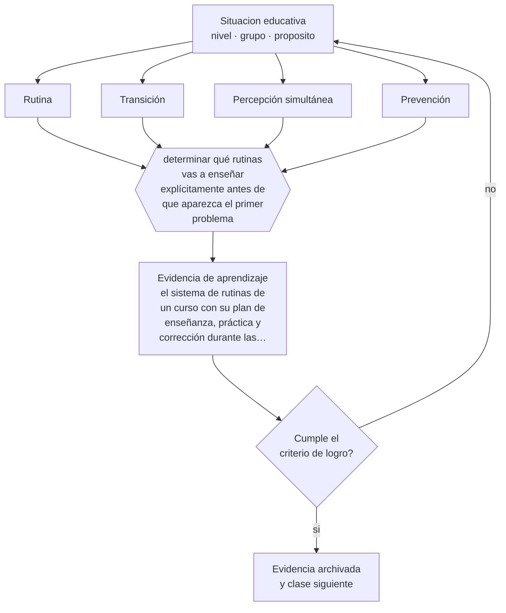

# Clase 059 — Gestión de aula en niñez media

> **Parte 04 · Educación básica** — clase 11 de 12

**Estado de evidencia:** `CONSISTENTE` · **Etapa:** 🔵 Etapa B — Enseñanza por ciclo vital · **Población de referencia:** 1.º a 8.º básico (6 a 13 años) 
**Decisión que habilita:** determinar qué rutinas vas a enseñar explícitamente antes de que aparezca el primer problema 
**Evidencia de aprendizaje:** el sistema de rutinas de un curso con su plan de enseñanza, práctica y corrección durante las primeras semanas

## 🎯 Propósito

Diseñar y enseñar el sistema de rutinas, normas y transiciones de un curso de niñez media, entendiendo que la gestión eficaz es preventiva y no reactiva.

## 📚 Resultados de aprendizaje

Al finalizar esta clase podrás:

1. **Definir** con precisión los cuatro conceptos centrales de la clase y reconocerlos en una situación educativa real, no solo en su enunciado.
2. **Explicar** por qué las rutinas enseñadas al inicio del año explican la mayor parte del clima del resto del año.
3. **Decidir** —qué rutinas vas a enseñar explícitamente antes de que aparezca el primer problema— y sostener la decisión con un fundamento escrito.
4. **Producir** la evidencia de la clase —el sistema de rutinas de un curso con su plan de enseñanza, práctica y corrección durante las primeras semanas— y contrastarla contra el criterio de logro.
5. **Distinguir** lo que la evidencia sostiene de lo que es práctica instalada, preferencia personal o costumbre de la institución.

## 🧩 Conceptos centrales

| Concepto | Comprensión verificable |
|---|---|
| **Rutina** | procedimiento estable para una situación recurrente; se enseña, se practica y se corrige |
| **Transición** | cambio entre actividades; concentra la mayoría de los problemas de conducta |
| **Percepción simultánea** | capacidad del docente de saber qué ocurre en toda la sala mientras atiende a una parte |
| **Prevención** | conjunto de decisiones tomadas antes del problema y que reducen su probabilidad |

## 🗺️ Flujo de razonamiento

## 📖 Desarrollo

### 1. El fondo del asunto

La investigación clásica sobre gestión de aula estableció que los docentes con menos problemas no son los que responden mejor sino los que previenen más, y que la diferencia se juega en las primeras semanas del año. Las rutinas explícitamente enseñadas —cómo se entra, cómo se pide material, cómo se transita entre actividades, qué se hace al terminar antes— eliminan la mayoría de las situaciones que después se gestionan como problemas de disciplina.

### 2. Cómo se traduce en decisiones de enseñanza

Enseñar una rutina sigue la misma lógica que enseñar contenido: explicarla, modelarla, practicarla, corregirla y volver a practicarla. En niñez media eso funciona particularmente bien porque el grupo acepta la estructura y valora la previsibilidad. La otra decisión de alto rendimiento es reducir tiempos muertos: casi toda disrupción aparece en el vacío entre dos actividades.

### 3. Qué sostiene la evidencia y qué no

Las rutinas ordenan pero no resuelven conflictos de fondo ni situaciones de vulneración, y un sistema rígido aplicado sin criterio puede volverse una fuente de conflicto. Además, la evidencia proviene sobre todo de estudios observacionales y de contextos culturales específicos; su traducción exige ajuste al grupo y a la institución.

> **Cómo leer el estado de evidencia `CONSISTENTE`.** La evidencia es amplia y coherente, pero proviene sobre todo de estudios correlacionales, de síntesis con heterogeneidad alta o de contextos distintos al tuyo. Sirve para orientar la decisión y exige que compruebes el efecto en tu propio grupo.

## 🧪 Taller guiado

Aplica la clase a **uno** de los contextos siguientes y repite después el ejercicio en un
contexto de exigencia distinta. Cambiar de contexto es parte del aprendizaje: lo que funciona
con un grupo no se traslada intacto a otro.

| Contexto | Rasgo que cambia la decisión |
|---|---|
| Primer ciclo (1.º a 4.º) | alfabetización inicial y hábitos: el error se arrastra si no se corrige |
| Segundo ciclo (5.º a 8.º) | contenido disciplinar creciente y comparación social |
| Curso numeroso (más de 35) | la gestión del tiempo condiciona toda decisión didáctica |
| Escuela rural multigrado | un docente atiende varios niveles a la vez |
| Grupo con brecha lectora amplia | sin diagnóstico específico, la clase deja fuera a un tercio |
| Alta rotación o inasistencia | la continuidad no puede darse por supuesta |

**Secuencia de trabajo:**

1. Delimita el contexto: nivel, edad, tamaño del grupo, asignatura o experiencia y tiempo real disponible.
2. Declara qué saben ya los estudiantes y **cómo lo comprobaste**, no cómo lo supones.
3. Formula la decisión pedagógica que esta clase habilita y escribe su fundamento.
4. Anticipa qué observarías si la decisión funciona y qué observarías si no funciona.
5. Diseña de antemano la alternativa que aplicarás si la primera estrategia falla.
6. Ejecuta o simula, y registra lo observado con fecha, contexto y evidencia concreta.
7. Produce la evidencia de aprendizaje de la clase.
8. Contrástala contra el criterio de logro, corrige y recién entonces avanza.

### 📦 Evidencia de aprendizaje

El sistema de rutinas de un curso con su plan de enseñanza, práctica y corrección durante las primeras semanas.

Debe incluir contexto, decisión, fundamento, fuentes consultadas con su fecha, indicador de
logro observable, riesgos previstos y qué harías distinto en la siguiente iteración.

## 🏆 Reto verificable

Escoge la transición más problemática de tu curso. Enséñala explícitamente durante una semana con práctica y corrección, y mide el tiempo que toma antes y después.

## ✅ Criterio de logro

- [ ] cada rutina tiene un plan de enseñanza, práctica y corrección, no solo un enunciado;
- [ ] el sistema identifica y reduce los tiempos muertos entre actividades;
- [ ] cada afirmación sobre «lo que funciona» está atribuida a una fuente identificable, con autor y fecha;
- [ ] la decisión es ejecutable con el tiempo, el espacio, el número de estudiantes y los recursos que realmente tienes;
- [ ] la evidencia queda archivada de forma reproducible: otra persona podría revisarla sin que tú se la expliques.

## ⚠️ Errores frecuentes

**Propios de esta clase:**

- Suponer que las rutinas se entienden porque se anunciaron una vez.
- Gestionar por reacción y dedicar a la corrección el tiempo que faltó en la enseñanza de la rutina.

**Característicos de la parte 04:**

- Sostener métodos de lectura inicial refutados por costumbre o por identidad profesional.
- Oponer fluidez y comprensión como si fueran alternativas excluyentes.

## ♿ Diversidad, accesibilidad y ética

La previsibilidad de las rutinas beneficia especialmente a estudiantes autistas, con TDAH o con historias de inestabilidad. Hacer visible la secuencia de la clase y anticipar los cambios reduce conductas que de otro modo se interpretan como desafío.

Antes de aplicar cualquier decisión de esta clase con estudiantes reales, revisa el
[protocolo de práctica responsable](../../../docs/ETICA_Y_PRACTICA_RESPONSABLE.md):
consentimiento, resguardo de datos personales, proporcionalidad de la intervención y derecho
de cada estudiante a no ser objeto de un ensayo que no le reporta beneficio.

## ❓ Preguntas de comprobación

1. ¿Qué rutina de tu curso nunca fue enseñada explícitamente?
2. ¿Cuánto tiempo pierde tu clase en transiciones y qué la haría más breve?
3. ¿Qué ocurre en tu sala cuando un estudiante termina antes que el resto?

## 📕 Lecturas base

**Kounin, J. (1970). *Discipline and Group Management in Classrooms*.**  
*Qué aporta a esta clase:* origen del hallazgo sobre prevención y percepción simultánea; sigue siendo la mejor descripción del mecanismo.

**Evertson, C. & Emmer, E. *Classroom Management for Elementary Teachers*.**  
*Qué aporta a esta clase:* manual operativo de rutinas, transiciones y comienzo del año escolar.

Catálogo completo: [bibliografía del programa](../../../docs/BIBLIOGRAFIA.md) ·
[glosario](../../../docs/GLOSARIO.md) ·
[fuentes oficiales y cómo leerlas](../../../docs/FUENTES.md).

## 🔗 Conexión con el resto del programa

Es la aplicación en niñez media de la parte 12 y se apoya en la clase 031, porque en esta edad el estatus ante el grupo condiciona la respuesta a la corrección.

> [!IMPORTANT]
> Material de formación profesional. No reemplaza un título de pedagogía, una habilitación
> legal para ejercer, ni el juicio de un equipo educativo que conoce a sus estudiantes.

---

| Anterior | Índice | Siguiente |
|---|---|---|
| [← 058 · Evaluación formativa en básica](../class-10-evaluacion-formativa-en-basica/README.md) | [Parte 04](../README.md) · [Programa](../../../README.md) | [060 · Proyecto integrador: unidad interdisciplinaria →](../class-12-proyecto-integrador-unidad-interdisciplinaria/README.md) |
