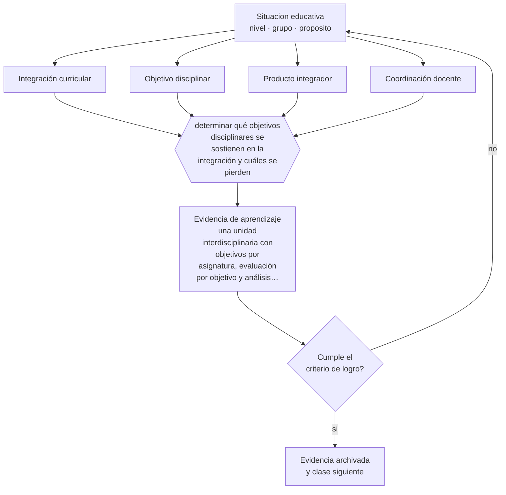

# Clase 060 — Proyecto integrador: unidad interdisciplinaria

> **Parte 04 · Educación básica** — clase 12 de 12

**Estado de evidencia:** `CONSISTENTE` · **Etapa:** 🔵 Etapa B — Enseñanza por ciclo vital · **Población de referencia:** 1.º a 8.º básico (6 a 13 años) 
**Decisión que habilita:** determinar qué objetivos disciplinares se sostienen en la integración y cuáles se pierden 
**Evidencia de aprendizaje:** una unidad interdisciplinaria con objetivos por asignatura, evaluación por objetivo y análisis de su ejecución

## 🎯 Propósito

Integrar la parte diseñando y ejecutando una unidad interdisciplinaria que mantenga objetivos disciplinares verificables en cada asignatura involucrada.

## 📚 Resultados de aprendizaje

Al finalizar esta clase podrás:

1. **Definir** con precisión los cuatro conceptos centrales de la clase y reconocerlos en una situación educativa real, no solo en su enunciado.
2. **Explicar** cómo integrar asignaturas sin diluir los objetivos de aprendizaje de ninguna de ellas.
3. **Decidir** —qué objetivos disciplinares se sostienen en la integración y cuáles se pierden— y sostener la decisión con un fundamento escrito.
4. **Producir** la evidencia de la clase —una unidad interdisciplinaria con objetivos por asignatura, evaluación por objetivo y análisis de su ejecución— y contrastarla contra el criterio de logro.
5. **Distinguir** lo que la evidencia sostiene de lo que es práctica instalada, preferencia personal o costumbre de la institución.

## 🧩 Conceptos centrales

| Concepto | Comprensión verificable |
|---|---|
| **Integración curricular** | organización de la enseñanza en torno a un problema o tema que convoca a varias asignaturas |
| **Objetivo disciplinar** | aprendizaje propio de una asignatura que debe seguir siendo verificable dentro de la integración |
| **Producto integrador** | tarea final que exige movilizar aprendizajes de más de una disciplina |
| **Coordinación docente** | acuerdo explícito entre docentes sobre objetivos, tiempos y criterios de evaluación |

## 🗺️ Flujo de razonamiento

## 📖 Desarrollo

### 1. El fondo del asunto

La integración es atractiva y frágil: cuando funciona, hace visible la utilidad del conocimiento; cuando falla, produce actividades vistosas donde ninguna asignatura logra su objetivo. La diferencia está en si cada disciplina conserva objetivos propios y evaluación propia dentro del proyecto común. Un proyecto sin objetivos disciplinares verificables no es interdisciplinario: es una actividad temática.

### 2. Cómo se traduce en decisiones de enseñanza

El diseño exige coordinación real: acordar el problema, declarar qué aporta cada asignatura, definir la evaluación por objetivo y calendarizar. Es trabajo docente que consume tiempo y que rara vez está considerado en la carga horaria, y esa es la principal causa de que estas unidades se abandonen después del primer intento. Preverlo forma parte del diseño.

### 3. Qué sostiene la evidencia y qué no

La evidencia sobre enfoques integrados es mixta y depende fuertemente de la calidad del diseño y del conocimiento previo de los estudiantes. La integración no mejora por sí sola el aprendizaje y puede reducirlo si diluye la enseñanza explícita. Se justifica cuando el problema elegido exige genuinamente más de una disciplina.

> **Cómo leer el estado de evidencia `CONSISTENTE`.** La evidencia es amplia y coherente, pero proviene sobre todo de estudios correlacionales, de síntesis con heterogeneidad alta o de contextos distintos al tuyo. Sirve para orientar la decisión y exige que compruebes el efecto en tu propio grupo.

## 🧪 Taller guiado

Aplica la clase a **uno** de los contextos siguientes y repite después el ejercicio en un
contexto de exigencia distinta. Cambiar de contexto es parte del aprendizaje: lo que funciona
con un grupo no se traslada intacto a otro.

| Contexto | Rasgo que cambia la decisión |
|---|---|
| Primer ciclo (1.º a 4.º) | alfabetización inicial y hábitos: el error se arrastra si no se corrige |
| Segundo ciclo (5.º a 8.º) | contenido disciplinar creciente y comparación social |
| Curso numeroso (más de 35) | la gestión del tiempo condiciona toda decisión didáctica |
| Escuela rural multigrado | un docente atiende varios niveles a la vez |
| Grupo con brecha lectora amplia | sin diagnóstico específico, la clase deja fuera a un tercio |
| Alta rotación o inasistencia | la continuidad no puede darse por supuesta |

**Secuencia de trabajo:**

1. Delimita el contexto: nivel, edad, tamaño del grupo, asignatura o experiencia y tiempo real disponible.
2. Declara qué saben ya los estudiantes y **cómo lo comprobaste**, no cómo lo supones.
3. Formula la decisión pedagógica que esta clase habilita y escribe su fundamento.
4. Anticipa qué observarías si la decisión funciona y qué observarías si no funciona.
5. Diseña de antemano la alternativa que aplicarás si la primera estrategia falla.
6. Ejecuta o simula, y registra lo observado con fecha, contexto y evidencia concreta.
7. Produce la evidencia de aprendizaje de la clase.
8. Contrástala contra el criterio de logro, corrige y recién entonces avanza.

### 📦 Evidencia de aprendizaje

Una unidad interdisciplinaria con objetivos por asignatura, evaluación por objetivo y análisis de su ejecución.

Debe incluir contexto, decisión, fundamento, fuentes consultadas con su fecha, indicador de
logro observable, riesgos previstos y qué harías distinto en la siguiente iteración.

## 🏆 Reto verificable

Ejecuta la unidad y evalúa por objetivo disciplinar. Identifica cuál se diluyó y rediseña esa parte para una segunda versión.

## ✅ Criterio de logro

- [ ] cada asignatura conserva objetivos propios con evaluación identificable;
- [ ] el análisis posterior indica qué objetivos se lograron y cuáles se diluyeron;
- [ ] cada afirmación sobre «lo que funciona» está atribuida a una fuente identificable, con autor y fecha;
- [ ] la decisión es ejecutable con el tiempo, el espacio, el número de estudiantes y los recursos que realmente tienes;
- [ ] la evidencia queda archivada de forma reproducible: otra persona podría revisarla sin que tú se la expliques.

## ⚠️ Errores frecuentes

**Propios de esta clase:**

- Integrar por tema sin objetivos disciplinares verificables en cada asignatura.
- Diseñar una unidad interdisciplinaria sin considerar el tiempo de coordinación docente que exige.

**Característicos de la parte 04:**

- Sostener métodos de lectura inicial refutados por costumbre o por identidad profesional.
- Oponer fluidez y comprensión como si fueran alternativas excluyentes.

## ♿ Diversidad, accesibilidad y ética

Los proyectos con producto final complejo pueden dejar fuera a estudiantes con dificultades de organización o de escritura si no se prevén roles, apoyos y vías alternativas de contribución que sigan exigiendo el mismo objetivo.

Antes de aplicar cualquier decisión de esta clase con estudiantes reales, revisa el
[protocolo de práctica responsable](../../../docs/ETICA_Y_PRACTICA_RESPONSABLE.md):
consentimiento, resguardo de datos personales, proporcionalidad de la intervención y derecho
de cada estudiante a no ser objeto de un ensayo que no le reporta beneficio.

## ❓ Preguntas de comprobación

1. ¿Qué objetivo disciplinar se perdió realmente en tu proyecto?
2. ¿Qué hace que este problema exija más de una asignatura y no sea una excusa temática?
3. ¿Cuánto tiempo de coordinación necesitó y de dónde salió?

## 📕 Lecturas base

**Beane, J. (1997). *Curriculum Integration*.**  
*Qué aporta a esta clase:* la formulación más consistente de la integración curricular y sus condiciones.

**Wiggins, G. & McTighe, J. (2005). *Understanding by Design*.**  
*Qué aporta a esta clase:* aporta el criterio de evidencia aceptable, que es lo que impide que la integración diluya objetivos.

Catálogo completo: [bibliografía del programa](../../../docs/BIBLIOGRAFIA.md) ·
[glosario](../../../docs/GLOSARIO.md) ·
[fuentes oficiales y cómo leerlas](../../../docs/FUENTES.md).

## 🔗 Conexión con el resto del programa

Cierra la parte 04 integrando las clases 049 a 059 y anticipa la parte 05 (proyectos) y la parte 09 (diseño curricular).

> [!IMPORTANT]
> Material de formación profesional. No reemplaza un título de pedagogía, una habilitación
> legal para ejercer, ni el juicio de un equipo educativo que conoce a sus estudiantes.

---

| Anterior | Índice | Siguiente |
|---|---|---|
| [← 059 · Gestión de aula en niñez media](../class-11-gestion-de-aula-en-ninez-media/README.md) | [Parte 04](../README.md) · [Programa](../../../README.md) | [Programa completo →](../../../README.md) |
