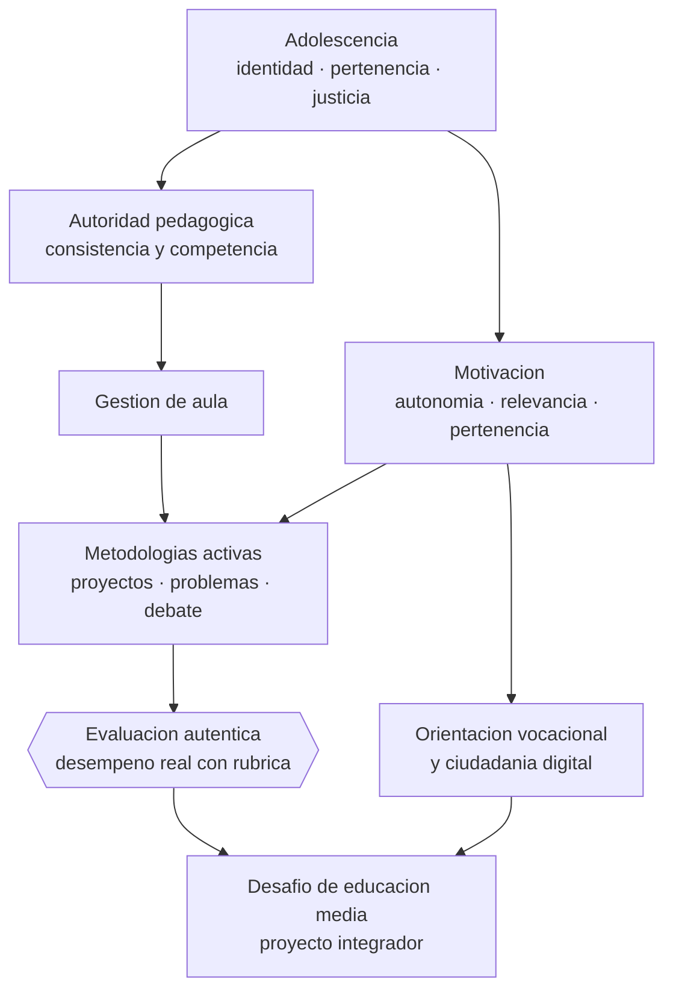

# Parte 05 — Educación media y adolescencia

> *Con adolescentes, la relación no es un accesorio de la enseñanza: es su condición*

🔵 **Etapa B — Enseñanza por ciclo vital** · salida de la etapa: enseñar a una población concreta con decisiones ajustadas a su desarrollo

**Clases:** 12 (061–072) · **Población de referencia:** 1.º a 4.º medio (14 a 18 años) · **Conceptos operacionales:** 48 · **Señales observables:** 36 
**Contenido central:** Psicología de la adolescencia, identidad y motivación, autoridad pedagógica, gestión de aula, aprendizaje basado en proyectos y problemas, debate, STEM, orientación vocacional, ciudadanía digital y evaluación auténtica

## 🎯 De qué trata esta parte

La adolescencia reorganiza la motivación. Lo que antes movía —la aprobación del adulto, la nota, la rutina— pierde fuerza frente a la pertenencia al grupo, la percepción de justicia y el sentido de lo que se hace. Esa es la causa mecánica de la mayoría de los conflictos de aula en educación media: no un déficit de disciplina, sino un desajuste entre lo que la escuela ofrece y lo que la etapa demanda. La investigación sobre ajuste entre etapa y ambiente lleva décadas mostrando este desencuentro.

De ahí que la autoridad pedagógica sea el eje de la parte. En educación media la autoridad no se sostiene en el cargo: se construye con consistencia, competencia disciplinar visible y trato justo, y se pierde en minutos con una humillación pública o una arbitrariedad. Nada de esto es blandura: un docente con autoridad legítima puede exigir mucho más, y de hecho lo hace, porque la exigencia se lee como confianza en la capacidad del estudiante.

La parte incorpora también las metodologías activas —proyectos, problemas, debate— con una advertencia honesta. Funcionan cuando hay estructura, conocimiento previo suficiente y andamiaje, y fracasan cuando se usan como sustituto de la instrucción. La evidencia sobre aprendizaje basado en problemas es matizada y depende del diseño: aquí se enseña a construir el diseño que la hace funcionar, no a repetir la consigna de que el estudiante debe descubrirlo todo solo.

## 🏫 Caso de la parte

Las doce clases trabajan sobre la misma realidad, para que puedas ver cómo cambia tu diagnóstico
a medida que avanzas:

> En 2.º medio, la mitad del curso entrega trabajos hechos con herramientas generativas y el resto dejó de entregar. La respuesta institucional fue prohibir el celular; el desenganche siguió igual.

**Artefacto que produces al terminar:** desafío de educación media con autoridad pedagógica explícita, evaluación auténtica y análisis de resultados estudiante por estudiante.

## 📚 Resultados de la parte

Al terminar esta parte podrás:

1. **Construir autoridad pedagógica legítima y sostenerla bajo conflicto**.
2. **Diseñar una experiencia por proyectos o problemas con estructura y andamiaje suficientes**.
3. **Conectar el contenido con identidad, pertinencia y proyección del estudiante**.
4. **Evaluar de forma auténtica sin perder validez ni comparabilidad**.

## 🗺️ Mapa de la parte

## 🧠 Marco de referencia

- desarrollo adolescente: sensibilidad social, búsqueda de autonomía y toma de decisiones
- ajuste entre etapa evolutiva y ambiente escolar como explicación del desenganche
- aprendizaje basado en proyectos y problemas con andamiaje explícito
- evaluación auténtica y de desempeño con criterios públicos

**Autoras y autores que conviene conocer:** Laurence Steinberg, Jacquelynne Eccles, Carol Dweck y David Yeager, Cindy Hmelo-Silver, Robert Alexander, Grant Wiggins, equipos chilenos de convivencia escolar

## 📋 Las 12 clases

| # | Clase | Decisión que habilita | Evidencia |
|---:|---|---|---|
| 061 | [Psicología de la adolescencia](class-01-psicologia-de-la-adolescencia/README.md) | determinar qué práctica de tu establecimiento está produciendo el desenganche que atribuye a los estudiantes | `ROBUSTA` |
| 062 | [Identidad, pertenencia y motivación](class-02-identidad-pertenencia-y-motivacion/README.md) | determinar qué mensaje de pertenencia y de utilidad necesita recibir tu grupo para comprometerse con el contenido | `CONSISTENTE` |
| 063 | [Autoridad pedagógica](class-03-autoridad-pedagogica/README.md) | determinar qué acción concreta construye o repara tu autoridad ante un curso específico | `PRACTICA-PROFESIONAL` |
| 064 | [Gestión de aula adolescente](class-04-gestion-de-aula-adolescente/README.md) | determinar qué nivel de intervención corresponde a cada tipo de conducta antes de que ocurra | `CONSISTENTE` |
| 065 | [Aprendizaje basado en proyectos](class-05-aprendizaje-basado-en-proyectos/README.md) | determinar qué aprendizaje disciplinar debe quedar comprobado al final del proyecto y cómo se comprobará | `EN-DEBATE` |
| 066 | [Aprendizaje basado en problemas](class-06-aprendizaje-basado-en-problemas/README.md) | determinar si tu objetivo se sirve mejor de un problema abierto o de instrucción explícita seguida de aplicación | `EN-DEBATE` |
| 067 | [Debate y argumentación](class-07-debate-y-argumentacion/README.md) | determinar qué estructura argumental vas a enseñar explícitamente y cómo la evaluarás | `CONSISTENTE` |
| 068 | [STEM y STEAM](class-08-stem-y-steam/README.md) | determinar qué contenido disciplinar debe quedar aprendido en tu experiencia STEM y cómo lo comprobarás | `EMERGENTE` |
| 069 | [Orientación vocacional](class-09-orientacion-vocacional/README.md) | determinar qué información y qué experiencia necesita tu estudiante antes de decidir su trayectoria | `CONSISTENTE` |
| 070 | [Ciudadanía digital](class-10-ciudadania-digital/README.md) | determinar qué se enseña, qué se regula y qué se deriva cuando ocurre un incidente digital en tu comunidad | `EMERGENTE` |
| 071 | [Evaluación auténtica](class-11-evaluacion-autentica/README.md) | determinar qué desempeño real quieres evaluar y qué criterios permitirán juzgarlo con consistencia | `CONSISTENTE` |
| 072 | [Proyecto integrador: desafío de educación media](class-12-proyecto-integrador-desafio-de-educacion-media/README.md) | determinar el diseño completo del desafío y qué evidencia probará que hubo aprendizaje disciplinar | `CONSISTENTE` |

## ⚠️ Riesgos característicos

- Interpretar como indisciplina lo que es un desajuste entre etapa y ambiente.
- Confundir autoridad con imposición y perder legitimidad en el primer conflicto.
- Usar metodologías activas sin estructura y llamar autonomía a la falta de guía.
- Evaluar productos vistosos sin criterios que permitan defender la calificación.

## 📕 Lecturas de referencia de la parte

- **Eccles, J. et al. (1993). *Development During Adolescence: The Impact of Stage-Environment Fit*. American Psychologist, 48(2).** — explica por qué la motivación cae justo cuando la escuela se vuelve más controladora; base del diagnóstico de esta parte. **Localizar:** [DOI 10.1037/0003-066x.48.2.90](https://doi.org/10.1037/0003-066x.48.2.90) · [ficha](../../docs/REGISTRO_DE_FUENTES.md#eccles-1993-development-during-adolescence-the-impact-of)
- **Hmelo-Silver, C. (2004). *Problem-Based Learning: What and How Do Students Learn?*** — revisión que separa las condiciones en que el aprendizaje basado en problemas funciona de aquellas en que no. **Localizar:** [DOI 10.1023/b:edpr.0000034022.16470.f3](https://doi.org/10.1023/b:edpr.0000034022.16470.f3) · [ficha](../../docs/REGISTRO_DE_FUENTES.md#hmelo-silver-2004-problem-based-learning-what-and-how)
- **Yeager, D. & Dweck, C. (2012). *Mindsets That Promote Resilience*. Educational Psychologist, 47(4).** — léelo junto con las replicaciones posteriores: efecto real pero pequeño y condicionado al contexto escolar. **Localizar:** [DOI 10.1080/00461520.2012.722805](https://doi.org/10.1080/00461520.2012.722805) · [ficha](../../docs/REGISTRO_DE_FUENTES.md#yeager-dweck-2012-mindsets-that-promote-resilience)
- **Wiggins, G. (1998). *Educative Assessment*.** — define evaluación auténtica con criterios exigibles, no como sinónimo de trabajo creativo. **Localizar:** [ISBN 9780787908485](https://openlibrary.org/isbn/9780787908485) · [ficha](../../docs/REGISTRO_DE_FUENTES.md#wiggins-1998-educative-assessment)

## ✅ Evidencia mínima para dar la parte por cerrada

- [ ] un protocolo propio de construcción y reparación de autoridad pedagógica;
- [ ] un diseño de proyecto con andamiaje, hitos y evaluación intermedia;
- [ ] una rúbrica de desempeño auténtico aplicada a trabajos reales;
- [ ] un plan de trabajo con un estudiante desenganchado, con seguimiento.

## 🧭 Práctica y evaluación de la parte

- [Rúbrica maestra e instrumentos de autoevaluación](../../assessments/README.md)
- [Casos profesionales para resolver con este marco](../../cases/README.md)
- [Laboratorios de decisión](../../labs/README.md)
- [Dónde se archiva la evidencia](../../evidence/README.md)

---

| Anterior | Índice | Siguiente |
|---|---|---|
| [← Parte 04 · Educación básica](../part-04-educacion-basica/README.md) | [Programa](../../README.md) · [Currículo](../../CURRICULUM.md) | [Parte 06 · Educación técnico-profesional →](../part-06-educacion-tecnico-profesional/README.md) |
