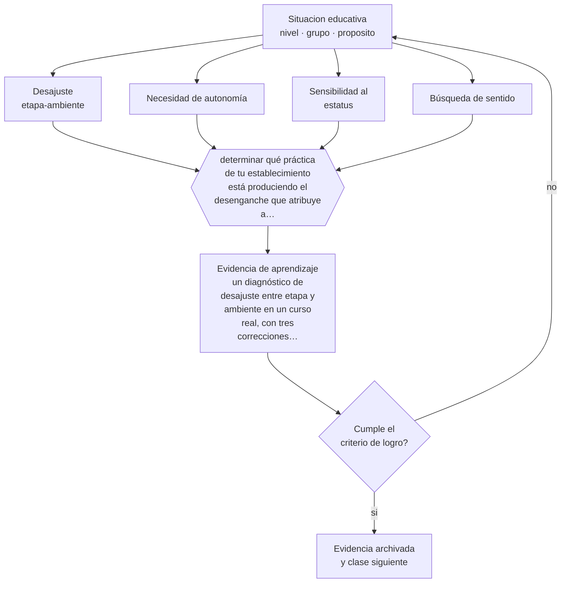

# Clase 061 — Psicología de la adolescencia

> **Parte 05 · Educación media y adolescencia** — clase 1 de 12

**Estado de evidencia:** `ROBUSTA` · **Etapa:** 🔵 Etapa B — Enseñanza por ciclo vital · **Población de referencia:** 1.º a 4.º medio (14 a 18 años) 
**Decisión que habilita:** determinar qué práctica de tu establecimiento está produciendo el desenganche que atribuye a los estudiantes 
**Evidencia de aprendizaje:** un diagnóstico de desajuste entre etapa y ambiente en un curso real, con tres correcciones concretas

## 🎯 Propósito

Aplicar la psicología del desarrollo adolescente al diseño de la enseñanza media: mayor sensibilidad social, necesidad de autonomía, búsqueda de sentido y capacidad intelectual en expansión.

## 📚 Resultados de aprendizaje

Al finalizar esta clase podrás:

1. **Definir** con precisión los cuatro conceptos centrales de la clase y reconocerlos en una situación educativa real, no solo en su enunciado.
2. **Explicar** qué cambia realmente en la adolescencia y por qué la escuela suele responder al revés de lo que la etapa pide.
3. **Decidir** —qué práctica de tu establecimiento está produciendo el desenganche que atribuye a los estudiantes— y sostener la decisión con un fundamento escrito.
4. **Producir** la evidencia de la clase —un diagnóstico de desajuste entre etapa y ambiente en un curso real, con tres correcciones concretas— y contrastarla contra el criterio de logro.
5. **Distinguir** lo que la evidencia sostiene de lo que es práctica instalada, preferencia personal o costumbre de la institución.

## 🧩 Conceptos centrales

| Concepto | Comprensión verificable |
|---|---|
| **Desajuste etapa-ambiente** | desencuentro entre lo que la etapa demanda y lo que la escuela ofrece; explica la caída de motivación |
| **Necesidad de autonomía** | demanda creciente de decidir; el control percibido como arbitrario produce resistencia |
| **Sensibilidad al estatus** | alta reactividad a la evaluación de los pares; encarece cualquier exposición pública |
| **Búsqueda de sentido** | exigencia de que lo que se hace tenga relación con algo que importa |

## 🗺️ Flujo de razonamiento

## 📖 Desarrollo

### 1. El fondo del asunto

Justo cuando los adolescentes necesitan más autonomía y participación, la escuela secundaria suele ofrecerles más control, más comparación pública y menos relación personal con adultos. La investigación sobre ajuste entre etapa y ambiente documenta ese desencuentro y explica la caída de motivación que ocurre en la transición a la enseñanza media en muchos sistemas. Es un problema de diseño institucional, no de carácter generacional.

### 2. Cómo se traduce en decisiones de enseñanza

El diagnóstico consiste en revisar prácticas concretas: cuántas decisiones puede tomar un estudiante en una jornada, cuántas situaciones lo exponen ante sus pares, cuánto tiempo tiene con un adulto que lo conoce por su nombre y su historia. Las correcciones suelen ser baratas: ceder decisiones acotadas, eliminar exposición innecesaria, garantizar al menos un vínculo adulto estable por estudiante.

### 3. Qué sostiene la evidencia y qué no

El desajuste explica una parte del desenganche, no todo: la calidad de la enseñanza, las condiciones materiales y la trayectoria previa pesan igual o más. Y las descripciones del desarrollo adolescente son promedios: la variación individual dentro de un curso de dieciséis años es enorme. Usar la etapa como explicación única lleva a intervenciones genéricas que no cambian resultados.

> **Cómo leer el estado de evidencia `ROBUSTA`.** Hay evidencia convergente de varios equipos, países y diseños de investigación, incluidos estudios experimentales o cuasiexperimentales, y el efecto se sostiene al replicarlo. Puedes apoyar una decisión profesional en ella, sin olvidar que ningún efecto promedio describe a un estudiante concreto.

## 🧪 Taller guiado

Aplica la clase a **uno** de los contextos siguientes y repite después el ejercicio en un
contexto de exigencia distinta. Cambiar de contexto es parte del aprendizaje: lo que funciona
con un grupo no se traslada intacto a otro.

| Contexto | Rasgo que cambia la decisión |
|---|---|
| 1.º y 2.º medio | transición desde la básica y reacomodo de grupos |
| 3.º y 4.º medio | presión de egreso, admisión y decisión vocacional |
| Curso con desenganche marcado | el contenido no compite con el problema de sentido |
| Liceo técnico-profesional | la utilidad visible del contenido cambia la motivación |
| Jornada vespertina o reingreso | estudiantes que trabajan y tienen trayectorias interrumpidas |
| Contexto de alta conflictividad | la seguridad y la convivencia condicionan la enseñanza |

**Secuencia de trabajo:**

1. Delimita el contexto: nivel, edad, tamaño del grupo, asignatura o experiencia y tiempo real disponible.
2. Declara qué saben ya los estudiantes y **cómo lo comprobaste**, no cómo lo supones.
3. Formula la decisión pedagógica que esta clase habilita y escribe su fundamento.
4. Anticipa qué observarías si la decisión funciona y qué observarías si no funciona.
5. Diseña de antemano la alternativa que aplicarás si la primera estrategia falla.
6. Ejecuta o simula, y registra lo observado con fecha, contexto y evidencia concreta.
7. Produce la evidencia de aprendizaje de la clase.
8. Contrástala contra el criterio de logro, corrige y recién entonces avanza.

### 📦 Evidencia de aprendizaje

Un diagnóstico de desajuste entre etapa y ambiente en un curso real, con tres correcciones concretas.

Debe incluir contexto, decisión, fundamento, fuentes consultadas con su fecha, indicador de
logro observable, riesgos previstos y qué harías distinto en la siguiente iteración.

## 🏆 Reto verificable

Sigue durante una jornada completa a un estudiante desenganchado. Registra sus decisiones, sus exposiciones públicas y sus interacciones adultas, y propón tres correcciones.

## ✅ Criterio de logro

- [ ] el diagnóstico cita prácticas observadas y no percepciones generales;
- [ ] las correcciones son ejecutables sin cambios normativos ni recursos adicionales;
- [ ] cada afirmación sobre «lo que funciona» está atribuida a una fuente identificable, con autor y fecha;
- [ ] la decisión es ejecutable con el tiempo, el espacio, el número de estudiantes y los recursos que realmente tienes;
- [ ] la evidencia queda archivada de forma reproducible: otra persona podría revisarla sin que tú se la expliques.

## ⚠️ Errores frecuentes

**Propios de esta clase:**

- Explicar el desenganche por características de los estudiantes y no revisar las prácticas institucionales.
- Responder a la demanda de autonomía con más control, que es la reacción institucional más común.

**Característicos de la parte 05:**

- Interpretar como indisciplina lo que es un desajuste entre etapa y ambiente.
- Confundir autoridad con imposición y perder legitimidad en el primer conflicto.

## ♿ Diversidad, accesibilidad y ética

El desajuste golpea más fuerte a estudiantes que ya llegan con desventaja académica o social: la exposición pública y la falta de vínculo adulto los expulsan primero. Las correcciones deben verificarse mirando a quienes están más cerca de abandonar.

Antes de aplicar cualquier decisión de esta clase con estudiantes reales, revisa el
[protocolo de práctica responsable](../../../docs/ETICA_Y_PRACTICA_RESPONSABLE.md):
consentimiento, resguardo de datos personales, proporcionalidad de la intervención y derecho
de cada estudiante a no ser objeto de un ensayo que no le reporta beneficio.

## ❓ Preguntas de comprobación

1. ¿Cuántas decisiones reales toma un estudiante tuyo en una jornada completa?
2. ¿Qué adulto conoce bien a cada estudiante de tu curso?
3. ¿Qué práctica tuya aumenta el control justo cuando la etapa pide lo contrario?

## 📕 Lecturas base

**Eccles, J. et al. (1993). *Stage-Environment Fit*. American Psychologist, 48(2).**  
*Qué aporta a esta clase:* el estudio que explica la caída de motivación en la transición a secundaria; base del diagnóstico.

**Steinberg, L. (2014). *Age of Opportunity*.**  
*Qué aporta a esta clase:* reinterpreta la adolescencia como período de plasticidad y oportunidad educativa.

Catálogo completo: [bibliografía del programa](../../../docs/BIBLIOGRAFIA.md) ·
[glosario](../../../docs/GLOSARIO.md) ·
[fuentes oficiales y cómo leerlas](../../../docs/FUENTES.md).

## 🔗 Conexión con el resto del programa

Aplica la clase 032 y sostiene el resto de la parte 05, especialmente las clases 063 y 064.

> [!IMPORTANT]
> Material de formación profesional. No reemplaza un título de pedagogía, una habilitación
> legal para ejercer, ni el juicio de un equipo educativo que conoce a sus estudiantes.

---

| Anterior | Índice | Siguiente |
|---|---|---|
| [← Parte 05](../README.md) | [Parte 05](../README.md) · [Programa](../../../README.md) | [062 · Identidad, pertenencia y motivación →](../class-02-identidad-pertenencia-y-motivacion/README.md) |
