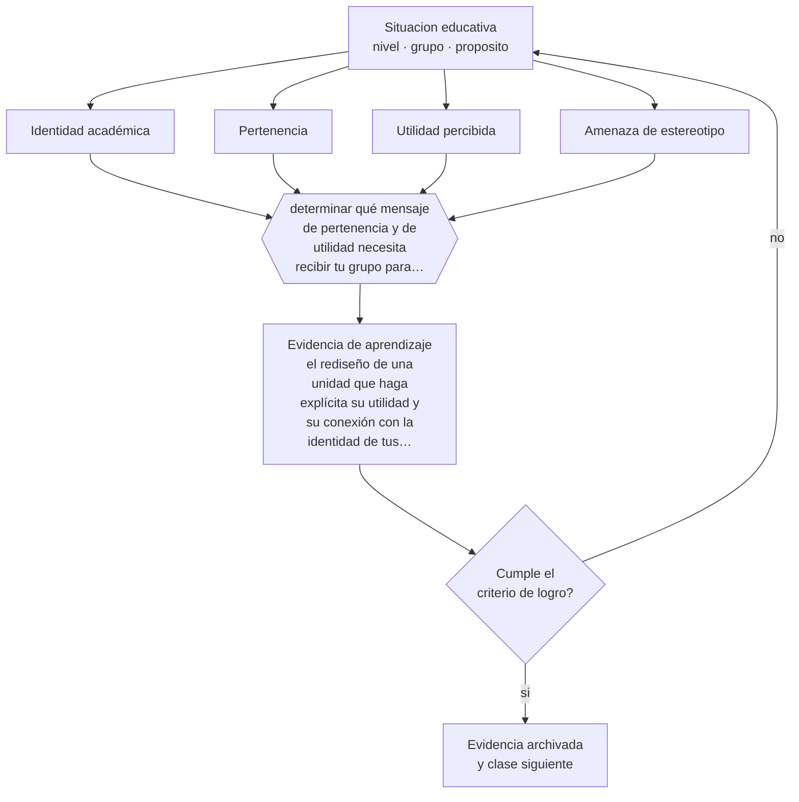

# Clase 062 — Identidad, pertenencia y motivación

> **Parte 05 · Educación media y adolescencia** — clase 2 de 12

**Estado de evidencia:** `CONSISTENTE` · **Etapa:** 🔵 Etapa B — Enseñanza por ciclo vital · **Población de referencia:** 1.º a 4.º medio (14 a 18 años) 
**Decisión que habilita:** determinar qué mensaje de pertenencia y de utilidad necesita recibir tu grupo para comprometerse con el contenido 
**Evidencia de aprendizaje:** el rediseño de una unidad que haga explícita su utilidad y su conexión con la identidad de tus estudiantes

## 🎯 Propósito

Trabajar identidad, pertenencia y motivación como variables del diseño pedagógico: el esfuerzo aparece cuando la tarea es alcanzable, relevante para quien la hace y compatible con quien el estudiante cree ser.

## 📚 Resultados de aprendizaje

Al finalizar esta clase podrás:

1. **Definir** con precisión los cuatro conceptos centrales de la clase y reconocerlos en una situación educativa real, no solo en su enunciado.
2. **Explicar** por qué un adolescente estudia para una asignatura y no para otra, teniendo el mismo profesor y el mismo horario.
3. **Decidir** —qué mensaje de pertenencia y de utilidad necesita recibir tu grupo para comprometerse con el contenido— y sostener la decisión con un fundamento escrito.
4. **Producir** la evidencia de la clase —el rediseño de una unidad que haga explícita su utilidad y su conexión con la identidad de tus estudiantes— y contrastarla contra el criterio de logro.
5. **Distinguir** lo que la evidencia sostiene de lo que es práctica instalada, preferencia personal o costumbre de la institución.

## 🧩 Conceptos centrales

| Concepto | Comprensión verificable |
|---|---|
| **Identidad académica** | idea del estudiante sobre si esta asignatura es para alguien como él |
| **Pertenencia** | percepción de ser aceptado y valorado en el espacio de aprendizaje |
| **Utilidad percibida** | relación visible entre el contenido y algo que el estudiante valora |
| **Amenaza de estereotipo** | deterioro del desempeño cuando existe riesgo de confirmar un estereotipo sobre el propio grupo |

## 🗺️ Flujo de razonamiento

## 📖 Desarrollo

### 1. El fondo del asunto

Los adolescentes evalúan implícitamente si un dominio es para ellos, y esa evaluación pesa tanto como su capacidad. Un estudiante que cree que la matemática es para otro tipo de persona invierte menos, obtiene menos y confirma su creencia. Las intervenciones que trabajan pertenencia y utilidad han mostrado efectos reales, aunque modestos y muy dependientes de que el contexto escolar sostenga el mensaje.

### 2. Cómo se traduce en decisiones de enseñanza

Las decisiones útiles son concretas: mostrar referentes con los que el grupo pueda identificarse, hacer explícita la utilidad del contenido con ejemplos del mundo real de los estudiantes, dar tareas donde el esfuerzo produzca mejora visible, y cuidar el lenguaje al corregir para que el error no confirme una identidad de incapacidad.

### 3. Qué sostiene la evidencia y qué no

Las intervenciones breves de mentalidad y pertenencia han mostrado en replicaciones a gran escala efectos pequeños, concentrados en subgrupos y dependientes del clima escolar. No sustituyen enseñanza de calidad ni resuelven desigualdades estructurales. Presentarlas como solución general contradice la evidencia disponible.

> **Cómo leer el estado de evidencia `CONSISTENTE`.** La evidencia es amplia y coherente, pero proviene sobre todo de estudios correlacionales, de síntesis con heterogeneidad alta o de contextos distintos al tuyo. Sirve para orientar la decisión y exige que compruebes el efecto en tu propio grupo.

## 🧪 Taller guiado

Aplica la clase a **uno** de los contextos siguientes y repite después el ejercicio en un
contexto de exigencia distinta. Cambiar de contexto es parte del aprendizaje: lo que funciona
con un grupo no se traslada intacto a otro.

| Contexto | Rasgo que cambia la decisión |
|---|---|
| 1.º y 2.º medio | transición desde la básica y reacomodo de grupos |
| 3.º y 4.º medio | presión de egreso, admisión y decisión vocacional |
| Curso con desenganche marcado | el contenido no compite con el problema de sentido |
| Liceo técnico-profesional | la utilidad visible del contenido cambia la motivación |
| Jornada vespertina o reingreso | estudiantes que trabajan y tienen trayectorias interrumpidas |
| Contexto de alta conflictividad | la seguridad y la convivencia condicionan la enseñanza |

**Secuencia de trabajo:**

1. Delimita el contexto: nivel, edad, tamaño del grupo, asignatura o experiencia y tiempo real disponible.
2. Declara qué saben ya los estudiantes y **cómo lo comprobaste**, no cómo lo supones.
3. Formula la decisión pedagógica que esta clase habilita y escribe su fundamento.
4. Anticipa qué observarías si la decisión funciona y qué observarías si no funciona.
5. Diseña de antemano la alternativa que aplicarás si la primera estrategia falla.
6. Ejecuta o simula, y registra lo observado con fecha, contexto y evidencia concreta.
7. Produce la evidencia de aprendizaje de la clase.
8. Contrástala contra el criterio de logro, corrige y recién entonces avanza.

### 📦 Evidencia de aprendizaje

El rediseño de una unidad que haga explícita su utilidad y su conexión con la identidad de tus estudiantes.

Debe incluir contexto, decisión, fundamento, fuentes consultadas con su fecha, indicador de
logro observable, riesgos previstos y qué harías distinto en la siguiente iteración.

## 🏆 Reto verificable

Pregunta a tu curso, de forma anónima, para qué creen que sirve tu asignatura. Rediseña la unidad a partir de esas respuestas y vuelve a preguntar al final.

## ✅ Criterio de logro

- [ ] la utilidad declarada es verificable en el mundo de los estudiantes y no genérica;
- [ ] el rediseño incluye una experiencia temprana de mejora visible con el esfuerzo;
- [ ] cada afirmación sobre «lo que funciona» está atribuida a una fuente identificable, con autor y fecha;
- [ ] la decisión es ejecutable con el tiempo, el espacio, el número de estudiantes y los recursos que realmente tienes;
- [ ] la evidencia queda archivada de forma reproducible: otra persona podría revisarla sin que tú se la expliques.

## ⚠️ Errores frecuentes

**Propios de esta clase:**

- Aplicar intervenciones motivacionales breves y esperar cambios que la evidencia no respalda.
- Hablar de utilidad del contenido en abstracto, sin conexión con el mundo real de ese grupo.

**Característicos de la parte 05:**

- Interpretar como indisciplina lo que es un desajuste entre etapa y ambiente.
- Confundir autoridad con imposición y perder legitimidad en el primer conflicto.

## ♿ Diversidad, accesibilidad y ética

La pertenencia es más frágil para estudiantes de grupos históricamente subrepresentados en un dominio. La intervención eficaz no es un discurso motivacional sino cambiar quién aparece en los ejemplos, quién recibe preguntas exigentes y quién obtiene reconocimiento público por su trabajo.

Antes de aplicar cualquier decisión de esta clase con estudiantes reales, revisa el
[protocolo de práctica responsable](../../../docs/ETICA_Y_PRACTICA_RESPONSABLE.md):
consentimiento, resguardo de datos personales, proporcionalidad de la intervención y derecho
de cada estudiante a no ser objeto de un ensayo que no le reporta beneficio.

## ❓ Preguntas de comprobación

1. ¿Quién cree en tu curso que esta asignatura no es para él, y en qué se nota?
2. ¿Qué ejemplo de utilidad reconocerían tus estudiantes como propio?
3. ¿Qué dice tu lenguaje de corrección sobre la capacidad de quien se equivoca?

## 📕 Lecturas base

**Walton, G. & Cohen, G. (2011). *A Brief Social-Belonging Intervention Improves Academic and Health Outcomes*. Science, 331.**  
*Qué aporta a esta clase:* el estudio de referencia sobre pertenencia; léelo junto con las replicaciones posteriores.

**Hulleman, C. & Harackiewicz, J. (2009). *Promoting Interest and Performance in High School Science Classes*. Science, 326.**  
*Qué aporta a esta clase:* intervención de utilidad percibida con diseño experimental y efectos condicionados.

Catálogo completo: [bibliografía del programa](../../../docs/BIBLIOGRAFIA.md) ·
[glosario](../../../docs/GLOSARIO.md) ·
[fuentes oficiales y cómo leerlas](../../../docs/FUENTES.md).

## 🔗 Conexión con el resto del programa

Aplica la clase 022 a la adolescencia y sostiene la clase 069 sobre orientación vocacional.

> [!IMPORTANT]
> Material de formación profesional. No reemplaza un título de pedagogía, una habilitación
> legal para ejercer, ni el juicio de un equipo educativo que conoce a sus estudiantes.

---

| Anterior | Índice | Siguiente |
|---|---|---|
| [← 061 · Psicología de la adolescencia](../class-01-psicologia-de-la-adolescencia/README.md) | [Parte 05](../README.md) · [Programa](../../../README.md) | [063 · Autoridad pedagógica →](../class-03-autoridad-pedagogica/README.md) |
