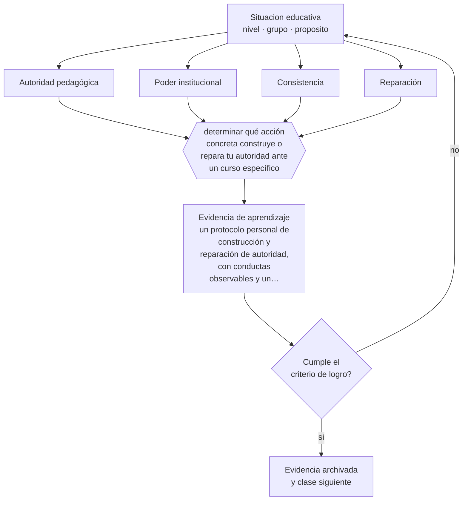

# Clase 063 — Autoridad pedagógica

> **Parte 05 · Educación media y adolescencia** — clase 3 de 12

**Estado de evidencia:** `PRACTICA-PROFESIONAL` · **Etapa:** 🔵 Etapa B — Enseñanza por ciclo vital · **Población de referencia:** 1.º a 4.º medio (14 a 18 años) 
**Decisión que habilita:** determinar qué acción concreta construye o repara tu autoridad ante un curso específico 
**Evidencia de aprendizaje:** un protocolo personal de construcción y reparación de autoridad, con conductas observables y un caso aplicado

## 🎯 Propósito

Construir autoridad pedagógica legítima —basada en competencia, consistencia y trato justo— y distinguirla del poder institucional, que se tiene por el cargo y no produce obediencia genuina.

## 📚 Resultados de aprendizaje

Al finalizar esta clase podrás:

1. **Definir** con precisión los cuatro conceptos centrales de la clase y reconocerlos en una situación educativa real, no solo en su enunciado.
2. **Explicar** de qué está hecha la autoridad que un curso reconoce, y cómo se recupera cuando se pierde.
3. **Decidir** —qué acción concreta construye o repara tu autoridad ante un curso específico— y sostener la decisión con un fundamento escrito.
4. **Producir** la evidencia de la clase —un protocolo personal de construcción y reparación de autoridad, con conductas observables y un caso aplicado— y contrastarla contra el criterio de logro.
5. **Distinguir** lo que la evidencia sostiene de lo que es práctica instalada, preferencia personal o costumbre de la institución.

## 🧩 Conceptos centrales

| Concepto | Comprensión verificable |
|---|---|
| **Autoridad pedagógica** | legitimidad reconocida por los estudiantes para dirigir el aprendizaje |
| **Poder institucional** | capacidad de sancionar derivada del cargo; existe aunque no haya legitimidad |
| **Consistencia** | correspondencia entre lo que se anuncia y lo que efectivamente ocurre, sostenida en el tiempo |
| **Reparación** | acción deliberada para restablecer la relación después de un error propio o de un conflicto |

## 🗺️ Flujo de razonamiento

## 📖 Desarrollo

### 1. El fondo del asunto

Los adolescentes reconocen autoridad en tres cosas: que el docente sepa lo que enseña, que cumpla lo que anuncia y que trate a todos con el mismo criterio. La legitimidad se construye lentamente y se pierde rápido, sobre todo con humillación pública o con arbitrariedad visible. Un docente con autoridad legítima puede exigir mucho más, porque la exigencia se interpreta como confianza y no como abuso.

### 2. Cómo se traduce en decisiones de enseñanza

Lo que más rinde es también lo más difícil de sostener: cumplir siempre lo anunciado, corregir sin exponer, reconocer el propio error explícitamente y volver al vínculo después del conflicto. La reparación merece protocolo propio, porque el momento posterior a un choque decide si la relación se recompone o se instala como enemistad para el resto del año.

### 3. Qué sostiene la evidencia y qué no

No existe evidencia experimental sólida sobre construcción de autoridad: es conocimiento profesional acumulado, sensible al contexto cultural e institucional. Además, la autoridad individual no compensa condiciones institucionales deterioradas: cuando la escuela no sostiene criterios comunes, cada docente negocia solo y el desgaste es alto.

> **Cómo leer el estado de evidencia `PRACTICA-PROFESIONAL`.** Es conocimiento práctico acumulado del oficio, útil y transferible, pero no probado con diseños de investigación. Trátalo como un buen punto de partida sujeto a comprobación en tu contexto.

## 🧪 Taller guiado

Aplica la clase a **uno** de los contextos siguientes y repite después el ejercicio en un
contexto de exigencia distinta. Cambiar de contexto es parte del aprendizaje: lo que funciona
con un grupo no se traslada intacto a otro.

| Contexto | Rasgo que cambia la decisión |
|---|---|
| 1.º y 2.º medio | transición desde la básica y reacomodo de grupos |
| 3.º y 4.º medio | presión de egreso, admisión y decisión vocacional |
| Curso con desenganche marcado | el contenido no compite con el problema de sentido |
| Liceo técnico-profesional | la utilidad visible del contenido cambia la motivación |
| Jornada vespertina o reingreso | estudiantes que trabajan y tienen trayectorias interrumpidas |
| Contexto de alta conflictividad | la seguridad y la convivencia condicionan la enseñanza |

**Secuencia de trabajo:**

1. Delimita el contexto: nivel, edad, tamaño del grupo, asignatura o experiencia y tiempo real disponible.
2. Declara qué saben ya los estudiantes y **cómo lo comprobaste**, no cómo lo supones.
3. Formula la decisión pedagógica que esta clase habilita y escribe su fundamento.
4. Anticipa qué observarías si la decisión funciona y qué observarías si no funciona.
5. Diseña de antemano la alternativa que aplicarás si la primera estrategia falla.
6. Ejecuta o simula, y registra lo observado con fecha, contexto y evidencia concreta.
7. Produce la evidencia de aprendizaje de la clase.
8. Contrástala contra el criterio de logro, corrige y recién entonces avanza.

### 📦 Evidencia de aprendizaje

Un protocolo personal de construcción y reparación de autoridad, con conductas observables y un caso aplicado.

Debe incluir contexto, decisión, fundamento, fuentes consultadas con su fecha, indicador de
logro observable, riesgos previstos y qué harías distinto en la siguiente iteración.

## 🏆 Reto verificable

Pide retroalimentación anónima a un curso sobre consistencia y justicia de tu trato. Escoge la crítica más incómoda y trabájala durante un mes.

## ✅ Criterio de logro

- [ ] el protocolo describe conductas observables y no intenciones ni valores;
- [ ] incluye un procedimiento explícito de reparación tras el conflicto;
- [ ] cada afirmación sobre «lo que funciona» está atribuida a una fuente identificable, con autor y fecha;
- [ ] la decisión es ejecutable con el tiempo, el espacio, el número de estudiantes y los recursos que realmente tienes;
- [ ] la evidencia queda archivada de forma reproducible: otra persona podría revisarla sin que tú se la expliques.

## ⚠️ Errores frecuentes

**Propios de esta clase:**

- Recuperar el control mediante la exposición pública de un estudiante.
- Anunciar consecuencias que después no se aplican, con lo que toda regla pierde valor.

**Característicos de la parte 05:**

- Interpretar como indisciplina lo que es un desajuste entre etapa y ambiente.
- Confundir autoridad con imposición y perder legitimidad en el primer conflicto.

## ♿ Diversidad, accesibilidad y ética

La percepción de trato injusto es una de las principales causas de conflicto con estudiantes que ya se sienten marcados por su historia escolar, su origen o su comportamiento previo. La consistencia visible del criterio protege especialmente a quienes esperan ser tratados con sospecha.

Antes de aplicar cualquier decisión de esta clase con estudiantes reales, revisa el
[protocolo de práctica responsable](../../../docs/ETICA_Y_PRACTICA_RESPONSABLE.md):
consentimiento, resguardo de datos personales, proporcionalidad de la intervención y derecho
de cada estudiante a no ser objeto de un ensayo que no le reporta beneficio.

## ❓ Preguntas de comprobación

1. ¿Qué anunciaste este mes que no cumpliste?
2. ¿Cómo reparas la relación después de un choque con un estudiante?
3. ¿Qué haces cuando te equivocas delante del curso?

## 📕 Lecturas base

**Meirieu, P. *Frankenstein educador* y trabajos sobre autoridad pedagógica.**  
*Qué aporta a esta clase:* distingue autoridad de autoritarismo y sitúa el problema en la relación educativa.

**Marzano, R. (2003). *Classroom Management That Works*.**  
*Qué aporta a esta clase:* sistematiza prácticas de relación y consistencia con evidencia observacional.

Catálogo completo: [bibliografía del programa](../../../docs/BIBLIOGRAFIA.md) ·
[glosario](../../../docs/GLOSARIO.md) ·
[fuentes oficiales y cómo leerlas](../../../docs/FUENTES.md).

## 🔗 Conexión con el resto del programa

Sostiene la clase 064 y se apoya en la clase 061. Reaparece en la parte 15, donde el mismo problema se plantea entre directivos y docentes.

> [!IMPORTANT]
> Material de formación profesional. No reemplaza un título de pedagogía, una habilitación
> legal para ejercer, ni el juicio de un equipo educativo que conoce a sus estudiantes.

---

| Anterior | Índice | Siguiente |
|---|---|---|
| [← 062 · Identidad, pertenencia y motivación](../class-02-identidad-pertenencia-y-motivacion/README.md) | [Parte 05](../README.md) · [Programa](../../../README.md) | [064 · Gestión de aula adolescente →](../class-04-gestion-de-aula-adolescente/README.md) |
