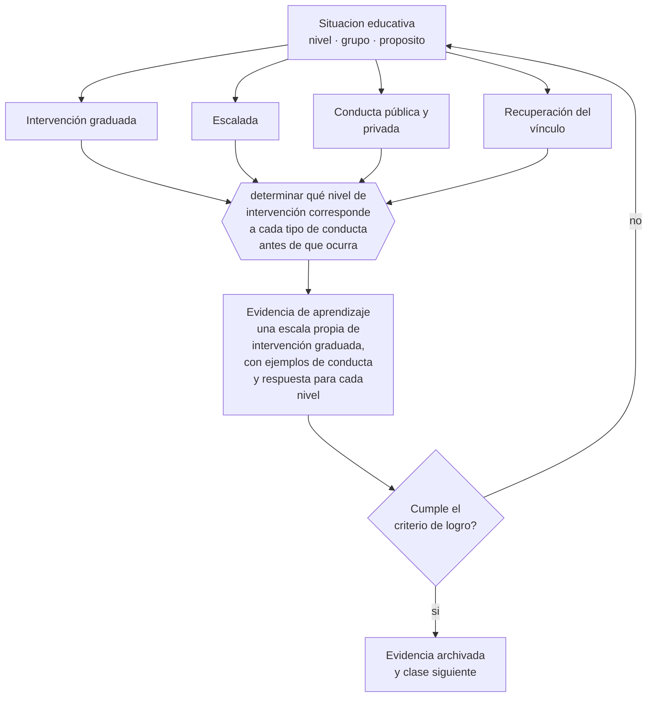

# Clase 064 — Gestión de aula adolescente

> **Parte 05 · Educación media y adolescencia** — clase 4 de 12

**Estado de evidencia:** `CONSISTENTE` · **Etapa:** 🔵 Etapa B — Enseñanza por ciclo vital · **Población de referencia:** 1.º a 4.º medio (14 a 18 años) 
**Decisión que habilita:** determinar qué nivel de intervención corresponde a cada tipo de conducta antes de que ocurra 
**Evidencia de aprendizaje:** una escala propia de intervención graduada, con ejemplos de conducta y respuesta para cada nivel

## 🎯 Propósito

Gestionar el aula adolescente con intervenciones graduadas que detengan la conducta sin escalar, preservando la relación y sin dejar la situación sin respuesta.

## 📚 Resultados de aprendizaje

Al finalizar esta clase podrás:

1. **Definir** con precisión los cuatro conceptos centrales de la clase y reconocerlos en una situación educativa real, no solo en su enunciado.
2. **Explicar** cómo intervenir una disrupción sin convertirla en un conflicto que dure semanas.
3. **Decidir** —qué nivel de intervención corresponde a cada tipo de conducta antes de que ocurra— y sostener la decisión con un fundamento escrito.
4. **Producir** la evidencia de la clase —una escala propia de intervención graduada, con ejemplos de conducta y respuesta para cada nivel— y contrastarla contra el criterio de logro.
5. **Distinguir** lo que la evidencia sostiene de lo que es práctica instalada, preferencia personal o costumbre de la institución.

## 🧩 Conceptos centrales

| Concepto | Comprensión verificable |
|---|---|
| **Intervención graduada** | escala de respuestas de menor a mayor intensidad ante conductas disruptivas |
| **Escalada** | dinámica en que la respuesta del adulto aumenta la intensidad del conflicto |
| **Conducta pública y privada** | distinción entre corregir ante el grupo o en privado; cambia por completo el resultado |
| **Recuperación del vínculo** | acción posterior a la corrección destinada a restablecer la relación de trabajo |

## 🗺️ Flujo de razonamiento

## 📖 Desarrollo

### 1. El fondo del asunto

Con adolescentes, la forma de la corrección importa tanto como su contenido. Una corrección pública activa la sensibilidad al estatus y obliga al estudiante a responder ante sus pares, lo que convierte una conducta menor en un enfrentamiento. Una escala graduada —proximidad, señal no verbal, indicación breve, conversación privada, medida formal— permite detener la conducta con el menor costo relacional posible.

### 2. Cómo se traduce en decisiones de enseñanza

La clave es tener la escala decidida antes, porque en el momento no hay tiempo de deliberar. También conviene distinguir de antemano qué conductas se corrigen en el momento y cuáles se abordan después: intentar resolverlo todo en clase suele detener la enseñanza y beneficiar a quien busca precisamente eso. Y toda corrección debe cerrarse con una acción que recupere el vínculo.

### 3. Qué sostiene la evidencia y qué no

Las escalas de intervención funcionan cuando la institución las sostiene: si el reglamento y el equipo directivo aplican criterios distintos, el docente queda sin respaldo y la escala se rompe en el primer caso grave. Además, ninguna técnica de aula sustituye la respuesta institucional ante situaciones de violencia o vulneración, que tienen protocolo propio.

> **Cómo leer el estado de evidencia `CONSISTENTE`.** La evidencia es amplia y coherente, pero proviene sobre todo de estudios correlacionales, de síntesis con heterogeneidad alta o de contextos distintos al tuyo. Sirve para orientar la decisión y exige que compruebes el efecto en tu propio grupo.

## 🧪 Taller guiado

Aplica la clase a **uno** de los contextos siguientes y repite después el ejercicio en un
contexto de exigencia distinta. Cambiar de contexto es parte del aprendizaje: lo que funciona
con un grupo no se traslada intacto a otro.

| Contexto | Rasgo que cambia la decisión |
|---|---|
| 1.º y 2.º medio | transición desde la básica y reacomodo de grupos |
| 3.º y 4.º medio | presión de egreso, admisión y decisión vocacional |
| Curso con desenganche marcado | el contenido no compite con el problema de sentido |
| Liceo técnico-profesional | la utilidad visible del contenido cambia la motivación |
| Jornada vespertina o reingreso | estudiantes que trabajan y tienen trayectorias interrumpidas |
| Contexto de alta conflictividad | la seguridad y la convivencia condicionan la enseñanza |

**Secuencia de trabajo:**

1. Delimita el contexto: nivel, edad, tamaño del grupo, asignatura o experiencia y tiempo real disponible.
2. Declara qué saben ya los estudiantes y **cómo lo comprobaste**, no cómo lo supones.
3. Formula la decisión pedagógica que esta clase habilita y escribe su fundamento.
4. Anticipa qué observarías si la decisión funciona y qué observarías si no funciona.
5. Diseña de antemano la alternativa que aplicarás si la primera estrategia falla.
6. Ejecuta o simula, y registra lo observado con fecha, contexto y evidencia concreta.
7. Produce la evidencia de aprendizaje de la clase.
8. Contrástala contra el criterio de logro, corrige y recién entonces avanza.

### 📦 Evidencia de aprendizaje

Una escala propia de intervención graduada, con ejemplos de conducta y respuesta para cada nivel.

Debe incluir contexto, decisión, fundamento, fuentes consultadas con su fecha, indicador de
logro observable, riesgos previstos y qué harías distinto en la siguiente iteración.

## 🏆 Reto verificable

Registra durante dos semanas cada intervención tuya, su nivel y a quién se aplicó. Analiza el patrón y ajusta la escala donde estés escalando innecesariamente.

## ✅ Criterio de logro

- [ ] la escala define conductas y respuestas por nivel, decididas de antemano;
- [ ] incluye qué se aborda en el momento y qué se posterga, con criterio explícito;
- [ ] cada afirmación sobre «lo que funciona» está atribuida a una fuente identificable, con autor y fecha;
- [ ] la decisión es ejecutable con el tiempo, el espacio, el número de estudiantes y los recursos que realmente tienes;
- [ ] la evidencia queda archivada de forma reproducible: otra persona podría revisarla sin que tú se la expliques.

## ⚠️ Errores frecuentes

**Propios de esta clase:**

- Corregir en público una conducta menor y provocar un enfrentamiento por estatus.
- Dejar sin respuesta una conducta para evitar el conflicto, lo que la instala como norma.

**Característicos de la parte 05:**

- Interpretar como indisciplina lo que es un desajuste entre etapa y ambiente.
- Confundir autoridad con imposición y perder legitimidad en el primer conflicto.

## ♿ Diversidad, accesibilidad y ética

Las estadísticas de sanciones muestran de forma consistente que algunos perfiles de estudiantes reciben más medidas por conductas equivalentes. Registrar quién recibe cada nivel de intervención permite detectar ese sesgo en el propio curso.

Antes de aplicar cualquier decisión de esta clase con estudiantes reales, revisa el
[protocolo de práctica responsable](../../../docs/ETICA_Y_PRACTICA_RESPONSABLE.md):
consentimiento, resguardo de datos personales, proporcionalidad de la intervención y derecho
de cada estudiante a no ser objeto de un ensayo que no le reporta beneficio.

## ❓ Preguntas de comprobación

1. ¿Qué haces en los primeros cinco segundos de una disrupción?
2. ¿Qué conductas estás corrigiendo en público sin necesidad?
3. ¿Qué respaldo institucional tienes cuando la escala llega a su último nivel?

## 📕 Lecturas base

**Emmer, E. & Evertson, C. *Classroom Management for Secondary Teachers*.**  
*Qué aporta a esta clase:* manual operativo específico para enseñanza media, con escalas y procedimientos.

**Mineduc / Superintendencia de Educación. *Normativa sobre convivencia escolar y reglamentos internos*.**  
*Qué aporta a esta clase:* define el marco chileno que respalda o limita cada nivel de intervención.

Catálogo completo: [bibliografía del programa](../../../docs/BIBLIOGRAFIA.md) ·
[glosario](../../../docs/GLOSARIO.md) ·
[fuentes oficiales y cómo leerlas](../../../docs/FUENTES.md).

## 🔗 Conexión con el resto del programa

Se apoya en las clases 061 y 063, y es la versión adolescente de lo que la parte 12 desarrolla en profundidad.

> [!IMPORTANT]
> Material de formación profesional. No reemplaza un título de pedagogía, una habilitación
> legal para ejercer, ni el juicio de un equipo educativo que conoce a sus estudiantes.

---

| Anterior | Índice | Siguiente |
|---|---|---|
| [← 063 · Autoridad pedagógica](../class-03-autoridad-pedagogica/README.md) | [Parte 05](../README.md) · [Programa](../../../README.md) | [065 · Aprendizaje basado en proyectos →](../class-05-aprendizaje-basado-en-proyectos/README.md) |
