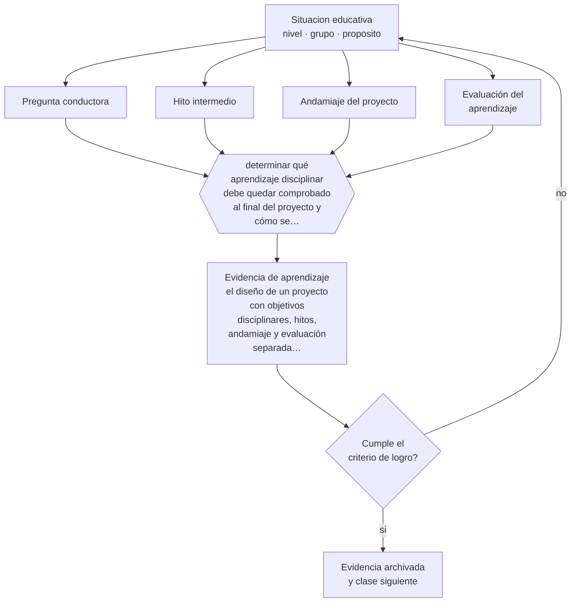

# Clase 065 — Aprendizaje basado en proyectos

> **Parte 05 · Educación media y adolescencia** — clase 5 de 12

**Estado de evidencia:** `EN-DEBATE` · **Etapa:** 🔵 Etapa B — Enseñanza por ciclo vital · **Población de referencia:** 1.º a 4.º medio (14 a 18 años) 
**Decisión que habilita:** determinar qué aprendizaje disciplinar debe quedar comprobado al final del proyecto y cómo se comprobará 
**Evidencia de aprendizaje:** el diseño de un proyecto con objetivos disciplinares, hitos, andamiaje y evaluación separada del producto final

## 🎯 Propósito

Diseñar aprendizaje basado en proyectos con las condiciones que la evidencia asocia a su eficacia: objetivos disciplinares explícitos, andamiaje, hitos intermedios y evaluación de aprendizaje y no solo de producto.

## 📚 Resultados de aprendizaje

Al finalizar esta clase podrás:

1. **Definir** con precisión los cuatro conceptos centrales de la clase y reconocerlos en una situación educativa real, no solo en su enunciado.
2. **Explicar** qué condiciones separan un proyecto que enseña de una actividad larga que produce un producto vistoso.
3. **Decidir** —qué aprendizaje disciplinar debe quedar comprobado al final del proyecto y cómo se comprobará— y sostener la decisión con un fundamento escrito.
4. **Producir** la evidencia de la clase —el diseño de un proyecto con objetivos disciplinares, hitos, andamiaje y evaluación separada del producto final— y contrastarla contra el criterio de logro.
5. **Distinguir** lo que la evidencia sostiene de lo que es práctica instalada, preferencia personal o costumbre de la institución.

## 🧩 Conceptos centrales

| Concepto | Comprensión verificable |
|---|---|
| **Pregunta conductora** | problema o desafío que organiza el proyecto y exige el contenido disciplinar |
| **Hito intermedio** | punto de control con entrega y retroalimentación antes del producto final |
| **Andamiaje del proyecto** | apoyos explícitos —modelos, plantillas, enseñanza directa— dentro del trabajo autónomo |
| **Evaluación del aprendizaje** | comprobación del contenido aprendido, distinta de la evaluación del producto entregado |

## 🗺️ Flujo de razonamiento

## 📖 Desarrollo

### 1. El fondo del asunto

El aprendizaje basado en proyectos tiene evidencia mixta y su variación se explica sobre todo por el diseño. Los proyectos eficaces conservan enseñanza explícita del contenido dentro del proceso, tienen hitos con retroalimentación y evalúan el aprendizaje individual además del producto grupal. Los proyectos que fallan sustituyen la enseñanza por la búsqueda autónoma y evalúan la presentación final, que suele reflejar recursos del hogar más que aprendizaje.

### 2. Cómo se traduce en decisiones de enseñanza

El diseño empieza al revés: definir qué debe saber y poder hacer cada estudiante al final, y luego construir el proyecto que exige eso. Los hitos permiten corregir a tiempo; sin ellos, los problemas aparecen cuando ya no hay margen. Y la evaluación individual del contenido es lo que impide que un proyecto brillante oculte que la mitad del grupo no aprendió nada.

### 3. Qué sostiene la evidencia y qué no

Los metaanálisis muestran efectos positivos pero heterogéneos, y con frecuencia menores en conocimiento disciplinar que en motivación o habilidades de trabajo. El debate sobre cuánta guía es necesaria sigue abierto, aunque hay acuerdo en que la guía mínima perjudica a los estudiantes con menos conocimiento previo, que son quienes más necesitan el aprendizaje.

> **Cómo leer el estado de evidencia `EN-DEBATE`.** Hay desacuerdo activo y publicado entre especialistas competentes. La clase presenta las posiciones y sus argumentos; tu tarea no es escoger un bando, sino saber qué evidencia te haría cambiar de posición.

## 🧪 Taller guiado

Aplica la clase a **uno** de los contextos siguientes y repite después el ejercicio en un
contexto de exigencia distinta. Cambiar de contexto es parte del aprendizaje: lo que funciona
con un grupo no se traslada intacto a otro.

| Contexto | Rasgo que cambia la decisión |
|---|---|
| 1.º y 2.º medio | transición desde la básica y reacomodo de grupos |
| 3.º y 4.º medio | presión de egreso, admisión y decisión vocacional |
| Curso con desenganche marcado | el contenido no compite con el problema de sentido |
| Liceo técnico-profesional | la utilidad visible del contenido cambia la motivación |
| Jornada vespertina o reingreso | estudiantes que trabajan y tienen trayectorias interrumpidas |
| Contexto de alta conflictividad | la seguridad y la convivencia condicionan la enseñanza |

**Secuencia de trabajo:**

1. Delimita el contexto: nivel, edad, tamaño del grupo, asignatura o experiencia y tiempo real disponible.
2. Declara qué saben ya los estudiantes y **cómo lo comprobaste**, no cómo lo supones.
3. Formula la decisión pedagógica que esta clase habilita y escribe su fundamento.
4. Anticipa qué observarías si la decisión funciona y qué observarías si no funciona.
5. Diseña de antemano la alternativa que aplicarás si la primera estrategia falla.
6. Ejecuta o simula, y registra lo observado con fecha, contexto y evidencia concreta.
7. Produce la evidencia de aprendizaje de la clase.
8. Contrástala contra el criterio de logro, corrige y recién entonces avanza.

### 📦 Evidencia de aprendizaje

El diseño de un proyecto con objetivos disciplinares, hitos, andamiaje y evaluación separada del producto final.

Debe incluir contexto, decisión, fundamento, fuentes consultadas con su fecha, indicador de
logro observable, riesgos previstos y qué harías distinto en la siguiente iteración.

## 🏆 Reto verificable

Diseña un proyecto con evaluación individual del contenido. Compara esa evaluación con la calificación del producto grupal y analiza la diferencia.

## ✅ Criterio de logro

- [ ] el proyecto declara objetivos disciplinares y su evaluación individual;
- [ ] existen al menos dos hitos con retroalimentación antes del producto final;
- [ ] cada afirmación sobre «lo que funciona» está atribuida a una fuente identificable, con autor y fecha;
- [ ] la decisión es ejecutable con el tiempo, el espacio, el número de estudiantes y los recursos que realmente tienes;
- [ ] la evidencia queda archivada de forma reproducible: otra persona podría revisarla sin que tú se la expliques.

## ⚠️ Errores frecuentes

**Propios de esta clase:**

- Evaluar el producto final grupal y no el aprendizaje individual del contenido.
- Sustituir la enseñanza del contenido por la investigación autónoma de los estudiantes.

**Característicos de la parte 05:**

- Interpretar como indisciplina lo que es un desajuste entre etapa y ambiente.
- Confundir autoridad con imposición y perder legitimidad en el primer conflicto.

## ♿ Diversidad, accesibilidad y ética

El trabajo autónomo prolongado penaliza a estudiantes con dificultades de organización y a quienes no tienen apoyo ni recursos en casa. Andamiaje explícito, tiempo de trabajo en clase y roles definidos son condiciones de equidad, no concesiones.

Antes de aplicar cualquier decisión de esta clase con estudiantes reales, revisa el
[protocolo de práctica responsable](../../../docs/ETICA_Y_PRACTICA_RESPONSABLE.md):
consentimiento, resguardo de datos personales, proporcionalidad de la intervención y derecho
de cada estudiante a no ser objeto de un ensayo que no le reporta beneficio.

## ❓ Preguntas de comprobación

1. ¿Qué aprenderá cada estudiante, no cada grupo?
2. ¿Qué enseñanza explícita ocurre dentro de tu proyecto?
3. ¿Qué parte del producto final refleja recursos del hogar y no aprendizaje?

## 📕 Lecturas base

**Condliffe, B. et al. (2017). *Project-Based Learning: A Literature Review*. MDRC.**  
*Qué aporta a esta clase:* revisión honesta sobre qué muestra y qué no muestra la evidencia disponible.

**Barron, B. & Darling-Hammond, L. (2008). *Teaching for Meaningful Learning*.**  
*Qué aporta a esta clase:* sintetiza condiciones de diseño asociadas a mejores resultados en enfoques por proyectos.

Catálogo completo: [bibliografía del programa](../../../docs/BIBLIOGRAFIA.md) ·
[glosario](../../../docs/GLOSARIO.md) ·
[fuentes oficiales y cómo leerlas](../../../docs/FUENTES.md).

## 🔗 Conexión con el resto del programa

Se apoya en la clase 016 (andamiaje) y se distingue de la clase 066, con la que suele confundirse.

> [!IMPORTANT]
> Material de formación profesional. No reemplaza un título de pedagogía, una habilitación
> legal para ejercer, ni el juicio de un equipo educativo que conoce a sus estudiantes.

---

| Anterior | Índice | Siguiente |
|---|---|---|
| [← 064 · Gestión de aula adolescente](../class-04-gestion-de-aula-adolescente/README.md) | [Parte 05](../README.md) · [Programa](../../../README.md) | [066 · Aprendizaje basado en problemas →](../class-06-aprendizaje-basado-en-problemas/README.md) |
