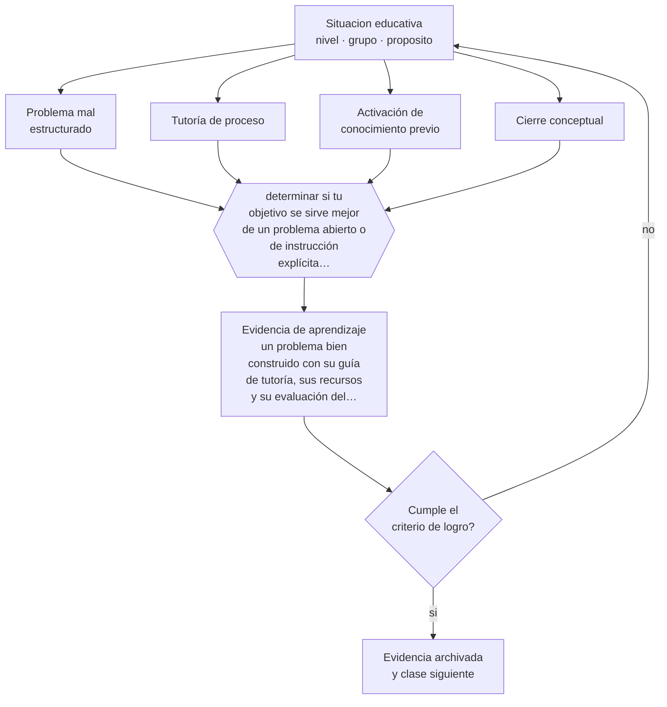

# Clase 066 — Aprendizaje basado en problemas

> **Parte 05 · Educación media y adolescencia** — clase 6 de 12

**Estado de evidencia:** `EN-DEBATE` · **Etapa:** 🔵 Etapa B — Enseñanza por ciclo vital · **Población de referencia:** 1.º a 4.º medio (14 a 18 años) 
**Decisión que habilita:** determinar si tu objetivo se sirve mejor de un problema abierto o de instrucción explícita seguida de aplicación 
**Evidencia de aprendizaje:** un problema bien construido con su guía de tutoría, sus recursos y su evaluación del aprendizaje adquirido

## 🎯 Propósito

Diseñar aprendizaje basado en problemas con su lógica propia: el problema precede al contenido y organiza su adquisición, con tutoría que sostiene el proceso sin resolverlo.

## 📚 Resultados de aprendizaje

Al finalizar esta clase podrás:

1. **Definir** con precisión los cuatro conceptos centrales de la clase y reconocerlos en una situación educativa real, no solo en su enunciado.
2. **Explicar** en qué se diferencia trabajar por problemas de trabajar por proyectos, y cuándo conviene cada uno.
3. **Decidir** —si tu objetivo se sirve mejor de un problema abierto o de instrucción explícita seguida de aplicación— y sostener la decisión con un fundamento escrito.
4. **Producir** la evidencia de la clase —un problema bien construido con su guía de tutoría, sus recursos y su evaluación del aprendizaje adquirido— y contrastarla contra el criterio de logro.
5. **Distinguir** lo que la evidencia sostiene de lo que es práctica instalada, preferencia personal o costumbre de la institución.

## 🧩 Conceptos centrales

| Concepto | Comprensión verificable |
|---|---|
| **Problema mal estructurado** | situación sin una única solución correcta ni un procedimiento evidente; exige decisiones |
| **Tutoría de proceso** | acompañamiento que orienta el razonamiento sin entregar la solución |
| **Activación de conocimiento previo** | fase inicial en que el grupo determina qué sabe y qué necesita averiguar |
| **Cierre conceptual** | momento en que se sistematiza el contenido aprendido para que no quede disperso |

## 🗺️ Flujo de razonamiento

## 📖 Desarrollo

### 1. El fondo del asunto

En el aprendizaje basado en problemas el problema viene primero y motiva la búsqueda del contenido; en el aprendizaje por proyectos, el contenido se aplica en la producción de algo. Las revisiones muestran resultados favorables en aplicación y retención de largo plazo, y menos favorables en adquisición inicial de conocimiento, sobre todo con estudiantes novatos. El cierre conceptual es la fase que más se omite y la que determina si el contenido queda organizado.

### 2. Cómo se traduce en decisiones de enseñanza

Un buen problema es realista, admite más de una respuesta defendible y exige exactamente el contenido que se quiere enseñar. La tutoría se prepara: preguntas previstas, recursos disponibles, puntos donde intervenir. Y el cierre no es opcional: sin una sistematización final, cada grupo se queda con la versión parcial que construyó.

### 3. Qué sostiene la evidencia y qué no

El debate sobre guía mínima aplica directamente aquí. Con estudiantes sin conocimiento previo suficiente, el problema abierto produce carga excesiva y aprendizaje errático. La posición defendible es reservar el problema abierto para cuando existe base suficiente, y usar instrucción explícita seguida de aplicación cuando no la hay.

> **Cómo leer el estado de evidencia `EN-DEBATE`.** Hay desacuerdo activo y publicado entre especialistas competentes. La clase presenta las posiciones y sus argumentos; tu tarea no es escoger un bando, sino saber qué evidencia te haría cambiar de posición.

## 🧪 Taller guiado

Aplica la clase a **uno** de los contextos siguientes y repite después el ejercicio en un
contexto de exigencia distinta. Cambiar de contexto es parte del aprendizaje: lo que funciona
con un grupo no se traslada intacto a otro.

| Contexto | Rasgo que cambia la decisión |
|---|---|
| 1.º y 2.º medio | transición desde la básica y reacomodo de grupos |
| 3.º y 4.º medio | presión de egreso, admisión y decisión vocacional |
| Curso con desenganche marcado | el contenido no compite con el problema de sentido |
| Liceo técnico-profesional | la utilidad visible del contenido cambia la motivación |
| Jornada vespertina o reingreso | estudiantes que trabajan y tienen trayectorias interrumpidas |
| Contexto de alta conflictividad | la seguridad y la convivencia condicionan la enseñanza |

**Secuencia de trabajo:**

1. Delimita el contexto: nivel, edad, tamaño del grupo, asignatura o experiencia y tiempo real disponible.
2. Declara qué saben ya los estudiantes y **cómo lo comprobaste**, no cómo lo supones.
3. Formula la decisión pedagógica que esta clase habilita y escribe su fundamento.
4. Anticipa qué observarías si la decisión funciona y qué observarías si no funciona.
5. Diseña de antemano la alternativa que aplicarás si la primera estrategia falla.
6. Ejecuta o simula, y registra lo observado con fecha, contexto y evidencia concreta.
7. Produce la evidencia de aprendizaje de la clase.
8. Contrástala contra el criterio de logro, corrige y recién entonces avanza.

### 📦 Evidencia de aprendizaje

Un problema bien construido con su guía de tutoría, sus recursos y su evaluación del aprendizaje adquirido.

Debe incluir contexto, decisión, fundamento, fuentes consultadas con su fecha, indicador de
logro observable, riesgos previstos y qué harías distinto en la siguiente iteración.

## 🏆 Reto verificable

Construye un problema y aplícalo. Evalúa el contenido adquirido con un instrumento individual y compáralo con lo que esperabas que aprendieran.

## ✅ Criterio de logro

- [ ] el problema exige el contenido objetivo y admite más de una solución defendible;
- [ ] el diseño incluye cierre conceptual con sistematización del contenido;
- [ ] cada afirmación sobre «lo que funciona» está atribuida a una fuente identificable, con autor y fecha;
- [ ] la decisión es ejecutable con el tiempo, el espacio, el número de estudiantes y los recursos que realmente tienes;
- [ ] la evidencia queda archivada de forma reproducible: otra persona podría revisarla sin que tú se la expliques.

## ⚠️ Errores frecuentes

**Propios de esta clase:**

- Usar problemas abiertos con estudiantes que no tienen el conocimiento previo para abordarlos.
- Omitir el cierre conceptual y dejar el contenido disperso entre los grupos.

**Característicos de la parte 05:**

- Interpretar como indisciplina lo que es un desajuste entre etapa y ambiente.
- Confundir autoridad con imposición y perder legitimidad en el primer conflicto.

## ♿ Diversidad, accesibilidad y ética

El problema abierto puede excluir a quienes tienen menos vocabulario académico o menos experiencia con el contexto del problema. Elegir contextos familiares para todo el grupo y ofrecer recursos de acceso nivela la entrada sin reducir la exigencia.

Antes de aplicar cualquier decisión de esta clase con estudiantes reales, revisa el
[protocolo de práctica responsable](../../../docs/ETICA_Y_PRACTICA_RESPONSABLE.md):
consentimiento, resguardo de datos personales, proporcionalidad de la intervención y derecho
de cada estudiante a no ser objeto de un ensayo que no le reporta beneficio.

## ❓ Preguntas de comprobación

1. ¿Qué conocimiento previo necesita tu grupo para abordar este problema?
2. ¿Dónde intervendrás como tutor y dónde no?
3. ¿Cómo quedará organizado el contenido al final para todos, y no solo para cada grupo?

## 📕 Lecturas base

**Hmelo-Silver, C. (2004). *Problem-Based Learning: What and How Do Students Learn?***  
*Qué aporta a esta clase:* revisión que ordena qué aprende el estudiante en este enfoque y bajo qué condiciones.

**Schmidt, H., Loyens, S., van Gog, T. & Paas, F. (2007). *Problem-Based Learning is Compatible with Human Cognitive Architecture*.**  
*Qué aporta a esta clase:* el contrapunto al artículo de guía mínima; útil para entender el debate completo.

Catálogo completo: [bibliografía del programa](../../../docs/BIBLIOGRAFIA.md) ·
[glosario](../../../docs/GLOSARIO.md) ·
[fuentes oficiales y cómo leerlas](../../../docs/FUENTES.md).

## 🔗 Conexión con el resto del programa

Se distingue de la clase 065 y se apoya en las clases 015 y 019. Es antecedente directo de los formatos de la parte 14.

> [!IMPORTANT]
> Material de formación profesional. No reemplaza un título de pedagogía, una habilitación
> legal para ejercer, ni el juicio de un equipo educativo que conoce a sus estudiantes.

---

| Anterior | Índice | Siguiente |
|---|---|---|
| [← 065 · Aprendizaje basado en proyectos](../class-05-aprendizaje-basado-en-proyectos/README.md) | [Parte 05](../README.md) · [Programa](../../../README.md) | [067 · Debate y argumentación →](../class-07-debate-y-argumentacion/README.md) |
