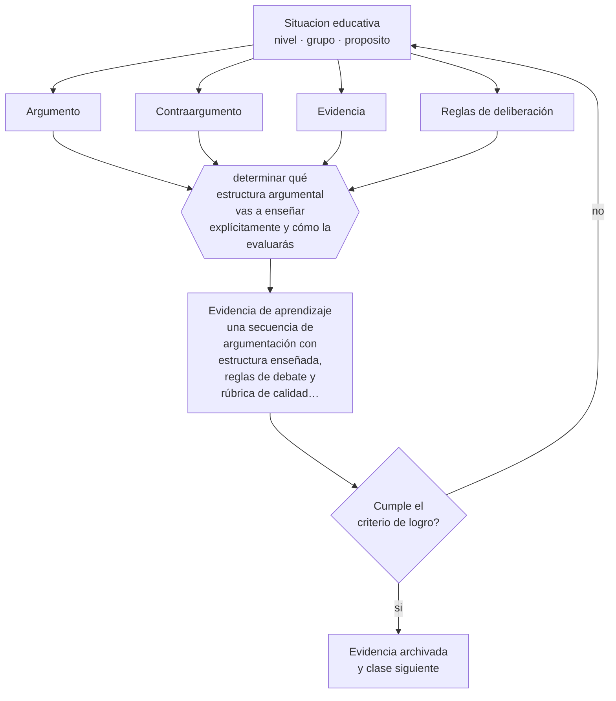

# Clase 067 — Debate y argumentación

> **Parte 05 · Educación media y adolescencia** — clase 7 de 12

**Estado de evidencia:** `CONSISTENTE` · **Etapa:** 🔵 Etapa B — Enseñanza por ciclo vital · **Población de referencia:** 1.º a 4.º medio (14 a 18 años) 
**Decisión que habilita:** determinar qué estructura argumental vas a enseñar explícitamente y cómo la evaluarás 
**Evidencia de aprendizaje:** una secuencia de argumentación con estructura enseñada, reglas de debate y rúbrica de calidad argumental

## 🎯 Propósito

Enseñar argumentación y debate como competencia disciplinar y cívica: construir una tesis, sostenerla con evidencia, anticipar objeciones y cambiar de posición cuando corresponde.

## 📚 Resultados de aprendizaje

Al finalizar esta clase podrás:

1. **Definir** con precisión los cuatro conceptos centrales de la clase y reconocerlos en una situación educativa real, no solo en su enunciado.
2. **Explicar** cómo se enseña a discutir con argumentos en un grupo donde discutir suele significar imponerse.
3. **Decidir** —qué estructura argumental vas a enseñar explícitamente y cómo la evaluarás— y sostener la decisión con un fundamento escrito.
4. **Producir** la evidencia de la clase —una secuencia de argumentación con estructura enseñada, reglas de debate y rúbrica de calidad argumental— y contrastarla contra el criterio de logro.
5. **Distinguir** lo que la evidencia sostiene de lo que es práctica instalada, preferencia personal o costumbre de la institución.

## 🧩 Conceptos centrales

| Concepto | Comprensión verificable |
|---|---|
| **Argumento** | tesis sostenida con razones y evidencia que puede ser evaluada por su calidad |
| **Contraargumento** | objeción a la propia posición, que un buen argumento debe anticipar y responder |
| **Evidencia** | información verificable que respalda una razón; distinta de la opinión y de la anécdota |
| **Reglas de deliberación** | normas explícitas que hacen posible discutir sin que gane quien habla más fuerte |

## 🗺️ Flujo de razonamiento

## 📖 Desarrollo

### 1. El fondo del asunto

Argumentar bien no es una habilidad natural: exige estructura enseñada. Los estudiantes tienden a defender posiciones sin evidencia, a confundir intensidad con solidez y a no anticipar objeciones. La enseñanza explícita de la estructura —tesis, razones, evidencia, objeción, respuesta— mejora la calidad de los textos y de las discusiones, y transfiere a la escritura académica posterior.

### 2. Cómo se traduce en decisiones de enseñanza

El debate necesita reglas para no reproducir jerarquías: tiempo asignado, preparación escrita previa, obligación de responder a la posición contraria y evaluación de la calidad argumental en vez del carisma. Una práctica de alto rendimiento es exigir que cada estudiante defienda la posición que no comparte: obliga a comprender el argumento ajeno antes de refutarlo.

### 3. Qué sostiene la evidencia y qué no

La transferencia del debate a otras situaciones no es automática y depende del contenido: se argumenta bien sobre lo que se conoce bien. Además, sin clima seguro y sin reglas, la deliberación sobre temas sensibles puede dañar a estudiantes que quedan expuestos por su posición o su identidad.

> **Cómo leer el estado de evidencia `CONSISTENTE`.** La evidencia es amplia y coherente, pero proviene sobre todo de estudios correlacionales, de síntesis con heterogeneidad alta o de contextos distintos al tuyo. Sirve para orientar la decisión y exige que compruebes el efecto en tu propio grupo.

## 🧪 Taller guiado

Aplica la clase a **uno** de los contextos siguientes y repite después el ejercicio en un
contexto de exigencia distinta. Cambiar de contexto es parte del aprendizaje: lo que funciona
con un grupo no se traslada intacto a otro.

| Contexto | Rasgo que cambia la decisión |
|---|---|
| 1.º y 2.º medio | transición desde la básica y reacomodo de grupos |
| 3.º y 4.º medio | presión de egreso, admisión y decisión vocacional |
| Curso con desenganche marcado | el contenido no compite con el problema de sentido |
| Liceo técnico-profesional | la utilidad visible del contenido cambia la motivación |
| Jornada vespertina o reingreso | estudiantes que trabajan y tienen trayectorias interrumpidas |
| Contexto de alta conflictividad | la seguridad y la convivencia condicionan la enseñanza |

**Secuencia de trabajo:**

1. Delimita el contexto: nivel, edad, tamaño del grupo, asignatura o experiencia y tiempo real disponible.
2. Declara qué saben ya los estudiantes y **cómo lo comprobaste**, no cómo lo supones.
3. Formula la decisión pedagógica que esta clase habilita y escribe su fundamento.
4. Anticipa qué observarías si la decisión funciona y qué observarías si no funciona.
5. Diseña de antemano la alternativa que aplicarás si la primera estrategia falla.
6. Ejecuta o simula, y registra lo observado con fecha, contexto y evidencia concreta.
7. Produce la evidencia de aprendizaje de la clase.
8. Contrástala contra el criterio de logro, corrige y recién entonces avanza.

### 📦 Evidencia de aprendizaje

Una secuencia de argumentación con estructura enseñada, reglas de debate y rúbrica de calidad argumental.

Debe incluir contexto, decisión, fundamento, fuentes consultadas con su fecha, indicador de
logro observable, riesgos previstos y qué harías distinto en la siguiente iteración.

## 🏆 Reto verificable

Enseña una estructura argumental y aplícala en un debate con posiciones asignadas. Evalúa con rúbrica y compara con la calidad argumental de un debate previo sin estructura.

## ✅ Criterio de logro

- [ ] la rúbrica evalúa estructura y evidencia, no elocuencia ni seguridad al hablar;
- [ ] la secuencia exige anticipar y responder al menos una objeción fuerte;
- [ ] cada afirmación sobre «lo que funciona» está atribuida a una fuente identificable, con autor y fecha;
- [ ] la decisión es ejecutable con el tiempo, el espacio, el número de estudiantes y los recursos que realmente tienes;
- [ ] la evidencia queda archivada de forma reproducible: otra persona podría revisarla sin que tú se la expliques.

## ⚠️ Errores frecuentes

**Propios de esta clase:**

- Evaluar el debate por desempeño oral y no por calidad argumental.
- Debatir sobre temas que el grupo no conoce lo suficiente para argumentar con evidencia.

**Característicos de la parte 05:**

- Interpretar como indisciplina lo que es un desajuste entre etapa y ambiente.
- Confundir autoridad con imposición y perder legitimidad en el primer conflicto.

## ♿ Diversidad, accesibilidad y ética

El debate oral favorece a quienes tienen más capital verbal y más confianza. Preparación escrita previa, roles rotativos y evaluación de la argumentación —no de la fluidez— permiten que participe todo el curso.

Antes de aplicar cualquier decisión de esta clase con estudiantes reales, revisa el
[protocolo de práctica responsable](../../../docs/ETICA_Y_PRACTICA_RESPONSABLE.md):
consentimiento, resguardo de datos personales, proporcionalidad de la intervención y derecho
de cada estudiante a no ser objeto de un ensayo que no le reporta beneficio.

## ❓ Preguntas de comprobación

1. ¿Qué estructura argumental pueden usar tus estudiantes sin ayuda?
2. ¿Quién queda expuesto si debaten este tema en tu curso?
3. ¿Qué pasaría si cada uno tuviera que defender la posición contraria a la suya?

## 📕 Lecturas base

**Toulmin, S. (1958). *The Uses of Argument*.**  
*Qué aporta a esta clase:* modelo de estructura argumental que se puede enseñar y evaluar con precisión.

**Hess, D. & McAvoy, P. (2015). *The Political Classroom*.**  
*Qué aporta a esta clase:* criterios y evidencia para conducir deliberación sobre temas controversiales en la escuela.

Catálogo completo: [bibliografía del programa](../../../docs/BIBLIOGRAFIA.md) ·
[glosario](../../../docs/GLOSARIO.md) ·
[fuentes oficiales y cómo leerlas](../../../docs/FUENTES.md).

## 🔗 Conexión con el resto del programa

Aplica la clase 053 y prepara la parte 14 (escritura académica) y la parte 16 (argumentación con evidencia).

> [!IMPORTANT]
> Material de formación profesional. No reemplaza un título de pedagogía, una habilitación
> legal para ejercer, ni el juicio de un equipo educativo que conoce a sus estudiantes.

---

| Anterior | Índice | Siguiente |
|---|---|---|
| [← 066 · Aprendizaje basado en problemas](../class-06-aprendizaje-basado-en-problemas/README.md) | [Parte 05](../README.md) · [Programa](../../../README.md) | [068 · STEM y STEAM →](../class-08-stem-y-steam/README.md) |
