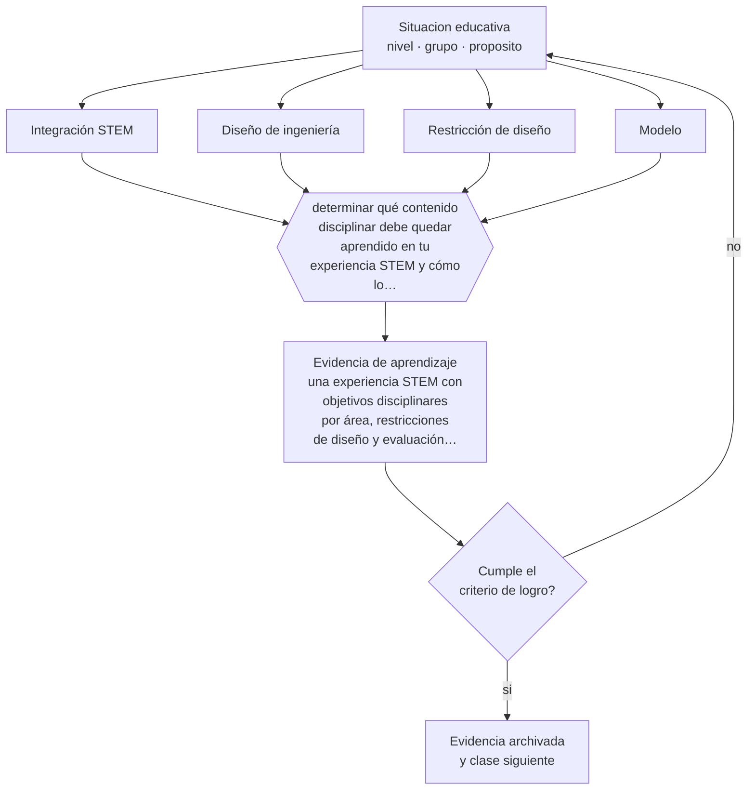

# Clase 068 — STEM y STEAM

> **Parte 05 · Educación media y adolescencia** — clase 8 de 12

**Estado de evidencia:** `EMERGENTE` · **Etapa:** 🔵 Etapa B — Enseñanza por ciclo vital · **Población de referencia:** 1.º a 4.º medio (14 a 18 años) 
**Decisión que habilita:** determinar qué contenido disciplinar debe quedar aprendido en tu experiencia STEM y cómo lo comprobarás 
**Evidencia de aprendizaje:** una experiencia STEM con objetivos disciplinares por área, restricciones de diseño y evaluación del aprendizaje

## 🎯 Propósito

Diseñar experiencias STEM con contenido disciplinar verificable, distinguiendo la integración que exige el problema de la que solo suma asignaturas alrededor de una actividad manual.

## 📚 Resultados de aprendizaje

Al finalizar esta clase podrás:

1. **Definir** con precisión los cuatro conceptos centrales de la clase y reconocerlos en una situación educativa real, no solo en su enunciado.
2. **Explicar** qué aporta realmente integrar ciencias, tecnología, ingeniería y matemática, y qué se pierde al hacerlo mal.
3. **Decidir** —qué contenido disciplinar debe quedar aprendido en tu experiencia STEM y cómo lo comprobarás— y sostener la decisión con un fundamento escrito.
4. **Producir** la evidencia de la clase —una experiencia STEM con objetivos disciplinares por área, restricciones de diseño y evaluación del aprendizaje— y contrastarla contra el criterio de logro.
5. **Distinguir** lo que la evidencia sostiene de lo que es práctica instalada, preferencia personal o costumbre de la institución.

## 🧩 Conceptos centrales

| Concepto | Comprensión verificable |
|---|---|
| **Integración STEM** | articulación de disciplinas en torno a un problema que exige genuinamente a todas |
| **Diseño de ingeniería** | ciclo de definir, idear, prototipar, probar y mejorar bajo restricciones |
| **Restricción de diseño** | límite explícito —material, tiempo, costo— que obliga a decidir con criterio |
| **Modelo** | representación simplificada que permite predecir el comportamiento de un sistema |

## 🗺️ Flujo de razonamiento

## 📖 Desarrollo

### 1. El fondo del asunto

El ciclo de diseño de ingeniería aporta algo valioso a la enseñanza científica: obliga a decidir bajo restricciones y a probar contra la realidad. El riesgo es conocido: actividades de construcción entretenidas donde no se aprende contenido de ninguna de las disciplinas involucradas. La diferencia está en si el problema exige el contenido y si el aprendizaje se evalúa por disciplina.

### 2. Cómo se traduce en decisiones de enseñanza

El diseño parte de un contenido disciplinar concreto y busca un problema que lo requiera, no al revés. Las restricciones explícitas son lo que produce razonamiento: sin límite de materiales, de tiempo o de costo, no hay decisiones que justificar. Y el prototipo debe probarse contra un criterio medible, porque de esa medición sale el aprendizaje.

### 3. Qué sostiene la evidencia y qué no

La evidencia sobre efectos de la integración STEM es emergente y heterogénea: la mayoría de los estudios son pequeños y con medidas de resultado variables. La incorporación de las artes en el acrónimo STEAM tiene una base empírica aún más débil. Conviene usar el enfoque por sus méritos de diseño y no por promesas de efecto que todavía no están respaldadas.

> **Cómo leer el estado de evidencia `EMERGENTE`.** El cuerpo de estudios es reciente, escaso o poco replicado. Úsala como hipótesis de trabajo con seguimiento explícito, nunca como argumento de autoridad ni como base para una política de establecimiento.

## 🧪 Taller guiado

Aplica la clase a **uno** de los contextos siguientes y repite después el ejercicio en un
contexto de exigencia distinta. Cambiar de contexto es parte del aprendizaje: lo que funciona
con un grupo no se traslada intacto a otro.

| Contexto | Rasgo que cambia la decisión |
|---|---|
| 1.º y 2.º medio | transición desde la básica y reacomodo de grupos |
| 3.º y 4.º medio | presión de egreso, admisión y decisión vocacional |
| Curso con desenganche marcado | el contenido no compite con el problema de sentido |
| Liceo técnico-profesional | la utilidad visible del contenido cambia la motivación |
| Jornada vespertina o reingreso | estudiantes que trabajan y tienen trayectorias interrumpidas |
| Contexto de alta conflictividad | la seguridad y la convivencia condicionan la enseñanza |

**Secuencia de trabajo:**

1. Delimita el contexto: nivel, edad, tamaño del grupo, asignatura o experiencia y tiempo real disponible.
2. Declara qué saben ya los estudiantes y **cómo lo comprobaste**, no cómo lo supones.
3. Formula la decisión pedagógica que esta clase habilita y escribe su fundamento.
4. Anticipa qué observarías si la decisión funciona y qué observarías si no funciona.
5. Diseña de antemano la alternativa que aplicarás si la primera estrategia falla.
6. Ejecuta o simula, y registra lo observado con fecha, contexto y evidencia concreta.
7. Produce la evidencia de aprendizaje de la clase.
8. Contrástala contra el criterio de logro, corrige y recién entonces avanza.

### 📦 Evidencia de aprendizaje

Una experiencia STEM con objetivos disciplinares por área, restricciones de diseño y evaluación del aprendizaje.

Debe incluir contexto, decisión, fundamento, fuentes consultadas con su fecha, indicador de
logro observable, riesgos previstos y qué harías distinto en la siguiente iteración.

## 🏆 Reto verificable

Diseña una experiencia STEM y evalúa el contenido disciplinar con un instrumento individual. Analiza si el aprendizaje justificó el tiempo invertido.

## ✅ Criterio de logro

- [ ] cada disciplina involucrada tiene objetivo y evaluación identificables;
- [ ] existen restricciones explícitas y un criterio medible de prueba del prototipo;
- [ ] cada afirmación sobre «lo que funciona» está atribuida a una fuente identificable, con autor y fecha;
- [ ] la decisión es ejecutable con el tiempo, el espacio, el número de estudiantes y los recursos que realmente tienes;
- [ ] la evidencia queda archivada de forma reproducible: otra persona podría revisarla sin que tú se la expliques.

## ⚠️ Errores frecuentes

**Propios de esta clase:**

- Diseñar la actividad primero y buscar después qué contenido disciplinar cubre.
- Evaluar el prototipo construido sin comprobar el aprendizaje del contenido.

**Característicos de la parte 05:**

- Interpretar como indisciplina lo que es un desajuste entre etapa y ambiente.
- Confundir autoridad con imposición y perder legitimidad en el primer conflicto.

## ♿ Diversidad, accesibilidad y ética

Las actividades de construcción pueden reproducir estereotipos de género y de destreza si los roles se distribuyen espontáneamente. Asignar y rotar roles de forma explícita cambia quién manipula, quién decide y quién solo documenta.

Antes de aplicar cualquier decisión de esta clase con estudiantes reales, revisa el
[protocolo de práctica responsable](../../../docs/ETICA_Y_PRACTICA_RESPONSABLE.md):
consentimiento, resguardo de datos personales, proporcionalidad de la intervención y derecho
de cada estudiante a no ser objeto de un ensayo que no le reporta beneficio.

## ❓ Preguntas de comprobación

1. ¿Qué contenido no se puede aprender sin esta experiencia?
2. ¿Qué restricción obliga a tus estudiantes a decidir con criterio?
3. ¿Cómo compruebas que aprendieron y no solo que construyeron?

## 📕 Lecturas base

**National Academy of Engineering & NRC (2014). *STEM Integration in K-12 Education*.**  
*Qué aporta a esta clase:* revisión rigurosa sobre qué se sabe y qué falta por establecer en integración STEM.

**Cunningham, C. (2018). *Engineering in Elementary STEM Education*.**  
*Qué aporta a esta clase:* modelo de ciclo de diseño con evidencia de implementación escolar.

Catálogo completo: [bibliografía del programa](../../../docs/BIBLIOGRAFIA.md) ·
[glosario](../../../docs/GLOSARIO.md) ·
[fuentes oficiales y cómo leerlas](../../../docs/FUENTES.md).

## 🔗 Conexión con el resto del programa

Se apoya en las clases 051 y 052 y comparte los riesgos de diseño de las clases 060 y 065.

> [!IMPORTANT]
> Material de formación profesional. No reemplaza un título de pedagogía, una habilitación
> legal para ejercer, ni el juicio de un equipo educativo que conoce a sus estudiantes.

---

| Anterior | Índice | Siguiente |
|---|---|---|
| [← 067 · Debate y argumentación](../class-07-debate-y-argumentacion/README.md) | [Parte 05](../README.md) · [Programa](../../../README.md) | [069 · Orientación vocacional →](../class-09-orientacion-vocacional/README.md) |
