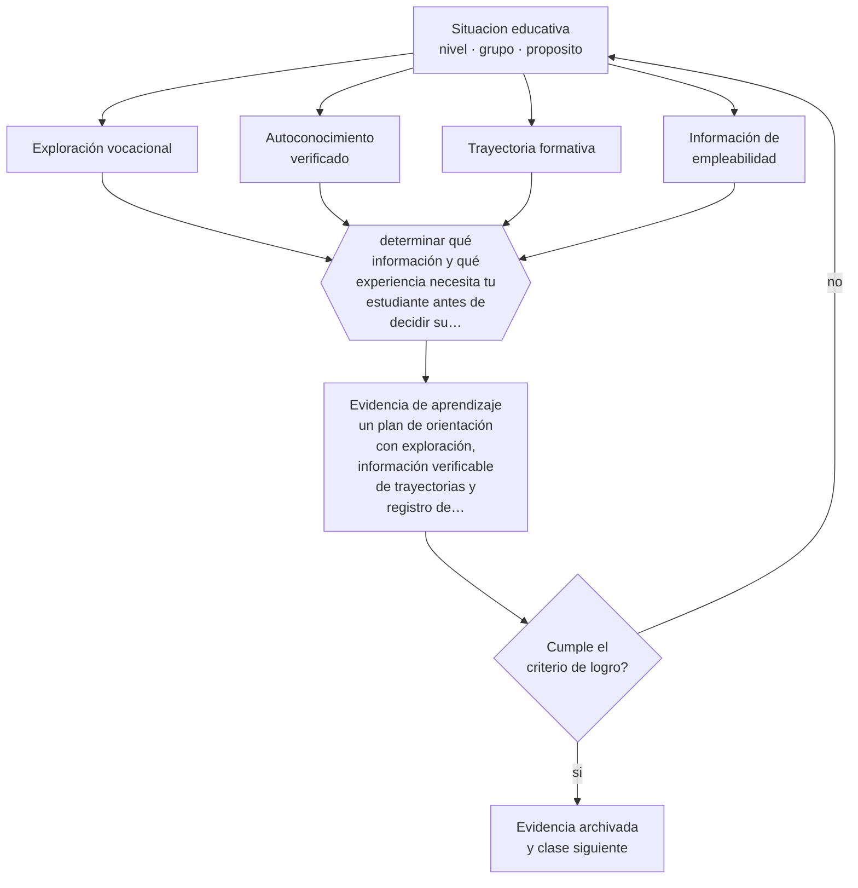

# Clase 069 — Orientación vocacional

> **Parte 05 · Educación media y adolescencia** — clase 9 de 12

**Estado de evidencia:** `CONSISTENTE` · **Etapa:** 🔵 Etapa B — Enseñanza por ciclo vital · **Población de referencia:** 1.º a 4.º medio (14 a 18 años) 
**Decisión que habilita:** determinar qué información y qué experiencia necesita tu estudiante antes de decidir su trayectoria 
**Evidencia de aprendizaje:** un plan de orientación con exploración, información verificable de trayectorias y registro de decisiones del estudiante

## 🎯 Propósito

Conducir orientación vocacional basada en exploración informada, autoconocimiento verificado con desempeño y comprensión realista de trayectorias formativas y laborales.

## 📚 Resultados de aprendizaje

Al finalizar esta clase podrás:

1. **Definir** con precisión los cuatro conceptos centrales de la clase y reconocerlos en una situación educativa real, no solo en su enunciado.
2. **Explicar** cómo acompañar una decisión vocacional sin reducirla a un test ni a la lista de carreras mejor pagadas.
3. **Decidir** —qué información y qué experiencia necesita tu estudiante antes de decidir su trayectoria— y sostener la decisión con un fundamento escrito.
4. **Producir** la evidencia de la clase —un plan de orientación con exploración, información verificable de trayectorias y registro de decisiones del estudiante— y contrastarla contra el criterio de logro.
5. **Distinguir** lo que la evidencia sostiene de lo que es práctica instalada, preferencia personal o costumbre de la institución.

## 🧩 Conceptos centrales

| Concepto | Comprensión verificable |
|---|---|
| **Exploración vocacional** | proceso activo de conocer opciones formativas y laborales con información real |
| **Autoconocimiento verificado** | imagen de las propias capacidades contrastada con desempeño y no solo con preferencia |
| **Trayectoria formativa** | recorrido posible entre niveles y programas, incluidas las vías no universitarias |
| **Información de empleabilidad** | datos sobre ingresos, empleo y continuidad de estudios de programas específicos |

## 🗺️ Flujo de razonamiento

## 📖 Desarrollo

### 1. El fondo del asunto

La orientación eficaz combina tres elementos: exploración real de opciones, autoconocimiento contrastado con desempeño e información verificable sobre trayectorias. Los tests de intereses aportan un punto de partida para conversar y poco más: su valor predictivo sobre satisfacción y permanencia es limitado. Lo que sí muestra efecto es la información concreta sobre programas —duración, costo, titulación efectiva, empleabilidad— presentada de forma comprensible.

### 2. Cómo se traduce en decisiones de enseñanza

El trabajo consiste en desmontar supuestos: qué implica realmente estudiar esa carrera, cuántos terminan, qué se hace en ese trabajo cotidianamente, qué vías alternativas existen. En Chile, hay información pública sobre programas, titulación e ingresos que rara vez llega a los estudiantes que más la necesitan. Ponerla sobre la mesa es una intervención de equidad.

### 3. Qué sostiene la evidencia y qué no

La decisión vocacional está condicionada por factores que la orientación no controla: recursos familiares, información del entorno, expectativas sociales y oferta local. Y la evidencia sobre programas de orientación es heterogénea. Prometer que un buen proceso garantiza una buena decisión excede lo que se puede sostener.

> **Cómo leer el estado de evidencia `CONSISTENTE`.** La evidencia es amplia y coherente, pero proviene sobre todo de estudios correlacionales, de síntesis con heterogeneidad alta o de contextos distintos al tuyo. Sirve para orientar la decisión y exige que compruebes el efecto en tu propio grupo.

## 🧪 Taller guiado

Aplica la clase a **uno** de los contextos siguientes y repite después el ejercicio en un
contexto de exigencia distinta. Cambiar de contexto es parte del aprendizaje: lo que funciona
con un grupo no se traslada intacto a otro.

| Contexto | Rasgo que cambia la decisión |
|---|---|
| 1.º y 2.º medio | transición desde la básica y reacomodo de grupos |
| 3.º y 4.º medio | presión de egreso, admisión y decisión vocacional |
| Curso con desenganche marcado | el contenido no compite con el problema de sentido |
| Liceo técnico-profesional | la utilidad visible del contenido cambia la motivación |
| Jornada vespertina o reingreso | estudiantes que trabajan y tienen trayectorias interrumpidas |
| Contexto de alta conflictividad | la seguridad y la convivencia condicionan la enseñanza |

**Secuencia de trabajo:**

1. Delimita el contexto: nivel, edad, tamaño del grupo, asignatura o experiencia y tiempo real disponible.
2. Declara qué saben ya los estudiantes y **cómo lo comprobaste**, no cómo lo supones.
3. Formula la decisión pedagógica que esta clase habilita y escribe su fundamento.
4. Anticipa qué observarías si la decisión funciona y qué observarías si no funciona.
5. Diseña de antemano la alternativa que aplicarás si la primera estrategia falla.
6. Ejecuta o simula, y registra lo observado con fecha, contexto y evidencia concreta.
7. Produce la evidencia de aprendizaje de la clase.
8. Contrástala contra el criterio de logro, corrige y recién entonces avanza.

### 📦 Evidencia de aprendizaje

Un plan de orientación con exploración, información verificable de trayectorias y registro de decisiones del estudiante.

Debe incluir contexto, decisión, fundamento, fuentes consultadas con su fecha, indicador de
logro observable, riesgos previstos y qué harías distinto en la siguiente iteración.

## 🏆 Reto verificable

Trabaja con un grupo la información pública de tres programas que les interesen. Registra qué supuestos cambiaron al ver los datos reales.

## ✅ Criterio de logro

- [ ] el plan incluye información verificable de programas y no solo exploración de intereses;
- [ ] el estudiante registra sus decisiones y los criterios que usó para tomarlas;
- [ ] cada afirmación sobre «lo que funciona» está atribuida a una fuente identificable, con autor y fecha;
- [ ] la decisión es ejecutable con el tiempo, el espacio, el número de estudiantes y los recursos que realmente tienes;
- [ ] la evidencia queda archivada de forma reproducible: otra persona podría revisarla sin que tú se la expliques.

## ⚠️ Errores frecuentes

**Propios de esta clase:**

- Reducir la orientación a la aplicación de un test de intereses.
- Presentar solo la vía universitaria e ignorar trayectorias técnicas y laborales.

**Característicos de la parte 05:**

- Interpretar como indisciplina lo que es un desajuste entre etapa y ambiente.
- Confundir autoridad con imposición y perder legitimidad en el primer conflicto.

## ♿ Diversidad, accesibilidad y ética

Los estudiantes de familias sin experiencia en educación superior toman decisiones con información sistemáticamente peor. Compensar esa asimetría con información concreta y con contacto real con instituciones y trabajos es una de las intervenciones más equitativas disponibles.

Antes de aplicar cualquier decisión de esta clase con estudiantes reales, revisa el
[protocolo de práctica responsable](../../../docs/ETICA_Y_PRACTICA_RESPONSABLE.md):
consentimiento, resguardo de datos personales, proporcionalidad de la intervención y derecho
de cada estudiante a no ser objeto de un ensayo que no le reporta beneficio.

## ❓ Preguntas de comprobación

1. ¿Qué sabe realmente tu estudiante sobre lo que hace a diario alguien de esa profesión?
2. ¿Qué información pública sobre ese programa no ha visto nunca?
3. ¿Qué alternativa no universitaria ni siquiera consideró y por qué?

## 📕 Lecturas base

**OCDE (2021). *Career Readiness in the Pandemic* y estudios sobre orientación temprana.**  
*Qué aporta a esta clase:* identifica qué actividades de orientación se asocian con mejores resultados laborales posteriores.

**Mineduc / Subsecretaría de Educación Superior. *Sistemas públicos de información sobre programas y empleabilidad*.**  
*Qué aporta a esta clase:* fuente verificable para trabajar con datos reales de trayectorias en Chile.

Catálogo completo: [bibliografía del programa](../../../docs/BIBLIOGRAFIA.md) ·
[glosario](../../../docs/GLOSARIO.md) ·
[fuentes oficiales y cómo leerlas](../../../docs/FUENTES.md).

## 🔗 Conexión con el resto del programa

Se apoya en la clase 062 y conecta con la parte 06, donde las trayectorias técnico-profesionales se examinan en detalle.

> [!IMPORTANT]
> Material de formación profesional. No reemplaza un título de pedagogía, una habilitación
> legal para ejercer, ni el juicio de un equipo educativo que conoce a sus estudiantes.

---

| Anterior | Índice | Siguiente |
|---|---|---|
| [← 068 · STEM y STEAM](../class-08-stem-y-steam/README.md) | [Parte 05](../README.md) · [Programa](../../../README.md) | [070 · Ciudadanía digital →](../class-10-ciudadania-digital/README.md) |
