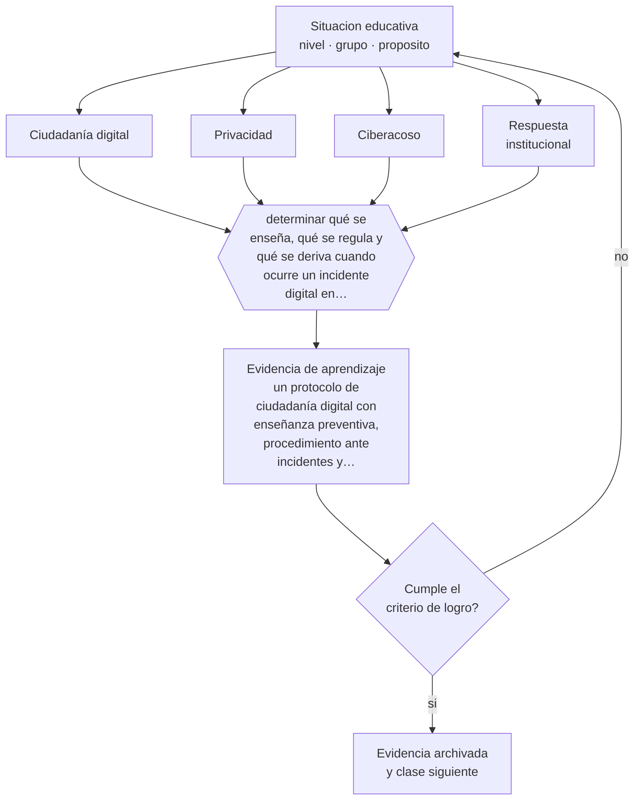

# Clase 070 — Ciudadanía digital

> **Parte 05 · Educación media y adolescencia** — clase 10 de 12

**Estado de evidencia:** `EMERGENTE` · **Etapa:** 🔵 Etapa B — Enseñanza por ciclo vital · **Población de referencia:** 1.º a 4.º medio (14 a 18 años) 
**Decisión que habilita:** determinar qué se enseña, qué se regula y qué se deriva cuando ocurre un incidente digital en tu comunidad 
**Evidencia de aprendizaje:** un protocolo de ciudadanía digital con enseñanza preventiva, procedimiento ante incidentes y criterios de derivación

## 🎯 Propósito

Trabajar ciudadanía digital como formación en criterio y responsabilidad: reputación, privacidad, convivencia en línea, verificación de información y respuesta institucional ante incidentes.

## 📚 Resultados de aprendizaje

Al finalizar esta clase podrás:

1. **Definir** con precisión los cuatro conceptos centrales de la clase y reconocerlos en una situación educativa real, no solo en su enunciado.
2. **Explicar** qué puede hacer la escuela frente a los conflictos digitales que ocurren fuera de su horario y dentro de su comunidad.
3. **Decidir** —qué se enseña, qué se regula y qué se deriva cuando ocurre un incidente digital en tu comunidad— y sostener la decisión con un fundamento escrito.
4. **Producir** la evidencia de la clase —un protocolo de ciudadanía digital con enseñanza preventiva, procedimiento ante incidentes y criterios de derivación— y contrastarla contra el criterio de logro.
5. **Distinguir** lo que la evidencia sostiene de lo que es práctica instalada, preferencia personal o costumbre de la institución.

## 🧩 Conceptos centrales

| Concepto | Comprensión verificable |
|---|---|
| **Ciudadanía digital** | ejercicio responsable de derechos y deberes en entornos digitales |
| **Privacidad** | control sobre la información personal propia y ajena; se enseña con casos concretos |
| **Ciberacoso** | agresión sostenida mediante medios digitales; tiene tratamiento normativo específico |
| **Respuesta institucional** | conjunto de acciones que el establecimiento debe ejecutar ante un incidente digital |

## 🗺️ Flujo de razonamiento

## 📖 Desarrollo

### 1. El fondo del asunto

Los conflictos digitales entre estudiantes ocurren mayormente fuera del horario escolar y estallan dentro de la escuela. La respuesta más común —prohibir dispositivos— administra el síntoma y no enseña criterio. Un enfoque completo combina enseñanza preventiva con casos reales, reglas claras sobre uso en el establecimiento, y un procedimiento de respuesta ante incidentes que distinga conflicto, falta y posible delito.

### 2. Cómo se traduce en decisiones de enseñanza

La enseñanza preventiva rinde cuando trabaja con situaciones concretas del entorno de los estudiantes y no con advertencias generales. El protocolo institucional debe estar escrito antes del primer incidente: quién recibe la denuncia, qué se resguarda como evidencia, a quién se informa, en qué plazo y cuándo corresponde denunciar a la autoridad. Improvisar en el momento produce daños adicionales.

### 3. Qué sostiene la evidencia y qué no

La evidencia sobre programas de prevención del ciberacoso muestra efectos modestos y muy dependientes de la implementación. Y el campo cambia con la tecnología más rápido de lo que se producen estudios. Además, la respuesta institucional está regulada y sus obligaciones cambian: hay que verificar la norma vigente antes de actuar.

> **Cómo leer el estado de evidencia `EMERGENTE`.** El cuerpo de estudios es reciente, escaso o poco replicado. Úsala como hipótesis de trabajo con seguimiento explícito, nunca como argumento de autoridad ni como base para una política de establecimiento.

## 🧪 Taller guiado

Aplica la clase a **uno** de los contextos siguientes y repite después el ejercicio en un
contexto de exigencia distinta. Cambiar de contexto es parte del aprendizaje: lo que funciona
con un grupo no se traslada intacto a otro.

| Contexto | Rasgo que cambia la decisión |
|---|---|
| 1.º y 2.º medio | transición desde la básica y reacomodo de grupos |
| 3.º y 4.º medio | presión de egreso, admisión y decisión vocacional |
| Curso con desenganche marcado | el contenido no compite con el problema de sentido |
| Liceo técnico-profesional | la utilidad visible del contenido cambia la motivación |
| Jornada vespertina o reingreso | estudiantes que trabajan y tienen trayectorias interrumpidas |
| Contexto de alta conflictividad | la seguridad y la convivencia condicionan la enseñanza |

**Secuencia de trabajo:**

1. Delimita el contexto: nivel, edad, tamaño del grupo, asignatura o experiencia y tiempo real disponible.
2. Declara qué saben ya los estudiantes y **cómo lo comprobaste**, no cómo lo supones.
3. Formula la decisión pedagógica que esta clase habilita y escribe su fundamento.
4. Anticipa qué observarías si la decisión funciona y qué observarías si no funciona.
5. Diseña de antemano la alternativa que aplicarás si la primera estrategia falla.
6. Ejecuta o simula, y registra lo observado con fecha, contexto y evidencia concreta.
7. Produce la evidencia de aprendizaje de la clase.
8. Contrástala contra el criterio de logro, corrige y recién entonces avanza.

### 📦 Evidencia de aprendizaje

Un protocolo de ciudadanía digital con enseñanza preventiva, procedimiento ante incidentes y criterios de derivación.

Debe incluir contexto, decisión, fundamento, fuentes consultadas con su fecha, indicador de
logro observable, riesgos previstos y qué harías distinto en la siguiente iteración.

## 🏆 Reto verificable

Revisa el protocolo digital de tu establecimiento y simula un incidente real. Identifica dónde se detiene el procedimiento y propón la corrección.

## ✅ Criterio de logro

- [ ] el protocolo distingue conflicto, falta reglamentaria y posible delito, con la respuesta de cada uno;
- [ ] la enseñanza preventiva usa casos del entorno real de los estudiantes;
- [ ] cada afirmación sobre «lo que funciona» está atribuida a una fuente identificable, con autor y fecha;
- [ ] la decisión es ejecutable con el tiempo, el espacio, el número de estudiantes y los recursos que realmente tienes;
- [ ] la evidencia queda archivada de forma reproducible: otra persona podría revisarla sin que tú se la expliques.

## ⚠️ Errores frecuentes

**Propios de esta clase:**

- Responder a los conflictos digitales solo con prohibición de dispositivos.
- Actuar ante un incidente sin protocolo previo y sin resguardar evidencia.

**Característicos de la parte 05:**

- Interpretar como indisciplina lo que es un desajuste entre etapa y ambiente.
- Confundir autoridad con imposición y perder legitimidad en el primer conflicto.

## ♿ Diversidad, accesibilidad y ética

Los incidentes digitales afectan de forma desproporcionada a estudiantes con identidades minorizadas y a quienes ya sufren exclusión presencial. Un protocolo que no considera esa asimetría termina tratando como conflicto entre pares lo que es hostigamiento sistemático.

Antes de aplicar cualquier decisión de esta clase con estudiantes reales, revisa el
[protocolo de práctica responsable](../../../docs/ETICA_Y_PRACTICA_RESPONSABLE.md):
consentimiento, resguardo de datos personales, proporcionalidad de la intervención y derecho
de cada estudiante a no ser objeto de un ensayo que no le reporta beneficio.

## ❓ Preguntas de comprobación

1. ¿Qué hace tu establecimiento en las primeras 24 horas de un incidente digital?
2. ¿Qué evidencia se resguarda y quién la custodia?
3. ¿Qué enseñas sobre privacidad que tus estudiantes puedan aplicar mañana?

## 📕 Lecturas base

**UNESCO. *Orientaciones sobre ciudadanía digital y prevención del ciberacoso*.**  
*Qué aporta a esta clase:* marco internacional con recomendaciones y evidencia disponible.

**Superintendencia de Educación (Chile). *Orientaciones sobre convivencia digital y protocolos*.**  
*Qué aporta a esta clase:* define obligaciones y procedimientos exigibles al establecimiento.

Catálogo completo: [bibliografía del programa](../../../docs/BIBLIOGRAFIA.md) ·
[glosario](../../../docs/GLOSARIO.md) ·
[fuentes oficiales y cómo leerlas](../../../docs/FUENTES.md).

## 🔗 Conexión con el resto del programa

Anticipa la parte 13 y se conecta con la parte 12, donde el conflicto digital se trata como parte de la convivencia escolar.

> [!IMPORTANT]
> Material de formación profesional. No reemplaza un título de pedagogía, una habilitación
> legal para ejercer, ni el juicio de un equipo educativo que conoce a sus estudiantes.

---

| Anterior | Índice | Siguiente |
|---|---|---|
| [← 069 · Orientación vocacional](../class-09-orientacion-vocacional/README.md) | [Parte 05](../README.md) · [Programa](../../../README.md) | [071 · Evaluación auténtica →](../class-11-evaluacion-autentica/README.md) |
