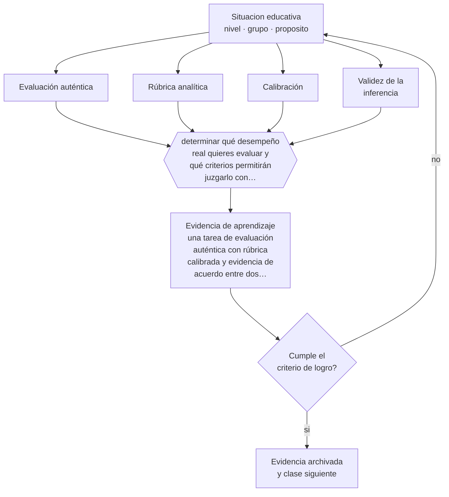

# Clase 071 — Evaluación auténtica

> **Parte 05 · Educación media y adolescencia** — clase 11 de 12

**Estado de evidencia:** `CONSISTENTE` · **Etapa:** 🔵 Etapa B — Enseñanza por ciclo vital · **Población de referencia:** 1.º a 4.º medio (14 a 18 años) 
**Decisión que habilita:** determinar qué desempeño real quieres evaluar y qué criterios permitirán juzgarlo con consistencia 
**Evidencia de aprendizaje:** una tarea de evaluación auténtica con rúbrica calibrada y evidencia de acuerdo entre dos evaluadores

## 🎯 Propósito

Diseñar evaluación auténtica —tareas que se parecen a los desempeños reales del dominio— manteniendo criterios explícitos, calibración entre evaluadores y validez de la inferencia.

## 📚 Resultados de aprendizaje

Al finalizar esta clase podrás:

1. **Definir** con precisión los cuatro conceptos centrales de la clase y reconocerlos en una situación educativa real, no solo en su enunciado.
2. **Explicar** cómo evaluar desempeños complejos sin perder la posibilidad de defender la calificación.
3. **Decidir** —qué desempeño real quieres evaluar y qué criterios permitirán juzgarlo con consistencia— y sostener la decisión con un fundamento escrito.
4. **Producir** la evidencia de la clase —una tarea de evaluación auténtica con rúbrica calibrada y evidencia de acuerdo entre dos evaluadores— y contrastarla contra el criterio de logro.
5. **Distinguir** lo que la evidencia sostiene de lo que es práctica instalada, preferencia personal o costumbre de la institución.

## 🧩 Conceptos centrales

| Concepto | Comprensión verificable |
|---|---|
| **Evaluación auténtica** | tarea que replica desempeños valorados fuera de la escuela y exige integrar conocimientos |
| **Rúbrica analítica** | instrumento que descompone el desempeño en criterios y niveles observables |
| **Calibración** | proceso de acordar la aplicación de la rúbrica entre evaluadores hasta lograr consistencia |
| **Validez de la inferencia** | justificación de que la tarea permite concluir lo que se afirma sobre el estudiante |

## 🗺️ Flujo de razonamiento

## 📖 Desarrollo

### 1. El fondo del asunto

La evaluación auténtica gana en relevancia y arriesga en consistencia: cuanto más compleja la tarea, más depende el juicio del evaluador. Ese riesgo no es argumento para volver a las pruebas de respuesta única, sino para invertir en criterios explícitos y en calibración. Dos evaluadores que aplican la misma rúbrica y llegan a puntajes muy distintos indican que el instrumento todavía no sirve para calificar.

### 2. Cómo se traduce en decisiones de enseñanza

El procedimiento incluye construir la rúbrica antes de la tarea, compartirla con los estudiantes, calibrar con dos o tres trabajos reales junto a otro docente y ajustar la redacción de los criterios que produjeron desacuerdo. También conviene decidir de antemano qué se evalúa individualmente cuando la tarea es grupal, porque de lo contrario la calificación mide colaboración y no aprendizaje.

### 3. Qué sostiene la evidencia y qué no

La autenticidad no garantiza validez: una tarea realista puede depender de recursos del hogar, de habilidades de presentación o de tiempo disponible fuera de clase, y entonces mide otra cosa. Y las rúbricas mal construidas —con niveles definidos por adverbios de frecuencia— dan apariencia de objetividad sin aportar consistencia real.

> **Cómo leer el estado de evidencia `CONSISTENTE`.** La evidencia es amplia y coherente, pero proviene sobre todo de estudios correlacionales, de síntesis con heterogeneidad alta o de contextos distintos al tuyo. Sirve para orientar la decisión y exige que compruebes el efecto en tu propio grupo.

## 🧪 Taller guiado

Aplica la clase a **uno** de los contextos siguientes y repite después el ejercicio en un
contexto de exigencia distinta. Cambiar de contexto es parte del aprendizaje: lo que funciona
con un grupo no se traslada intacto a otro.

| Contexto | Rasgo que cambia la decisión |
|---|---|
| 1.º y 2.º medio | transición desde la básica y reacomodo de grupos |
| 3.º y 4.º medio | presión de egreso, admisión y decisión vocacional |
| Curso con desenganche marcado | el contenido no compite con el problema de sentido |
| Liceo técnico-profesional | la utilidad visible del contenido cambia la motivación |
| Jornada vespertina o reingreso | estudiantes que trabajan y tienen trayectorias interrumpidas |
| Contexto de alta conflictividad | la seguridad y la convivencia condicionan la enseñanza |

**Secuencia de trabajo:**

1. Delimita el contexto: nivel, edad, tamaño del grupo, asignatura o experiencia y tiempo real disponible.
2. Declara qué saben ya los estudiantes y **cómo lo comprobaste**, no cómo lo supones.
3. Formula la decisión pedagógica que esta clase habilita y escribe su fundamento.
4. Anticipa qué observarías si la decisión funciona y qué observarías si no funciona.
5. Diseña de antemano la alternativa que aplicarás si la primera estrategia falla.
6. Ejecuta o simula, y registra lo observado con fecha, contexto y evidencia concreta.
7. Produce la evidencia de aprendizaje de la clase.
8. Contrástala contra el criterio de logro, corrige y recién entonces avanza.

### 📦 Evidencia de aprendizaje

Una tarea de evaluación auténtica con rúbrica calibrada y evidencia de acuerdo entre dos evaluadores.

Debe incluir contexto, decisión, fundamento, fuentes consultadas con su fecha, indicador de
logro observable, riesgos previstos y qué harías distinto en la siguiente iteración.

## 🏆 Reto verificable

Califica con un colega los mismos cinco trabajos usando tu rúbrica. Analiza los desacuerdos y reescribe los criterios que los produjeron.

## ✅ Criterio de logro

- [ ] la rúbrica describe desempeños observables por nivel y se entregó antes de la tarea;
- [ ] existe evidencia de calibración entre al menos dos evaluadores;
- [ ] cada afirmación sobre «lo que funciona» está atribuida a una fuente identificable, con autor y fecha;
- [ ] la decisión es ejecutable con el tiempo, el espacio, el número de estudiantes y los recursos que realmente tienes;
- [ ] la evidencia queda archivada de forma reproducible: otra persona podría revisarla sin que tú se la expliques.

## ⚠️ Errores frecuentes

**Propios de esta clase:**

- Construir la rúbrica después de recibir los trabajos.
- Definir niveles de desempeño con adverbios vagos en vez de conductas observables.

**Característicos de la parte 05:**

- Interpretar como indisciplina lo que es un desajuste entre etapa y ambiente.
- Confundir autoridad con imposición y perder legitimidad en el primer conflicto.

## ♿ Diversidad, accesibilidad y ética

Las tareas auténticas pueden penalizar a quienes tienen menos recursos, menos tiempo o dificultades de presentación oral. Ofrecer formatos alternativos de entrega que evalúen el mismo criterio mantiene la exigencia y elimina la barrera.

Antes de aplicar cualquier decisión de esta clase con estudiantes reales, revisa el
[protocolo de práctica responsable](../../../docs/ETICA_Y_PRACTICA_RESPONSABLE.md):
consentimiento, resguardo de datos personales, proporcionalidad de la intervención y derecho
de cada estudiante a no ser objeto de un ensayo que no le reporta beneficio.

## ❓ Preguntas de comprobación

1. ¿Qué desempeño real del dominio replica tu tarea?
2. ¿Qué parte de la nota depende de recursos que no todos tienen?
3. ¿Qué tan distinto calificaría esta tarea otro docente de tu departamento?

## 📕 Lecturas base

**Wiggins, G. (1998). *Educative Assessment*.**  
*Qué aporta a esta clase:* define evaluación auténtica con criterios exigibles y no como sinónimo de creatividad.

**Jonsson, A. & Svingby, G. (2007). *The Use of Scoring Rubrics: Reliability, Validity and Educational Consequences*.**  
*Qué aporta a esta clase:* evidencia sobre cuándo las rúbricas mejoran la consistencia y cuándo no.

Catálogo completo: [bibliografía del programa](../../../docs/BIBLIOGRAFIA.md) ·
[glosario](../../../docs/GLOSARIO.md) ·
[fuentes oficiales y cómo leerlas](../../../docs/FUENTES.md).

## 🔗 Conexión con el resto del programa

Es la puerta de entrada a la parte 11 y sostiene la evaluación de las clases 065, 066 y 068.

> [!IMPORTANT]
> Material de formación profesional. No reemplaza un título de pedagogía, una habilitación
> legal para ejercer, ni el juicio de un equipo educativo que conoce a sus estudiantes.

---

| Anterior | Índice | Siguiente |
|---|---|---|
| [← 070 · Ciudadanía digital](../class-10-ciudadania-digital/README.md) | [Parte 05](../README.md) · [Programa](../../../README.md) | [072 · Proyecto integrador: desafío de educación media →](../class-12-proyecto-integrador-desafio-de-educacion-media/README.md) |
