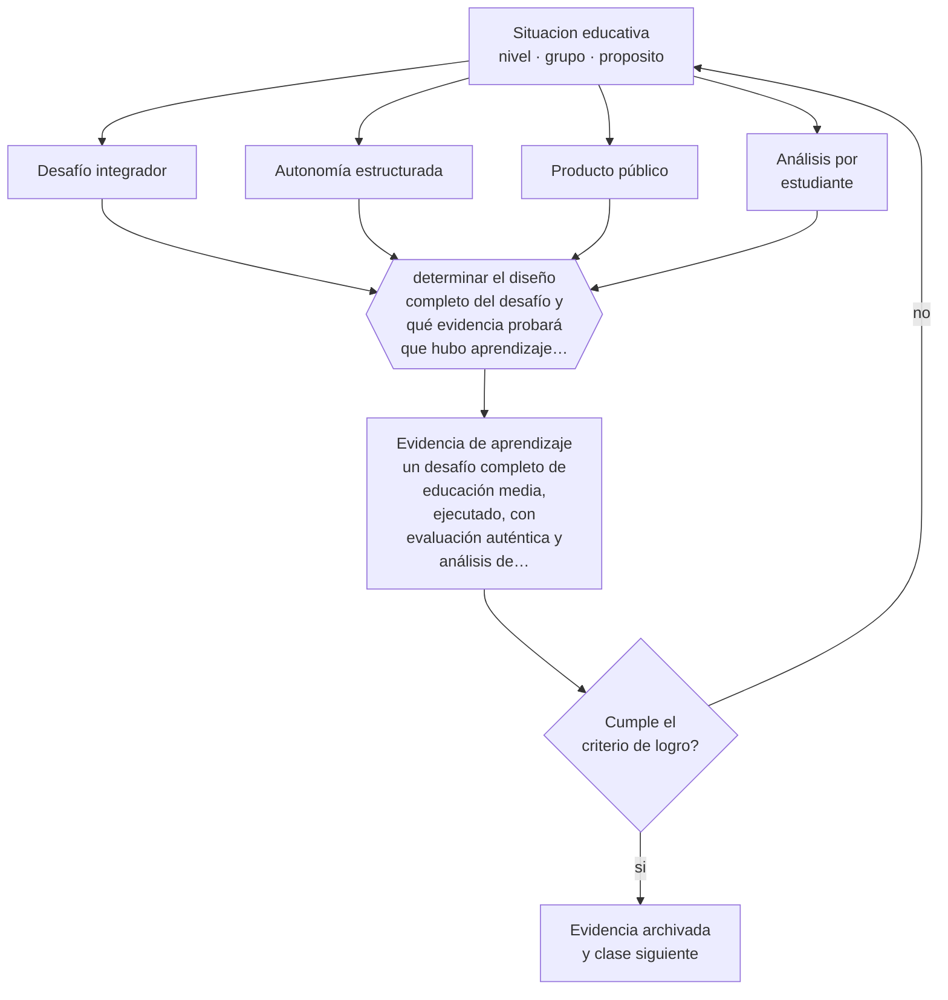

# Clase 072 — Proyecto integrador: desafío de educación media

> **Parte 05 · Educación media y adolescencia** — clase 12 de 12

**Estado de evidencia:** `CONSISTENTE` · **Etapa:** 🔵 Etapa B — Enseñanza por ciclo vital · **Población de referencia:** 1.º a 4.º medio (14 a 18 años) 
**Decisión que habilita:** determinar el diseño completo del desafío y qué evidencia probará que hubo aprendizaje disciplinar 
**Evidencia de aprendizaje:** un desafío completo de educación media, ejecutado, con evaluación auténtica y análisis de resultados por estudiante

## 🎯 Propósito

Integrar la parte diseñando, ejecutando y evaluando un desafío de educación media que combine contenido disciplinar exigente, autonomía real y evaluación auténtica.

## 📚 Resultados de aprendizaje

Al finalizar esta clase podrás:

1. **Definir** con precisión los cuatro conceptos centrales de la clase y reconocerlos en una situación educativa real, no solo en su enunciado.
2. **Explicar** cómo se sostiene un desafío largo con adolescentes sin perder ni el contenido ni la relación.
3. **Decidir** —el diseño completo del desafío y qué evidencia probará que hubo aprendizaje disciplinar— y sostener la decisión con un fundamento escrito.
4. **Producir** la evidencia de la clase —un desafío completo de educación media, ejecutado, con evaluación auténtica y análisis de resultados por estudiante— y contrastarla contra el criterio de logro.
5. **Distinguir** lo que la evidencia sostiene de lo que es práctica instalada, preferencia personal o costumbre de la institución.

## 🧩 Conceptos centrales

| Concepto | Comprensión verificable |
|---|---|
| **Desafío integrador** | tarea extensa que exige contenido disciplinar, autonomía y producto público |
| **Autonomía estructurada** | libertad de decisión dentro de límites explícitos que sostienen el aprendizaje |
| **Producto público** | entrega que se presenta ante una audiencia real, lo que eleva la exigencia percibida |
| **Análisis por estudiante** | revisión individual de resultados que impide que el promedio del grupo oculte a quien no aprendió |

## 🗺️ Flujo de razonamiento

## 📖 Desarrollo

### 1. El fondo del asunto

El proyecto integrador de la parte exige sostener a la vez lo que las clases anteriores trataron por separado: relación, autonomía, estructura, contenido y evaluación defendible. La dificultad práctica es que las tensiones aparecen juntas: dar autonomía y mantener el contenido, permitir trabajo grupal y evaluar individualmente, hacer público el producto y proteger a quienes se exponen.

### 2. Cómo se traduce en decisiones de enseñanza

El diseño se prueba en tres puntos: la existencia de hitos que permiten corregir a tiempo, la evaluación individual del contenido, y el análisis final estudiante por estudiante. Ese análisis suele revelar que el desafío funcionó muy bien para un tercio del curso y no llegó a otro tercio, información que ninguna calificación promedio entrega.

### 3. Qué sostiene la evidencia y qué no

Un desafío ejecutado una vez no prueba la eficacia del método: hay efecto de novedad, esfuerzo extra del docente y selección del grupo. Lo que sí produce es evidencia sobre tu propio diseño y sobre qué estudiantes quedaron fuera, que es información suficiente para mejorar la próxima versión.

> **Cómo leer el estado de evidencia `CONSISTENTE`.** La evidencia es amplia y coherente, pero proviene sobre todo de estudios correlacionales, de síntesis con heterogeneidad alta o de contextos distintos al tuyo. Sirve para orientar la decisión y exige que compruebes el efecto en tu propio grupo.

## 🧪 Taller guiado

Aplica la clase a **uno** de los contextos siguientes y repite después el ejercicio en un
contexto de exigencia distinta. Cambiar de contexto es parte del aprendizaje: lo que funciona
con un grupo no se traslada intacto a otro.

| Contexto | Rasgo que cambia la decisión |
|---|---|
| 1.º y 2.º medio | transición desde la básica y reacomodo de grupos |
| 3.º y 4.º medio | presión de egreso, admisión y decisión vocacional |
| Curso con desenganche marcado | el contenido no compite con el problema de sentido |
| Liceo técnico-profesional | la utilidad visible del contenido cambia la motivación |
| Jornada vespertina o reingreso | estudiantes que trabajan y tienen trayectorias interrumpidas |
| Contexto de alta conflictividad | la seguridad y la convivencia condicionan la enseñanza |

**Secuencia de trabajo:**

1. Delimita el contexto: nivel, edad, tamaño del grupo, asignatura o experiencia y tiempo real disponible.
2. Declara qué saben ya los estudiantes y **cómo lo comprobaste**, no cómo lo supones.
3. Formula la decisión pedagógica que esta clase habilita y escribe su fundamento.
4. Anticipa qué observarías si la decisión funciona y qué observarías si no funciona.
5. Diseña de antemano la alternativa que aplicarás si la primera estrategia falla.
6. Ejecuta o simula, y registra lo observado con fecha, contexto y evidencia concreta.
7. Produce la evidencia de aprendizaje de la clase.
8. Contrástala contra el criterio de logro, corrige y recién entonces avanza.

### 📦 Evidencia de aprendizaje

Un desafío completo de educación media, ejecutado, con evaluación auténtica y análisis de resultados por estudiante.

Debe incluir contexto, decisión, fundamento, fuentes consultadas con su fecha, indicador de
logro observable, riesgos previstos y qué harías distinto en la siguiente iteración.

## 🏆 Reto verificable

Ejecuta el desafío y analiza los resultados estudiante por estudiante. Escribe qué habría necesitado quien menos aprendió para lograrlo.

## ✅ Criterio de logro

- [ ] existe evaluación individual del contenido además de la del producto;
- [ ] el análisis final identifica quiénes no lograron el aprendizaje y por qué;
- [ ] cada afirmación sobre «lo que funciona» está atribuida a una fuente identificable, con autor y fecha;
- [ ] la decisión es ejecutable con el tiempo, el espacio, el número de estudiantes y los recursos que realmente tienes;
- [ ] la evidencia queda archivada de forma reproducible: otra persona podría revisarla sin que tú se la expliques.

## ⚠️ Errores frecuentes

**Propios de esta clase:**

- Concluir que el desafío funcionó a partir de los productos más visibles del curso.
- Evaluar solo el producto grupal y no el aprendizaje individual.

**Característicos de la parte 05:**

- Interpretar como indisciplina lo que es un desajuste entre etapa y ambiente.
- Confundir autoridad con imposición y perder legitimidad en el primer conflicto.

## ♿ Diversidad, accesibilidad y ética

El análisis por estudiante es la herramienta de inclusión de esta clase: obliga a mirar a quienes el entusiasmo colectivo deja invisibles. Sin él, un desafío exitoso puede consolidar la brecha que dice combatir.

Antes de aplicar cualquier decisión de esta clase con estudiantes reales, revisa el
[protocolo de práctica responsable](../../../docs/ETICA_Y_PRACTICA_RESPONSABLE.md):
consentimiento, resguardo de datos personales, proporcionalidad de la intervención y derecho
de cada estudiante a no ser objeto de un ensayo que no le reporta beneficio.

## ❓ Preguntas de comprobación

1. ¿Qué estudiante quedó fuera de tu desafío y en qué momento?
2. ¿Qué contenido disciplinar quedó efectivamente aprendido, con qué evidencia?
3. ¿Qué cambiarías en la segunda versión y por qué?

## 📕 Lecturas base

**Barron, B. & Darling-Hammond, L. (2008). *Teaching for Meaningful Learning*.**  
*Qué aporta a esta clase:* condiciones de diseño de experiencias extensas con evidencia de aprendizaje.

**Wiggins, G. (1998). *Educative Assessment*.**  
*Qué aporta a esta clase:* criterios de evaluación auténtica aplicables al producto y al proceso del desafío.

Catálogo completo: [bibliografía del programa](../../../docs/BIBLIOGRAFIA.md) ·
[glosario](../../../docs/GLOSARIO.md) ·
[fuentes oficiales y cómo leerlas](../../../docs/FUENTES.md).

## 🔗 Conexión con el resto del programa

Cierra la parte 05 integrando sus once clases previas y conecta con la parte 06 y con la parte 11.

> [!IMPORTANT]
> Material de formación profesional. No reemplaza un título de pedagogía, una habilitación
> legal para ejercer, ni el juicio de un equipo educativo que conoce a sus estudiantes.

---

| Anterior | Índice | Siguiente |
|---|---|---|
| [← 071 · Evaluación auténtica](../class-11-evaluacion-autentica/README.md) | [Parte 05](../README.md) · [Programa](../../../README.md) | [Programa completo →](../../../README.md) |
