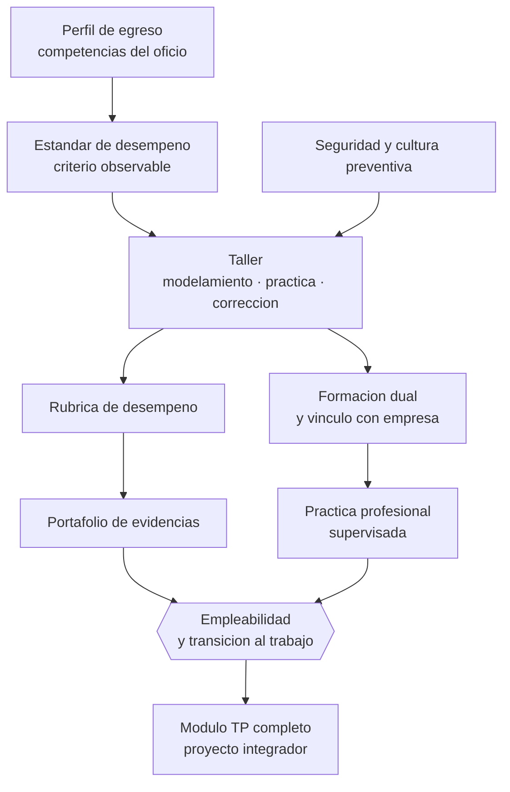

# Parte 06 — Educación técnico-profesional

> *Aquí el aprendizaje se demuestra haciendo, y la seguridad no es un módulo aparte*

🔵 **Etapa B — Enseñanza por ciclo vital** · salida de la etapa: enseñar a una población concreta con decisiones ajustadas a su desarrollo

**Clases:** 12 (073–084) · **Población de referencia:** formación técnica de nivel medio y superior, y capacitación de oficio · **Conceptos operacionales:** 48 · **Señales observables:** 36 
**Contenido central:** Formación por competencias, aprendizaje situado, talleres, seguridad, rúbricas de desempeño, portafolio, formación dual, vínculo con empresa, práctica profesional, competencias transversales y empleabilidad

## 🎯 De qué trata esta parte

La formación técnico-profesional tiene una ventaja que el resto del sistema envidia: el criterio de logro es observable. Una soldadura resiste o no resiste; una toma de muestra cumple protocolo o lo incumple. Esa ventaja se pierde cuando la evaluación se traslada a pruebas de papel sobre el oficio en vez de a desempeños del oficio. La primera decisión de esta parte es no perderla.

El marco de competencias organiza el trabajo, pero exige precisión. Una competencia no es un contenido con verbo delante: es la capacidad de movilizar conocimiento, procedimiento y criterio en una situación real, con un estándar de desempeño explícito. Escribirla bien es difícil, y la mayoría de los perfiles de egreso mal formulados provienen de saltarse ese trabajo. Aquí se entrena esa escritura con el instrumento que la comprueba: la rúbrica de desempeño.

El tercer eje es la relación con el mundo del trabajo, que en Chile está regulada y tiene formatos definidos —formación dual, prácticas profesionales, convenios con empresas— con obligaciones sobre supervisión y seguridad. La cultura preventiva no es un anexo: en un taller, la decisión pedagógica y la decisión de seguridad son la misma decisión, y un docente que las separa está formando un profesional que también las separará.

## 🏫 Caso de la parte

Las doce clases trabajan sobre la misma realidad, para que puedas ver cómo cambia tu diagnóstico
a medida que avanzas:

> En la especialidad de administración, los estudiantes aprueban las pruebas escritas del módulo y fallan en la práctica profesional: no saben conciliar una cuenta ni explicar un error a un cliente. Dos empresas devolvieron practicantes.

**Artefacto que produces al terminar:** módulo técnico-profesional completo con competencias evaluables, seguridad integrada, rúbricas calibradas y portafolio de evidencias.

## 📚 Resultados de la parte

Al terminar esta parte podrás:

1. **Redactar competencias y estándares de desempeño verificables en una tarea real del oficio**.
2. **Diseñar un taller con progresión de dominio, seguridad integrada y evaluación de desempeño**.
3. **Construir un portafolio de evidencias que soporte una certificación defendible**.
4. **Articular la formación con empresa y práctica profesional respetando el marco vigente**.

## 🗺️ Mapa de la parte

## 🧠 Marco de referencia

- formación basada en competencias y estándares de desempeño observables
- aprendizaje situado y participación periférica legítima en comunidades de práctica
- marco de cualificaciones técnico-profesional y formación dual en Chile
- prevención de riesgos y responsabilidad del establecimiento en talleres y prácticas

**Autoras y autores que conviene conocer:** Jean Lave y Etienne Wenger, Donald Schön, David Boud, Ruth Stringher y equipos de UNESCO-UNEVOC, especialistas del marco de cualificaciones TP de Chile

## 📋 Las 12 clases

| # | Clase | Decisión que habilita | Evidencia |
|---:|---|---|---|
| 073 | [Formación por competencias](class-01-formacion-por-competencias/README.md) | determinar el estándar de desempeño que hará observable la competencia que declaraste | `MARCO-NORMATIVO` |
| 074 | [Aprendizaje situado](class-02-aprendizaje-situado/README.md) | determinar qué nivel de participación real puede asumir tu estudiante ahora y cuál será el siguiente | `CONSISTENTE` |
| 075 | [Talleres y laboratorios](class-03-talleres-y-laboratorios/README.md) | determinar la estructura de tu sesión de taller para maximizar la práctica efectiva de cada estudiante | `CONSISTENTE` |
| 076 | [Seguridad y cultura preventiva](class-04-seguridad-y-cultura-preventiva/README.md) | determinar cómo la seguridad quedará incorporada al criterio de evaluación de cada desempeño y no como contenido aparte | `MARCO-NORMATIVO` |
| 077 | [Rúbricas de desempeño](class-05-rubricas-de-desempeno/README.md) | determinar los descriptores de cada nivel de desempeño para que la evaluación no dependa del evaluador | `CONSISTENTE` |
| 078 | [Portafolio de evidencias](class-06-portafolio-de-evidencias/README.md) | determinar qué evidencias son suficientes para afirmar que una competencia está lograda | `PRACTICA-PROFESIONAL` |
| 079 | [Aprendizaje dual](class-07-aprendizaje-dual/README.md) | determinar qué aprendizajes corresponden a la empresa, cuáles al establecimiento y cómo se articulan | `CONSISTENTE` |
| 080 | [Vínculo educación-empresa](class-08-vinculo-educacion-empresa/README.md) | determinar qué acuerdos concretos sostienen una relación útil con una empresa y qué se ofrece a cambio | `PRACTICA-PROFESIONAL` |
| 081 | [Práctica profesional](class-09-practica-profesional/README.md) | determinar qué objetivos de aprendizaje debe cumplir la práctica y cómo se supervisarán efectivamente | `MARCO-NORMATIVO` |
| 082 | [Competencias transversales](class-10-competencias-transversales/README.md) | determinar qué competencia transversal vas a enseñar de forma explícita y con qué desempeño la evaluarás | `EN-DEBATE` |
| 083 | [Empleabilidad y transición al trabajo](class-11-empleabilidad-y-transicion-al-trabajo/README.md) | determinar qué acompañamiento a la transición ofrece tu programa y cómo medirá su efecto | `CONSISTENTE` |
| 084 | [Proyecto integrador: módulo TP](class-12-proyecto-integrador-modulo-tp/README.md) | determinar el diseño completo del módulo y justificar la coherencia entre competencia, enseñanza y evaluación | `MARCO-NORMATIVO` |

## ⚠️ Riesgos característicos

- Evaluar el oficio con pruebas escritas en vez de desempeños observables.
- Redactar competencias que no se pueden observar ni graduar.
- Tratar la seguridad como contenido aparte y no como criterio de todo desempeño.
- Enviar a práctica profesional sin supervisión ni criterios de evaluación acordados.

## 📕 Lecturas de referencia de la parte

- **Lave, J. & Wenger, E. (1991). *Situated Learning: Legitimate Peripheral Participation*.** — explica por qué el taller enseña más que el contenido del taller: se aprende a ser parte de una comunidad de oficio.
- **Schön, D. (1983). *The Reflective Practitioner*.** — fundamenta la reflexión en la acción, que es el mecanismo real de aprendizaje en formación práctica.
- **Mineduc. *Bases Curriculares de la Formación Diferenciada Técnico-Profesional* y Marco de Cualificaciones TP (edición vigente).** — define especialidades, perfiles de egreso y estándares vigentes en Chile.
- **UNESCO-UNEVOC. *Informes sobre educación y formación técnica y profesional* (edición vigente).** — comparación internacional de modelos duales y de transición al empleo.

## ✅ Evidencia mínima para dar la parte por cerrada

- [ ] un perfil de competencias con estándares de desempeño y evidencias asociadas;
- [ ] una rúbrica de taller aplicada a desempeños reales o simulados;
- [ ] un portafolio de evidencias con trazabilidad y criterios de suficiencia;
- [ ] un plan de práctica profesional con supervisión, seguridad y evaluación.

## 🧭 Práctica y evaluación de la parte

- [Rúbrica maestra e instrumentos de autoevaluación](../../assessments/README.md)
- [Casos profesionales para resolver con este marco](../../cases/README.md)
- [Laboratorios de decisión](../../labs/README.md)
- [Dónde se archiva la evidencia](../../evidence/README.md)

---

| Anterior | Índice | Siguiente |
|---|---|---|
| [← Parte 05 · Educación media y adolescencia](../part-05-educacion-media-y-adolescencia/README.md) | [Programa](../../README.md) · [Currículo](../../CURRICULUM.md) | [Parte 07 · Educación de adultos y andragogía →](../part-07-educacion-de-adultos-y-andragogia/README.md) |
