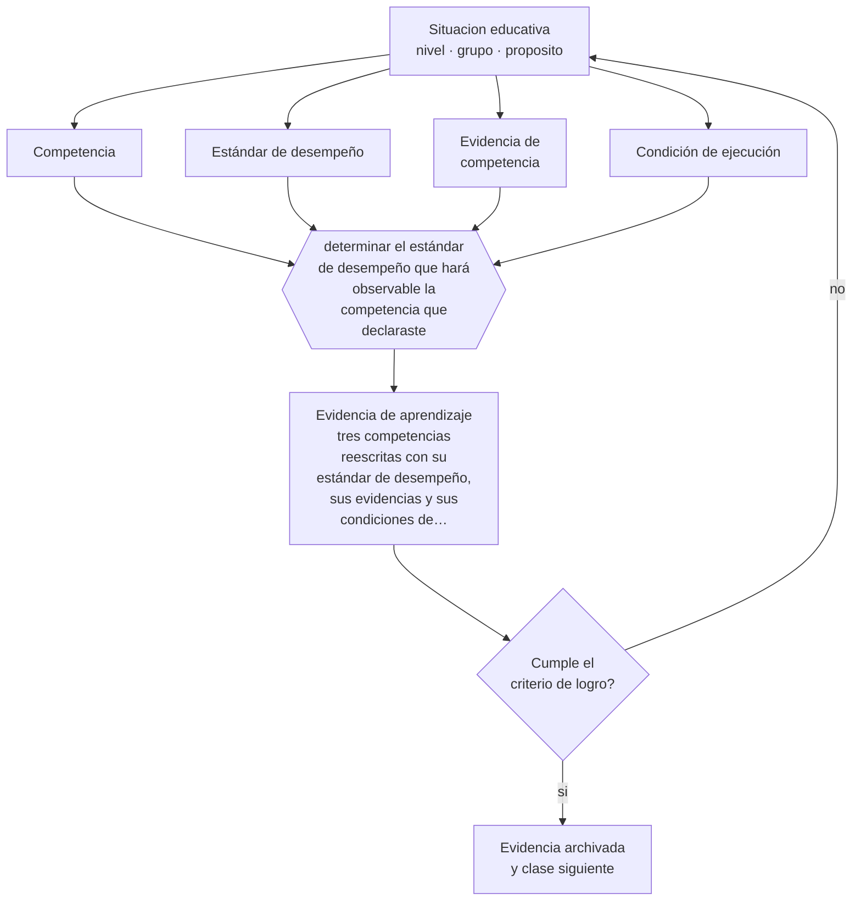

# Clase 073 — Formación por competencias

> **Parte 06 · Educación técnico-profesional** — clase 1 de 12

**Estado de evidencia:** `MARCO-NORMATIVO` · **Etapa:** 🔵 Etapa B — Enseñanza por ciclo vital · **Población de referencia:** formación técnica de nivel medio y superior, y capacitación de oficio 
**Decisión que habilita:** determinar el estándar de desempeño que hará observable la competencia que declaraste 
**Evidencia de aprendizaje:** tres competencias reescritas con su estándar de desempeño, sus evidencias y sus condiciones de ejecución

## 🎯 Propósito

Redactar competencias y estándares de desempeño que se puedan observar, graduar y evaluar, distinguiéndolos de contenidos con un verbo antepuesto.

## 📚 Resultados de aprendizaje

Al finalizar esta clase podrás:

1. **Definir** con precisión los cuatro conceptos centrales de la clase y reconocerlos en una situación educativa real, no solo en su enunciado.
2. **Explicar** por qué la mayoría de los perfiles de egreso por competencias no se pueden evaluar tal como están escritos.
3. **Decidir** —el estándar de desempeño que hará observable la competencia que declaraste— y sostener la decisión con un fundamento escrito.
4. **Producir** la evidencia de la clase —tres competencias reescritas con su estándar de desempeño, sus evidencias y sus condiciones de ejecución— y contrastarla contra el criterio de logro.
5. **Distinguir** lo que la evidencia sostiene de lo que es práctica instalada, preferencia personal o costumbre de la institución.

## 🧩 Conceptos centrales

| Concepto | Comprensión verificable |
|---|---|
| **Competencia** | capacidad de movilizar conocimientos, procedimientos y criterios en una situación real del oficio |
| **Estándar de desempeño** | descripción del nivel exigido: qué hace, con qué calidad y en qué condiciones |
| **Evidencia de competencia** | producto, desempeño o registro que permite afirmar que la competencia se posee |
| **Condición de ejecución** | contexto, materiales, tiempo y restricciones en que se demuestra el desempeño |

## 🗺️ Flujo de razonamiento

## 📖 Desarrollo

### 1. El fondo del asunto

Una competencia mal escrita hace imposible evaluar y vuelve arbitraria la certificación. «Conocer los sistemas eléctricos» no es una competencia: no dice qué hace la persona, con qué calidad ni en qué condiciones. «Diagnosticar una falla en un circuito residencial, con instrumento, en menos de treinta minutos y sin interrumpir el suministro de otros circuitos» sí lo es, porque describe desempeño, calidad y condiciones.

### 2. Cómo se traduce en decisiones de enseñanza

El procedimiento consiste en partir de la tarea real del oficio, describir qué hace un trabajador competente, definir el nivel exigido y declarar en qué condiciones se demuestra. En Chile, el Marco de Cualificaciones Técnico-Profesional y los perfiles de egreso de las especialidades entregan la referencia; el trabajo local es traducirlos a estándares evaluables en el taller.

### 3. Qué sostiene la evidencia y qué no

El enfoque de competencias tiene críticas legítimas: puede fragmentar el conocimiento en listas de tareas y perder la comprensión que las sostiene, y su lenguaje puede volverse burocrático. Un buen perfil conserva los fundamentos disciplinares que explican por qué se hace así, y no solo la lista de desempeños observables.

> **Cómo leer el estado de evidencia `MARCO-NORMATIVO`.** El contenido no se decide por evidencia empírica sino por norma, política pública o marco institucional vigente. Verifica siempre la versión vigente a la fecha en que vas a aplicarlo: la norma cambia y la clase no se actualiza sola.

## 🧪 Taller guiado

Aplica la clase a **uno** de los contextos siguientes y repite después el ejercicio en un
contexto de exigencia distinta. Cambiar de contexto es parte del aprendizaje: lo que funciona
con un grupo no se traslada intacto a otro.

| Contexto | Rasgo que cambia la decisión |
|---|---|
| Taller de especialidad industrial | riesgo físico alto: la seguridad domina la secuencia |
| Especialidad de servicios o administración | el desempeño se observa en interacción y en producto documental |
| Especialidad de salud o alimentos | protocolo y trazabilidad son parte del estándar |
| Formación dual con empresa | el estándar se negocia con un tercero |
| Capacitación laboral de corta duración | tiempo mínimo y foco en una tarea crítica |
| Reconocimiento de aprendizajes previos | hay que evaluar competencias adquiridas fuera del aula |

**Secuencia de trabajo:**

1. Delimita el contexto: nivel, edad, tamaño del grupo, asignatura o experiencia y tiempo real disponible.
2. Declara qué saben ya los estudiantes y **cómo lo comprobaste**, no cómo lo supones.
3. Formula la decisión pedagógica que esta clase habilita y escribe su fundamento.
4. Anticipa qué observarías si la decisión funciona y qué observarías si no funciona.
5. Diseña de antemano la alternativa que aplicarás si la primera estrategia falla.
6. Ejecuta o simula, y registra lo observado con fecha, contexto y evidencia concreta.
7. Produce la evidencia de aprendizaje de la clase.
8. Contrástala contra el criterio de logro, corrige y recién entonces avanza.

### 📦 Evidencia de aprendizaje

Tres competencias reescritas con su estándar de desempeño, sus evidencias y sus condiciones de ejecución.

Debe incluir contexto, decisión, fundamento, fuentes consultadas con su fecha, indicador de
logro observable, riesgos previstos y qué harías distinto en la siguiente iteración.

## 🏆 Reto verificable

Toma tres competencias del perfil de tu especialidad y reescríbelas con estándar y condiciones. Contrástalas con un docente de taller y ajusta lo que él no podría evaluar.

## ✅ Criterio de logro

- [ ] cada competencia declara desempeño, calidad exigida y condiciones de ejecución;
- [ ] las evidencias asociadas son observables en una tarea real o simulada del oficio;
- [ ] cada afirmación sobre «lo que funciona» está atribuida a una fuente identificable, con autor y fecha;
- [ ] la decisión es ejecutable con el tiempo, el espacio, el número de estudiantes y los recursos que realmente tienes;
- [ ] la evidencia queda archivada de forma reproducible: otra persona podría revisarla sin que tú se la expliques.

## ⚠️ Errores frecuentes

**Propios de esta clase:**

- Redactar competencias con verbos no observables y evaluarlas con pruebas escritas.
- Fragmentar el oficio en tareas aisladas y perder los fundamentos que las explican.

**Característicos de la parte 06:**

- Evaluar el oficio con pruebas escritas en vez de desempeños observables.
- Redactar competencias que no se pueden observar ni graduar.

## ♿ Diversidad, accesibilidad y ética

Los estándares deben distinguir la competencia del oficio de las condiciones accesorias de su demostración. Un estudiante con discapacidad puede demostrar la misma competencia con apoyos o adaptaciones sin que el estándar baje, siempre que la seguridad y el resultado se mantengan.

Antes de aplicar cualquier decisión de esta clase con estudiantes reales, revisa el
[protocolo de práctica responsable](../../../docs/ETICA_Y_PRACTICA_RESPONSABLE.md):
consentimiento, resguardo de datos personales, proporcionalidad de la intervención y derecho
de cada estudiante a no ser objeto de un ensayo que no le reporta beneficio.

## ❓ Preguntas de comprobación

1. ¿Qué hace exactamente una persona competente en esta tarea, y con qué calidad?
2. ¿Podrías evaluar tu competencia sin pedir un texto escrito?
3. ¿Qué fundamento se pierde si solo evalúas la ejecución?

## 📕 Lecturas base

**Mineduc. *Marco de Cualificaciones Técnico-Profesional* y perfiles de egreso vigentes.**  
*Qué aporta a esta clase:* referencia oficial chilena para niveles, competencias y estándares por especialidad.

**Wesselink, R. et al. *Competence-Based Education: Principles and Critiques*.**  
*Qué aporta a esta clase:* sistematiza el enfoque y sus objeciones; útil para no adoptarlo de forma acrítica.

Catálogo completo: [bibliografía del programa](../../../docs/BIBLIOGRAFIA.md) ·
[glosario](../../../docs/GLOSARIO.md) ·
[fuentes oficiales y cómo leerlas](../../../docs/FUENTES.md).

## 🔗 Conexión con el resto del programa

Abre la parte 06 y sostiene las clases 077 y 078. Se apoya en la parte 09 para la lógica de resultados de aprendizaje.

> [!IMPORTANT]
> Material de formación profesional. No reemplaza un título de pedagogía, una habilitación
> legal para ejercer, ni el juicio de un equipo educativo que conoce a sus estudiantes.

---

| Anterior | Índice | Siguiente |
|---|---|---|
| [← Parte 06](../README.md) | [Parte 06](../README.md) · [Programa](../../../README.md) | [074 · Aprendizaje situado →](../class-02-aprendizaje-situado/README.md) |
