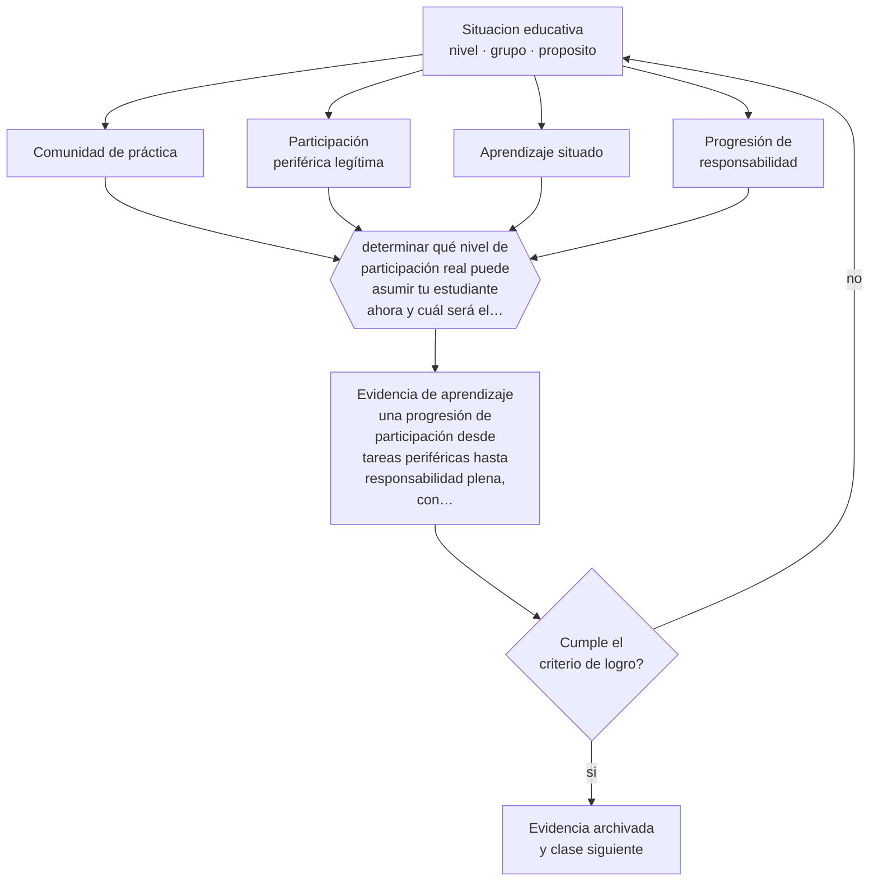

# Clase 074 — Aprendizaje situado

> **Parte 06 · Educación técnico-profesional** — clase 2 de 12

**Estado de evidencia:** `CONSISTENTE` · **Etapa:** 🔵 Etapa B — Enseñanza por ciclo vital · **Población de referencia:** formación técnica de nivel medio y superior, y capacitación de oficio 
**Decisión que habilita:** determinar qué nivel de participación real puede asumir tu estudiante ahora y cuál será el siguiente 
**Evidencia de aprendizaje:** una progresión de participación desde tareas periféricas hasta responsabilidad plena, con criterios de avance

## 🎯 Propósito

Diseñar aprendizaje situado: participación progresiva en tareas reales de la comunidad de práctica, con responsabilidad creciente y acompañamiento experto.

## 📚 Resultados de aprendizaje

Al finalizar esta clase podrás:

1. **Definir** con precisión los cuatro conceptos centrales de la clase y reconocerlos en una situación educativa real, no solo en su enunciado.
2. **Explicar** por qué se aprende el oficio participando en él y no escuchando sobre él.
3. **Decidir** —qué nivel de participación real puede asumir tu estudiante ahora y cuál será el siguiente— y sostener la decisión con un fundamento escrito.
4. **Producir** la evidencia de la clase —una progresión de participación desde tareas periféricas hasta responsabilidad plena, con criterios de avance— y contrastarla contra el criterio de logro.
5. **Distinguir** lo que la evidencia sostiene de lo que es práctica instalada, preferencia personal o costumbre de la institución.

## 🧩 Conceptos centrales

| Concepto | Comprensión verificable |
|---|---|
| **Comunidad de práctica** | grupo que comparte un oficio, sus estándares y sus formas de hacer las cosas |
| **Participación periférica legítima** | involucramiento real pero acotado del aprendiz en el trabajo de la comunidad |
| **Aprendizaje situado** | adquisición de competencias en el contexto real donde se usan |
| **Progresión de responsabilidad** | aumento gradual de la exigencia y de la autonomía en la tarea |

## 🗺️ Flujo de razonamiento

## 📖 Desarrollo

### 1. El fondo del asunto

En un oficio no se aprende primero la teoría y luego la práctica: se aprende participando desde el inicio en tareas reales, aunque acotadas, con acompañamiento. Esa participación enseña el procedimiento y algo más difícil de transmitir: los estándares implícitos de calidad, el lenguaje del oficio y las decisiones que un experto toma sin verbalizarlas. Por eso el taller y la empresa enseñan cosas que ninguna clase puede sustituir.

### 2. Cómo se traduce en decisiones de enseñanza

La progresión se diseña explícitamente: qué tarea puede asumir un estudiante en su primera semana, qué se le agrega después, con qué criterio se decide que está listo. Sin esa progresión escrita, la práctica se convierte en observación pasiva o en asignación de tareas irrelevantes, que son las dos formas más comunes de desperdiciar una plaza de práctica.

### 3. Qué sostiene la evidencia y qué no

El aprendizaje situado es un marco descriptivo potente y no un método con protocolo probado; su evidencia proviene sobre todo de estudios etnográficos. Además, la participación real solo enseña si hay acompañamiento experto: sin él, el aprendiz consolida los errores del entorno y aprende las malas prácticas junto con las buenas.

> **Cómo leer el estado de evidencia `CONSISTENTE`.** La evidencia es amplia y coherente, pero proviene sobre todo de estudios correlacionales, de síntesis con heterogeneidad alta o de contextos distintos al tuyo. Sirve para orientar la decisión y exige que compruebes el efecto en tu propio grupo.

## 🧪 Taller guiado

Aplica la clase a **uno** de los contextos siguientes y repite después el ejercicio en un
contexto de exigencia distinta. Cambiar de contexto es parte del aprendizaje: lo que funciona
con un grupo no se traslada intacto a otro.

| Contexto | Rasgo que cambia la decisión |
|---|---|
| Taller de especialidad industrial | riesgo físico alto: la seguridad domina la secuencia |
| Especialidad de servicios o administración | el desempeño se observa en interacción y en producto documental |
| Especialidad de salud o alimentos | protocolo y trazabilidad son parte del estándar |
| Formación dual con empresa | el estándar se negocia con un tercero |
| Capacitación laboral de corta duración | tiempo mínimo y foco en una tarea crítica |
| Reconocimiento de aprendizajes previos | hay que evaluar competencias adquiridas fuera del aula |

**Secuencia de trabajo:**

1. Delimita el contexto: nivel, edad, tamaño del grupo, asignatura o experiencia y tiempo real disponible.
2. Declara qué saben ya los estudiantes y **cómo lo comprobaste**, no cómo lo supones.
3. Formula la decisión pedagógica que esta clase habilita y escribe su fundamento.
4. Anticipa qué observarías si la decisión funciona y qué observarías si no funciona.
5. Diseña de antemano la alternativa que aplicarás si la primera estrategia falla.
6. Ejecuta o simula, y registra lo observado con fecha, contexto y evidencia concreta.
7. Produce la evidencia de aprendizaje de la clase.
8. Contrástala contra el criterio de logro, corrige y recién entonces avanza.

### 📦 Evidencia de aprendizaje

Una progresión de participación desde tareas periféricas hasta responsabilidad plena, con criterios de avance.

Debe incluir contexto, decisión, fundamento, fuentes consultadas con su fecha, indicador de
logro observable, riesgos previstos y qué harías distinto en la siguiente iteración.

## 🏆 Reto verificable

Documenta durante una semana qué tareas hace realmente un estudiante en práctica. Compáralo con la progresión que diseñaste y corrige la diferencia.

## ✅ Criterio de logro

- [ ] la progresión declara tareas concretas por etapa y criterios de avance;
- [ ] cada etapa identifica quién acompaña y con qué frecuencia;
- [ ] cada afirmación sobre «lo que funciona» está atribuida a una fuente identificable, con autor y fecha;
- [ ] la decisión es ejecutable con el tiempo, el espacio, el número de estudiantes y los recursos que realmente tienes;
- [ ] la evidencia queda archivada de forma reproducible: otra persona podría revisarla sin que tú se la expliques.

## ⚠️ Errores frecuentes

**Propios de esta clase:**

- Asignar al aprendiz tareas irrelevantes y llamarlo práctica.
- Suponer que la sola exposición al entorno de trabajo produce aprendizaje sin acompañamiento.

**Característicos de la parte 06:**

- Evaluar el oficio con pruebas escritas en vez de desempeños observables.
- Redactar competencias que no se pueden observar ni graduar.

## ♿ Diversidad, accesibilidad y ética

La asignación de tareas en talleres y empresas suele reproducir sesgos de género y de origen: quién opera la máquina y quién limpia. Explicitar la progresión para todos los estudiantes impide que la desigualdad se instale como costumbre del lugar.

Antes de aplicar cualquier decisión de esta clase con estudiantes reales, revisa el
[protocolo de práctica responsable](../../../docs/ETICA_Y_PRACTICA_RESPONSABLE.md):
consentimiento, resguardo de datos personales, proporcionalidad de la intervención y derecho
de cada estudiante a no ser objeto de un ensayo que no le reporta beneficio.

## ❓ Preguntas de comprobación

1. ¿Qué tarea real puede hacer tu estudiante hoy con seguridad?
2. ¿Quién lo acompaña y cuánto tiempo efectivo le dedica?
3. ¿Qué malas prácticas del entorno podría estar aprendiendo sin que nadie lo note?

## 📕 Lecturas base

**Lave, J. & Wenger, E. (1991). *Situated Learning*.**  
*Qué aporta a esta clase:* el texto que define participación periférica legítima y explica cómo se aprende un oficio.

**Billett, S. (2001). *Learning in the Workplace*.**  
*Qué aporta a esta clase:* traduce el enfoque a decisiones de diseño de formación en el puesto de trabajo.

Catálogo completo: [bibliografía del programa](../../../docs/BIBLIOGRAFIA.md) ·
[glosario](../../../docs/GLOSARIO.md) ·
[fuentes oficiales y cómo leerlas](../../../docs/FUENTES.md).

## 🔗 Conexión con el resto del programa

Sostiene las clases 079, 080 y 081, y aplica al oficio la clase 016 sobre andamiaje.

> [!IMPORTANT]
> Material de formación profesional. No reemplaza un título de pedagogía, una habilitación
> legal para ejercer, ni el juicio de un equipo educativo que conoce a sus estudiantes.

---

| Anterior | Índice | Siguiente |
|---|---|---|
| [← 073 · Formación por competencias](../class-01-formacion-por-competencias/README.md) | [Parte 06](../README.md) · [Programa](../../../README.md) | [075 · Talleres y laboratorios →](../class-03-talleres-y-laboratorios/README.md) |
