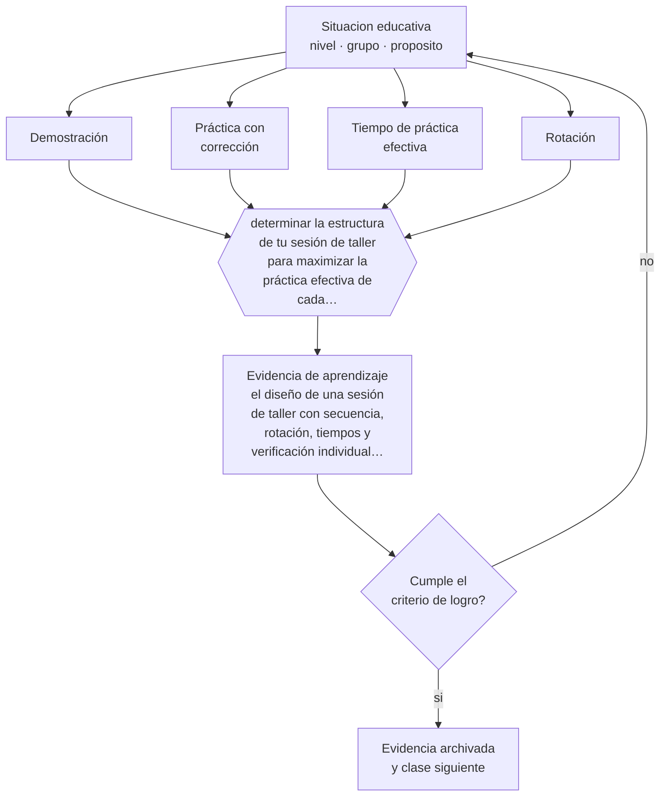

# Clase 075 — Talleres y laboratorios

> **Parte 06 · Educación técnico-profesional** — clase 3 de 12

**Estado de evidencia:** `CONSISTENTE` · **Etapa:** 🔵 Etapa B — Enseñanza por ciclo vital · **Población de referencia:** formación técnica de nivel medio y superior, y capacitación de oficio 
**Decisión que habilita:** determinar la estructura de tu sesión de taller para maximizar la práctica efectiva de cada estudiante 
**Evidencia de aprendizaje:** el diseño de una sesión de taller con secuencia, rotación, tiempos y verificación individual del desempeño

## 🎯 Propósito

Diseñar sesiones de taller y laboratorio con secuencia de dominio: demostración, práctica con corrección, práctica independiente y verificación, gestionando equipos y tiempos limitados.

## 📚 Resultados de aprendizaje

Al finalizar esta clase podrás:

1. **Definir** con precisión los cuatro conceptos centrales de la clase y reconocerlos en una situación educativa real, no solo en su enunciado.
2. **Explicar** cómo se estructura un taller para que todos practiquen, y no solo los que llegan primero a la máquina.
3. **Decidir** —la estructura de tu sesión de taller para maximizar la práctica efectiva de cada estudiante— y sostener la decisión con un fundamento escrito.
4. **Producir** la evidencia de la clase —el diseño de una sesión de taller con secuencia, rotación, tiempos y verificación individual del desempeño— y contrastarla contra el criterio de logro.
5. **Distinguir** lo que la evidencia sostiene de lo que es práctica instalada, preferencia personal o costumbre de la institución.

## 🧩 Conceptos centrales

| Concepto | Comprensión verificable |
|---|---|
| **Demostración** | ejecución modelada por el docente con explicación de los puntos críticos |
| **Práctica con corrección** | ejecución del estudiante con retroalimentación inmediata sobre el error |
| **Tiempo de práctica efectiva** | minutos reales en que cada estudiante ejecuta la tarea, no en que observa o espera |
| **Rotación** | organización que distribuye el acceso a equipos limitados sin dejar a nadie inactivo |

## 🗺️ Flujo de razonamiento

## 📖 Desarrollo

### 1. El fondo del asunto

El taller tiene una restricción estructural: equipos limitados y muchos estudiantes. Sin diseño, esa restricción produce clases donde unos pocos practican y el resto observa. La secuencia con mejor rendimiento es conocida —demostración con puntos críticos explícitos, práctica inmediata con corrección, práctica independiente y verificación individual— y su implementación depende enteramente de cómo se organiza la rotación y qué hacen los que esperan.

### 2. Cómo se traduce en decisiones de enseñanza

Diseñar la sesión implica calcular el tiempo de práctica efectiva por estudiante y organizar estaciones o tareas paralelas para que nadie espere sin hacer nada. La verificación individual al cierre es indispensable: sin ella, el estudiante que nunca ejecutó correctamente pasa inadvertido hasta la evaluación final.

### 3. Qué sostiene la evidencia y qué no

La demostración es necesaria y no suficiente: observar a un experto produce la ilusión de saber hacerlo. Esa ilusión es sistemática y explica por qué los estudiantes se sorprenden al fallar en la ejecución. La corrección inmediata durante la primera práctica es lo que evita que el error se consolide.

> **Cómo leer el estado de evidencia `CONSISTENTE`.** La evidencia es amplia y coherente, pero proviene sobre todo de estudios correlacionales, de síntesis con heterogeneidad alta o de contextos distintos al tuyo. Sirve para orientar la decisión y exige que compruebes el efecto en tu propio grupo.

## 🧪 Taller guiado

Aplica la clase a **uno** de los contextos siguientes y repite después el ejercicio en un
contexto de exigencia distinta. Cambiar de contexto es parte del aprendizaje: lo que funciona
con un grupo no se traslada intacto a otro.

| Contexto | Rasgo que cambia la decisión |
|---|---|
| Taller de especialidad industrial | riesgo físico alto: la seguridad domina la secuencia |
| Especialidad de servicios o administración | el desempeño se observa en interacción y en producto documental |
| Especialidad de salud o alimentos | protocolo y trazabilidad son parte del estándar |
| Formación dual con empresa | el estándar se negocia con un tercero |
| Capacitación laboral de corta duración | tiempo mínimo y foco en una tarea crítica |
| Reconocimiento de aprendizajes previos | hay que evaluar competencias adquiridas fuera del aula |

**Secuencia de trabajo:**

1. Delimita el contexto: nivel, edad, tamaño del grupo, asignatura o experiencia y tiempo real disponible.
2. Declara qué saben ya los estudiantes y **cómo lo comprobaste**, no cómo lo supones.
3. Formula la decisión pedagógica que esta clase habilita y escribe su fundamento.
4. Anticipa qué observarías si la decisión funciona y qué observarías si no funciona.
5. Diseña de antemano la alternativa que aplicarás si la primera estrategia falla.
6. Ejecuta o simula, y registra lo observado con fecha, contexto y evidencia concreta.
7. Produce la evidencia de aprendizaje de la clase.
8. Contrástala contra el criterio de logro, corrige y recién entonces avanza.

### 📦 Evidencia de aprendizaje

El diseño de una sesión de taller con secuencia, rotación, tiempos y verificación individual del desempeño.

Debe incluir contexto, decisión, fundamento, fuentes consultadas con su fecha, indicador de
logro observable, riesgos previstos y qué harías distinto en la siguiente iteración.

## 🏆 Reto verificable

Cronometra el tiempo de práctica de tres estudiantes distintos en una sesión. Rediseña la rotación para igualarlo y vuelve a medir.

## ✅ Criterio de logro

- [ ] el diseño declara el tiempo de práctica efectiva por estudiante y cómo se logra;
- [ ] existe verificación individual del desempeño antes de cerrar la sesión;
- [ ] cada afirmación sobre «lo que funciona» está atribuida a una fuente identificable, con autor y fecha;
- [ ] la decisión es ejecutable con el tiempo, el espacio, el número de estudiantes y los recursos que realmente tienes;
- [ ] la evidencia queda archivada de forma reproducible: otra persona podría revisarla sin que tú se la expliques.

## ⚠️ Errores frecuentes

**Propios de esta clase:**

- Diseñar la sesión sin calcular el tiempo real de práctica por estudiante.
- Dar por aprendido lo demostrado, sin verificación individual de ejecución.

**Característicos de la parte 06:**

- Evaluar el oficio con pruebas escritas en vez de desempeños observables.
- Redactar competencias que no se pueden observar ni graduar.

## ♿ Diversidad, accesibilidad y ética

El acceso desigual a los equipos suele coincidir con jerarquías informales del grupo. Una rotación explícita y registrada garantiza que la distribución de la práctica no dependa de quién se impone en el taller.

Antes de aplicar cualquier decisión de esta clase con estudiantes reales, revisa el
[protocolo de práctica responsable](../../../docs/ETICA_Y_PRACTICA_RESPONSABLE.md):
consentimiento, resguardo de datos personales, proporcionalidad de la intervención y derecho
de cada estudiante a no ser objeto de un ensayo que no le reporta beneficio.

## ❓ Preguntas de comprobación

1. ¿Cuántos minutos ejecuta realmente cada estudiante en tu taller?
2. ¿Qué hacen los que esperan turno?
3. ¿Cómo sabes que todos ejecutaron correctamente al menos una vez?

## 📕 Lecturas base

**Rosenshine, B. (2012). *Principles of Instruction*.**  
*Qué aporta a esta clase:* la secuencia de demostración, práctica guiada e independiente aplicada a cualquier destreza.

**Ericsson, K. A. & Pool, R. (2016). *Peak: Secrets from the New Science of Expertise*.**  
*Qué aporta a esta clase:* fundamenta la práctica deliberada con retroalimentación como mecanismo de dominio técnico.

Catálogo completo: [bibliografía del programa](../../../docs/BIBLIOGRAFIA.md) ·
[glosario](../../../docs/GLOSARIO.md) ·
[fuentes oficiales y cómo leerlas](../../../docs/FUENTES.md).

## 🔗 Conexión con el resto del programa

Se apoya en la clase 074 y en la parte 10, y se articula obligatoriamente con la clase 076.

> [!IMPORTANT]
> Material de formación profesional. No reemplaza un título de pedagogía, una habilitación
> legal para ejercer, ni el juicio de un equipo educativo que conoce a sus estudiantes.

---

| Anterior | Índice | Siguiente |
|---|---|---|
| [← 074 · Aprendizaje situado](../class-02-aprendizaje-situado/README.md) | [Parte 06](../README.md) · [Programa](../../../README.md) | [076 · Seguridad y cultura preventiva →](../class-04-seguridad-y-cultura-preventiva/README.md) |
