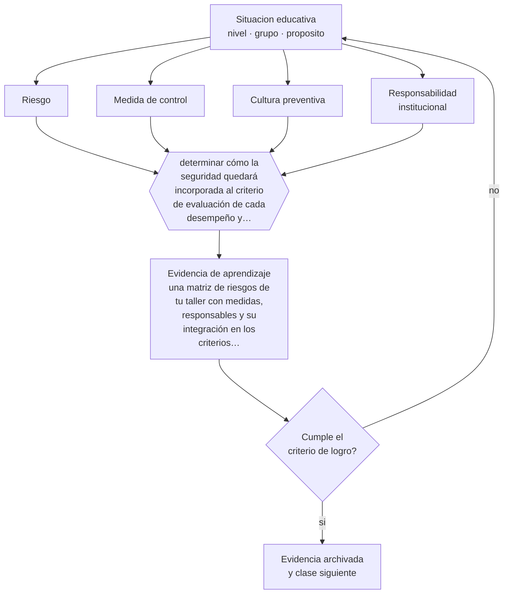

# Clase 076 — Seguridad y cultura preventiva

> **Parte 06 · Educación técnico-profesional** — clase 4 de 12

**Estado de evidencia:** `MARCO-NORMATIVO` · **Etapa:** 🔵 Etapa B — Enseñanza por ciclo vital · **Población de referencia:** formación técnica de nivel medio y superior, y capacitación de oficio 
**Decisión que habilita:** determinar cómo la seguridad quedará incorporada al criterio de evaluación de cada desempeño y no como contenido aparte 
**Evidencia de aprendizaje:** una matriz de riesgos de tu taller con medidas, responsables y su integración en los criterios de evaluación

## 🎯 Propósito

Integrar la prevención de riesgos como parte del estándar de desempeño y construir cultura preventiva, distinguiendo obligación legal, procedimiento institucional y formación de criterio.

## 📚 Resultados de aprendizaje

Al finalizar esta clase podrás:

1. **Definir** con precisión los cuatro conceptos centrales de la clase y reconocerlos en una situación educativa real, no solo en su enunciado.
2. **Explicar** por qué la seguridad no es un módulo aparte sino un criterio de todo desempeño técnico.
3. **Decidir** —cómo la seguridad quedará incorporada al criterio de evaluación de cada desempeño y no como contenido aparte— y sostener la decisión con un fundamento escrito.
4. **Producir** la evidencia de la clase —una matriz de riesgos de tu taller con medidas, responsables y su integración en los criterios de evaluación— y contrastarla contra el criterio de logro.
5. **Distinguir** lo que la evidencia sostiene de lo que es práctica instalada, preferencia personal o costumbre de la institución.

## 🧩 Conceptos centrales

| Concepto | Comprensión verificable |
|---|---|
| **Riesgo** | probabilidad de que ocurra un daño asociado a una tarea, equipo o condición |
| **Medida de control** | acción que elimina, reduce o señaliza un riesgo, con jerarquía definida |
| **Cultura preventiva** | conjunto de prácticas y supuestos compartidos que hacen de la seguridad una conducta por defecto |
| **Responsabilidad institucional** | obligaciones del establecimiento sobre condiciones, supervisión y registro |

## 🗺️ Flujo de razonamiento

## 📖 Desarrollo

### 1. El fondo del asunto

Un desempeño técnico ejecutado sin las medidas de seguridad no es un desempeño competente al que le falta algo: es un desempeño incorrecto. Formular así el criterio cambia la evaluación y también la cultura, porque el estudiante aprende que ambas cosas son la misma. En sentido inverso, un establecimiento que enseña seguridad como módulo teórico y luego tolera su incumplimiento en el taller enseña, con más fuerza, que la norma es opcional.

### 2. Cómo se traduce en decisiones de enseñanza

El trabajo concreto es levantar la matriz de riesgos del taller —tarea por tarea— con sus medidas de control, y traducir esas medidas a criterios de la rúbrica de desempeño. Además, la responsabilidad institucional exige registro: capacitación entregada, elementos de protección disponibles, mantenimiento de equipos y supervisión efectiva. Ese registro protege al estudiante y también al docente.

### 3. Qué sostiene la evidencia y qué no

La normativa de seguridad y salud en el trabajo cambia y varía por sector; toda afirmación específica debe verificarse en su versión vigente. Y la formación de criterio no se reduce al cumplimiento: un trabajador competente reconoce riesgos nuevos que ninguna norma anticipó, y eso se enseña con análisis de situaciones y no con listas memorizadas.

> **Cómo leer el estado de evidencia `MARCO-NORMATIVO`.** El contenido no se decide por evidencia empírica sino por norma, política pública o marco institucional vigente. Verifica siempre la versión vigente a la fecha en que vas a aplicarlo: la norma cambia y la clase no se actualiza sola.

## 🧪 Taller guiado

Aplica la clase a **uno** de los contextos siguientes y repite después el ejercicio en un
contexto de exigencia distinta. Cambiar de contexto es parte del aprendizaje: lo que funciona
con un grupo no se traslada intacto a otro.

| Contexto | Rasgo que cambia la decisión |
|---|---|
| Taller de especialidad industrial | riesgo físico alto: la seguridad domina la secuencia |
| Especialidad de servicios o administración | el desempeño se observa en interacción y en producto documental |
| Especialidad de salud o alimentos | protocolo y trazabilidad son parte del estándar |
| Formación dual con empresa | el estándar se negocia con un tercero |
| Capacitación laboral de corta duración | tiempo mínimo y foco en una tarea crítica |
| Reconocimiento de aprendizajes previos | hay que evaluar competencias adquiridas fuera del aula |

**Secuencia de trabajo:**

1. Delimita el contexto: nivel, edad, tamaño del grupo, asignatura o experiencia y tiempo real disponible.
2. Declara qué saben ya los estudiantes y **cómo lo comprobaste**, no cómo lo supones.
3. Formula la decisión pedagógica que esta clase habilita y escribe su fundamento.
4. Anticipa qué observarías si la decisión funciona y qué observarías si no funciona.
5. Diseña de antemano la alternativa que aplicarás si la primera estrategia falla.
6. Ejecuta o simula, y registra lo observado con fecha, contexto y evidencia concreta.
7. Produce la evidencia de aprendizaje de la clase.
8. Contrástala contra el criterio de logro, corrige y recién entonces avanza.

### 📦 Evidencia de aprendizaje

Una matriz de riesgos de tu taller con medidas, responsables y su integración en los criterios de evaluación.

Debe incluir contexto, decisión, fundamento, fuentes consultadas con su fecha, indicador de
logro observable, riesgos previstos y qué harías distinto en la siguiente iteración.

## 🏆 Reto verificable

Levanta la matriz de riesgos de una tarea de tu taller e incorpórala a la rúbrica. Aplica la rúbrica y registra cuántos desempeños fallan por seguridad y no por técnica.

## ✅ Criterio de logro

- [ ] la matriz cubre las tareas del taller con medidas y responsables identificados;
- [ ] los criterios de evaluación del desempeño incluyen la seguridad como condición y no como bonificación;
- [ ] cada afirmación sobre «lo que funciona» está atribuida a una fuente identificable, con autor y fecha;
- [ ] la decisión es ejecutable con el tiempo, el espacio, el número de estudiantes y los recursos que realmente tienes;
- [ ] la evidencia queda archivada de forma reproducible: otra persona podría revisarla sin que tú se la expliques.

## ⚠️ Errores frecuentes

**Propios de esta clase:**

- Enseñar seguridad como contenido separado y evaluarla con una prueba escrita.
- Tolerar incumplimientos menores en el taller, que enseñan que la norma es negociable.

**Característicos de la parte 06:**

- Evaluar el oficio con pruebas escritas en vez de desempeños observables.
- Redactar competencias que no se pueden observar ni graduar.

## ♿ Diversidad, accesibilidad y ética

Los ajustes de accesibilidad en un taller deben diseñarse junto con las medidas de seguridad, nunca en contra: adaptar el puesto, la herramienta o el procedimiento, manteniendo el control del riesgo, es lo que permite que un estudiante con discapacidad participe plenamente.

Antes de aplicar cualquier decisión de esta clase con estudiantes reales, revisa el
[protocolo de práctica responsable](../../../docs/ETICA_Y_PRACTICA_RESPONSABLE.md):
consentimiento, resguardo de datos personales, proporcionalidad de la intervención y derecho
de cada estudiante a no ser objeto de un ensayo que no le reporta beneficio.

## ❓ Preguntas de comprobación

1. ¿Qué incumplimiento menor toleras habitualmente en tu taller?
2. ¿Qué registro tienes de la capacitación y de los elementos de protección entregados?
3. ¿Cómo enseñas a reconocer un riesgo que no está en ninguna lista?

## 📕 Lecturas base

**Organización Internacional del Trabajo. *Directrices sobre sistemas de gestión de la seguridad y salud en el trabajo*.**  
*Qué aporta a esta clase:* marco internacional de referencia para la jerarquía de medidas de control.

**Superintendencia de Seguridad Social y normativa chilena de seguridad y salud en el trabajo.**  
*Qué aporta a esta clase:* obligaciones vigentes aplicables a establecimientos y a estudiantes en práctica.

Catálogo completo: [bibliografía del programa](../../../docs/BIBLIOGRAFIA.md) ·
[glosario](../../../docs/GLOSARIO.md) ·
[fuentes oficiales y cómo leerlas](../../../docs/FUENTES.md).

## 🔗 Conexión con el resto del programa

Es condición de las clases 075, 079 y 081, y su lógica de registro se conecta con la parte 12.

> [!IMPORTANT]
> Material de formación profesional. No reemplaza un título de pedagogía, una habilitación
> legal para ejercer, ni el juicio de un equipo educativo que conoce a sus estudiantes.

---

| Anterior | Índice | Siguiente |
|---|---|---|
| [← 075 · Talleres y laboratorios](../class-03-talleres-y-laboratorios/README.md) | [Parte 06](../README.md) · [Programa](../../../README.md) | [077 · Rúbricas de desempeño →](../class-05-rubricas-de-desempeno/README.md) |
