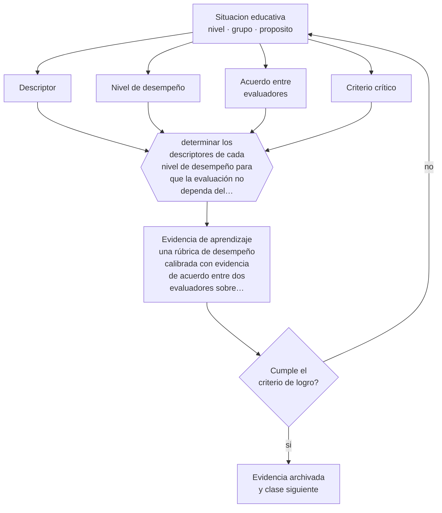

# Clase 077 — Rúbricas de desempeño

> **Parte 06 · Educación técnico-profesional** — clase 5 de 12

**Estado de evidencia:** `CONSISTENTE` · **Etapa:** 🔵 Etapa B — Enseñanza por ciclo vital · **Población de referencia:** formación técnica de nivel medio y superior, y capacitación de oficio 
**Decisión que habilita:** determinar los descriptores de cada nivel de desempeño para que la evaluación no dependa del evaluador 
**Evidencia de aprendizaje:** una rúbrica de desempeño calibrada con evidencia de acuerdo entre dos evaluadores sobre trabajos reales

## 🎯 Propósito

Construir rúbricas de desempeño técnicas: descriptores observables, niveles diferenciados por calidad y no por adverbios, y calibración entre evaluadores.

## 📚 Resultados de aprendizaje

Al finalizar esta clase podrás:

1. **Definir** con precisión los cuatro conceptos centrales de la clase y reconocerlos en una situación educativa real, no solo en su enunciado.
2. **Explicar** cómo se construye una rúbrica que dos evaluadores distintos apliquen con el mismo resultado.
3. **Decidir** —los descriptores de cada nivel de desempeño para que la evaluación no dependa del evaluador— y sostener la decisión con un fundamento escrito.
4. **Producir** la evidencia de la clase —una rúbrica de desempeño calibrada con evidencia de acuerdo entre dos evaluadores sobre trabajos reales— y contrastarla contra el criterio de logro.
5. **Distinguir** lo que la evidencia sostiene de lo que es práctica instalada, preferencia personal o costumbre de la institución.

## 🧩 Conceptos centrales

| Concepto | Comprensión verificable |
|---|---|
| **Descriptor** | descripción observable de lo que se hace en un nivel de desempeño determinado |
| **Nivel de desempeño** | grado de calidad diferenciado por rasgos concretos y no por intensidad del adverbio |
| **Acuerdo entre evaluadores** | grado en que dos personas asignan el mismo nivel al mismo desempeño |
| **Criterio crítico** | aspecto cuyo incumplimiento invalida el desempeño completo, típicamente la seguridad |

## 🗺️ Flujo de razonamiento

## 📖 Desarrollo

### 1. El fondo del asunto

La rúbrica es el instrumento central de la evaluación técnica y la mayoría de las que circulan no cumplen su función, porque sus niveles se distinguen con adverbios —«siempre», «a veces», «adecuadamente»— que trasladan el juicio al evaluador. Una rúbrica útil describe qué se observa en cada nivel: qué tolerancia, qué acabado, qué secuencia, qué tiempo. Solo así dos evaluadores pueden coincidir.

### 2. Cómo se traduce en decisiones de enseñanza

Construirla exige partir de desempeños reales: mirar trabajos de distinta calidad y describir en qué se diferencian. Después se calibra con otro evaluador sobre casos reales y se reescriben los descriptores que produjeron desacuerdo. La rúbrica también debe declarar los criterios críticos, aquellos cuyo incumplimiento hace inválido el desempeño aunque el resto esté bien.

### 3. Qué sostiene la evidencia y qué no

Las rúbricas mejoran la consistencia pero no garantizan validez: pueden ser muy consistentes midiendo lo que no importa. Además, descomponer demasiado el desempeño produce listas de verificación que pierden la calidad global del trabajo. El equilibrio entre analítico y holístico es una decisión profesional que depende del uso que se dará al resultado.

> **Cómo leer el estado de evidencia `CONSISTENTE`.** La evidencia es amplia y coherente, pero proviene sobre todo de estudios correlacionales, de síntesis con heterogeneidad alta o de contextos distintos al tuyo. Sirve para orientar la decisión y exige que compruebes el efecto en tu propio grupo.

## 🧪 Taller guiado

Aplica la clase a **uno** de los contextos siguientes y repite después el ejercicio en un
contexto de exigencia distinta. Cambiar de contexto es parte del aprendizaje: lo que funciona
con un grupo no se traslada intacto a otro.

| Contexto | Rasgo que cambia la decisión |
|---|---|
| Taller de especialidad industrial | riesgo físico alto: la seguridad domina la secuencia |
| Especialidad de servicios o administración | el desempeño se observa en interacción y en producto documental |
| Especialidad de salud o alimentos | protocolo y trazabilidad son parte del estándar |
| Formación dual con empresa | el estándar se negocia con un tercero |
| Capacitación laboral de corta duración | tiempo mínimo y foco en una tarea crítica |
| Reconocimiento de aprendizajes previos | hay que evaluar competencias adquiridas fuera del aula |

**Secuencia de trabajo:**

1. Delimita el contexto: nivel, edad, tamaño del grupo, asignatura o experiencia y tiempo real disponible.
2. Declara qué saben ya los estudiantes y **cómo lo comprobaste**, no cómo lo supones.
3. Formula la decisión pedagógica que esta clase habilita y escribe su fundamento.
4. Anticipa qué observarías si la decisión funciona y qué observarías si no funciona.
5. Diseña de antemano la alternativa que aplicarás si la primera estrategia falla.
6. Ejecuta o simula, y registra lo observado con fecha, contexto y evidencia concreta.
7. Produce la evidencia de aprendizaje de la clase.
8. Contrástala contra el criterio de logro, corrige y recién entonces avanza.

### 📦 Evidencia de aprendizaje

Una rúbrica de desempeño calibrada con evidencia de acuerdo entre dos evaluadores sobre trabajos reales.

Debe incluir contexto, decisión, fundamento, fuentes consultadas con su fecha, indicador de
logro observable, riesgos previstos y qué harías distinto en la siguiente iteración.

## 🏆 Reto verificable

Evalúa cinco trabajos con un colega usando tu rúbrica. Calcula el acuerdo, reescribe los descriptores conflictivos y repite el ejercicio.

## ✅ Criterio de logro

- [ ] cada nivel describe rasgos observables y no grados de un adverbio;
- [ ] la rúbrica declara sus criterios críticos y existe evidencia de calibración;
- [ ] cada afirmación sobre «lo que funciona» está atribuida a una fuente identificable, con autor y fecha;
- [ ] la decisión es ejecutable con el tiempo, el espacio, el número de estudiantes y los recursos que realmente tienes;
- [ ] la evidencia queda archivada de forma reproducible: otra persona podría revisarla sin que tú se la expliques.

## ⚠️ Errores frecuentes

**Propios de esta clase:**

- Diferenciar niveles con adverbios de frecuencia en vez de con rasgos observables.
- Omitir los criterios críticos, con lo que un desempeño inseguro puede aprobar por promedio.

**Característicos de la parte 06:**

- Evaluar el oficio con pruebas escritas en vez de desempeños observables.
- Redactar competencias que no se pueden observar ni graduar.

## ♿ Diversidad, accesibilidad y ética

Los descriptores deben evaluar el resultado y el procedimiento seguro, no la forma corporal de ejecutarlo. Escrito así, un estudiante con una adaptación puede alcanzar el mismo nivel sin que la rúbrica lo penalice por hacerlo de otra manera.

Antes de aplicar cualquier decisión de esta clase con estudiantes reales, revisa el
[protocolo de práctica responsable](../../../docs/ETICA_Y_PRACTICA_RESPONSABLE.md):
consentimiento, resguardo de datos personales, proporcionalidad de la intervención y derecho
de cada estudiante a no ser objeto de un ensayo que no le reporta beneficio.

## ❓ Preguntas de comprobación

1. ¿Qué se ve exactamente distinto entre un nivel y el siguiente en tu rúbrica?
2. ¿Qué criterio invalida el desempeño completo aunque todo lo demás esté bien?
3. ¿Qué tan distinto evaluaría este trabajo tu colega de taller?

## 📕 Lecturas base

**Jonsson, A. & Svingby, G. (2007). *The Use of Scoring Rubrics*.**  
*Qué aporta a esta clase:* evidencia sobre cuándo las rúbricas mejoran la consistencia y qué las hace fallar.

**Sadler, D. R. (2009). *Indeterminacy in the Use of Preset Criteria for Assessment*.**  
*Qué aporta a esta clase:* advierte sobre los límites de los criterios prefijados en desempeños complejos.

Catálogo completo: [bibliografía del programa](../../../docs/BIBLIOGRAFIA.md) ·
[glosario](../../../docs/GLOSARIO.md) ·
[fuentes oficiales y cómo leerlas](../../../docs/FUENTES.md).

## 🔗 Conexión con el resto del programa

Es el instrumento de las clases 073 y 075, y anticipa el tratamiento técnico de la parte 11.

> [!IMPORTANT]
> Material de formación profesional. No reemplaza un título de pedagogía, una habilitación
> legal para ejercer, ni el juicio de un equipo educativo que conoce a sus estudiantes.

---

| Anterior | Índice | Siguiente |
|---|---|---|
| [← 076 · Seguridad y cultura preventiva](../class-04-seguridad-y-cultura-preventiva/README.md) | [Parte 06](../README.md) · [Programa](../../../README.md) | [078 · Portafolio de evidencias →](../class-06-portafolio-de-evidencias/README.md) |
