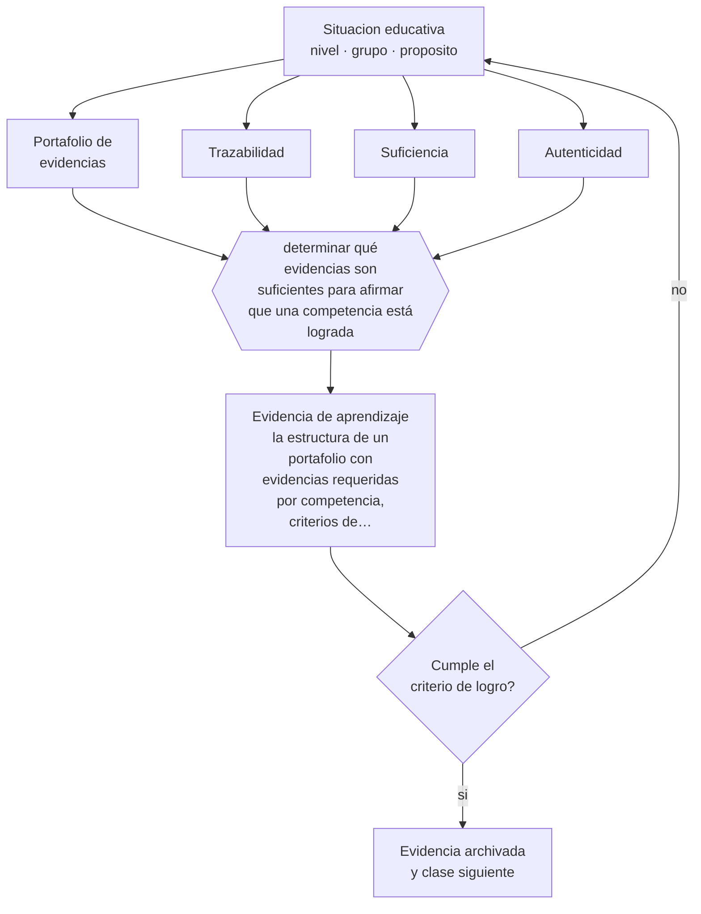

# Clase 078 — Portafolio de evidencias

> **Parte 06 · Educación técnico-profesional** — clase 6 de 12

**Estado de evidencia:** `PRACTICA-PROFESIONAL` · **Etapa:** 🔵 Etapa B — Enseñanza por ciclo vital · **Población de referencia:** formación técnica de nivel medio y superior, y capacitación de oficio 
**Decisión que habilita:** determinar qué evidencias son suficientes para afirmar que una competencia está lograda 
**Evidencia de aprendizaje:** la estructura de un portafolio con evidencias requeridas por competencia, criterios de suficiencia y sistema de verificación

## 🎯 Propósito

Diseñar portafolios de evidencias con trazabilidad, suficiencia y criterios de validez, de modo que sirvan para certificar competencias y no solo para acumular trabajos.

## 📚 Resultados de aprendizaje

Al finalizar esta clase podrás:

1. **Definir** con precisión los cuatro conceptos centrales de la clase y reconocerlos en una situación educativa real, no solo en su enunciado.
2. **Explicar** cómo se construye una carpeta de evidencias que efectivamente respalde una certificación.
3. **Decidir** —qué evidencias son suficientes para afirmar que una competencia está lograda— y sostener la decisión con un fundamento escrito.
4. **Producir** la evidencia de la clase —la estructura de un portafolio con evidencias requeridas por competencia, criterios de suficiencia y sistema de verificación— y contrastarla contra el criterio de logro.
5. **Distinguir** lo que la evidencia sostiene de lo que es práctica instalada, preferencia personal o costumbre de la institución.

## 🧩 Conceptos centrales

| Concepto | Comprensión verificable |
|---|---|
| **Portafolio de evidencias** | conjunto organizado de productos y registros que documentan el logro de competencias |
| **Trazabilidad** | posibilidad de vincular cada evidencia con la competencia, la fecha y las condiciones en que se produjo |
| **Suficiencia** | cantidad y variedad de evidencia necesaria para sostener la afirmación de logro |
| **Autenticidad** | garantía de que la evidencia fue producida por el estudiante en las condiciones declaradas |

## 🗺️ Flujo de razonamiento

## 📖 Desarrollo

### 1. El fondo del asunto

Un portafolio sin criterios es una carpeta. Lo que lo convierte en instrumento de evaluación es la definición previa de qué evidencia se exige por competencia, cuánta es suficiente y cómo se verifica su autenticidad. Esa definición debe hacerse antes de recolectar; hacerlo después obliga a aceptar lo que haya, que es como se llega a certificar competencias con evidencia insuficiente.

### 2. Cómo se traduce en decisiones de enseñanza

La estructura útil asocia cada competencia con sus evidencias requeridas —producto, registro de desempeño observado, fotografía fechada, informe del supervisor—, define el mínimo de cada tipo y establece cómo se verifica. La reflexión del estudiante sobre su propio proceso agrega valor formativo, pero no sustituye la evidencia de desempeño.

### 3. Qué sostiene la evidencia y qué no

Los portafolios son costosos de evaluar y su consistencia entre evaluadores es baja sin criterios explícitos y calibración. Además, la autenticidad es un problema real, agravado por las herramientas digitales: la evidencia documental sin observación directa del desempeño no basta para certificar una competencia técnica.

> **Cómo leer el estado de evidencia `PRACTICA-PROFESIONAL`.** Es conocimiento práctico acumulado del oficio, útil y transferible, pero no probado con diseños de investigación. Trátalo como un buen punto de partida sujeto a comprobación en tu contexto.

## 🧪 Taller guiado

Aplica la clase a **uno** de los contextos siguientes y repite después el ejercicio en un
contexto de exigencia distinta. Cambiar de contexto es parte del aprendizaje: lo que funciona
con un grupo no se traslada intacto a otro.

| Contexto | Rasgo que cambia la decisión |
|---|---|
| Taller de especialidad industrial | riesgo físico alto: la seguridad domina la secuencia |
| Especialidad de servicios o administración | el desempeño se observa en interacción y en producto documental |
| Especialidad de salud o alimentos | protocolo y trazabilidad son parte del estándar |
| Formación dual con empresa | el estándar se negocia con un tercero |
| Capacitación laboral de corta duración | tiempo mínimo y foco en una tarea crítica |
| Reconocimiento de aprendizajes previos | hay que evaluar competencias adquiridas fuera del aula |

**Secuencia de trabajo:**

1. Delimita el contexto: nivel, edad, tamaño del grupo, asignatura o experiencia y tiempo real disponible.
2. Declara qué saben ya los estudiantes y **cómo lo comprobaste**, no cómo lo supones.
3. Formula la decisión pedagógica que esta clase habilita y escribe su fundamento.
4. Anticipa qué observarías si la decisión funciona y qué observarías si no funciona.
5. Diseña de antemano la alternativa que aplicarás si la primera estrategia falla.
6. Ejecuta o simula, y registra lo observado con fecha, contexto y evidencia concreta.
7. Produce la evidencia de aprendizaje de la clase.
8. Contrástala contra el criterio de logro, corrige y recién entonces avanza.

### 📦 Evidencia de aprendizaje

La estructura de un portafolio con evidencias requeridas por competencia, criterios de suficiencia y sistema de verificación.

Debe incluir contexto, decisión, fundamento, fuentes consultadas con su fecha, indicador de
logro observable, riesgos previstos y qué harías distinto en la siguiente iteración.

## 🏆 Reto verificable

Revisa un portafolio real con tus criterios de suficiencia. Identifica qué competencias no quedan respaldadas y define qué evidencia faltaría.

## ✅ Criterio de logro

- [ ] cada competencia declara evidencias requeridas, mínimo exigido y forma de verificación;
- [ ] existe al menos una evidencia de desempeño observado por competencia técnica;
- [ ] cada afirmación sobre «lo que funciona» está atribuida a una fuente identificable, con autor y fecha;
- [ ] la decisión es ejecutable con el tiempo, el espacio, el número de estudiantes y los recursos que realmente tienes;
- [ ] la evidencia queda archivada de forma reproducible: otra persona podría revisarla sin que tú se la expliques.

## ⚠️ Errores frecuentes

**Propios de esta clase:**

- Definir los criterios de suficiencia después de haber recolectado las evidencias.
- Certificar competencias técnicas solo con evidencia documental, sin desempeño observado.

**Característicos de la parte 06:**

- Evaluar el oficio con pruebas escritas en vez de desempeños observables.
- Redactar competencias que no se pueden observar ni graduar.

## ♿ Diversidad, accesibilidad y ética

El portafolio permite demostrar competencias por vías distintas, lo que favorece a estudiantes con dificultades en formatos escritos. Requiere, eso sí, que los criterios de suficiencia sean los mismos para todos y que las alternativas estén declaradas de antemano.

Antes de aplicar cualquier decisión de esta clase con estudiantes reales, revisa el
[protocolo de práctica responsable](../../../docs/ETICA_Y_PRACTICA_RESPONSABLE.md):
consentimiento, resguardo de datos personales, proporcionalidad de la intervención y derecho
de cada estudiante a no ser objeto de un ensayo que no le reporta beneficio.

## ❓ Preguntas de comprobación

1. ¿Qué evidencia de tu portafolio no probaría nada ante un tercero?
2. ¿Cómo verificas que el trabajo fue hecho por el estudiante y en esas condiciones?
3. ¿Cuánta evidencia es suficiente y quién lo decidió?

## 📕 Lecturas base

**Baartman, L. et al. (2007). *Evaluating Assessment Quality in Competence-Based Education*.**  
*Qué aporta a esta clase:* propone criterios de calidad aplicables a portafolios y evaluación de competencias.

**Mineduc. *Orientaciones para la evaluación en la formación diferenciada técnico-profesional*.**  
*Qué aporta a esta clase:* referencia chilena sobre instrumentos y evidencias esperadas en el nivel.

Catálogo completo: [bibliografía del programa](../../../docs/BIBLIOGRAFIA.md) ·
[glosario](../../../docs/GLOSARIO.md) ·
[fuentes oficiales y cómo leerlas](../../../docs/FUENTES.md).

## 🔗 Conexión con el resto del programa

Depende de las clases 073 y 077 y alimenta la clase 083, porque el portafolio es también un instrumento de transición al trabajo.

> [!IMPORTANT]
> Material de formación profesional. No reemplaza un título de pedagogía, una habilitación
> legal para ejercer, ni el juicio de un equipo educativo que conoce a sus estudiantes.

---

| Anterior | Índice | Siguiente |
|---|---|---|
| [← 077 · Rúbricas de desempeño](../class-05-rubricas-de-desempeno/README.md) | [Parte 06](../README.md) · [Programa](../../../README.md) | [079 · Aprendizaje dual →](../class-07-aprendizaje-dual/README.md) |
