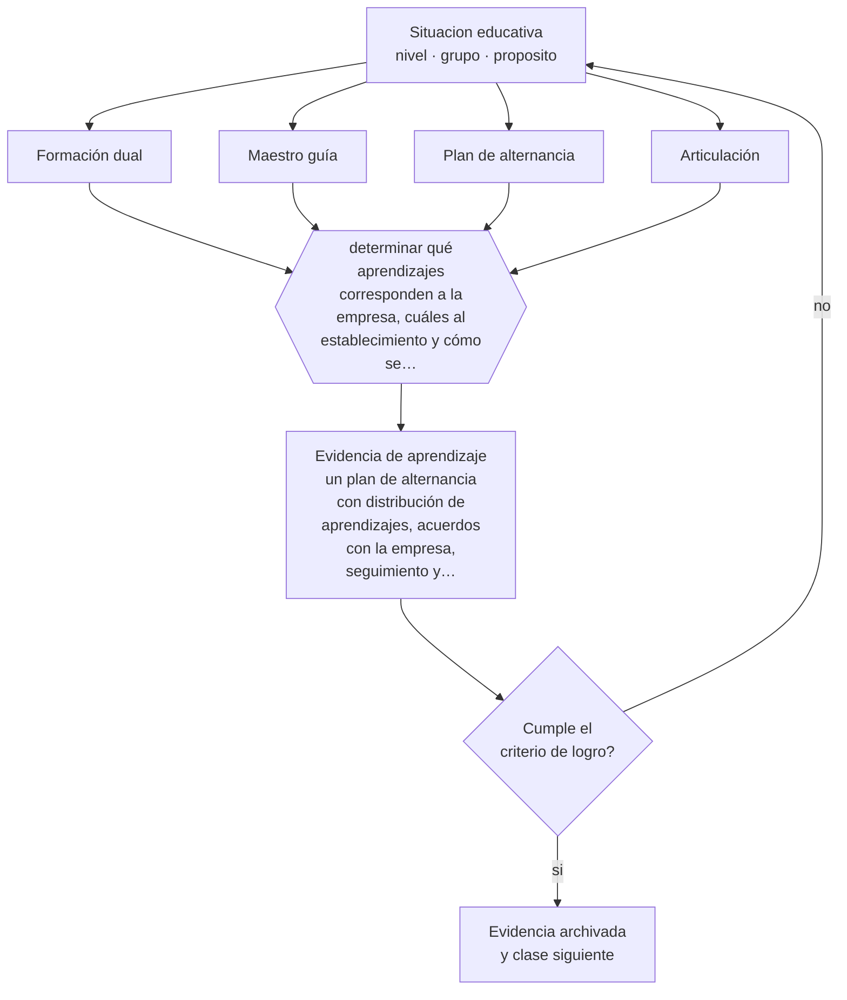

# Clase 079 — Aprendizaje dual

> **Parte 06 · Educación técnico-profesional** — clase 7 de 12

**Estado de evidencia:** `CONSISTENTE` · **Etapa:** 🔵 Etapa B — Enseñanza por ciclo vital · **Población de referencia:** formación técnica de nivel medio y superior, y capacitación de oficio 
**Decisión que habilita:** determinar qué aprendizajes corresponden a la empresa, cuáles al establecimiento y cómo se articulan 
**Evidencia de aprendizaje:** un plan de alternancia con distribución de aprendizajes, acuerdos con la empresa, seguimiento y evaluación conjunta

## 🎯 Propósito

Diseñar formación dual o en alternancia con articulación real entre lo que se aprende en el establecimiento y lo que se aprende en la empresa, con acuerdos y seguimiento explícitos.

## 📚 Resultados de aprendizaje

Al finalizar esta clase podrás:

1. **Definir** con precisión los cuatro conceptos centrales de la clase y reconocerlos en una situación educativa real, no solo en su enunciado.
2. **Explicar** qué hace que la alternancia entre escuela y empresa enseñe, en vez de solo repartir el tiempo.
3. **Decidir** —qué aprendizajes corresponden a la empresa, cuáles al establecimiento y cómo se articulan— y sostener la decisión con un fundamento escrito.
4. **Producir** la evidencia de la clase —un plan de alternancia con distribución de aprendizajes, acuerdos con la empresa, seguimiento y evaluación conjunta— y contrastarla contra el criterio de logro.
5. **Distinguir** lo que la evidencia sostiene de lo que es práctica instalada, preferencia personal o costumbre de la institución.

## 🧩 Conceptos centrales

| Concepto | Comprensión verificable |
|---|---|
| **Formación dual** | modalidad en que el estudiante alterna formación en el establecimiento y en un puesto de trabajo real |
| **Maestro guía** | persona de la empresa responsable de acompañar y evaluar al estudiante |
| **Plan de alternancia** | documento que distribuye aprendizajes, tiempos y responsabilidades entre ambas instituciones |
| **Articulación** | correspondencia entre lo aprendido en cada espacio, de modo que se refuercen mutuamente |

## 🗺️ Flujo de razonamiento

## 📖 Desarrollo

### 1. El fondo del asunto

Los sistemas duales muestran buenos resultados en transición al empleo en varios países, pero su eficacia depende de condiciones que rara vez se importan junto con el modelo: empresas con capacidad formativa, maestros guía preparados, currículo articulado y supervisión efectiva. Sin ellas, la alternancia se convierte en mano de obra barata con certificado, que es el riesgo principal del formato.

### 2. Cómo se traduce en decisiones de enseñanza

El plan de alternancia debe declarar qué aprendizajes ocurren en cada espacio, cómo se registra el avance y quién evalúa qué. La preparación del maestro guía es la variable más descuidada y la más determinante: una persona competente en el oficio no necesariamente sabe enseñarlo ni evaluarlo, y el establecimiento tiene la responsabilidad de apoyarlo.

### 3. Qué sostiene la evidencia y qué no

Los estudios comparados muestran resultados positivos en inserción laboral temprana y resultados más discutidos en trayectorias de largo plazo y movilidad. Además, la calidad varía enormemente entre empresas: promediar resultados oculta que una parte de los estudiantes tuvo una experiencia formativa y otra no.

> **Cómo leer el estado de evidencia `CONSISTENTE`.** La evidencia es amplia y coherente, pero proviene sobre todo de estudios correlacionales, de síntesis con heterogeneidad alta o de contextos distintos al tuyo. Sirve para orientar la decisión y exige que compruebes el efecto en tu propio grupo.

## 🧪 Taller guiado

Aplica la clase a **uno** de los contextos siguientes y repite después el ejercicio en un
contexto de exigencia distinta. Cambiar de contexto es parte del aprendizaje: lo que funciona
con un grupo no se traslada intacto a otro.

| Contexto | Rasgo que cambia la decisión |
|---|---|
| Taller de especialidad industrial | riesgo físico alto: la seguridad domina la secuencia |
| Especialidad de servicios o administración | el desempeño se observa en interacción y en producto documental |
| Especialidad de salud o alimentos | protocolo y trazabilidad son parte del estándar |
| Formación dual con empresa | el estándar se negocia con un tercero |
| Capacitación laboral de corta duración | tiempo mínimo y foco en una tarea crítica |
| Reconocimiento de aprendizajes previos | hay que evaluar competencias adquiridas fuera del aula |

**Secuencia de trabajo:**

1. Delimita el contexto: nivel, edad, tamaño del grupo, asignatura o experiencia y tiempo real disponible.
2. Declara qué saben ya los estudiantes y **cómo lo comprobaste**, no cómo lo supones.
3. Formula la decisión pedagógica que esta clase habilita y escribe su fundamento.
4. Anticipa qué observarías si la decisión funciona y qué observarías si no funciona.
5. Diseña de antemano la alternativa que aplicarás si la primera estrategia falla.
6. Ejecuta o simula, y registra lo observado con fecha, contexto y evidencia concreta.
7. Produce la evidencia de aprendizaje de la clase.
8. Contrástala contra el criterio de logro, corrige y recién entonces avanza.

### 📦 Evidencia de aprendizaje

Un plan de alternancia con distribución de aprendizajes, acuerdos con la empresa, seguimiento y evaluación conjunta.

Debe incluir contexto, decisión, fundamento, fuentes consultadas con su fecha, indicador de
logro observable, riesgos previstos y qué harías distinto en la siguiente iteración.

## 🏆 Reto verificable

Audita una plaza dual real contra tu plan de alternancia. Documenta qué aprendizajes efectivamente ocurren y renegocia lo que falta.

## ✅ Criterio de logro

- [ ] el plan distribuye aprendizajes por espacio con evaluación conjunta declarada;
- [ ] existe preparación y acompañamiento explícito del maestro guía;
- [ ] cada afirmación sobre «lo que funciona» está atribuida a una fuente identificable, con autor y fecha;
- [ ] la decisión es ejecutable con el tiempo, el espacio, el número de estudiantes y los recursos que realmente tienes;
- [ ] la evidencia queda archivada de forma reproducible: otra persona podría revisarla sin que tú se la expliques.

## ⚠️ Errores frecuentes

**Propios de esta clase:**

- Enviar estudiantes a empresas sin plan de alternancia ni acuerdos escritos.
- Suponer que un buen profesional de la empresa sabe formar y evaluar sin apoyo.

**Característicos de la parte 06:**

- Evaluar el oficio con pruebas escritas en vez de desempeños observables.
- Redactar competencias que no se pueden observar ni graduar.

## ♿ Diversidad, accesibilidad y ética

El acceso a plazas de calidad suele depender de redes familiares y de la ubicación del establecimiento. Gestionar activamente los cupos y monitorear su calidad evita que la alternancia amplifique la desigualdad de origen.

Antes de aplicar cualquier decisión de esta clase con estudiantes reales, revisa el
[protocolo de práctica responsable](../../../docs/ETICA_Y_PRACTICA_RESPONSABLE.md):
consentimiento, resguardo de datos personales, proporcionalidad de la intervención y derecho
de cada estudiante a no ser objeto de un ensayo que no le reporta beneficio.

## ❓ Preguntas de comprobación

1. ¿Qué aprende el estudiante en la empresa que no puede aprender en el establecimiento?
2. ¿Qué apoyo recibe el maestro guía para enseñar y evaluar?
3. ¿Cómo detectas que una empresa no está formando?

## 📕 Lecturas base

**Mineduc. *Normativa y orientaciones sobre formación dual en Chile*.**  
*Qué aporta a esta clase:* define requisitos, convenios y responsabilidades vigentes de la modalidad.

**UNESCO-UNEVOC / OCDE. *Estudios comparados sobre aprendizaje dual y transición al empleo*.**  
*Qué aporta a esta clase:* evidencia internacional sobre condiciones que hacen funcionar el modelo.

Catálogo completo: [bibliografía del programa](../../../docs/BIBLIOGRAFIA.md) ·
[glosario](../../../docs/GLOSARIO.md) ·
[fuentes oficiales y cómo leerlas](../../../docs/FUENTES.md).

## 🔗 Conexión con el resto del programa

Se apoya en la clase 074 y se articula con las clases 080 y 081.

> [!IMPORTANT]
> Material de formación profesional. No reemplaza un título de pedagogía, una habilitación
> legal para ejercer, ni el juicio de un equipo educativo que conoce a sus estudiantes.

---

| Anterior | Índice | Siguiente |
|---|---|---|
| [← 078 · Portafolio de evidencias](../class-06-portafolio-de-evidencias/README.md) | [Parte 06](../README.md) · [Programa](../../../README.md) | [080 · Vínculo educación-empresa →](../class-08-vinculo-educacion-empresa/README.md) |
