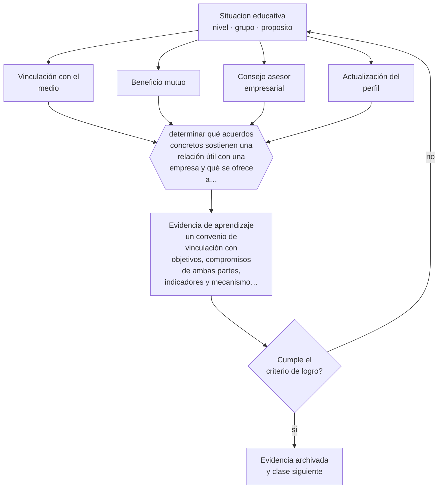

# Clase 080 — Vínculo educación-empresa

> **Parte 06 · Educación técnico-profesional** — clase 8 de 12

**Estado de evidencia:** `PRACTICA-PROFESIONAL` · **Etapa:** 🔵 Etapa B — Enseñanza por ciclo vital · **Población de referencia:** formación técnica de nivel medio y superior, y capacitación de oficio 
**Decisión que habilita:** determinar qué acuerdos concretos sostienen una relación útil con una empresa y qué se ofrece a cambio 
**Evidencia de aprendizaje:** un convenio de vinculación con objetivos, compromisos de ambas partes, indicadores y mecanismo de revisión

## 🎯 Propósito

Gestionar el vínculo entre establecimiento y empresa con acuerdos claros, beneficios mutuos y mecanismos de seguimiento, evitando tanto la dependencia como la relación puramente formal.

## 📚 Resultados de aprendizaje

Al finalizar esta clase podrás:

1. **Definir** con precisión los cuatro conceptos centrales de la clase y reconocerlos en una situación educativa real, no solo en su enunciado.
2. **Explicar** cómo se construye una relación con empresas que dure más de un año y sirva a la formación.
3. **Decidir** —qué acuerdos concretos sostienen una relación útil con una empresa y qué se ofrece a cambio— y sostener la decisión con un fundamento escrito.
4. **Producir** la evidencia de la clase —un convenio de vinculación con objetivos, compromisos de ambas partes, indicadores y mecanismo de revisión— y contrastarla contra el criterio de logro.
5. **Distinguir** lo que la evidencia sostiene de lo que es práctica instalada, preferencia personal o costumbre de la institución.

## 🧩 Conceptos centrales

| Concepto | Comprensión verificable |
|---|---|
| **Vinculación con el medio** | relación sistemática entre la institución formativa y el sector productivo |
| **Beneficio mutuo** | condición para la sostenibilidad: ambas partes obtienen algo verificable |
| **Consejo asesor empresarial** | instancia que aporta información sobre estándares y cambios del oficio |
| **Actualización del perfil** | revisión periódica de competencias a partir de lo que exige el sector |

## 🗺️ Flujo de razonamiento

## 📖 Desarrollo

### 1. El fondo del asunto

La relación con empresas se sostiene cuando ambas partes obtienen algo concreto. Del lado del establecimiento: plazas de práctica, información actualizada sobre tecnología y estándares, retroalimentación sobre egresados. Del lado de la empresa: acceso a talento formado, resolución de necesidades específicas, capacitación de sus trabajadores. Los convenios que solo declaran voluntad de colaborar no sobreviven al cambio de la persona que los firmó.

### 2. Cómo se traduce en decisiones de enseñanza

Un convenio útil especifica compromisos, responsables con nombre y cargo, indicadores y una revisión periódica. Los consejos asesores empresariales, cuando funcionan, aportan la información más valiosa: qué cambió en el oficio, qué equipos se usan hoy, qué competencias están faltando en los egresados. Esa información debe traducirse en ajustes del perfil y del taller, o el consejo se vuelve decorativo.

### 3. Qué sostiene la evidencia y qué no

El vínculo tiene tensiones reales: las necesidades inmediatas de la empresa no siempre coinciden con la formación integral del estudiante, y la dependencia de una sola empresa vuelve frágil el programa. Además, no existe evidencia sistemática sobre qué modelo de vinculación funciona mejor; es conocimiento profesional acumulado.

> **Cómo leer el estado de evidencia `PRACTICA-PROFESIONAL`.** Es conocimiento práctico acumulado del oficio, útil y transferible, pero no probado con diseños de investigación. Trátalo como un buen punto de partida sujeto a comprobación en tu contexto.

## 🧪 Taller guiado

Aplica la clase a **uno** de los contextos siguientes y repite después el ejercicio en un
contexto de exigencia distinta. Cambiar de contexto es parte del aprendizaje: lo que funciona
con un grupo no se traslada intacto a otro.

| Contexto | Rasgo que cambia la decisión |
|---|---|
| Taller de especialidad industrial | riesgo físico alto: la seguridad domina la secuencia |
| Especialidad de servicios o administración | el desempeño se observa en interacción y en producto documental |
| Especialidad de salud o alimentos | protocolo y trazabilidad son parte del estándar |
| Formación dual con empresa | el estándar se negocia con un tercero |
| Capacitación laboral de corta duración | tiempo mínimo y foco en una tarea crítica |
| Reconocimiento de aprendizajes previos | hay que evaluar competencias adquiridas fuera del aula |

**Secuencia de trabajo:**

1. Delimita el contexto: nivel, edad, tamaño del grupo, asignatura o experiencia y tiempo real disponible.
2. Declara qué saben ya los estudiantes y **cómo lo comprobaste**, no cómo lo supones.
3. Formula la decisión pedagógica que esta clase habilita y escribe su fundamento.
4. Anticipa qué observarías si la decisión funciona y qué observarías si no funciona.
5. Diseña de antemano la alternativa que aplicarás si la primera estrategia falla.
6. Ejecuta o simula, y registra lo observado con fecha, contexto y evidencia concreta.
7. Produce la evidencia de aprendizaje de la clase.
8. Contrástala contra el criterio de logro, corrige y recién entonces avanza.

### 📦 Evidencia de aprendizaje

Un convenio de vinculación con objetivos, compromisos de ambas partes, indicadores y mecanismo de revisión.

Debe incluir contexto, decisión, fundamento, fuentes consultadas con su fecha, indicador de
logro observable, riesgos previstos y qué harías distinto en la siguiente iteración.

## 🏆 Reto verificable

Revisa un convenio vigente de tu institución. Identifica qué compromisos no se cumplen y renegocia al menos uno con indicadores verificables.

## ✅ Criterio de logro

- [ ] el convenio declara compromisos concretos de ambas partes con responsables e indicadores;
- [ ] existe un mecanismo de revisión periódica con fecha definida;
- [ ] cada afirmación sobre «lo que funciona» está atribuida a una fuente identificable, con autor y fecha;
- [ ] la decisión es ejecutable con el tiempo, el espacio, el número de estudiantes y los recursos que realmente tienes;
- [ ] la evidencia queda archivada de forma reproducible: otra persona podría revisarla sin que tú se la expliques.

## ⚠️ Errores frecuentes

**Propios de esta clase:**

- Firmar convenios genéricos sin compromisos verificables ni responsables identificados.
- Ajustar el perfil de egreso a las necesidades inmediatas de una sola empresa.

**Característicos de la parte 06:**

- Evaluar el oficio con pruebas escritas en vez de desempeños observables.
- Redactar competencias que no se pueden observar ni graduar.

## ♿ Diversidad, accesibilidad y ética

La gestión activa de convenios es lo que permite ofrecer plazas de calidad a estudiantes sin redes familiares en el sector. Dejarlo al esfuerzo individual del estudiante traslada la desigualdad de origen al resultado formativo.

Antes de aplicar cualquier decisión de esta clase con estudiantes reales, revisa el
[protocolo de práctica responsable](../../../docs/ETICA_Y_PRACTICA_RESPONSABLE.md):
consentimiento, resguardo de datos personales, proporcionalidad de la intervención y derecho
de cada estudiante a no ser objeto de un ensayo que no le reporta beneficio.

## ❓ Preguntas de comprobación

1. ¿Qué gana la empresa con este convenio, en términos verificables?
2. ¿Qué información del sector cambió tu perfil de egreso en los últimos dos años?
3. ¿Qué pasa con tu programa si esta empresa se retira?

## 📕 Lecturas base

**OCDE. *Engaging Employers in Vocational Education and Training*.**  
*Qué aporta a esta clase:* analiza modelos de participación empresarial y sus condiciones de éxito.

**Mineduc. *Orientaciones para la vinculación con el sector productivo en educación técnico-profesional*.**  
*Qué aporta a esta clase:* marco chileno para convenios, prácticas y consejos asesores.

Catálogo completo: [bibliografía del programa](../../../docs/BIBLIOGRAFIA.md) ·
[glosario](../../../docs/GLOSARIO.md) ·
[fuentes oficiales y cómo leerlas](../../../docs/FUENTES.md).

## 🔗 Conexión con el resto del programa

Sostiene las clases 079 y 081 y se conecta con la parte 15, porque la vinculación es responsabilidad de gestión institucional.

> [!IMPORTANT]
> Material de formación profesional. No reemplaza un título de pedagogía, una habilitación
> legal para ejercer, ni el juicio de un equipo educativo que conoce a sus estudiantes.

---

| Anterior | Índice | Siguiente |
|---|---|---|
| [← 079 · Aprendizaje dual](../class-07-aprendizaje-dual/README.md) | [Parte 06](../README.md) · [Programa](../../../README.md) | [081 · Práctica profesional →](../class-09-practica-profesional/README.md) |
