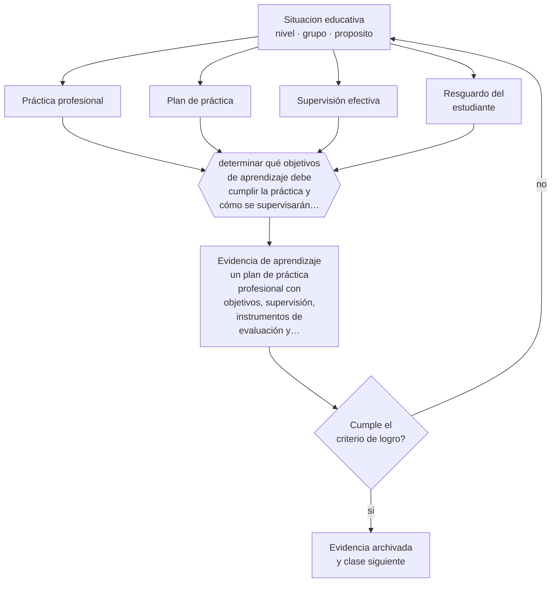

# Clase 081 — Práctica profesional

> **Parte 06 · Educación técnico-profesional** — clase 9 de 12

**Estado de evidencia:** `MARCO-NORMATIVO` · **Etapa:** 🔵 Etapa B — Enseñanza por ciclo vital · **Población de referencia:** formación técnica de nivel medio y superior, y capacitación de oficio 
**Decisión que habilita:** determinar qué objetivos de aprendizaje debe cumplir la práctica y cómo se supervisarán efectivamente 
**Evidencia de aprendizaje:** un plan de práctica profesional con objetivos, supervisión, instrumentos de evaluación y resguardos declarados

## 🎯 Propósito

Diseñar y supervisar prácticas profesionales con objetivos de aprendizaje, supervisión efectiva, evaluación conjunta y resguardo de las condiciones legales y de seguridad del estudiante.

## 📚 Resultados de aprendizaje

Al finalizar esta clase podrás:

1. **Definir** con precisión los cuatro conceptos centrales de la clase y reconocerlos en una situación educativa real, no solo en su enunciado.
2. **Explicar** qué convierte una práctica profesional en formación y qué la convierte en un trámite de titulación.
3. **Decidir** —qué objetivos de aprendizaje debe cumplir la práctica y cómo se supervisarán efectivamente— y sostener la decisión con un fundamento escrito.
4. **Producir** la evidencia de la clase —un plan de práctica profesional con objetivos, supervisión, instrumentos de evaluación y resguardos declarados— y contrastarla contra el criterio de logro.
5. **Distinguir** lo que la evidencia sostiene de lo que es práctica instalada, preferencia personal o costumbre de la institución.

## 🧩 Conceptos centrales

| Concepto | Comprensión verificable |
|---|---|
| **Práctica profesional** | período de desempeño en contexto laboral real como requisito formativo y de titulación |
| **Plan de práctica** | documento que define objetivos, tareas, supervisión y evaluación del período |
| **Supervisión efectiva** | contacto real y periódico del docente supervisor con el estudiante y con la empresa |
| **Resguardo del estudiante** | condiciones de seguridad, horario, seguro escolar y protección frente a abusos |

## 🗺️ Flujo de razonamiento

## 📖 Desarrollo

### 1. El fondo del asunto

La práctica profesional concentra el mayor potencial formativo y el mayor riesgo de desperdicio del ciclo técnico. La diferencia entre una y otra situación está en tres condiciones: objetivos de aprendizaje definidos antes, supervisión con contacto real durante, y evaluación conjunta entre empresa e institución al final. Sin ellas, el resultado depende del azar de la plaza que le tocó al estudiante.

### 2. Cómo se traduce en decisiones de enseñanza

El plan debe ser específico: qué debe poder hacer el estudiante al terminar, qué tareas lo permiten, con qué frecuencia lo visita el supervisor, qué instrumentos se aplican. Y debe declarar resguardos: jornada, seguro escolar, condiciones de seguridad y a quién acudir ante un problema. Muchos estudiantes en práctica no saben a quién llamar si algo sale mal, y eso es responsabilidad de la institución.

### 3. Qué sostiene la evidencia y qué no

La normativa sobre práctica profesional —duración, requisitos, seguro, obligaciones del establecimiento— es específica y cambia; debe verificarse en su versión vigente. Además, la supervisión efectiva tiene costo en tiempo docente que muchas instituciones no asignan, y sin ese tiempo el plan queda en el papel.

> **Cómo leer el estado de evidencia `MARCO-NORMATIVO`.** El contenido no se decide por evidencia empírica sino por norma, política pública o marco institucional vigente. Verifica siempre la versión vigente a la fecha en que vas a aplicarlo: la norma cambia y la clase no se actualiza sola.

## 🧪 Taller guiado

Aplica la clase a **uno** de los contextos siguientes y repite después el ejercicio en un
contexto de exigencia distinta. Cambiar de contexto es parte del aprendizaje: lo que funciona
con un grupo no se traslada intacto a otro.

| Contexto | Rasgo que cambia la decisión |
|---|---|
| Taller de especialidad industrial | riesgo físico alto: la seguridad domina la secuencia |
| Especialidad de servicios o administración | el desempeño se observa en interacción y en producto documental |
| Especialidad de salud o alimentos | protocolo y trazabilidad son parte del estándar |
| Formación dual con empresa | el estándar se negocia con un tercero |
| Capacitación laboral de corta duración | tiempo mínimo y foco en una tarea crítica |
| Reconocimiento de aprendizajes previos | hay que evaluar competencias adquiridas fuera del aula |

**Secuencia de trabajo:**

1. Delimita el contexto: nivel, edad, tamaño del grupo, asignatura o experiencia y tiempo real disponible.
2. Declara qué saben ya los estudiantes y **cómo lo comprobaste**, no cómo lo supones.
3. Formula la decisión pedagógica que esta clase habilita y escribe su fundamento.
4. Anticipa qué observarías si la decisión funciona y qué observarías si no funciona.
5. Diseña de antemano la alternativa que aplicarás si la primera estrategia falla.
6. Ejecuta o simula, y registra lo observado con fecha, contexto y evidencia concreta.
7. Produce la evidencia de aprendizaje de la clase.
8. Contrástala contra el criterio de logro, corrige y recién entonces avanza.

### 📦 Evidencia de aprendizaje

Un plan de práctica profesional con objetivos, supervisión, instrumentos de evaluación y resguardos declarados.

Debe incluir contexto, decisión, fundamento, fuentes consultadas con su fecha, indicador de
logro observable, riesgos previstos y qué harías distinto en la siguiente iteración.

## 🏆 Reto verificable

Aplica tu plan a un estudiante en práctica y registra la supervisión efectiva. Compara los objetivos declarados con lo que realmente hizo durante el período.

## ✅ Criterio de logro

- [ ] el plan declara objetivos, tareas asociadas, frecuencia de supervisión e instrumentos;
- [ ] los resguardos legales y de seguridad están explicitados y comunicados al estudiante;
- [ ] cada afirmación sobre «lo que funciona» está atribuida a una fuente identificable, con autor y fecha;
- [ ] la decisión es ejecutable con el tiempo, el espacio, el número de estudiantes y los recursos que realmente tienes;
- [ ] la evidencia queda archivada de forma reproducible: otra persona podría revisarla sin que tú se la expliques.

## ⚠️ Errores frecuentes

**Propios de esta clase:**

- Enviar a práctica sin objetivos de aprendizaje ni instrumento de evaluación.
- Dejar al estudiante sin canal claro para reportar un problema en la empresa.

**Característicos de la parte 06:**

- Evaluar el oficio con pruebas escritas en vez de desempeños observables.
- Redactar competencias que no se pueden observar ni graduar.

## ♿ Diversidad, accesibilidad y ética

Los estudiantes con discapacidad, con responsabilidades de cuidado o sin recursos para transporte enfrentan barreras de acceso a la práctica que la institución debe anticipar y resolver, porque de ella depende su titulación.

Antes de aplicar cualquier decisión de esta clase con estudiantes reales, revisa el
[protocolo de práctica responsable](../../../docs/ETICA_Y_PRACTICA_RESPONSABLE.md):
consentimiento, resguardo de datos personales, proporcionalidad de la intervención y derecho
de cada estudiante a no ser objeto de un ensayo que no le reporta beneficio.

## ❓ Preguntas de comprobación

1. ¿Qué debe poder hacer tu estudiante al terminar la práctica que no podía antes?
2. ¿Cuántas veces lo visitará efectivamente el supervisor?
3. ¿A quién llama el estudiante si la empresa lo expone a un riesgo?

## 📕 Lecturas base

**Mineduc. *Reglamento y orientaciones sobre práctica profesional en educación media técnico-profesional*.**  
*Qué aporta a esta clase:* define duración, requisitos y responsabilidades vigentes en Chile.

**Billett, S. (2011). *Curriculum and Pedagogic Bases for Effectively Integrating Practice-Based Experiences*.**  
*Qué aporta a esta clase:* evidencia sobre qué hace formativa una experiencia laboral integrada al currículo.

Catálogo completo: [bibliografía del programa](../../../docs/BIBLIOGRAFIA.md) ·
[glosario](../../../docs/GLOSARIO.md) ·
[fuentes oficiales y cómo leerlas](../../../docs/FUENTES.md).

## 🔗 Conexión con el resto del programa

Integra las clases 074, 076 y 079 y alimenta la clase 083 sobre transición al trabajo.

> [!IMPORTANT]
> Material de formación profesional. No reemplaza un título de pedagogía, una habilitación
> legal para ejercer, ni el juicio de un equipo educativo que conoce a sus estudiantes.

---

| Anterior | Índice | Siguiente |
|---|---|---|
| [← 080 · Vínculo educación-empresa](../class-08-vinculo-educacion-empresa/README.md) | [Parte 06](../README.md) · [Programa](../../../README.md) | [082 · Competencias transversales →](../class-10-competencias-transversales/README.md) |
