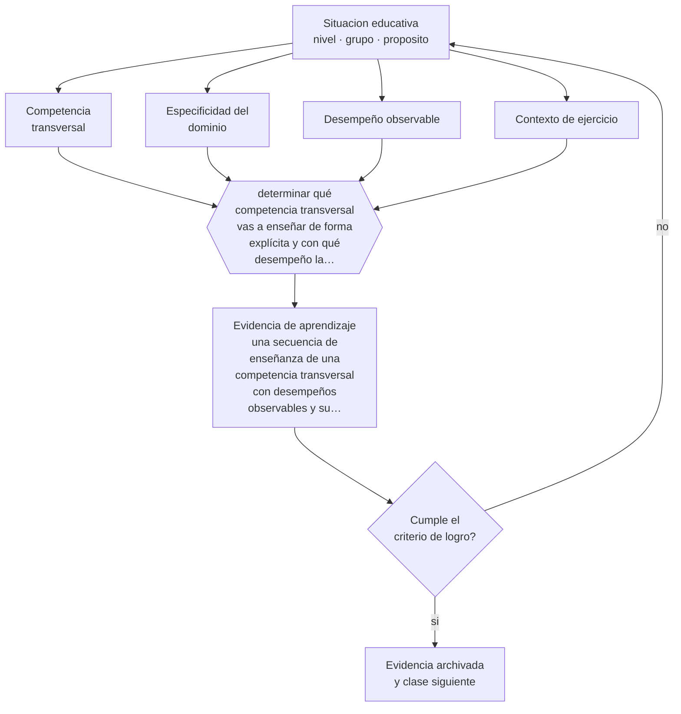

# Clase 082 — Competencias transversales

> **Parte 06 · Educación técnico-profesional** — clase 10 de 12

**Estado de evidencia:** `EN-DEBATE` · **Etapa:** 🔵 Etapa B — Enseñanza por ciclo vital · **Población de referencia:** formación técnica de nivel medio y superior, y capacitación de oficio 
**Decisión que habilita:** determinar qué competencia transversal vas a enseñar de forma explícita y con qué desempeño la evaluarás 
**Evidencia de aprendizaje:** una secuencia de enseñanza de una competencia transversal con desempeños observables y su evaluación

## 🎯 Propósito

Enseñar competencias transversales de forma específica y evaluable, evitando tanto su abandono como su tratamiento como cualidades genéricas que se declaran sin enseñarse.

## 📚 Resultados de aprendizaje

Al finalizar esta clase podrás:

1. **Definir** con precisión los cuatro conceptos centrales de la clase y reconocerlos en una situación educativa real, no solo en su enunciado.
2. **Explicar** qué se puede enseñar realmente cuando se habla de trabajo en equipo, comunicación y resolución de problemas.
3. **Decidir** —qué competencia transversal vas a enseñar de forma explícita y con qué desempeño la evaluarás— y sostener la decisión con un fundamento escrito.
4. **Producir** la evidencia de la clase —una secuencia de enseñanza de una competencia transversal con desempeños observables y su evaluación— y contrastarla contra el criterio de logro.
5. **Distinguir** lo que la evidencia sostiene de lo que es práctica instalada, preferencia personal o costumbre de la institución.

## 🧩 Conceptos centrales

| Concepto | Comprensión verificable |
|---|---|
| **Competencia transversal** | capacidad que atraviesa oficios: comunicación, trabajo en equipo, resolución de problemas, autonomía |
| **Especificidad del dominio** | dependencia de la competencia respecto del contenido y del contexto en que se ejerce |
| **Desempeño observable** | conducta concreta que permite evaluar la competencia sin recurrir a rasgos de personalidad |
| **Contexto de ejercicio** | situación del oficio en la que la competencia transversal se pone en juego |

## 🗺️ Flujo de razonamiento

## 📖 Desarrollo

### 1. El fondo del asunto

Las competencias transversales son las más demandadas por los empleadores y las peor enseñadas por las instituciones, porque se tratan como rasgos y no como desempeños. La evidencia sugiere que son fuertemente dependientes del dominio: alguien que comunica bien en su oficio no necesariamente lo hace en otro contexto. Por eso se enseñan situadas en tareas reales del oficio, con desempeños definidos, y no como talleres genéricos.

### 2. Cómo se traduce en decisiones de enseñanza

El procedimiento es el mismo que para cualquier competencia técnica: definir el desempeño observable en el contexto del oficio, modelarlo, practicarlo con retroalimentación y evaluarlo con criterios. «Trabajar en equipo» se convierte en «coordinar la entrega de un turno registrando lo pendiente y verificando que el receptor lo comprendió», que sí se puede enseñar y evaluar.

### 3. Qué sostiene la evidencia y qué no

Hay debate real sobre la transferibilidad de estas competencias entre contextos, y la evidencia sobre programas genéricos de habilidades blandas es débil. Además, muchos instrumentos de evaluación miden autopercepción y no desempeño. La posición defendible es enseñarlas situadas y evaluarlas por desempeño observado.

> **Cómo leer el estado de evidencia `EN-DEBATE`.** Hay desacuerdo activo y publicado entre especialistas competentes. La clase presenta las posiciones y sus argumentos; tu tarea no es escoger un bando, sino saber qué evidencia te haría cambiar de posición.

## 🧪 Taller guiado

Aplica la clase a **uno** de los contextos siguientes y repite después el ejercicio en un
contexto de exigencia distinta. Cambiar de contexto es parte del aprendizaje: lo que funciona
con un grupo no se traslada intacto a otro.

| Contexto | Rasgo que cambia la decisión |
|---|---|
| Taller de especialidad industrial | riesgo físico alto: la seguridad domina la secuencia |
| Especialidad de servicios o administración | el desempeño se observa en interacción y en producto documental |
| Especialidad de salud o alimentos | protocolo y trazabilidad son parte del estándar |
| Formación dual con empresa | el estándar se negocia con un tercero |
| Capacitación laboral de corta duración | tiempo mínimo y foco en una tarea crítica |
| Reconocimiento de aprendizajes previos | hay que evaluar competencias adquiridas fuera del aula |

**Secuencia de trabajo:**

1. Delimita el contexto: nivel, edad, tamaño del grupo, asignatura o experiencia y tiempo real disponible.
2. Declara qué saben ya los estudiantes y **cómo lo comprobaste**, no cómo lo supones.
3. Formula la decisión pedagógica que esta clase habilita y escribe su fundamento.
4. Anticipa qué observarías si la decisión funciona y qué observarías si no funciona.
5. Diseña de antemano la alternativa que aplicarás si la primera estrategia falla.
6. Ejecuta o simula, y registra lo observado con fecha, contexto y evidencia concreta.
7. Produce la evidencia de aprendizaje de la clase.
8. Contrástala contra el criterio de logro, corrige y recién entonces avanza.

### 📦 Evidencia de aprendizaje

Una secuencia de enseñanza de una competencia transversal con desempeños observables y su evaluación.

Debe incluir contexto, decisión, fundamento, fuentes consultadas con su fecha, indicador de
logro observable, riesgos previstos y qué harías distinto en la siguiente iteración.

## 🏆 Reto verificable

Traduce una competencia transversal de tu perfil a tres desempeños observables. Enséñalos y evalúalos en una tarea real del taller.

## ✅ Criterio de logro

- [ ] la competencia está traducida a desempeños observables en el contexto del oficio;
- [ ] la evaluación se basa en desempeño observado y no en autorreporte;
- [ ] cada afirmación sobre «lo que funciona» está atribuida a una fuente identificable, con autor y fecha;
- [ ] la decisión es ejecutable con el tiempo, el espacio, el número de estudiantes y los recursos que realmente tienes;
- [ ] la evidencia queda archivada de forma reproducible: otra persona podría revisarla sin que tú se la expliques.

## ⚠️ Errores frecuentes

**Propios de esta clase:**

- Enseñar habilidades transversales en talleres genéricos desconectados del oficio.
- Evaluar con escalas de autopercepción en vez de con desempeños observados.

**Característicos de la parte 06:**

- Evaluar el oficio con pruebas escritas en vez de desempeños observables.
- Redactar competencias que no se pueden observar ni graduar.

## ♿ Diversidad, accesibilidad y ética

Evaluar competencias transversales como rasgos de personalidad castiga sistemáticamente a estudiantes con perfiles neurodivergentes o de culturas comunicativas distintas. Definirlas como desempeños concretos y enseñables corrige ese sesgo.

Antes de aplicar cualquier decisión de esta clase con estudiantes reales, revisa el
[protocolo de práctica responsable](../../../docs/ETICA_Y_PRACTICA_RESPONSABLE.md):
consentimiento, resguardo de datos personales, proporcionalidad de la intervención y derecho
de cada estudiante a no ser objeto de un ensayo que no le reporta beneficio.

## ❓ Preguntas de comprobación

1. ¿Qué significa exactamente «trabaja bien en equipo» en tu especialidad?
2. ¿Dónde practican tus estudiantes esa competencia con retroalimentación?
3. ¿Qué estás midiendo cuando evalúas responsabilidad?

## 📕 Lecturas base

**OCDE. *Skills for Jobs* y estudios sobre competencias transversales.**  
*Qué aporta a esta clase:* documenta la demanda del sector y los problemas de medición de estas competencias.

**Tuning / Marco de cualificaciones. *Descriptores de competencias transversales*.**  
*Qué aporta a esta clase:* ejemplos de traducción de competencias genéricas a desempeños graduables.

Catálogo completo: [bibliografía del programa](../../../docs/BIBLIOGRAFIA.md) ·
[glosario](../../../docs/GLOSARIO.md) ·
[fuentes oficiales y cómo leerlas](../../../docs/FUENTES.md).

## 🔗 Conexión con el resto del programa

Se apoya en las clases 073 y 077 y alimenta la clase 083 y la parte 07.

> [!IMPORTANT]
> Material de formación profesional. No reemplaza un título de pedagogía, una habilitación
> legal para ejercer, ni el juicio de un equipo educativo que conoce a sus estudiantes.

---

| Anterior | Índice | Siguiente |
|---|---|---|
| [← 081 · Práctica profesional](../class-09-practica-profesional/README.md) | [Parte 06](../README.md) · [Programa](../../../README.md) | [083 · Empleabilidad y transición al trabajo →](../class-11-empleabilidad-y-transicion-al-trabajo/README.md) |
