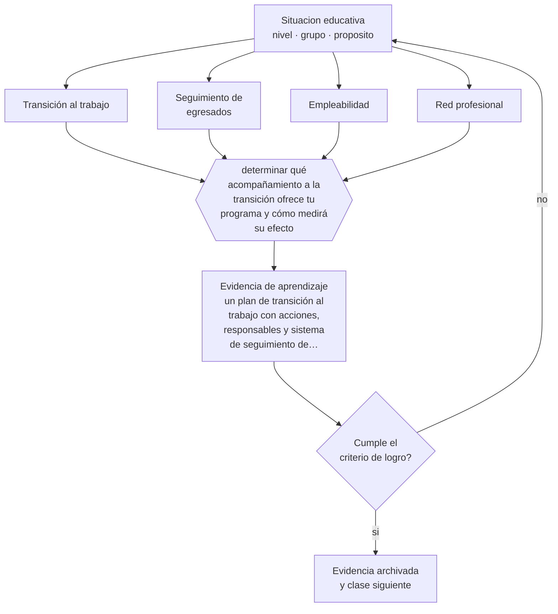

# Clase 083 — Empleabilidad y transición al trabajo

> **Parte 06 · Educación técnico-profesional** — clase 11 de 12

**Estado de evidencia:** `CONSISTENTE` · **Etapa:** 🔵 Etapa B — Enseñanza por ciclo vital · **Población de referencia:** formación técnica de nivel medio y superior, y capacitación de oficio 
**Decisión que habilita:** determinar qué acompañamiento a la transición ofrece tu programa y cómo medirá su efecto 
**Evidencia de aprendizaje:** un plan de transición al trabajo con acciones, responsables y sistema de seguimiento de egresados

## 🎯 Propósito

Diseñar el acompañamiento a la transición al trabajo con información, contactos, herramientas de búsqueda y seguimiento de egresados que retroalimente al programa.

## 📚 Resultados de aprendizaje

Al finalizar esta clase podrás:

1. **Definir** con precisión los cuatro conceptos centrales de la clase y reconocerlos en una situación educativa real, no solo en su enunciado.
2. **Explicar** qué hace la institución después de la titulación, que es cuando se juega el valor real de la formación.
3. **Decidir** —qué acompañamiento a la transición ofrece tu programa y cómo medirá su efecto— y sostener la decisión con un fundamento escrito.
4. **Producir** la evidencia de la clase —un plan de transición al trabajo con acciones, responsables y sistema de seguimiento de egresados— y contrastarla contra el criterio de logro.
5. **Distinguir** lo que la evidencia sostiene de lo que es práctica instalada, preferencia personal o costumbre de la institución.

## 🧩 Conceptos centrales

| Concepto | Comprensión verificable |
|---|---|
| **Transición al trabajo** | proceso entre la titulación y la inserción laboral estable |
| **Seguimiento de egresados** | recolección sistemática de información sobre trayectorias posteriores |
| **Empleabilidad** | conjunto de competencias, credenciales y redes que facilitan obtener y sostener un empleo |
| **Red profesional** | contactos del sector que abren acceso a oportunidades no publicadas |

## 🗺️ Flujo de razonamiento

## 📖 Desarrollo

### 1. El fondo del asunto

La formación técnica se evalúa finalmente por lo que ocurre después. La evidencia comparada muestra que la transición mejora con experiencia laboral previa durante la formación, con redes de contacto y con información concreta sobre el mercado, y no principalmente con talleres de currículum. Además, buena parte de las oportunidades no se publica: las redes que el estudiante no tiene son la barrera más grande.

### 2. Cómo se traduce en decisiones de enseñanza

Un plan realista combina experiencia laboral integrada, construcción deliberada de red —visitas, ferias, contacto con egresados—, herramientas concretas de postulación y un sistema de seguimiento a seis, doce y veinticuatro meses. El seguimiento no es solo rendición de cuentas: es la única fuente de información para saber si el perfil de egreso corresponde a lo que el sector requiere.

### 3. Qué sostiene la evidencia y qué no

La empleabilidad depende de factores fuera del control institucional: ciclo económico, oferta local, discriminación en la contratación. Atribuir al programa la totalidad del resultado es un error de interpretación frecuente, tanto para bien como para mal. Los indicadores deben leerse junto con el contexto del territorio.

> **Cómo leer el estado de evidencia `CONSISTENTE`.** La evidencia es amplia y coherente, pero proviene sobre todo de estudios correlacionales, de síntesis con heterogeneidad alta o de contextos distintos al tuyo. Sirve para orientar la decisión y exige que compruebes el efecto en tu propio grupo.

## 🧪 Taller guiado

Aplica la clase a **uno** de los contextos siguientes y repite después el ejercicio en un
contexto de exigencia distinta. Cambiar de contexto es parte del aprendizaje: lo que funciona
con un grupo no se traslada intacto a otro.

| Contexto | Rasgo que cambia la decisión |
|---|---|
| Taller de especialidad industrial | riesgo físico alto: la seguridad domina la secuencia |
| Especialidad de servicios o administración | el desempeño se observa en interacción y en producto documental |
| Especialidad de salud o alimentos | protocolo y trazabilidad son parte del estándar |
| Formación dual con empresa | el estándar se negocia con un tercero |
| Capacitación laboral de corta duración | tiempo mínimo y foco en una tarea crítica |
| Reconocimiento de aprendizajes previos | hay que evaluar competencias adquiridas fuera del aula |

**Secuencia de trabajo:**

1. Delimita el contexto: nivel, edad, tamaño del grupo, asignatura o experiencia y tiempo real disponible.
2. Declara qué saben ya los estudiantes y **cómo lo comprobaste**, no cómo lo supones.
3. Formula la decisión pedagógica que esta clase habilita y escribe su fundamento.
4. Anticipa qué observarías si la decisión funciona y qué observarías si no funciona.
5. Diseña de antemano la alternativa que aplicarás si la primera estrategia falla.
6. Ejecuta o simula, y registra lo observado con fecha, contexto y evidencia concreta.
7. Produce la evidencia de aprendizaje de la clase.
8. Contrástala contra el criterio de logro, corrige y recién entonces avanza.

### 📦 Evidencia de aprendizaje

Un plan de transición al trabajo con acciones, responsables y sistema de seguimiento de egresados.

Debe incluir contexto, decisión, fundamento, fuentes consultadas con su fecha, indicador de
logro observable, riesgos previstos y qué harías distinto en la siguiente iteración.

## 🏆 Reto verificable

Contacta a cinco egresados de tu programa titulados hace un año. Documenta sus trayectorias y traduce los hallazgos en un ajuste concreto del programa.

## ✅ Criterio de logro

- [ ] el plan incluye construcción de red y experiencia laboral, no solo herramientas de postulación;
- [ ] el seguimiento tiene periodicidad definida y retroalimenta el perfil de egreso;
- [ ] cada afirmación sobre «lo que funciona» está atribuida a una fuente identificable, con autor y fecha;
- [ ] la decisión es ejecutable con el tiempo, el espacio, el número de estudiantes y los recursos que realmente tienes;
- [ ] la evidencia queda archivada de forma reproducible: otra persona podría revisarla sin que tú se la expliques.

## ⚠️ Errores frecuentes

**Propios de esta clase:**

- Reducir el apoyo a la transición a un taller de currículum y entrevista.
- Interpretar los indicadores de empleabilidad sin considerar el contexto económico local.

**Característicos de la parte 06:**

- Evaluar el oficio con pruebas escritas en vez de desempeños observables.
- Redactar competencias que no se pueden observar ni graduar.

## ♿ Diversidad, accesibilidad y ética

Los estudiantes sin redes familiares en el sector, mujeres en especialidades masculinizadas y personas con discapacidad enfrentan barreras adicionales en la contratación. Un plan serio incluye acciones específicas para esas barreras y no solo apoyo genérico.

Antes de aplicar cualquier decisión de esta clase con estudiantes reales, revisa el
[protocolo de práctica responsable](../../../docs/ETICA_Y_PRACTICA_RESPONSABLE.md):
consentimiento, resguardo de datos personales, proporcionalidad de la intervención y derecho
de cada estudiante a no ser objeto de un ensayo que no le reporta beneficio.

## ❓ Preguntas de comprobación

1. ¿Qué red profesional tiene hoy un estudiante tuyo sin contactos familiares en el sector?
2. ¿Qué sabes de tus egresados a doce meses de titularse?
3. ¿Qué cambió en tu programa por lo que dijeron los egresados?

## 📕 Lecturas base

**OCDE. *Learning for Jobs* y estudios de transición educación-trabajo.**  
*Qué aporta a esta clase:* evidencia comparada sobre qué facilita la inserción laboral de egresados técnicos.

**Subsecretaría de Educación Superior (Chile). *Sistemas de información sobre empleabilidad e ingresos*.**  
*Qué aporta a esta clase:* fuente verificable para contrastar expectativas con datos reales de trayectorias.

Catálogo completo: [bibliografía del programa](../../../docs/BIBLIOGRAFIA.md) ·
[glosario](../../../docs/GLOSARIO.md) ·
[fuentes oficiales y cómo leerlas](../../../docs/FUENTES.md).

## 🔗 Conexión con el resto del programa

Cierra el ciclo abierto en la clase 069 y alimenta la parte 15, porque el seguimiento de egresados es un indicador de gestión institucional.

> [!IMPORTANT]
> Material de formación profesional. No reemplaza un título de pedagogía, una habilitación
> legal para ejercer, ni el juicio de un equipo educativo que conoce a sus estudiantes.

---

| Anterior | Índice | Siguiente |
|---|---|---|
| [← 082 · Competencias transversales](../class-10-competencias-transversales/README.md) | [Parte 06](../README.md) · [Programa](../../../README.md) | [084 · Proyecto integrador: módulo TP →](../class-12-proyecto-integrador-modulo-tp/README.md) |
