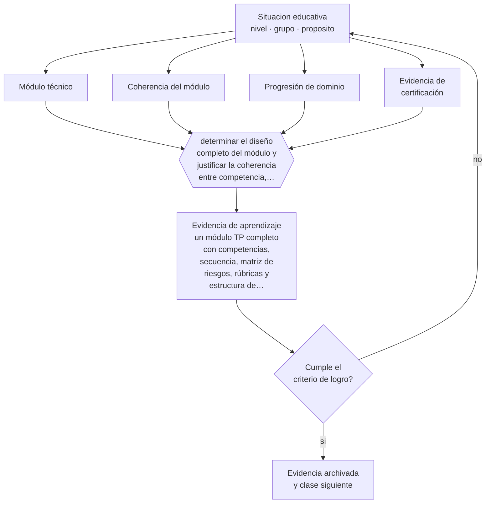

# Clase 084 — Proyecto integrador: módulo TP

> **Parte 06 · Educación técnico-profesional** — clase 12 de 12

**Estado de evidencia:** `MARCO-NORMATIVO` · **Etapa:** 🔵 Etapa B — Enseñanza por ciclo vital · **Población de referencia:** formación técnica de nivel medio y superior, y capacitación de oficio 
**Decisión que habilita:** determinar el diseño completo del módulo y justificar la coherencia entre competencia, enseñanza y evaluación 
**Evidencia de aprendizaje:** un módulo TP completo con competencias, secuencia, matriz de riesgos, rúbricas y estructura de portafolio

## 🎯 Propósito

Integrar la parte diseñando un módulo técnico-profesional completo: competencias, secuencia de taller, seguridad integrada, instrumentos de evaluación y portafolio.

## 📚 Resultados de aprendizaje

Al finalizar esta clase podrás:

1. **Definir** con precisión los cuatro conceptos centrales de la clase y reconocerlos en una situación educativa real, no solo en su enunciado.
2. **Explicar** cómo se construye un módulo técnico completo que resista una auditoría de calidad y forme de verdad.
3. **Decidir** —el diseño completo del módulo y justificar la coherencia entre competencia, enseñanza y evaluación— y sostener la decisión con un fundamento escrito.
4. **Producir** la evidencia de la clase —un módulo TP completo con competencias, secuencia, matriz de riesgos, rúbricas y estructura de portafolio— y contrastarla contra el criterio de logro.
5. **Distinguir** lo que la evidencia sostiene de lo que es práctica instalada, preferencia personal o costumbre de la institución.

## 🧩 Conceptos centrales

| Concepto | Comprensión verificable |
|---|---|
| **Módulo técnico** | unidad formativa que desarrolla competencias específicas del perfil de egreso |
| **Coherencia del módulo** | correspondencia entre competencia declarada, enseñanza diseñada y evaluación aplicada |
| **Progresión de dominio** | secuencia que lleva del desempeño asistido al desempeño autónomo con estándar |
| **Evidencia de certificación** | conjunto de evidencias que respalda la afirmación de competencia lograda |

## 🗺️ Flujo de razonamiento

## 📖 Desarrollo

### 1. El fondo del asunto

El proyecto integrador exige que todos los instrumentos de la parte funcionen juntos. La prueba de calidad es simple de enunciar y difícil de pasar: tomar una competencia declarada y seguirla hasta la evidencia que la certifica, comprobando que la enseñanza intermedia efectivamente la desarrolla. La mayoría de los módulos falla en algún punto de esa cadena.

### 2. Cómo se traduce en decisiones de enseñanza

El diseño se ordena desde la competencia: estándar, evidencias, progresión de taller, matriz de riesgos incorporada a los criterios, rúbricas calibradas y estructura de portafolio. Después se ejecuta al menos una parte y se documenta la diferencia entre lo diseñado y lo ocurrido, que es donde aparece el aprendizaje profesional.

### 3. Qué sostiene la evidencia y qué no

Un módulo bien diseñado no garantiza aprendizaje: depende de tiempo real, equipamiento disponible, tamaño del grupo y competencia del docente de taller. Declarar esas condiciones como supuestos del diseño es parte del rigor, y permite explicar los resultados sin atribuirlos a los estudiantes.

> **Cómo leer el estado de evidencia `MARCO-NORMATIVO`.** El contenido no se decide por evidencia empírica sino por norma, política pública o marco institucional vigente. Verifica siempre la versión vigente a la fecha en que vas a aplicarlo: la norma cambia y la clase no se actualiza sola.

## 🧪 Taller guiado

Aplica la clase a **uno** de los contextos siguientes y repite después el ejercicio en un
contexto de exigencia distinta. Cambiar de contexto es parte del aprendizaje: lo que funciona
con un grupo no se traslada intacto a otro.

| Contexto | Rasgo que cambia la decisión |
|---|---|
| Taller de especialidad industrial | riesgo físico alto: la seguridad domina la secuencia |
| Especialidad de servicios o administración | el desempeño se observa en interacción y en producto documental |
| Especialidad de salud o alimentos | protocolo y trazabilidad son parte del estándar |
| Formación dual con empresa | el estándar se negocia con un tercero |
| Capacitación laboral de corta duración | tiempo mínimo y foco en una tarea crítica |
| Reconocimiento de aprendizajes previos | hay que evaluar competencias adquiridas fuera del aula |

**Secuencia de trabajo:**

1. Delimita el contexto: nivel, edad, tamaño del grupo, asignatura o experiencia y tiempo real disponible.
2. Declara qué saben ya los estudiantes y **cómo lo comprobaste**, no cómo lo supones.
3. Formula la decisión pedagógica que esta clase habilita y escribe su fundamento.
4. Anticipa qué observarías si la decisión funciona y qué observarías si no funciona.
5. Diseña de antemano la alternativa que aplicarás si la primera estrategia falla.
6. Ejecuta o simula, y registra lo observado con fecha, contexto y evidencia concreta.
7. Produce la evidencia de aprendizaje de la clase.
8. Contrástala contra el criterio de logro, corrige y recién entonces avanza.

### 📦 Evidencia de aprendizaje

Un módulo TP completo con competencias, secuencia, matriz de riesgos, rúbricas y estructura de portafolio.

Debe incluir contexto, decisión, fundamento, fuentes consultadas con su fecha, indicador de
logro observable, riesgos previstos y qué harías distinto en la siguiente iteración.

## 🏆 Reto verificable

Ejecuta una parte del módulo y audita la cadena completa con un colega. Documenta dónde se rompió y corrígelo antes de la siguiente cohorte.

## ✅ Criterio de logro

- [ ] la cadena competencia-enseñanza-evidencia es trazable de principio a fin;
- [ ] la seguridad está integrada como criterio de desempeño y no como módulo aparte;
- [ ] cada afirmación sobre «lo que funciona» está atribuida a una fuente identificable, con autor y fecha;
- [ ] la decisión es ejecutable con el tiempo, el espacio, el número de estudiantes y los recursos que realmente tienes;
- [ ] la evidencia queda archivada de forma reproducible: otra persona podría revisarla sin que tú se la expliques.

## ⚠️ Errores frecuentes

**Propios de esta clase:**

- Diseñar el módulo desde las actividades disponibles en vez de desde la competencia.
- Certificar competencias con evidencia insuficiente por falta de tiempo o equipamiento.

**Característicos de la parte 06:**

- Evaluar el oficio con pruebas escritas en vez de desempeños observables.
- Redactar competencias que no se pueden observar ni graduar.

## ♿ Diversidad, accesibilidad y ética

El módulo debe declarar cómo un estudiante con discapacidad demostrará la misma competencia, con qué apoyos y bajo qué condiciones de seguridad. Resolverlo en el diseño evita improvisar cuando el estudiante ya está en el taller.

Antes de aplicar cualquier decisión de esta clase con estudiantes reales, revisa el
[protocolo de práctica responsable](../../../docs/ETICA_Y_PRACTICA_RESPONSABLE.md):
consentimiento, resguardo de datos personales, proporcionalidad de la intervención y derecho
de cada estudiante a no ser objeto de un ensayo que no le reporta beneficio.

## ❓ Preguntas de comprobación

1. ¿Qué eslabón de tu cadena competencia-enseñanza-evidencia no resiste una revisión?
2. ¿Qué condición material impide certificar con la evidencia que definiste?
3. ¿Qué harías si tuvieras la mitad del tiempo y el doble de estudiantes?

## 📕 Lecturas base

**Mineduc. *Bases Curriculares de la Formación Diferenciada Técnico-Profesional*.**  
*Qué aporta a esta clase:* referencia obligatoria de módulos, competencias y evaluación del nivel.

**Baartman, L. et al. (2007). *Evaluating Assessment Quality in Competence-Based Education*.**  
*Qué aporta a esta clase:* criterios para auditar la calidad de un sistema de evaluación por competencias.

Catálogo completo: [bibliografía del programa](../../../docs/BIBLIOGRAFIA.md) ·
[glosario](../../../docs/GLOSARIO.md) ·
[fuentes oficiales y cómo leerlas](../../../docs/FUENTES.md).

## 🔗 Conexión con el resto del programa

Cierra la parte 06 integrando sus once clases previas y se conecta con la parte 09 y con la parte 11.

> [!IMPORTANT]
> Material de formación profesional. No reemplaza un título de pedagogía, una habilitación
> legal para ejercer, ni el juicio de un equipo educativo que conoce a sus estudiantes.

---

| Anterior | Índice | Siguiente |
|---|---|---|
| [← 083 · Empleabilidad y transición al trabajo](../class-11-empleabilidad-y-transicion-al-trabajo/README.md) | [Parte 06](../README.md) · [Programa](../../../README.md) | [Programa completo →](../../../README.md) |
