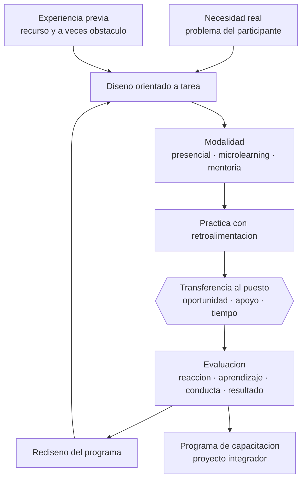

# Parte 07 — Educación de adultos y andragogía

> *El adulto no llega vacío: llega con experiencia, con prisa y con motivos propios*

🔵 **Etapa B — Enseñanza por ciclo vital** · salida de la etapa: enseñar a una población concreta con decisiones ajustadas a su desarrollo

**Clases:** 12 (085–096) · **Población de referencia:** educación de adultos, capacitación laboral y formación continua · **Conceptos operacionales:** 48 · **Señales observables:** 36 
**Contenido central:** Andragogía, experiencia previa como recurso, aprendizaje autodirigido, motivación, capacitación laboral, reskilling, microlearning, mentoría, coaching, aprendizaje experiencial y evaluación

## 🎯 De qué trata esta parte

Enseñar a adultos cambia tres condiciones a la vez: el tiempo es escaso y compite con trabajo y familia, la experiencia previa es abundante y a veces obstaculiza, y la motivación es instrumental —se aprende para resolver algo concreto—. Cualquier diseño que ignore estas tres condiciones produce el resultado conocido: alta inscripción, baja asistencia y transferencia nula al puesto de trabajo.

La andragogía clásica aportó los supuestos correctos —autonomía, experiencia, orientación a problemas, motivación interna— pero su estatus como teoría es discutido: describe bien al adulto típico de la formación voluntaria y describe mal al adulto obligado a capacitarse, al que retoma estudios interrumpidos o al que llega con baja confianza académica. Esta parte usa sus supuestos como hipótesis de diseño, no como ley, y los contrasta con la evidencia sobre transferencia de la capacitación.

El eje práctico es la transferencia. La pregunta que ordena la parte no es si el participante quedó satisfecho, sino si algo cambió en su desempeño después. La investigación sobre evaluación de la capacitación muestra que la satisfacción correlaciona poco con el aprendizaje y menos aún con el cambio de conducta, y que la transferencia depende de factores del entorno —apoyo de la jefatura, oportunidad de aplicar, tiempo— tanto como del diseño instruccional.

## 🏫 Caso de la parte

Las doce clases trabajan sobre la misma realidad, para que puedas ver cómo cambia tu diagnóstico
a medida que avanzas:

> El sostenedor contrató una capacitación de 16 horas en evaluación formativa para los 42 docentes. Todos la evaluaron con nota alta y, tres meses después, ninguna práctica de aula cambió.

**Artefacto que produces al terminar:** programa de capacitación ejecutable por otro formador, con diagnóstico, plan de transferencia acordado y evaluación más allá de la satisfacción.

## 📚 Resultados de la parte

Al terminar esta parte podrás:

1. **Diseñar formación de adultos que parta del problema real del participante**.
2. **Convertir la experiencia previa en recurso de aprendizaje y detectar cuándo interfiere**.
3. **Planificar la transferencia al puesto de trabajo desde el diseño, no después del curso**.
4. **Evaluar un programa de capacitación más allá de la satisfacción del participante**.

## 🗺️ Mapa de la parte

## 🧠 Marco de referencia

- supuestos andragógicos y sus límites reconocidos
- aprendizaje experiencial y reflexión sobre la práctica
- aprendizaje transformador en trayectorias adultas
- modelos de evaluación de la capacitación y evidencia sobre transferencia

**Autoras y autores que conviene conocer:** Malcolm Knowles, David Kolb, Jack Mezirow, Sharan Merriam, Knud Illeris, Raymond Wlodkowski, Donald Kirkpatrick y sus críticos

## 📋 Las 12 clases

| # | Clase | Decisión que habilita | Evidencia |
|---:|---|---|---|
| 085 | [Principios de andragogía](class-01-principios-de-andragogia/README.md) | determinar qué supuesto andragógico se cumple en tu grupo real y cuál no | `EN-DEBATE` |
| 086 | [Experiencia previa como recurso](class-02-experiencia-previa-como-recurso/README.md) | determinar qué experiencia previa vas a usar como anclaje y cuál vas a confrontar | `CONSISTENTE` |
| 087 | [Aprendizaje autodirigido](class-03-aprendizaje-autodirigido/README.md) | determinar qué apoyos a la autorregulación incorporará tu programa para sostener el trabajo autónomo | `CONSISTENTE` |
| 088 | [Motivación en adultos](class-04-motivacion-en-adultos/README.md) | determinar qué determinante motivacional está bloqueando la participación real de tu grupo | `CONSISTENTE` |
| 089 | [Capacitación laboral](class-05-capacitacion-laboral/README.md) | determinar qué desempeño debe cambiar en el puesto y qué condiciones organizacionales lo permitirán | `CONSISTENTE` |
| 090 | [Reskilling y upskilling](class-06-reskilling-y-upskilling/README.md) | determinar qué brecha específica separa el perfil actual del perfil objetivo y en qué orden se cierra | `EMERGENTE` |
| 091 | [Microlearning](class-07-microlearning/README.md) | determinar si tu objetivo se puede lograr con un formato breve o si exige sesiones extensas | `EMERGENTE` |
| 092 | [Mentoría](class-08-mentoria/README.md) | determinar qué estructura mínima necesita tu programa de mentoría para producir resultados verificables | `CONSISTENTE` |
| 093 | [Coaching educativo](class-09-coaching-educativo/README.md) | determinar si la situación requiere coaching, mentoría, supervisión o derivación a otro profesional | `EN-DEBATE` |
| 094 | [Aprendizaje experiencial](class-10-aprendizaje-experiencial/README.md) | determinar cómo estructurarás la reflexión para que la experiencia produzca aprendizaje transferible | `CONSISTENTE` |
| 095 | [Evaluación en formación de adultos](class-11-evaluacion-en-formacion-de-adultos/README.md) | determinar qué nivel de evaluación necesitas realmente y qué instrumento lo hace viable | `CONSISTENTE` |
| 096 | [Proyecto integrador: programa de capacitación](class-12-proyecto-integrador-programa-de-capacitacion/README.md) | determinar el diseño completo del programa y qué evidencia probará que produjo cambio en el desempeño | `CONSISTENTE` |

## ⚠️ Riesgos característicos

- Diseñar para el contenido y no para el problema que el adulto necesita resolver.
- Ignorar que la experiencia previa puede sostener creencias erróneas resistentes.
- Medir el éxito con encuestas de satisfacción al final de la sesión.
- Programar sin considerar el tiempo real disponible de quien trabaja.

## 📕 Lecturas de referencia de la parte

- **Knowles, M. (1984). *The Adult Learner: A Neglected Species*.** — el planteamiento clásico de la andragogía; léelo sabiendo que sus supuestos son hipótesis útiles, no leyes verificadas. **Localizar:** [ficha](../../docs/REGISTRO_DE_FUENTES.md#knowles-1984-the-adult-learner-a-neglected-species) — sin localizador verificado todavía.
- **Kolb, D. (1984). *Experiential Learning*.** — modelo del ciclo experiencial; su valor está en el diseño de la reflexión, no en los tipos de estilo que se le derivaron. **Localizar:** [ISBN 9780768682151](https://openlibrary.org/isbn/9780768682151) · [ficha](../../docs/REGISTRO_DE_FUENTES.md#kolb-1984-experiential-learning)
- **Mezirow, J. (1991). *Transformative Dimensions of Adult Learning*.** — explica el aprendizaje que reorganiza supuestos, típico de trayectorias adultas de reconversión. **Localizar:** [ISBN 9781555423391](https://openlibrary.org/isbn/9781555423391) · [ficha](../../docs/REGISTRO_DE_FUENTES.md#mezirow-1991-transformative-dimensions-of-adult-learning)
- **Merriam, S. & Bierema, L. (2013). *Adult Learning: Linking Theory and Practice*.** — síntesis actualizada y crítica del campo; buena para separar evidencia de tradición. **Localizar:** [ficha](../../docs/REGISTRO_DE_FUENTES.md#merriam-bierema-2013-adult-learning-linking-theory-and-practice) — sin localizador verificado todavía.

## ✅ Evidencia mínima para dar la parte por cerrada

- [ ] un diagnóstico de necesidades con evidencia y no con suposición;
- [ ] un diseño de programa con objetivos de desempeño y plan de transferencia;
- [ ] un instrumento de evaluación en al menos dos niveles distintos de la satisfacción;
- [ ] el informe de resultados con recomendaciones de rediseño.

## 🧭 Práctica y evaluación de la parte

- [Rúbrica maestra e instrumentos de autoevaluación](../../assessments/README.md)
- [Casos profesionales para resolver con este marco](../../cases/README.md)
- [Laboratorios de decisión](../../labs/README.md)
- [Dónde se archiva la evidencia](../../evidence/README.md)

---

| Anterior | Índice | Siguiente |
|---|---|---|
| [← Parte 06 · Educación técnico-profesional](../part-06-educacion-tecnico-profesional/README.md) | [Programa](../../README.md) · [Currículo](../../CURRICULUM.md) | [Parte 08 · Inclusión y educación especial →](../part-08-inclusion-y-educacion-especial/README.md) |
