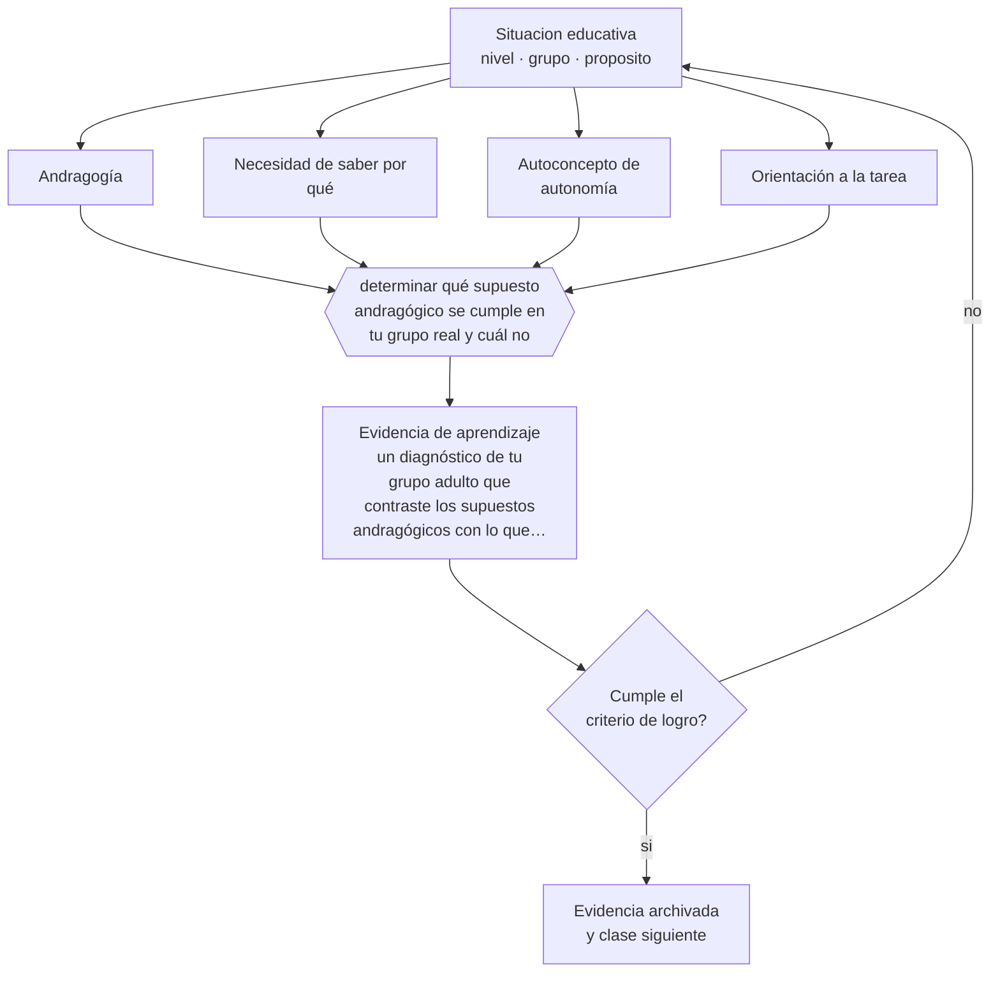

# Clase 085 — Principios de andragogía

> **Parte 07 · Educación de adultos y andragogía** — clase 1 de 12

**Estado de evidencia:** `EN-DEBATE` · **Etapa:** 🔵 Etapa B — Enseñanza por ciclo vital · **Población de referencia:** educación de adultos, capacitación laboral y formación continua 
**Decisión que habilita:** determinar qué supuesto andragógico se cumple en tu grupo real y cuál no 
**Evidencia de aprendizaje:** un diagnóstico de tu grupo adulto que contraste los supuestos andragógicos con lo que efectivamente observas

## 🎯 Propósito

Usar los supuestos andragógicos —autonomía, experiencia, orientación a problemas, motivación interna, necesidad de saber por qué— como hipótesis de diseño verificables, y no como leyes del aprendizaje adulto.

## 📚 Resultados de aprendizaje

Al finalizar esta clase podrás:

1. **Definir** con precisión los cuatro conceptos centrales de la clase y reconocerlos en una situación educativa real, no solo en su enunciado.
2. **Explicar** qué supuestos sobre el adulto que aprende son útiles como hipótesis de diseño y cuáles se repiten sin evidencia.
3. **Decidir** —qué supuesto andragógico se cumple en tu grupo real y cuál no— y sostener la decisión con un fundamento escrito.
4. **Producir** la evidencia de la clase —un diagnóstico de tu grupo adulto que contraste los supuestos andragógicos con lo que efectivamente observas— y contrastarla contra el criterio de logro.
5. **Distinguir** lo que la evidencia sostiene de lo que es práctica instalada, preferencia personal o costumbre de la institución.

## 🧩 Conceptos centrales

| Concepto | Comprensión verificable |
|---|---|
| **Andragogía** | conjunto de supuestos sobre cómo aprenden los adultos, formulado como alternativa a la pedagogía escolar |
| **Necesidad de saber por qué** | exigencia adulta de comprender la utilidad de lo que se le pide aprender |
| **Autoconcepto de autonomía** | imagen de sí mismo como persona que decide; se resiente con formatos escolares infantilizantes |
| **Orientación a la tarea** | preferencia por aprendizajes organizados en torno a problemas reales y no a materias |

## 🗺️ Flujo de razonamiento

## 📖 Desarrollo

### 1. El fondo del asunto

Los supuestos andragógicos describen bien a un adulto concreto: el que asiste voluntariamente, con experiencia relevante y motivación clara. Describen mal al que fue enviado por su jefatura, al que retoma estudios interrumpidos con historia de fracaso o al que carece de base en la materia. Tratar los supuestos como universales lleva a diseños que suponen autonomía donde hay inseguridad y experiencia donde hay vacío.

### 2. Cómo se traduce en decisiones de enseñanza

El uso profesional es diagnóstico: antes de diseñar, comprobar cuál de los supuestos se cumple en este grupo. Si el grupo no eligió estar, hay que ganar la relevancia explícitamente. Si tiene poca base, el andamiaje debe ser mayor, no menor. Si trae experiencia contradictoria con lo que se enseñará, hay que hacerla explícita antes de intentar corregirla.

### 3. Qué sostiene la evidencia y qué no

La andragogía ha sido criticada por su débil base empírica: sus supuestos son razonables y poco contrastados con diseños rigurosos. Además, las diferencias entre adultos y adolescentes son de grado y de contexto más que de mecanismo cognitivo: la memoria de trabajo, la carga y la práctica de recuperación funcionan igual en ambos.

> **Cómo leer el estado de evidencia `EN-DEBATE`.** Hay desacuerdo activo y publicado entre especialistas competentes. La clase presenta las posiciones y sus argumentos; tu tarea no es escoger un bando, sino saber qué evidencia te haría cambiar de posición.

## 🧪 Taller guiado

Aplica la clase a **uno** de los contextos siguientes y repite después el ejercicio en un
contexto de exigencia distinta. Cambiar de contexto es parte del aprendizaje: lo que funciona
con un grupo no se traslada intacto a otro.

| Contexto | Rasgo que cambia la decisión |
|---|---|
| Capacitación obligatoria en empresa | el participante no eligió estar: hay que ganar la relevancia |
| Formación voluntaria de perfeccionamiento | alta motivación y alta exigencia de utilidad |
| Educación de adultos que retoma estudios | historia escolar previa, muchas veces negativa |
| Reconversión laboral o reskilling | urgencia económica y necesidad de resultado rápido |
| Formación en línea asincrónica | la deserción es el riesgo principal |
| Mentoría o acompañamiento individual | la relación es el vehículo del aprendizaje |

**Secuencia de trabajo:**

1. Delimita el contexto: nivel, edad, tamaño del grupo, asignatura o experiencia y tiempo real disponible.
2. Declara qué saben ya los estudiantes y **cómo lo comprobaste**, no cómo lo supones.
3. Formula la decisión pedagógica que esta clase habilita y escribe su fundamento.
4. Anticipa qué observarías si la decisión funciona y qué observarías si no funciona.
5. Diseña de antemano la alternativa que aplicarás si la primera estrategia falla.
6. Ejecuta o simula, y registra lo observado con fecha, contexto y evidencia concreta.
7. Produce la evidencia de aprendizaje de la clase.
8. Contrástala contra el criterio de logro, corrige y recién entonces avanza.

### 📦 Evidencia de aprendizaje

Un diagnóstico de tu grupo adulto que contraste los supuestos andragógicos con lo que efectivamente observas.

Debe incluir contexto, decisión, fundamento, fuentes consultadas con su fecha, indicador de
logro observable, riesgos previstos y qué harías distinto en la siguiente iteración.

## 🏆 Reto verificable

Aplica un diagnóstico breve a un grupo adulto real y contrástalo con los supuestos. Ajusta dos decisiones de diseño a partir de los supuestos que no se cumplen.

## ✅ Criterio de logro

- [ ] el diagnóstico contrasta cada supuesto con evidencia observada del grupo real;
- [ ] las decisiones de diseño se ajustan a los supuestos que no se cumplen;
- [ ] cada afirmación sobre «lo que funciona» está atribuida a una fuente identificable, con autor y fecha;
- [ ] la decisión es ejecutable con el tiempo, el espacio, el número de estudiantes y los recursos que realmente tienes;
- [ ] la evidencia queda archivada de forma reproducible: otra persona podría revisarla sin que tú se la expliques.

## ⚠️ Errores frecuentes

**Propios de esta clase:**

- Suponer autonomía y experiencia en un grupo que no las tiene y retirar el andamiaje.
- Aplicar formatos escolares infantilizantes a adultos y perder legitimidad en la primera sesión.

**Característicos de la parte 07:**

- Diseñar para el contenido y no para el problema que el adulto necesita resolver.
- Ignorar que la experiencia previa puede sostener creencias erróneas resistentes.

## ♿ Diversidad, accesibilidad y ética

Los adultos con menor escolaridad previa suelen ser los que más apoyo necesitan y los que menos lo piden, por temor a exponerse. Un diseño que ofrece apoyo por defecto, sin obligar a solicitarlo, evita esa barrera de vergüenza.

Antes de aplicar cualquier decisión de esta clase con estudiantes reales, revisa el
[protocolo de práctica responsable](../../../docs/ETICA_Y_PRACTICA_RESPONSABLE.md):
consentimiento, resguardo de datos personales, proporcionalidad de la intervención y derecho
de cada estudiante a no ser objeto de un ensayo que no le reporta beneficio.

## ❓ Preguntas de comprobación

1. ¿Tu grupo eligió estar aquí?
2. ¿Qué experiencia previa relevante tiene realmente, y cómo lo comprobaste?
3. ¿Qué parte de tu diseño supone una autonomía que este grupo aún no tiene?

## 📕 Lecturas base

**Knowles, M. (1984). *The Adult Learner*.**  
*Qué aporta a esta clase:* la formulación clásica de los supuestos; imprescindible como referencia y como objeto de crítica.

**Merriam, S. & Bierema, L. (2013). *Adult Learning: Linking Theory and Practice*.**  
*Qué aporta a esta clase:* revisa críticamente la andragogía y separa lo respaldado de lo asumido.

Catálogo completo: [bibliografía del programa](../../../docs/BIBLIOGRAFIA.md) ·
[glosario](../../../docs/GLOSARIO.md) ·
[fuentes oficiales y cómo leerlas](../../../docs/FUENTES.md).

## 🔗 Conexión con el resto del programa

Abre la parte 07 y se apoya en la clase 033. Sus resultados condicionan las decisiones de las clases 088 y 096.

> [!IMPORTANT]
> Material de formación profesional. No reemplaza un título de pedagogía, una habilitación
> legal para ejercer, ni el juicio de un equipo educativo que conoce a sus estudiantes.

---

| Anterior | Índice | Siguiente |
|---|---|---|
| [← Parte 07](../README.md) | [Parte 07](../README.md) · [Programa](../../../README.md) | [086 · Experiencia previa como recurso →](../class-02-experiencia-previa-como-recurso/README.md) |
