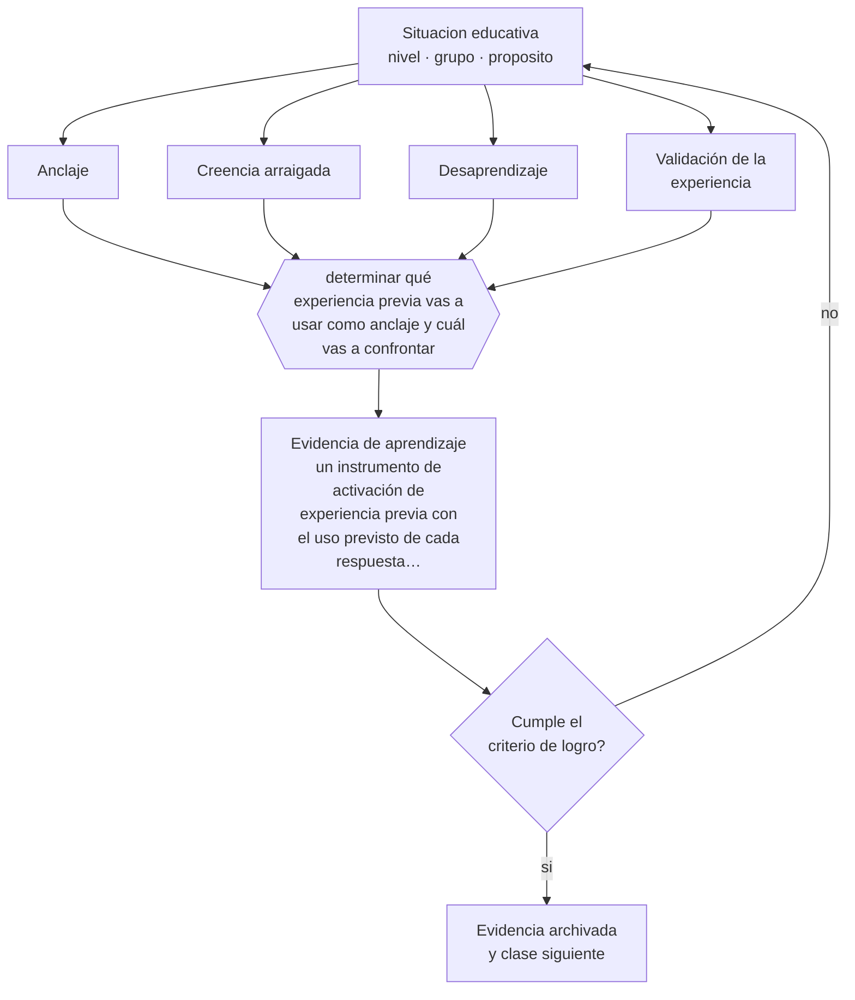

# Clase 086 — Experiencia previa como recurso

> **Parte 07 · Educación de adultos y andragogía** — clase 2 de 12

**Estado de evidencia:** `CONSISTENTE` · **Etapa:** 🔵 Etapa B — Enseñanza por ciclo vital · **Población de referencia:** educación de adultos, capacitación laboral y formación continua 
**Decisión que habilita:** determinar qué experiencia previa vas a usar como anclaje y cuál vas a confrontar 
**Evidencia de aprendizaje:** un instrumento de activación de experiencia previa con el uso previsto de cada respuesta esperada

## 🎯 Propósito

Convertir la experiencia previa del participante en recurso didáctico y detectar cuándo sostiene creencias erróneas que la formación deberá confrontar de manera explícita.

## 📚 Resultados de aprendizaje

Al finalizar esta clase podrás:

1. **Definir** con precisión los cuatro conceptos centrales de la clase y reconocerlos en una situación educativa real, no solo en su enunciado.
2. **Explicar** cuándo la experiencia previa acelera el aprendizaje y cuándo lo bloquea.
3. **Decidir** —qué experiencia previa vas a usar como anclaje y cuál vas a confrontar— y sostener la decisión con un fundamento escrito.
4. **Producir** la evidencia de la clase —un instrumento de activación de experiencia previa con el uso previsto de cada respuesta esperada— y contrastarla contra el criterio de logro.
5. **Distinguir** lo que la evidencia sostiene de lo que es práctica instalada, preferencia personal o costumbre de la institución.

## 🧩 Conceptos centrales

| Concepto | Comprensión verificable |
|---|---|
| **Anclaje** | conexión entre el contenido nuevo y una experiencia previa que le da sentido |
| **Creencia arraigada** | idea sostenida por experiencia personal, resistente al argumento y frecuente en adultos con oficio |
| **Desaprendizaje** | proceso de abandonar una práctica o creencia consolidada; más costoso que aprender algo nuevo |
| **Validación de la experiencia** | reconocimiento explícito de lo que el participante sabe antes de corregir lo que sabe mal |

## 🗺️ Flujo de razonamiento

## 📖 Desarrollo

### 1. El fondo del asunto

La experiencia adulta es un recurso y un obstáculo a la vez. Un técnico con quince años de oficio aprende rápido lo que se conecta con su práctica y se resiste a lo que la contradice, sobre todo si su método le ha funcionado. Ese desaprendizaje es costoso y no ocurre por autoridad del instructor: requiere evidencia que el participante pueda comprobar y un reconocimiento previo de lo que sí sabe hacer.

### 2. Cómo se traduce en decisiones de enseñanza

El instrumento de activación cumple dos funciones: revela qué experiencia existe y expone las creencias que habrá que confrontar. La secuencia eficaz reconoce primero lo válido de la práctica actual, muestra después la situación donde falla, y solo entonces ofrece la alternativa. Invertir ese orden produce resistencia inmediata y pérdida de credibilidad del formador.

### 3. Qué sostiene la evidencia y qué no

No toda creencia arraigada es errónea: a veces el participante sabe algo del contexto real que el diseño de formación ignora. Un formador que descarta la experiencia por principio pierde información valiosa y credibilidad. La regla es tratarla como hipótesis a comprobar, en ambas direcciones.

> **Cómo leer el estado de evidencia `CONSISTENTE`.** La evidencia es amplia y coherente, pero proviene sobre todo de estudios correlacionales, de síntesis con heterogeneidad alta o de contextos distintos al tuyo. Sirve para orientar la decisión y exige que compruebes el efecto en tu propio grupo.

## 🧪 Taller guiado

Aplica la clase a **uno** de los contextos siguientes y repite después el ejercicio en un
contexto de exigencia distinta. Cambiar de contexto es parte del aprendizaje: lo que funciona
con un grupo no se traslada intacto a otro.

| Contexto | Rasgo que cambia la decisión |
|---|---|
| Capacitación obligatoria en empresa | el participante no eligió estar: hay que ganar la relevancia |
| Formación voluntaria de perfeccionamiento | alta motivación y alta exigencia de utilidad |
| Educación de adultos que retoma estudios | historia escolar previa, muchas veces negativa |
| Reconversión laboral o reskilling | urgencia económica y necesidad de resultado rápido |
| Formación en línea asincrónica | la deserción es el riesgo principal |
| Mentoría o acompañamiento individual | la relación es el vehículo del aprendizaje |

**Secuencia de trabajo:**

1. Delimita el contexto: nivel, edad, tamaño del grupo, asignatura o experiencia y tiempo real disponible.
2. Declara qué saben ya los estudiantes y **cómo lo comprobaste**, no cómo lo supones.
3. Formula la decisión pedagógica que esta clase habilita y escribe su fundamento.
4. Anticipa qué observarías si la decisión funciona y qué observarías si no funciona.
5. Diseña de antemano la alternativa que aplicarás si la primera estrategia falla.
6. Ejecuta o simula, y registra lo observado con fecha, contexto y evidencia concreta.
7. Produce la evidencia de aprendizaje de la clase.
8. Contrástala contra el criterio de logro, corrige y recién entonces avanza.

### 📦 Evidencia de aprendizaje

Un instrumento de activación de experiencia previa con el uso previsto de cada respuesta esperada.

Debe incluir contexto, decisión, fundamento, fuentes consultadas con su fecha, indicador de
logro observable, riesgos previstos y qué harías distinto en la siguiente iteración.

## 🏆 Reto verificable

Aplica tu instrumento a un grupo real. Escoge la creencia errónea más extendida y diseña la evidencia que permitirá al propio participante detectar el problema.

## ✅ Criterio de logro

- [ ] el instrumento anticipa qué creencias erróneas revelará y cómo se confrontarán;
- [ ] el diseño reconoce explícitamente la experiencia válida antes de proponer el cambio;
- [ ] cada afirmación sobre «lo que funciona» está atribuida a una fuente identificable, con autor y fecha;
- [ ] la decisión es ejecutable con el tiempo, el espacio, el número de estudiantes y los recursos que realmente tienes;
- [ ] la evidencia queda archivada de forma reproducible: otra persona podría revisarla sin que tú se la expliques.

## ⚠️ Errores frecuentes

**Propios de esta clase:**

- Corregir la práctica del participante antes de reconocer lo que su experiencia tiene de válido.
- Descartar objeciones basadas en experiencia sin comprobar si el diseño ignora algo del contexto real.

**Característicos de la parte 07:**

- Diseñar para el contenido y no para el problema que el adulto necesita resolver.
- Ignorar que la experiencia previa puede sostener creencias erróneas resistentes.

## ♿ Diversidad, accesibilidad y ética

Reconocer la experiencia adquirida fuera del sistema formal es un acto de inclusión concreto para trabajadores sin credenciales. En Chile y en otros sistemas existen procedimientos de reconocimiento de aprendizajes previos que conviene conocer y usar.

Antes de aplicar cualquier decisión de esta clase con estudiantes reales, revisa el
[protocolo de práctica responsable](../../../docs/ETICA_Y_PRACTICA_RESPONSABLE.md):
consentimiento, resguardo de datos personales, proporcionalidad de la intervención y derecho
de cada estudiante a no ser objeto de un ensayo que no le reporta beneficio.

## ❓ Preguntas de comprobación

1. ¿Qué cree tu grupo que sabe hacer bien y en realidad hace mal?
2. ¿Qué evidencia comprobable por ellos mismos mostraría el problema?
3. ¿Qué te está diciendo su objeción sobre el contexto real que tu diseño ignora?

## 📕 Lecturas base

**Mezirow, J. (1991). *Transformative Dimensions of Adult Learning*.**  
*Qué aporta a esta clase:* explica cómo se revisan supuestos consolidados y qué condiciones lo hacen posible.

**Schön, D. (1983). *The Reflective Practitioner*.**  
*Qué aporta a esta clase:* describe el conocimiento en la acción del profesional experimentado y su resistencia al cambio.

Catálogo completo: [bibliografía del programa](../../../docs/BIBLIOGRAFIA.md) ·
[glosario](../../../docs/GLOSARIO.md) ·
[fuentes oficiales y cómo leerlas](../../../docs/FUENTES.md).

## 🔗 Conexión con el resto del programa

Se apoya en la clase 015 y alimenta las clases 089 y 094.

> [!IMPORTANT]
> Material de formación profesional. No reemplaza un título de pedagogía, una habilitación
> legal para ejercer, ni el juicio de un equipo educativo que conoce a sus estudiantes.

---

| Anterior | Índice | Siguiente |
|---|---|---|
| [← 085 · Principios de andragogía](../class-01-principios-de-andragogia/README.md) | [Parte 07](../README.md) · [Programa](../../../README.md) | [087 · Aprendizaje autodirigido →](../class-03-aprendizaje-autodirigido/README.md) |
