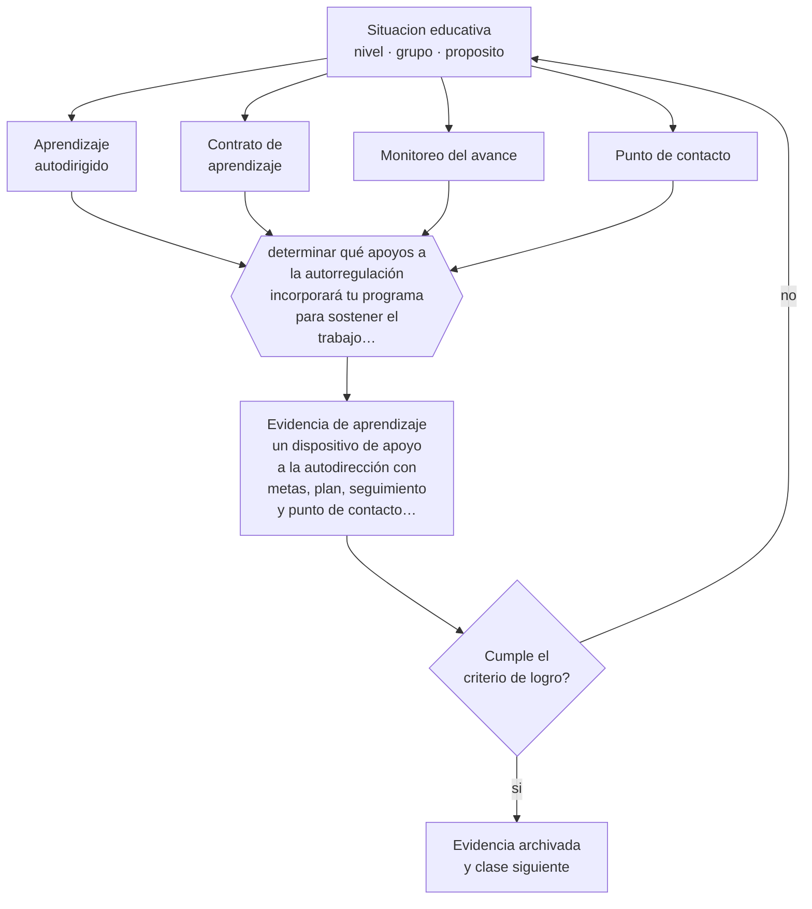

# Clase 087 — Aprendizaje autodirigido

> **Parte 07 · Educación de adultos y andragogía** — clase 3 de 12

**Estado de evidencia:** `CONSISTENTE` · **Etapa:** 🔵 Etapa B — Enseñanza por ciclo vital · **Población de referencia:** educación de adultos, capacitación laboral y formación continua 
**Decisión que habilita:** determinar qué apoyos a la autorregulación incorporará tu programa para sostener el trabajo autónomo 
**Evidencia de aprendizaje:** un dispositivo de apoyo a la autodirección con metas, plan, seguimiento y punto de contacto ante el abandono

## 🎯 Propósito

Desarrollar aprendizaje autodirigido con apoyos explícitos —metas, planificación, monitoreo, ajuste— en vez de suponer que el adulto ya sabe estudiar por su cuenta.

## 📚 Resultados de aprendizaje

Al finalizar esta clase podrás:

1. **Definir** con precisión los cuatro conceptos centrales de la clase y reconocerlos en una situación educativa real, no solo en su enunciado.
2. **Explicar** por qué la autonomía en el aprendizaje se enseña y no se supone, sobre todo en formación en línea.
3. **Decidir** —qué apoyos a la autorregulación incorporará tu programa para sostener el trabajo autónomo— y sostener la decisión con un fundamento escrito.
4. **Producir** la evidencia de la clase —un dispositivo de apoyo a la autodirección con metas, plan, seguimiento y punto de contacto ante el abandono— y contrastarla contra el criterio de logro.
5. **Distinguir** lo que la evidencia sostiene de lo que es práctica instalada, preferencia personal o costumbre de la institución.

## 🧩 Conceptos centrales

| Concepto | Comprensión verificable |
|---|---|
| **Aprendizaje autodirigido** | proceso en que la persona define metas, organiza recursos y evalúa su propio avance |
| **Contrato de aprendizaje** | acuerdo explícito sobre metas, plazos, evidencia y apoyos disponibles |
| **Monitoreo del avance** | seguimiento sistemático que permite detectar el rezago antes del abandono |
| **Punto de contacto** | persona o instancia a la que el participante puede recurrir cuando se atrasa |

## 🗺️ Flujo de razonamiento

## 📖 Desarrollo

### 1. El fondo del asunto

La deserción es el principal problema de la formación adulta y en línea, y su causa más frecuente no es la falta de interés sino la ausencia de estructura: el participante se atrasa, la deuda se acumula y abandonar se vuelve la salida menos costosa. Los dispositivos de apoyo a la autodirección —metas explícitas, plazos intermedios, seguimiento activo y un contacto humano cuando aparece el rezago— reducen esa dinámica.

### 2. Cómo se traduce en decisiones de enseñanza

Un contrato de aprendizaje breve, con metas y plazos acordados, funciona mejor que cualquier discurso sobre responsabilidad. El seguimiento debe ser proactivo: detectar el rezago en la semana dos y contactar, en vez de constatar el abandono en la semana seis. Y el contacto debe ofrecer una vía de reincorporación concreta, no solo un recordatorio.

### 3. Qué sostiene la evidencia y qué no

La autodirección no es un rasgo estable: la misma persona es autónoma en su oficio y dependiente en un contenido nuevo. Suponerla por edad es un error frecuente. Además, la evidencia sobre intervenciones contra la deserción en línea muestra efectos modestos, muy dependientes del contacto humano real.

> **Cómo leer el estado de evidencia `CONSISTENTE`.** La evidencia es amplia y coherente, pero proviene sobre todo de estudios correlacionales, de síntesis con heterogeneidad alta o de contextos distintos al tuyo. Sirve para orientar la decisión y exige que compruebes el efecto en tu propio grupo.

## 🧪 Taller guiado

Aplica la clase a **uno** de los contextos siguientes y repite después el ejercicio en un
contexto de exigencia distinta. Cambiar de contexto es parte del aprendizaje: lo que funciona
con un grupo no se traslada intacto a otro.

| Contexto | Rasgo que cambia la decisión |
|---|---|
| Capacitación obligatoria en empresa | el participante no eligió estar: hay que ganar la relevancia |
| Formación voluntaria de perfeccionamiento | alta motivación y alta exigencia de utilidad |
| Educación de adultos que retoma estudios | historia escolar previa, muchas veces negativa |
| Reconversión laboral o reskilling | urgencia económica y necesidad de resultado rápido |
| Formación en línea asincrónica | la deserción es el riesgo principal |
| Mentoría o acompañamiento individual | la relación es el vehículo del aprendizaje |

**Secuencia de trabajo:**

1. Delimita el contexto: nivel, edad, tamaño del grupo, asignatura o experiencia y tiempo real disponible.
2. Declara qué saben ya los estudiantes y **cómo lo comprobaste**, no cómo lo supones.
3. Formula la decisión pedagógica que esta clase habilita y escribe su fundamento.
4. Anticipa qué observarías si la decisión funciona y qué observarías si no funciona.
5. Diseña de antemano la alternativa que aplicarás si la primera estrategia falla.
6. Ejecuta o simula, y registra lo observado con fecha, contexto y evidencia concreta.
7. Produce la evidencia de aprendizaje de la clase.
8. Contrástala contra el criterio de logro, corrige y recién entonces avanza.

### 📦 Evidencia de aprendizaje

Un dispositivo de apoyo a la autodirección con metas, plan, seguimiento y punto de contacto ante el abandono.

Debe incluir contexto, decisión, fundamento, fuentes consultadas con su fecha, indicador de
logro observable, riesgos previstos y qué harías distinto en la siguiente iteración.

## 🏆 Reto verificable

Implementa detección de rezago en la semana dos de un programa. Contacta a quienes se atrasan y compara la retención con la de una edición anterior.

## ✅ Criterio de logro

- [ ] el dispositivo define metas, plazos intermedios y un mecanismo de detección temprana del rezago;
- [ ] existe un punto de contacto humano identificado con una vía concreta de reincorporación;
- [ ] cada afirmación sobre «lo que funciona» está atribuida a una fuente identificable, con autor y fecha;
- [ ] la decisión es ejecutable con el tiempo, el espacio, el número de estudiantes y los recursos que realmente tienes;
- [ ] la evidencia queda archivada de forma reproducible: otra persona podría revisarla sin que tú se la expliques.

## ⚠️ Errores frecuentes

**Propios de esta clase:**

- Suponer autonomía por edad y no incorporar apoyos ni seguimiento.
- Detectar el rezago demasiado tarde, cuando la deuda acumulada ya hace inviable la reincorporación.

**Característicos de la parte 07:**

- Diseñar para el contenido y no para el problema que el adulto necesita resolver.
- Ignorar que la experiencia previa puede sostener creencias erróneas resistentes.

## ♿ Diversidad, accesibilidad y ética

Los participantes con menos tiempo, peor conectividad o menos experiencia académica previa son los primeros en desertar. Un sistema de detección temprana los alcanza antes de que la brecha se vuelva irreversible, que es precisamente cuando el apoyo aún sirve.

Antes de aplicar cualquier decisión de esta clase con estudiantes reales, revisa el
[protocolo de práctica responsable](../../../docs/ETICA_Y_PRACTICA_RESPONSABLE.md):
consentimiento, resguardo de datos personales, proporcionalidad de la intervención y derecho
de cada estudiante a no ser objeto de un ensayo que no le reporta beneficio.

## ❓ Preguntas de comprobación

1. ¿En qué semana detectas que un participante se está quedando atrás?
2. ¿Qué pasa exactamente cuando lo detectas?
3. ¿Qué apoyo a la autorregulación ofreces además de recordatorios?

## 📕 Lecturas base

**Zimmerman, B. (2002). *Becoming a Self-Regulated Learner*.**  
*Qué aporta a esta clase:* modelo de autorregulación con fases y estrategias enseñables.

**Education Endowment Foundation (2018). *Metacognition and Self-Regulated Learning*.**  
*Qué aporta a esta clase:* evidencia sobre qué apoyos a la autorregulación funcionan y con qué magnitud.

Catálogo completo: [bibliografía del programa](../../../docs/BIBLIOGRAFIA.md) ·
[glosario](../../../docs/GLOSARIO.md) ·
[fuentes oficiales y cómo leerlas](../../../docs/FUENTES.md).

## 🔗 Conexión con el resto del programa

Aplica la clase 021 a la formación adulta y sostiene las clases 091 y 096.

> [!IMPORTANT]
> Material de formación profesional. No reemplaza un título de pedagogía, una habilitación
> legal para ejercer, ni el juicio de un equipo educativo que conoce a sus estudiantes.

---

| Anterior | Índice | Siguiente |
|---|---|---|
| [← 086 · Experiencia previa como recurso](../class-02-experiencia-previa-como-recurso/README.md) | [Parte 07](../README.md) · [Programa](../../../README.md) | [088 · Motivación en adultos →](../class-04-motivacion-en-adultos/README.md) |
